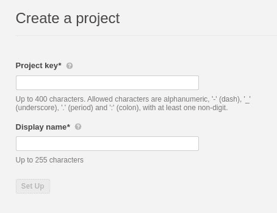
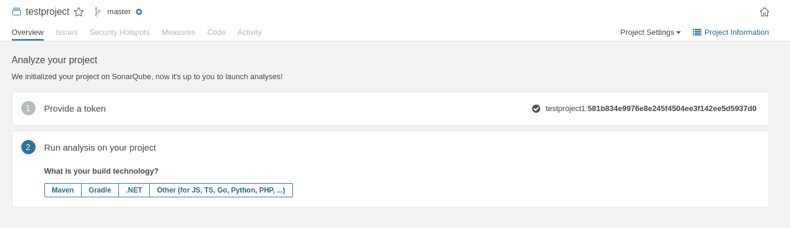

# 如何用 SonarQube 分析代码并发现漏洞

> 原文：<https://thenewstack.io/how-to-analyze-code-and-find-vulnerabilities-with-sonarqube/>

SonarQube 是一个基于网络的工具，可以帮助开发人员生成没有安全问题、错误、漏洞、气味和一般问题的代码。如果你正在做一个小项目，这可能是一个简单的壮举。您可以仔细检查您的代码，找出任何问题。但是当你在做一个更大的项目(或者许多更小的项目)时，你可能没有时间去梳理你写的每一行代码。

早在二月份，我写了一篇关于安装 SonarQube 代码分析平台的文章。这一次，我想向您展示如何使用这个工具，这样您就可以信任您正在使用的代码(无论是您还是其他人编写的)。

尽管您已经安装了一个非常好的基于 web 的工具，但是使用 Sonarqube 并不像您想象的那么简单。如果您深入研究文档，您可能会发现它并不那么有启发性。

不要害怕，我将带你经历扫描这个久经考验的真实世界的过程。用 Sonarqube 编写的应用程序(用 Java 编写)。因为我们最初的安装是在 Ubuntu Server 20.04 上，我将继续使用这个平台。如果你在不同的操作系统上使用 Sonarqube，你需要做必要的调整。

你准备好了吗？

我们开始吧。

## 安装声纳扫描仪

这是大多数用户会迷路的地方。在您使用 Sonarqube 做任何事情之前，您必须在您的项目所在的机器上安装`sonar-scanner`应用程序。我将使它变得更加简单，并将它安装在托管 Sonarqube 的同一个服务器上。你应该这么做。

登录托管 Sonarqube 的服务器，使用以下命令安装一些依赖项:

`sudo apt-get update && sudo apt-get install unzip wget nodejs -y`

安装完这些依赖项后，使用以下命令创建一个新目录:

`mkdir sonarqube`

使用以下命令切换到该目录:

`cd sonarqube`

下载`sonar-scan`文件:

`wget https://binaries.sonarsource.com/Distribution/sonar-scanner-cli/sonar-scanner-cli-4.2.0.1873-linux.zip`

解压缩下载的文件:

`unzip sonar-scanner-cli-4.2.0.1873-linux.zip`

最后，使用命令移动新创建的文件夹:

`sudo mv sonar-scanner-4.2.0.1873-linux /opt/sonar-scanner`

接下来，我们需要使用以下命令创建声纳扫描配置文件:

`sudo nano /opt/sonar-scanner/conf/sonar-scanner.properties`

在该文件中，粘贴以下内容:

```
sonar.host.url=http://SERVER:9000
sonar.sourceEncoding=UTF-8

```

其中 SERVER 是托管服务器的 IP 地址。

保存并关闭文件。

现在我们将创建另一个配置文件，它将设置必要的$PATH 变量。发出命令:

`sudo nano /etc/profile.d/sonar-scanner.sh`

在该文件中，粘贴以下内容:

```
#/bin/bash
export PATH="$PATH:/opt/sonar-scanner/bin"

```

保存并关闭文件。

使用命令将`sonar-scanner`添加到您的路径中:

`source /etc/profile.d/sonar-scanner.sh`

使用以下命令验证声纳扫描仪是否正常工作:

`sonar-scanner -v`

您应该会看到一些工具的版本号。成功！您已经准备好运行第一次扫描。

## 如何扫描你的代码

让我们创造一个你好，世界！应用示例。使用以下命令创建一个新目录:

`mkdir java`

使用以下命令切换到该文件夹:

`cd java`

使用以下命令创建代码文件:

`nano helloworld.java`

在该文件中，粘贴以下内容:

```
// Your Hello, World! java application

class  HelloWorld  {
    public static void main(String[]  args)  {
            System.out.println("Hello, World!");
    }
}

```

保存并关闭文件。

现在，回到 Sonarqube web 界面并创建一个新项目(图 1)。


图 1:点击 Create new project 开始这个过程。

在出现的窗口中(图 2)，为新项目命名键和显示。



图 2:在 Sonarqube 中命名您的新项目。

在下一个窗口中(图 3)，您必须为项目生成一个令牌。为令牌命名，然后单击生成。


图 3:为新项目生成一个令牌。

然后，您必须为令牌提供另一个名称，并单击 Generate。这将为您显示令牌。复制并保存该令牌(因为您将在以后的扫描中需要它)。

单击继续进入下一步。在这个窗口中(图 4)，选择项目的构建技术(我们将选择 Other)。



图 4:为您的项目选择构建技术。

然后会提示您扫描所用的操作系统。在我们的例子中，我们将选择 Linux。一旦您做出选择，您将看到在机器上运行 sonar-scanner 命令的命令(图 5)。回到终端窗口，将该命令粘贴到窗口中。


图 5:sonar cube 显示了用于扫描的命令。

从您的项目目录中运行扫描，它会做它的事情。过一会儿(取决于您的项目有多大),它将结束，扫描结果将出现在 Sonarqube web GUI 中(图 6)。


图 6:我们的扫描结果显示了一个非常干净的项目。

明白吗，这是一个简单的你好，世界！举例。如果您的项目较大，扫描将花费相当长的时间，并且您的结果可能无法用于生产。因此，仔细阅读 Sonarqube 报告，并解决它报告的任何问题。

这是确保您的代码尽可能干净和没有问题的好方法。不要依靠自己独自承担这项任务。只需几个额外的步骤，您就可以拥有一个能够更快、更可靠地完成工作的平台。

<svg xmlns:xlink="http://www.w3.org/1999/xlink" viewBox="0 0 68 31" version="1.1"><title>Group</title> <desc>Created with Sketch.</desc></svg>