# 如何自动化和扩展 REST API 测试

> 原文：<https://thenewstack.io/how-to-automate-and-scale-your-rest-api-tests/>

 [马克·卡尔达索夫

马克是一名测试自动化爱好者、企业家、滑雪板爱好者和 TestProject 的 CEO。在测试和测试自动化领域有超过 10 年的经验。](https://www.linkedin.com/in/mark-kardashov-4a54874/?originalSubdomain=il) 

REST API(表述性状态转移)是一种运行测试的强大方法。然而，这并不总是足够的。有一些陷阱是 REST API 测试无法单独发现的。这就是为什么端到端测试自动化很重要。

例如，在撰写本文时，我测试了 NASA 的公共 API，并在其中一个 API 模式中发现了一个 bug。除非我经历了整个端到端测试周期，否则我不可能发现这个 bug。这证明了端到端测试在产品生命周期中的重要性。换句话说，不要低估将 API 和用户界面(UI)自动化测试结合起来以获得更好的覆盖率和质量的能力。

TestProject 的端到端测试自动化框架为 RESTful API 客户端提供了一个开源插件。它提供了使用 GET、POST、PUT 和 DELETE 方法发送 HTTP/S 请求的操作，并且是完全开源的。你可以在这里看到它的文档和源代码。

在本文中，我们将讨论如何用 TestProject 创建自动化 REST API 测试。我们将介绍如何:

1.  向服务器发送 API 命令并验证响应。
2.  使用响应中的值作为测试步骤中的参数。
3.  在同一个自动化测试中结合 REST API 和记录的 UI 步骤，以实现端到端测试。
4.  分析报告。

要跟进，您需要具备:

*   一个 TestProject 账户(你可以在这里免费获得[)。](https://testproject.io/)
*   安装了一个 TestProject 代理(在这里观察如何安装一个 TestProject 代理[)。](https://www.youtube.com/watch?v=WNlnuU7pSgQ&t=49s)
*   REST API 附加组件(你可以在 TestProject 附加组件库[这里](https://app.testproject.io/#/addons/testproject)找到它)。

## 组装我们的端到端自动化测试

我们将使用 NASA 的 API 作为例子——不仅因为我们热爱科学，还因为它也是公开可用的。[近地天体网络服务](https://data.nasa.gov/Space-Science/Asteroids-NeoWs-API/73uw-d9i8)，这是一个针对近地小行星信息的 RESTful 网络服务，允许用户根据它们最接近地球的日期来搜索小行星。

我们的端到端测试将包含六个简单的步骤:

**步骤 1** —打开您的 TestProject 帐户，并创建一个新的记录测试。
**第二步** —通过使用 GET API 命令和[提取第一个小行星 ID](https://api.nasa.gov/neo/rest/v1/neo/browse?api_key=DEMO_KEY) 来检索所有可用的小行星。
**第三步** —根据检索到的第一个小行星 id 创建一个动态端点 URL，分析服务器的响应，提取 *$的值。nasa_jpl_url* ，表示提供小行星信息的网页的 url。
**步骤 4** —用有效的结构替换 URL(将“s”添加到 HTTP 字符串中)—这不是您在现实生活场景中应该做的事情。然而，我们这样做是为了克服我们在响应模式中发现的错误。
**第五步** —导航至小行星网址(我们修复的正确网址)。然后，验证网页中显示的小行星 id 标签是否与步骤 2 中提取的 ID 相匹配。
**第六步** —分析我们记录的测试报告。

### 步骤 1 —创建新的测试

打开您的 TestProject 帐户并创建一个新的测试。
在我们的例子中，我们将选择一个 web 测试(当然，您也可以用同样的方式创建一个移动测试，甚至是一个编码测试):

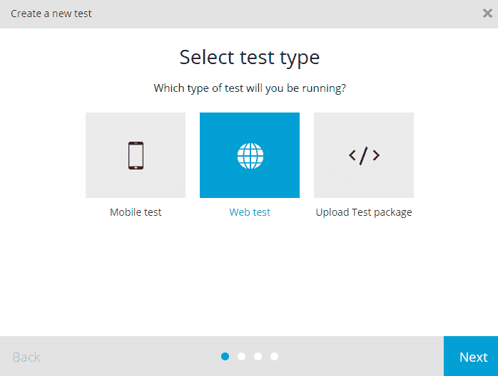

然后，您将需要提供测试细节，比如测试名称及其描述，并提供经过测试的 URL。

由于我们的测试将主要依赖于 REST API 命令，这些命令包含 URL 作为步骤的一部分，初始应用程序 URL 在这里并不扮演主要角色，但是应该作为 web 测试默认参数的一部分提供。

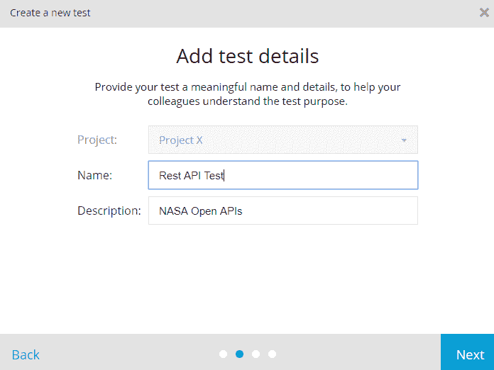

接下来，选择“记录”选项:

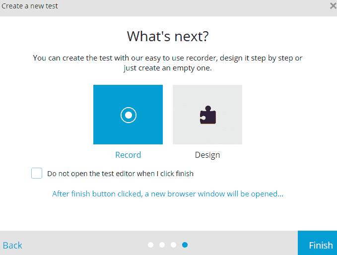

一个新的浏览器标签将在 TestProject 的测试记录器中打开。

### 步骤 2 —使用 GET API 命令提取值

在我们的初始步骤中，我们将通过使用 GET API 命令并提取第一个小行星 ID 来检索所有可用的小行星。

为了做到这一点，让我们在记录的测试中创建一个新的步骤(action 类型步骤)。在步骤编辑器中，选择“添加步骤”按钮(+)，然后按“类型”并切换到“操作”:

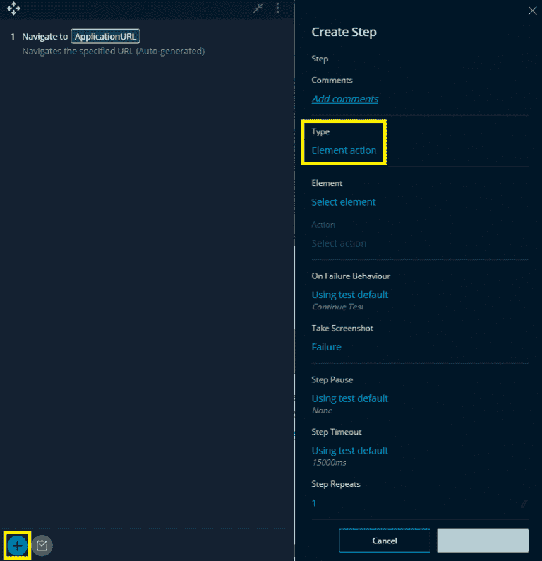

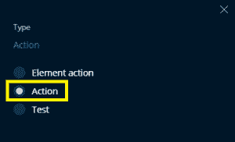

现在，让我们转到“操作”并搜索 GET。然后，您将看到来自附加组件库的 HTTP GET 请求操作:

选择操作。现在，将添加一个具有以下可用参数的步骤:

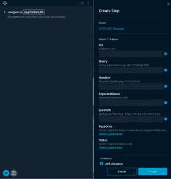

让我们添加得到回复所需的[相关参数](https://api.nasa.gov/):

**网址**:https://api.nasa.gov/neo/rest/v1/neo/browse

**查询** : *api_key=DEMO_KEY* (可以在这里添加多个参数，用'&'隔开)。

**预期状态**:我们将输入代码“200”根据 NASA 的文档，在请求有效的情况下，预期的服务器状态将是 200。

**JsonPath** : *$。近地天体[0]。neo_reference_id* (基于 [Jayway JsonPath](https://github.com/json-path/JsonPath) 语法，我们正在寻找第一个*neo _ reference _ id*，它将作为我们下一步的端点的一部分被传递)。

我们还将为响应字段添加一个参数(server_response ),以便存储检索到的第一个 *neo_reference_id。*

在我们的步骤编辑器中，该步骤应该是这样的:

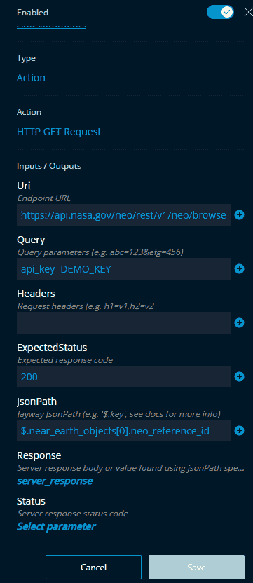

让我们点击“创建”现在，将成功创建并执行一个步骤。该成功执行将检索响应消息(如下所示)。请注意，我们使用 JayWay 语法搜索的特定值将存储在我们创建的 server_response 参数中(如下图所示，它等于 2021277):

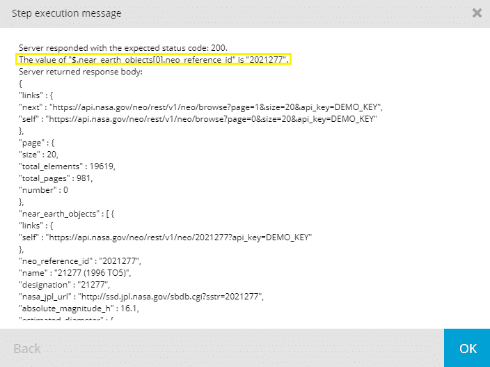

### 步骤 3 —创建动态端点 URL:提取信息并分析服务器的响应

现在，让我们根据在上方[检索到的小行星 id 创建一个动态端点 url，并从服务器响应中提取 *nasa_jpl_url* ，它表示提供小行星完整信息的网页的 URL。](https://blog.testproject.io/2018/11/28/rest-api-testing-testproject/#Step2Response)

根据美国宇航局的 API 文档，在上方[检索到的小行星 id(又名 neo_reference_id)是端点的一部分，为我们提供了详细的小行星信息，如本例](https://blog.testproject.io/2018/11/28/rest-api-testing-testproject/#Step2Response)中所示的[。](https://api.nasa.gov/neo/rest/v1/neo/2021277?api_key=DEMO_KEY)

在此步骤中，我们将使用存储在 server_response 参数中的 *neo_reference_id* 值创建一个 GET 请求，以组装端点 URL 并从响应消息中检索一个名为 *nasa_jpl_url* 的新值。

让我们在记录的测试中添加一个新步骤([动作类型步骤](https://blog.testproject.io/2018/11/28/rest-api-testing-testproject/#ActionTypeStep))。然后，搜索操作 GET。然后，您将看到 HTTP GET 请求操作。选择操作并在下面添加相关参数:

**网址**:https://api.nasa.gov/neo/rest/v1/neo/server_response

**查询** : *api_key=DEMO_KEY* (可以在这里添加多个参数，参数之间用“&”隔开)。

**预期状态**:我们将输入代码“200”根据 NASA 的文档，在请求有效的情况下，预期的服务器状态将是 200。

**JsonPath:** *$。nasa_jpl_url* (基于 [Jayway JsonPath](https://github.com/json-path/JsonPath) 语法，我们正在寻找一个 *nasa_jpl_url* 值)。

我们还将为响应字段添加一个参数( *Asteroid_URL* )，以便存储检索到的值( *nasa_jpl_url* )。

在我们的步骤编辑器中，该步骤应该是这样的:

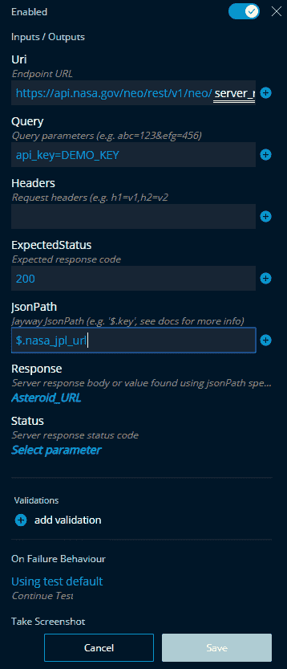

现在，让我们运行测试步骤并查看结果。

如下面显示的响应模式所示，我们收到了特定的小行星 id 详细信息。两个 GET 请求(来自步骤 2 和步骤 3)是相关的:第二个调用(在这个步骤中——步骤 3)基于第一个 REST API 调用(来自步骤 2)去往一个特定的端点。

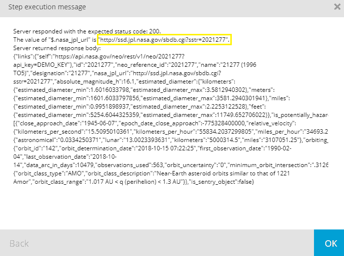

这是从值 *nasa_jpl_url* 中检索的 URL，并存储在[小行星 _url 参数](https://ssd.jpl.nasa.gov/sbdb.cgi?sstr=2021277)中。

如果你在你的浏览器中测试它，你会看到 URL 链接指向一个不正确的网页。NASA 一直使用的正确 URL 是基于安全的 HTTPS(而不是基于在值 *nasa_jpl_url* 中检索的 HTTP)。因此，让我们在记录的测试中添加一个步骤，用 HTTPS 替换 HTTP 并创建一个正确的 URL 地址。*

值得一提的是，这并不是你在现实生活中必须要做的事情，相反，你应该为你的开发团队打开一个 bug。在我们的情况下，我们已经发送了一封电子邮件给美国宇航局的人，我们相信他们会很快修复它。

### 步骤 4-用有效的结构替换 URL

作为我们在响应模式中发现的问题的解决方法，让我们用有效的结构替换 URL(在 HTTP 字符串中添加“s”)。为了做到这一点，让我们在记录的测试中添加一个新的步骤([动作类型步骤](https://blog.testproject.io/2018/11/28/rest-api-testing-testproject/#ActionTypeStep))。然后，搜索名为“在字符串中替换”的操作，选择它并添加以下参数:

**搜索模式** : http。

**原** : string Asteroid_URL 参数。

**文字** : https。

**结果**:名为 Fixed_Asteroid_URL 的新参数。

在我们的步骤编辑器中，该步骤应该是这样的:

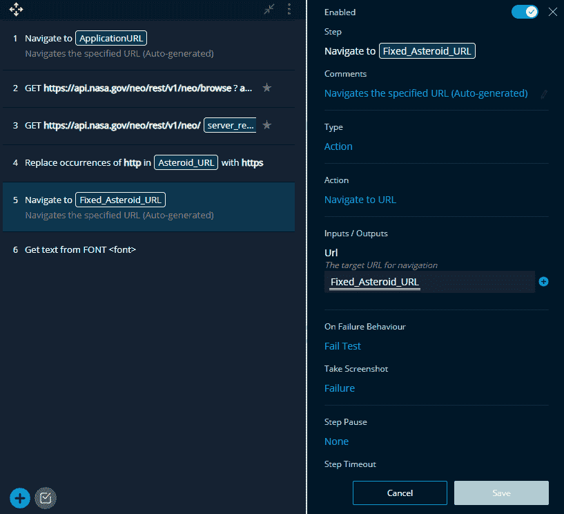

现在，让我们运行这个步骤，作为我们创建正确 URL 的测试的一部分。

### **步骤 5——端到端测试的力量:导航到一个新的 URL 并验证 ID 标签**

为了导航到新的 URL，让我们在记录的测试中添加另一个步骤(也是一个 action 类型的步骤)。然后，让我们搜索“导航到”操作并选择它。在 URL 参数中选择:Fixed_Asteroid_URL(我们在上面第 4 步中检索并修复的 URL)。创建步骤后，它将导航至正确的小行星 URL:

为了完成这个端到端的功能测试场景，我们将创建一个新的步骤(元素动作步骤),以便验证(固定 URL 的)网页中显示的 asteroid 标签是否与上面步骤 2 的第一个 API 调用中提取的 id 相匹配。在这一步，我们使用 TestProject 的内置元素定位器来识别出现在网页上的*SPK ID*标签，并激活“获取文本”元素操作步骤，如下所示:

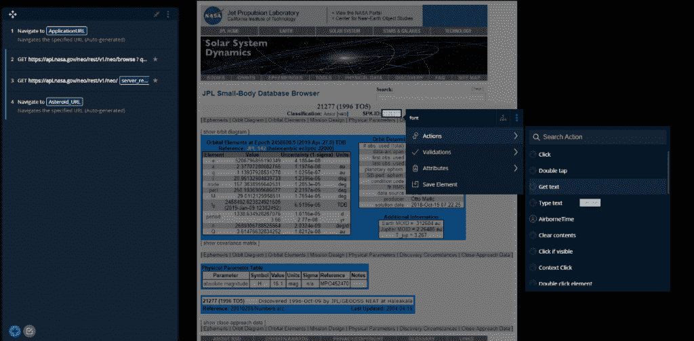

在“获取文本”步骤细节中，我们将通过单击(+)按钮添加一个验证。

在“选择字段”中，选择:“文本”

在“选择验证类型”中，选择:“等于”

在文本框中，我们将选择包含原始小行星 id 的 server_response 参数。

此操作将比较 UI 标签 ID 和从 API 中检索的 ID(在上面的步骤 2 中)。

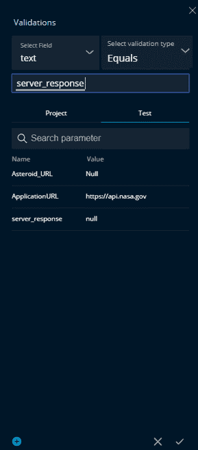

这是我们的端到端测试现在的样子:

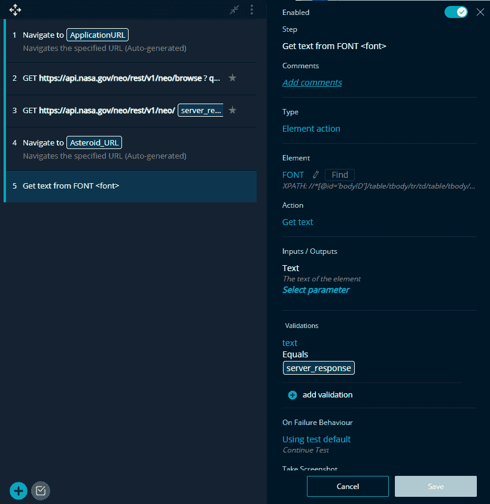

### 第 6 步—分析报告

既然我们已经创建了所有必要的测试步骤，让我们从 TestProject 仪表板中的“Project”区域执行我们的完整测试，然后我们可以分析测试的大量报告(这些报告是在测试执行完成之后自动创建的)。您可以深入每个测试步骤，查看截图、步骤执行持续时间，并监控端到端集成测试的每一次成功和失败，如下所示:

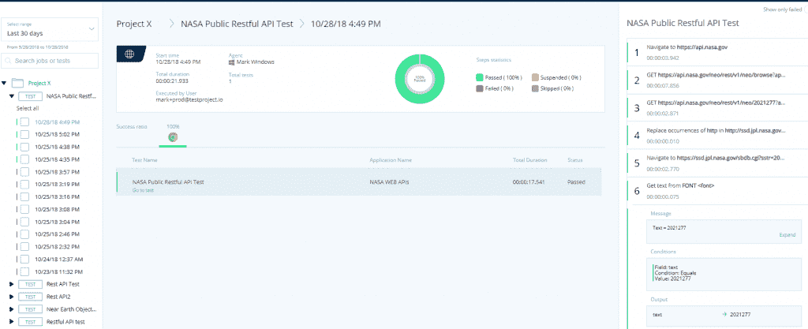

## 摘要

本教程涵盖了端到端自动化测试的整个工作流程，同时使用了 [TestProject 的](https://testproject.io/)框架。我们通过发送基本的 API 调用开始了本教程，并以验证和比较基于 UI 的元素结束了本教程。基本上，我们在同一个自动化测试中组合了 REST API 和记录的 UI 步骤，从而实现了强大的端到端测试。所有这些都是在没有一行代码的情况下发生的，这非常酷！

我认为在这里提到记录的测试在一定程度上是有限制的是很重要的，而且在某些情况下你必须利用你的编码技能。因此，我完全理解那些不喜欢记录测试的人。然而，我写这篇教程是为了演示如何轻松地利用 TestProject 的智能测试记录器的功能，将整个测试周期提升到一个全新的水平，并创建一个强大的端到端自动化测试(在这种情况下，同时使用 TestProject 的测试记录器，该测试记录器集成了内置功能以及 REST API 之类的定制插件)。正如我们在本教程中看到的，端到端测试对于任何产品的生命周期和质量都是至关重要的，如果没有它，我们甚至可能会错过一些错误。

<svg xmlns:xlink="http://www.w3.org/1999/xlink" viewBox="0 0 68 31" version="1.1"><title>Group</title> <desc>Created with Sketch.</desc></svg>