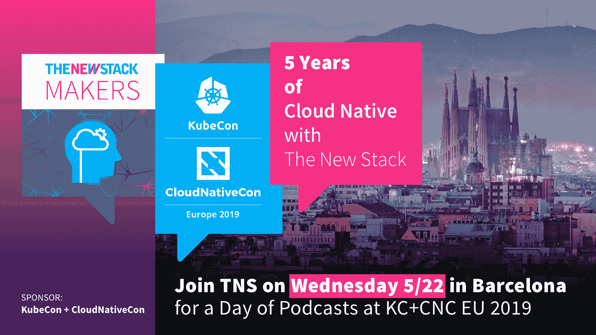

# 如何避免死路一条 Kubernetes 战略

> 原文：<https://thenewstack.io/how-to-avoid-a-dead-end-kubernetes-strategy/>

云本地计算基金会赞助了这篇文章。

Kubernetes 是管理容器的最新进展，与任何新的快速发展的技术一样；似乎有无数种方法可以部署它。Kubernetes 只是拼图的一部分。在生产中大规模部署 Kubernetes 需要一个完整的工具生态系统，从网络和存储到日志和监控。许多供应商都加入了这股潮流，提供了一个现成的 Kubernetes 平台，允许企业快速采用该技术。尽管乍一看很相似，但还是有(有时是显著的)关键区别。既然基础设施决策一旦启动并运行就很难撤销，那么您如何在未来改进您的 Kubernetes 策略呢？****

## **Kubernetes 之前的生活…以及 Kubernetes 如何成为事实上的标准**

 [特里·谢伊

Terry 是 Kublr 高级管理团队的成员，拥有 20 多年在全球软件公司工作的经验，包括 Sterling Software、BMC 和 IBM，他曾领导过移动和云团队。目前，Terry 正在与 Kublr 团队合作，确保企业客户可以跨多个环境(内部或不同的云中)利用容器和 Kubernetes。](https://kublr.com/) 

Kubernetes 于 2014 年 6 月发布，还不到五岁，仅被认为稳定了大约四年。在业界几乎一致同意迁移到 Kubernetes 之前，有多种方法可以编排容器。Docker Enterprise (Swarm)背后有 Docker 的知名度，AWS ECS 是第一个在公共云上广泛使用的容器解决方案。其他商业支持的竞争对手包括 Mesosphere 和 Cloud Foundry。

今天，所有这些以前行业领先的解决方案都宣布，他们要么用 Kubernetes 替换自己产品的关键组件，要么提供 Kubernetes 管理作为附加组件。这使得纯 Kubernetes 产品具有优势。他们可以专注于未来，而不是担心在迁移到新技术堆栈的同时让以前的客户满意。但是还有什么是重要的？

## 主要考虑事项

显然，早期采用者没有预见到 Kubernetes 的统治地位。今天，那些容器化应用程序的优势在于知道*是*事实上的容器编排器，但是在过去，没有明显的选择。虽然有些人很早就认识到了 Kubernetes 的潜力，但许多组织都是从 ECS、Mesosphere Marathon 或 Swarm 开始的。这个选择是有代价的，因为现在他们需要迁移到 Kubernetes——这是一项困难而昂贵的工作。

虽然在早期押注于正确的编排解决方案可能是一场赌博，但考虑未来的需求却不是。在选择 Kubernetes 平台时，超越单个项目的需求会有所帮助。Kubernetes 的采用率正在飞速上升，您的组织内的采用率也将随之上升。

**你应该考虑的五件事，以避免陷入死胡同的 Kubernetes 战略:**

1.  **开放性、灵活性和可扩展性**:技术和企业需求在不断发展。一个开放、灵活、可扩展的平台将与你一起发展。它不应该将您束缚于操作系统、单一云、平台即服务或技术堆栈，因为您的需求*将*发生变化。固执己见的解决方案可能会限制您将来从单个控制平面在多个环境中部署和管理 Kubernetes 的能力；
2.  **托管服务与否**:虽然方便，但托管服务限制了定制。Kubernetes 是高度可扩展的，有运营商，边车，自定义资源定义，多种覆盖网络选项等。转移到 Kubernetes 的新应用程序正在利用这一优势；
3.  **定制**:一旦你冒险进入高级用例，如 Kubernetes 上的人工智能或机器学习，或 Kubernetes for IoT at the Edge，你将需要定制集群的能力。如果您的解决方案过于依赖单一部署体系，您可能会受到限制；
4.  **多环境能力**:多云策略正变得越来越普遍，允许您在未来利用其他云，即使您现在只使用单一云解决方案。混合和内部部署也是当今常见的场景。您最好的选择是 Kubernetes 平台，它允许您将容器基础设施扩展到您需要的地方；
5.  **无状态和有状态应用** : Kubernetes 对大多数组织来说都是新的，您可能会从无状态的容器化工作负载开始。但是您会很快发现支持有状态应用程序的需求。Kubernetes 提供了一个持久卷子系统，它为您的开发人员提取存储细节，但是为 Kubernetes 设置和运行存储系统正在快速发展。在选择平台时，请确保考虑所有环境中的存储需求。

## **结论**

为了避免一个死路一条的 Kubernetes 战略，你需要一个面向未来的 Kubernetes 解决方案。一个坚持云的原生原则，如开放性、灵活性和可扩展性。虽然您可能无法预见未来的需求，但这些特征将确保您的选择能够随着您的需求而发展。随着开源和云原生的兴起，专有企业软件束缚你的时代已经结束。现代企业软件与云原生原则兼容，扩展了您的技术投资价值。

通过 Pixabay 的特征图像。

<svg xmlns:xlink="http://www.w3.org/1999/xlink" viewBox="0 0 68 31" version="1.1"><title>Group</title> <desc>Created with Sketch.</desc></svg>