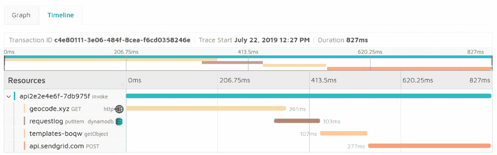
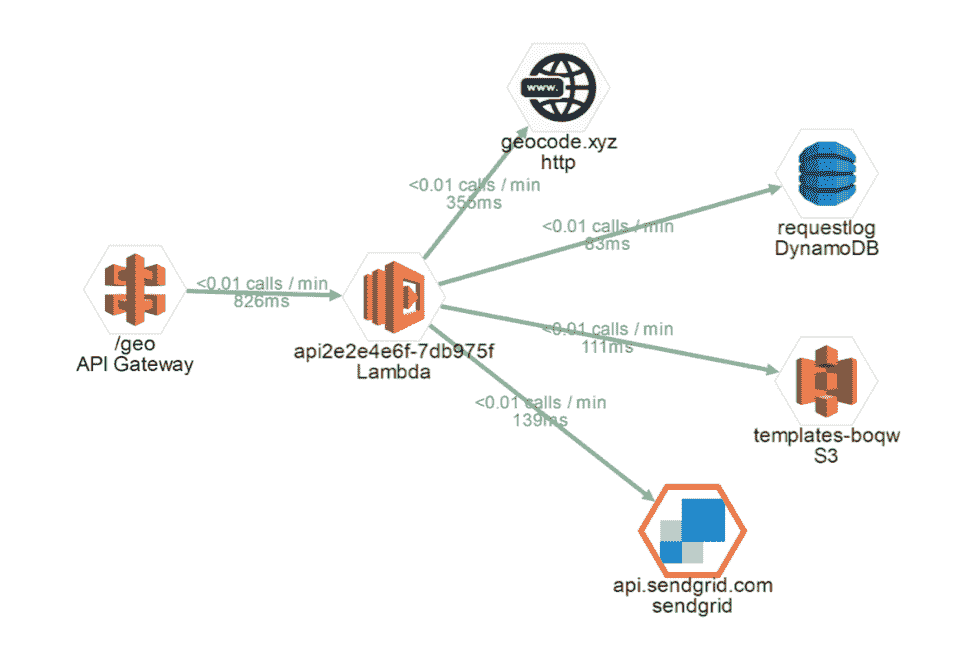

# 如何通过监视 AWS Lambda 中的 API 来避免成本陷阱

> 原文：<https://thenewstack.io/how-to-avoid-cost-pitfalls-by-monitoring-apis-in-aws-lambda/>

[Epsagon](https://epsagon.com/) 赞助本帖。

 [米哈伊尔·希尔科夫

Mikhail 是一名经验丰富的软件开发人员，微软 Azure MVP，居住在荷兰的俄罗斯侨民。他对云技术、函数式编程以及两者的交叉充满热情。他相信无服务器思维的力量，利用各种各样的托管云服务，并将云基础设施作为代码来处理。他是 mikhail.io 的博客作者，是会议和 meetup 的业余演讲者，meetup F#P Eindhoven 和 ServerlessDays Amsterdam 的共同主持人。](https://www.linkedin.com/in/mikhailshilkov/) 

现代软件世界运行在应用程序编程接口上，也称为 API。每件事都有一个 API:为信用卡充电、发送电子邮件、在地图上查找地址或者叫出租车。

同样，云的巨大计算能力完全可以通过多层编程接口获得，包括 HTTP 服务和特定语言的 SDK。像 AWS 这样的云供应商有数以千计的终端可供世界上的每个开发人员使用，现代企业应该接受这些现有的服务来保持生产力。企业不应试图重新发明轮子，而应专注于其特定市场的核心价值和竞争优势，并简单地购买、采用和重用已在其特定领域证明自己的第三方所需的剩余服务。

这个原则是无服务器架构背后哲学的核心:关注关键的部分。无服务器技术的进入门槛很低，其设计意图是要求使用很少的样板代码。这有助于解释为什么这么多可靠的[API 是当今无服务器应用程序的固有部分。Lambda 函数被开发人员用作云服务与内部和外部 API 调用之间的粘合剂。](https://epsagon.com/blog/the-importance-and-impact-of-apis-in-serverless/)

## 性能的作用

一般来说，在采用 API 时要记住的一件事是性能。大多数 API 调用通常是通过 HTTP 或 HTTPS 的同步请求。它们执行起来可能很快，但也可能很慢，并且响应性没有在 API 定义本身中表现出来。此外，延迟可能会随着时间的推移而变化，因为 API 可能会在看似随机的时间间隔或更高的负载下崩溃。一旦工作负载超过给定的阈值，节流策略也可能会起作用。

在无服务器世界中，这方面的性能可以说比以往任何时候都更具决定性，因为无服务器平台的慢速下游接入点具有多种含义:

*   每个 Lambda 函数都有一个最大持续时间阈值，如果 API 调用的总持续时间超过该值，它就会超时并失败。
*   AWS 向组织收取 Lambda 调用的执行时间费用。即使函数在等待 HTTP 响应时处于空闲状态，您也要为每 100 毫秒的消耗付费。缓慢的 API 调用导致无服务器应用程序不可避免的[额外成本。](https://epsagon.com/blog/how-much-does-aws-lambda-cost/)
*   对于同步调用，当用户等待 Lambda 完成时，速度的大幅降低会导致糟糕的用户体验，导致客户不高兴，并损失时间，甚至收入。

幸运的是，我们可以做很多事情来预防和缓解这些问题。

## 检测 API 性能

有几种策略可以评估第三方 API 的性能对无服务器应用程序的影响。

在刚刚开始使用一个新的 API 时，研究供应商是否提供了性能 SLA 是有意义的。不管答案是什么，下一步都是执行目标调用并测量延迟情况。在注册一项新服务之前，你应该努力提前做好。最后，值得运行一个负载测试来模拟长期的目标工作负载。

即使应用程序成功部署到生产环境中，您的工作仍然没有完成。对于任何重要的应用程序，投资监控工具和最佳实践都是值得的。监控工具包提供了关于依赖项性能的实时和历史观点，以及它们对应用程序可用性和成本的影响。

下一节先睹为快。

## 示例:地理警报应用程序

让我们考虑一个处理互联车辆遥测数据的示例应用。每辆车都会定期发送信息，这些信息最终会进入自动气象站的云端。单个 AWS Lambda 接收消息并执行以下步骤:

*   解码有效载荷并提取数据，包括地理坐标和传感器值。
*   通过调用 [xyz](https://geocode.xyz/) 服务，对坐标进行反向地理编码以推断地址。
*   将包含消息属性和地址的日志条目保存到 [AWS DynamoDB](https://aws.amazon.com/dynamodb/) 。
*   将这些值与阈值进行比较，以检查是否发送警报。
*   如果需要，从 [AWS S3](https://aws.amazon.com/s3/) 加载合适的电子邮件模板。
*   使用 [SendGrid](https://sendgrid.com/) 邮件服务发送电子邮件通知。

这是一个相当简单的应用程序，但是它依赖于四个外部 API:两个 AWS 服务和两个第三方端点。在这里，我们将实现这样一个应用程序的原型，并将它链接到一个 [Epsagon](https://epsagon.com/) 仪表板，看看我们可以获得关于它的性能的什么样的见解。

## 单次调用的时间线

让我们先调用我的 AWS Lambda 一次，然后在 Epsagon 仪表板中找到那个调用，并显示[时间线视图](https://epsagon.com/blog/introducing-the-timeline-view/):

Epsagon 仪表板:单个呼叫的时间线视图。

您可以看到，这个单独的调用花费了 827 毫秒来完成，并且这个时间完全用于等待 API 调用完成。您还可以清楚地看到四个依赖项之间的执行时间，地理编码和电子邮件发送比调用 DynamoDB 和 S3 慢。

任何曾经使用过作为浏览器开发工具一部分的性能和网络选项卡的开发人员都非常熟悉时间轴视图。这有利于一个相似的目的:找出执行缓慢的罪魁祸首。

值得一提的是，你不必手动跟踪电话。一旦你把 Epsagon 库插入 Lambda，所有的数据都会被自动收集。

## 随着时间的推移跟踪调用

以上只是一个测量，可能不太能代表现实。下一步是观察目标 AWS Lambda 如何随时间变化。让我们建立一个测试，在几分钟内执行这个函数几百次。使用 AWS 的 API 网关并通过 HTTP 调用函数是最简单的。或者，您可以使用 SQS 队列或另一个异步触发器，但是监视在所有情况下的行为都是相似的。

测试后，继续前进并导航到架构图页面:

Epsagon 仪表板:单个呼叫的时间线视图。

前面的 Epsagon 仪表板为您提供了最近所有函数执行的汇总视图。在这种情况下，数字恰好与之前的测试非常相似:平均调用时间约为 800 毫秒，地理编码是最慢的调用。SendGrid 调用似乎平均速度更快，但是它周围的红色边框表示一些请求失败了。这也指出了一个潜在的问题，您需要对此进行调查。您可能希望根据收集到的数据采取一些具体的措施，例如尝试另一种地理编码服务，看看在价格相当的情况下它是否更快。

您可以根据预测的调用次数乘以 900 毫秒执行时间的价格来估计应用程序的成本。这个函数一直在等待 I/O 操作完成，它不会占用太多 CPU 或内存。因此，提供更小的 AWS Lambda 实例是有意义的。

最后，您可能希望将您的“整体”功能分解成多个通过队列相互连接的功能。较小的单一用途功能[有几个好处](https://epsagon.com/blog/the-right-way-to-distribute-messages-effectively-in-serverless-applications/)，包括更高的弹性和潜在的更低成本。

## 结论

几乎每个无服务器功能都依赖于一个或多个 API 调用，以及其他云服务和第三方应用的组合。这些调用的延迟和稳定性直接影响 Lambda 函数的性能和成本。

在依赖任何新采用的 API 之前，一定要测试它的性能。此外，您需要监控生产中 API 调用的延迟、可靠性和[成本。优化应用程序的结构以避免最终用户可观察到的同步路径上的长时间运行的调用是很重要的。为了实现更好的成本管理和更高的弹性，尽可能快地完成执行，并将剩余工作委托给基于队列或事件的功能。](https://epsagon.com/blog/finding-serverless-hidden-costs/)

通过 Pixabay 的特征图像。

<svg xmlns:xlink="http://www.w3.org/1999/xlink" viewBox="0 0 68 31" version="1.1"><title>Group</title> <desc>Created with Sketch.</desc></svg>