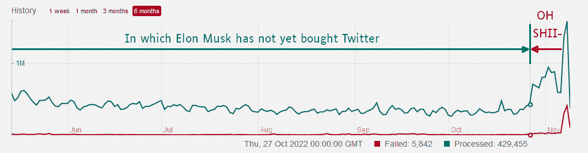
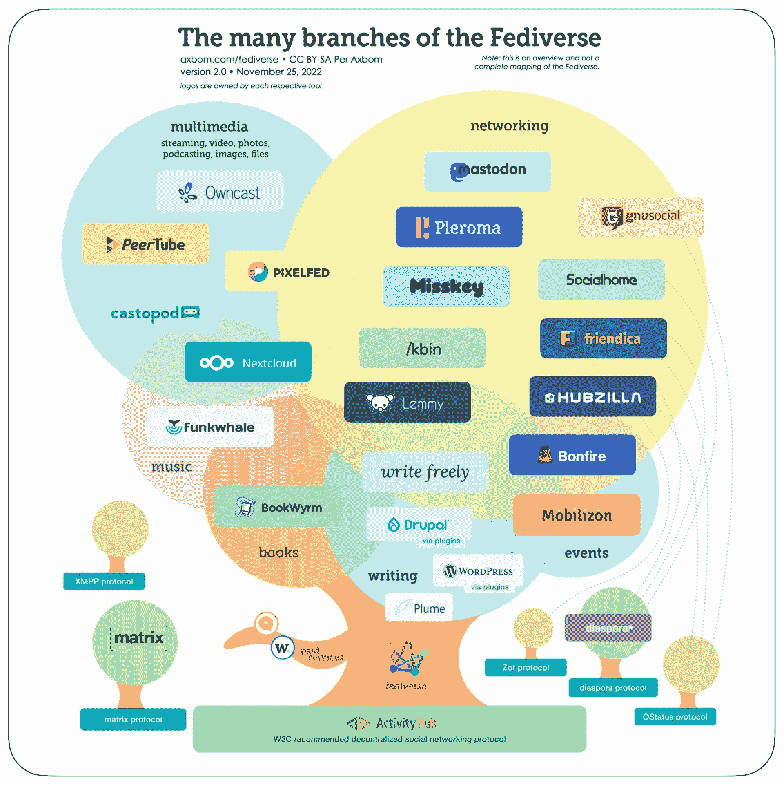
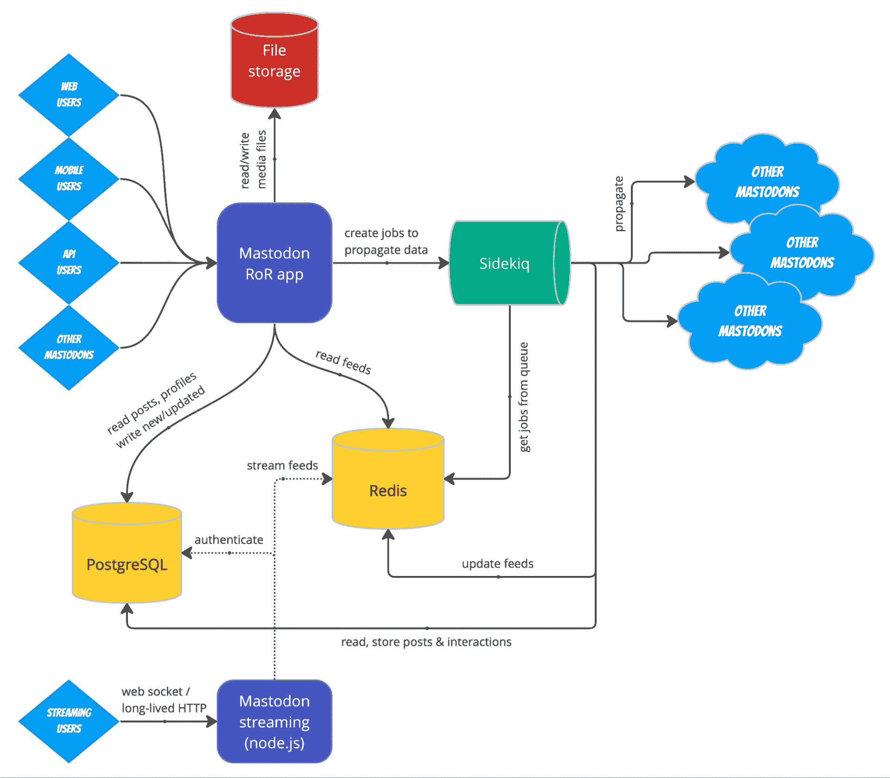

# 如何用 Redis 提高 Mastodon 服务器的性能

> 原文：<https://thenewstack.io/how-to-boost-mastodon-server-performance-with-redis/>

用户和活动的快速增长测试了许多 Mastodon 服务器的可伸缩性，并给它们的管理员带来了压力。根据 TechCrunch 对乳齿象创始人 Eugen Rochko 的采访，随着 Twitter 用户的大量流失，乳齿象在 8600 个不同服务器上的月活跃用户增加到了 250 万。这些数字来自 2022 年 12 月，采用率仍在继续增长。

增长速度有多快，对服务器有什么影响？下面的图表显示了一个大型实例的一段时间内的作业队列，这应该会让您有所了解。上面一行是处理的作业数量，下面一行是失败的作业数量。

图 Twitter 流失对乳齿象工作队列的影响。礼貌诺拉·廷德尔

Redis 开放源码(Redis OSS)是乳齿象技术栈的一部分。任何想要实现 Mastodon 服务器或提高其性能的人都应该了解如何最好地配置 Redis 元素以及其他设置。在这篇文章中，我们总结了乳齿象的体系结构，解释了 Redis 的作用，并指出了潜在的瓶颈。我们帮助您开始调优您自己的实例，并确定解决可伸缩性问题的第一步行动。

## 乳齿象是什么？

让我们从一个简短的技术回顾开始。

[乳齿象](https://docs.joinmastodon.org/dev/overview/) [将自己](https://github.com/mastodon/mastodon#------)描述为“一个基于 ActivityPub 的免费开源社交网络服务器，用户可以在这里关注朋友并发现新朋友。在乳齿象上，用户可以发布任何他们想要的东西:链接、图片、文本、视频。所有的 Mastodon 服务器都可以作为一个联合网络进行互操作(一台服务器上的用户可以与另一台服务器上的用户进行无缝通信，包括实现 ActivityPub 的非 Mastodon 软件)。”

[ActivityPub](https://www.w3.org/TR/activitypub/) ( [repo](https://github.com/w3c/activitypub) )是 W3C 推荐的基于 [Activity Streams 2.0](https://www.w3.org/TR/activitystreams-core/) 数据格式的去中心化社交网络协议，是使用 JSON 表示潜在的和已完成的活动的模型。ActivityPub 提供了用于创建、更新和删除内容的客户端到服务器 API，以及用于传递通知和内容的联合服务器到服务器 API。

### 乳齿象和食蚁兽

由 ActivityPub、 [OStatus、](https://www.w3.org/community/ostatus/wiki/Main_Page)、 [Zot 绑定在一起的服务器组成的联合网络！](https://wiki.p2pfoundation.net/Zot_Communications_Protocol)和[流散*](https://diaspora.github.io/diaspora_federation/) 协议被称为[飞散](https://axbom.com/fediverse/)。Fe diversity 上的服务器被称为“实例”，它们与其他实例联合，这样用户体验就是一个集成的社交网络。各个实例管理自己的操作和安全性。

Mastodon 是实现 ActivityPub 的 20 多种服务器之一。根据 Fediverse Observer 的数据，截至去年 12 月，Fediverse 共有 21，501 台服务器。

图 2:Fe diversity。根据阿克斯布姆的礼遇[。抄送 BY-SA。](https://axbom.com/fediverse/)

## 乳齿象建筑

Mastodon 是一个 Ruby on Rails (RoR)应用程序，具有 React.js 前端。它遵循那些框架的标准实践。要运行 Mastodon，需要 Ruby、Node.js、PostgreSQL、Redis 和一个 SMTP 服务器； [Sidekiq](https://sidekiq.org/) 是一个 [RubyGems](https://rubygems.org/) 。增加一些额外的服务，比如 [NGINX](https://www.nginx.com/) 和 [Cloudflare](https://www.cloudflare.com/) ，可以提高 Mastodon 的可扩展性和抗 DDoS 攻击能力。

下面的架构图有些过于简单。PostgreSQL 是保存用户和帖子以及其他项目的数据库。 [Sidekiq](https://sidekiq.org/) 是 Ruby 和 Rails 的后台作业系统。 [Redis](https://redis.io/) 是内存中的数据库，它缓存 PostgreSQL(从图中省略)并保存 Sidekiq 作业队列(包含在图中)。文件存储通常保存在亚马逊 S3 桶或等效物中；由于多种原因，将外部文件存储在本地磁盘上是有问题的，而将它们存储在 NFS 上则是一场迟早会发生的灾难。

图 3:乳齿象架构概述。礼貌[软件工厂](https://softwaremill.com/the-architecture-of-mastodon/)。

## Redis 是什么？

Redis 是一种 NoSQL 内存数据结构存储，可以持久存储在磁盘上。它可以充当数据库、缓存和消息代理。Redis 具有内置的复制、Lua 脚本、最近最少使用(LRU)驱逐、事务和不同级别的磁盘持久性。它通过 Redis Sentinel 和 Redis 集群的自动分区提供高可用性。

Redis 数据模型是键值，但是支持多种类型的值:字符串、列表、集合、排序集合、散列、流、超级日志和位图。Redis 还支持带有 radius 查询和流的地理空间索引。

Redis 操作系统功能强大，但 Redis Enterprise 增加了速度、可靠性和灵活性方面的功能，以及云数据库服务。Redis Enterprise 可线性扩展至每秒数亿次操作，具有带本地延迟的主动-主动全球分发，以基于磁盘的数据库的基础架构成本提供基于闪存的 Redis 来支持大型数据集，并基于内置耐用性和个位数秒故障切换提供 99.99%的正常运行时间。所有这些都是在将数据库延迟保持在一毫秒以下的情况下提供的。

## 如何安装乳齿象

你可以在 Debian 11 或 Ubuntu 20.04 系统上从源码安装 Mastodon，或者从云实例安装，只要你有 root 权限。这是一个漫长的过程，但最终手动完成可能会让您对要安装的内容有更多的控制和了解。

你也可以[在很多云提供商](https://docs.joinmastodon.org/user/run-your-own/)上安装来自 marketplace 的乳齿象，包括 DigitalOcean、Linode、AWS 等等；在 Docker 或 Kubernetes 上安装乳齿象，包括云提供商自己的 Kubernetes；或者从 Mastodon 托管提供商那里租用一个实例，比如 [Masto.host](https://masto.host/) 、 [Fedi.monster](https://fedi.monster/) 或 [Cloudplane](https://cloudplane.org/) 。在撰写本文时，许多但不是所有的乳齿象主机提供商都对新实例关闭；它们最终应该会再次开放。

许多人已经发布了他们安装和运行自己的乳齿象实例的经验。你可以通过搜索“我自己的乳齿象服务器”或“个人乳齿象实例”找到很多这样的报告

## 乳齿象表演的瓶颈(以及如何应对)

诺拉·廷德尔的叙述更加清晰明了。总结她的结论，“默认的乳齿象结构被打破了。对于小型服务器上的小型实例来说，这很好，但一旦开始增长，就必须扩大规模。”

[瓶颈在哪里](https://nora.codes/post/scaling-mastodon-in-the-face-of-an-exodus/#lessons-learned)？根据 Tindall 的说法，最大的是数据库资源(你需要给 PostgreSQL 一半的 RAM)、Sidekiq 队列(将它们分开)和数据库连接(确保有足够的连接来处理 web 服务器、Sidekiq 队列和流:Nora 建议总共 200 个数据库连接)。

另一组有用的调优技巧来自 [Hazel Weakly](https://hazelweakly.me/blog/scaling-mastodon/) :

*   通过增加其`worker_rlimit_nofile`和`worker_connections`值来调整 NGINX。
*   提高 PostgreSQL `max_connections`，但不要发疯。考虑 512 的上限。
*   考虑一个数据库池，比如`pgbouncer`。这可以让您避免 PostgreSQL 读取副本。
*   黑兹尔引用诺拉对`DB_POOL`、`MAX_THREADS`、`WEB_CONCURRENCY`和`STREAMING_CLUSTER_NUM`的推荐。
*   使用 S3 或等效的对象存储，不要使用本地磁盘，尤其不要使用网络文件系统(NFS)。
*   默认情况下，push 和 pull Sidekiq 队列:将`DB_POOL`设置为 10，并将`-c`设置为`$DB_POOL`的值。
*   对于入口和调度器 Sidekiq 队列:将`DB_POOL`设置为 5，并将`-c`设置为`$DB_POOL`的值。
*   对于邮件程序 Sidekiq 队列:将`DB_POOL`设置为 1，并将`-c`设置为`$DB_POOL`的值。
*   入口队列是非常受 CPU 限制的，用很少的线程就能吸干整个 CPU 内核。准备好启动入口队列的多个进程。将 DB_POOL 设置为 10。
*   考虑将 Puma(Mastodon web 服务器)和 Sidekiq 迁移到它们自己的机器上，如果需要的话，在 NGINX 后面添加更多这样的服务器以实现负载平衡。
*   对 Redis 实例运行 Sidekiq，该实例没有配置为缓存，而是配置为持久存储，并使用 Redis Sentinel(而不是 Redis Cluster，因为 Sidekiq 队列具有不断变化的键)对其进行扩展。
*   运行面向 PostgreSQL 的 Redis 实例作为缓存，并使用 Redis 集群进行扩展。是的，这意味着您至少需要两个 Redis 实例(如果您使用的是 Redis OSS)。

## 暂定结论

如您所见，可以做很多事情来扩展乳齿象以处理增加的流量。下一次，我们将探讨如何以及何时使用更大的 Redis RAM 分配并通过使用 Redis Enterprise 来进一步扩展 Mastodon。

与此同时，你可以[亲自尝试一下 Redis Enterprise](https://redis.com/try-free/)来了解它的强大功能。

<svg xmlns:xlink="http://www.w3.org/1999/xlink" viewBox="0 0 68 31" version="1.1"><title>Group</title> <desc>Created with Sketch.</desc></svg>