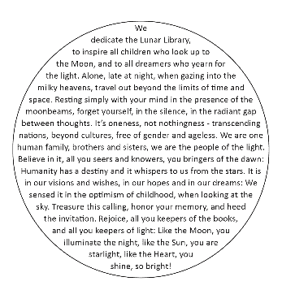

# 如何在月球上建立十亿年的图书馆

> 原文：<https://thenewstack.io/how-to-build-a-billion-year-library-on-the-moon/>

探索太空总是让我们这些雄心勃勃的人一路开发新的有趣的技术——并疯狂地合作。最近的一个项目就是如此，该项目将向月球发送一个 3000 万页的图书馆，以努力保护人类文明。

“刻在 DVD 大小的金属光盘上的人类知识的巨大档案构成了一个‘文明备份’，有助于确保我们遥远的后代永远不会失去人类的集体智慧，”NBC 新闻科技网站 Mach 的播音员[吟诵道。](https://www.nbcnews.com/mach/video/a-30-million-page-lunar-library-is-headed-to-the-moon-to-preserve-civilization-1461629507548)

200GB 的“月球图书馆”全部存储在 25 个镍盘上，每个只有 40 微米(600 分之一英寸)厚。“因为纯镍不会衰变，也没有半衰期，所以它基本上是不会被摧毁的，即使在太空中也是如此，” [the How Stuff works 网站](https://science.howstuffworks.com/lunar-library-backup-human-knowledge-on-moon.htm)指出。他们补充说，顶部的四个光盘已经蚀刻了 60，000 个显微图像，因此解码和查看它们唯一需要的是适当的放大技术。

这是一种新的尖端技术，叫做纳米胶片，比我们标准的胶片缩微胶片更耐用。镍显然是使用深蓝激光技术蚀刻的，最终缩小到 100 纳米的焦点，创建了 0.003 点大小的文本。每个字符为 1 微米。“母版以 300，000 dpi 写入玻璃，”任务网站的[解释道，“然后被电沉积成镍。”](https://www.archmission.org/nanofiche)

一份白皮书解释说，从那个玻璃母片开始，“一个薄的镍箔是通过在原子尺度上一个原子一个原子地电沉积镍来生长的。”

## 更大的计划

月球图书馆是由总部位于洛杉矶的非营利组织 [Arch Mission Foundation](https://www.archmission.org/) 于 2015 年共同创立的一个更大的文明保护项目的一部分。那里的科学家预计这些圆盘可以持续数十亿年，“如果不受干扰的话，比如在外太空。”(镍的熔点？摄氏 1455 度。)

Arch Mission 网站指出，nano fiche 是“NanoArchival 的专利专有产品，是 Arch Mission Foundation 的非营利研究和创新计划的第一个商业衍生产品”，在孵化该公司后，Arch Mission Foundation 成为了“小型创始股权合作伙伴”，希望该公司的任何成功都可以帮助资助该基金会保护文明知识的工作。

当然，该基金会正在探索其他形式的存储，包括合成 DNA 中的分子存储和石英玻璃层中的编码数据。该网站还将[人造琥珀](https://www.archmission.org/technologies)列为一项“即将到来”的技术——被描述为用于长期恢复而保存 DNA 的合成树脂。

该网站还描述了即将推出的另外两个令人难以置信的项目:

*   Archpedia，“一种以跨越语言、文化甚至物种的方式教授当今人类文明概念意义的技术。”
*   文明盒子，“超长耐用的容器，可以保存获取知识所必需的工具和技术，以及知识本身……可能保存一万年或更久。”

基金会想要保留的工具之一？纳米小说阅读器。

## 长久的梦想

Arch Mission Foundation 拥有令人印象深刻的合作伙伴名单，包括几所大学和太空基金会，以及微软和保罗·g·艾伦计算机科学与工程学院和维基媒体基金会。但它始于两位风险投资家和连续创业者的梦想。Nick Slavin 目前担任 Fuzionaire 的总裁兼联合创始人，(自 2016 年以来，他联合创立了三家[公司之一)。根据](https://www.linkedin.com/in/nickslavin/)[的 LinkedIn 个人资料](https://www.linkedin.com/in/novaspivack/)，斯拉文与诺瓦·斯皮瓦克一起创立了 Arch Mission 基金会，后者自 2016 年以来还创立或联合创立了四家不同的公司。但是斯皮瓦克“一生都对太空和星星感兴趣，也许部分是因为他父母给他起的名字，”他的官方简历说。

在年轻的时候，斯皮瓦克参加了航天飞机的早期发射，在从奥柏林大学获得哲学学士学位后，他在法国国际太空大学学习(根据他在 LinkedIn 上的简介，他后来获得了“太空研究证书”学位)。“作为早期的太空游客和太空企业家之一，他长期以来一直有兴趣帮助促进太空文明的发展，”他的简历写道。

## **骑在火箭上**

但是人类的合作才刚刚开始。另一个第一，四月份载着月球图书馆去月球的宇宙飞船也不是由政府资助的。《纽约时报》指出，总部位于以色列的 SpaceIL 公司相对低预算的 1 亿美元的 Beresheet 航天器涉及许多慈善家的捐赠(包括拉斯维加斯赌场的亿万富翁谢尔登·阿德尔森)，以及志愿者劳动。

《泰晤士报》还记录了它丰富多彩的起源故事。这一切都始于 2010 年 30 岁的计算机工程师 Yariv Bash 在《脸书邮报》上提问“谁想去月球？”他的两个年轻朋友和他一起喝酒，生物物理学家约纳坦·温特劳布记得，“随着我们血液中酒精含量的增加，我们变得更加坚定。”

据《纽约时报》报道，他们很快成立了一个非营利组织，最初计划建造一个 12 磅重的廉价着陆器，以竞争谷歌 2000 万美元的月球 X 奖(奖励给第一个在 2018 年 3 月之前将机器人登陆月球的私人资助团队)。但到发射时，它已经膨胀到 1300 磅(包括燃料)。经过八年的准备，他们的小飞船终于在 2 月份乘坐 SpaceX 的猎鹰 9 号火箭(从佛罗里达州卡纳维拉尔角空军基地发射)升空。

《泰晤士报》报道称，他们的计划是在越来越大的范围内环绕地球，最终通过“漫长而曲折的 400 万英里长的旅程”落入月球轨道，尽管月球本身只有 238，900 英里远。一路上，它将测量月球的磁场。

## **外部备份**

这并不是 Arch 任务的唯一尝试来支持人类的知识。CNET [提到了其他的胜利](https://www.cnet.com/news/backup-of-humanity-on-its-way-to-the-moon-aboard-israeli-lander/)——2018 年被送入太空的特斯拉跑车中载有艾萨克·阿西莫夫基金会三部曲副本的石英盘，或者来自[太空链](https://spacechain.com/)的一颗微型卫星携带的维基百科的数字副本，这是一个雄心勃勃的开源卫星网络。

本月早些时候，Arch Mission Foundation 宣布，它还将与 Hypergiant Galactic Systems 合作，在 2020 年围绕太阳系发射一系列卫星，以创建一个星际互联网，配备复杂的人工智能系统，实时将数据广播发送到其他基于太空的互联网节点。利用区块链驱动的数据同步，卫星系统将使用 Arch Mission 十亿年档案进行首次概念验证测试。

“我们与 Hypergiant 的合作伙伴关系，特别是他们的智能卫星平台，使我们能够从地球上连续发送更新，并且在发生灾难性事件时，也可以从地球上检索这些数据…”spiva CK[在 3 月初](https://www.prweb.com/releases/hypergiant_galactic_systems_and_the_arch_mission_foundation_partner_to_create_first_series_of_nodes_in_the_interplanetary_internet/prweb16158345.htm)宣布。“通过 Hypergiant，我们正在开发人工智能，如果需要的话，它可以智能地将这些卫星上的知识传回地球。”

CNET 报道说，拱门使命基金会还计划在火星上建立档案——以及深入地球的地下洞穴。

## 我们在节约什么

磁盘上有什么？该基金会宣布，他们的“月球图书馆”包括 3000 万页地球文本——包括维基百科的完整英文版，古登堡计划和互联网档案馆的大量样本，以及 Long Now Foundation Rosetta 和 PanLex 数据集，“这些数据集提供了 5000 种语言的语言学钥匙，有 15 亿次跨语言翻译。”

第一张光盘可以用放大镜阅读，尽管接下来的三张光盘需要放大 1000 倍。这四个光盘被认为是“模拟”层，包括来自 SpaceIL 的描述以色列文化和历史的时间胶囊，以及儿童的歌曲和绘画，加上来自 Long Now 基金会的“初级读本”，该基金会使用图片来教授超过 100 万个概念及其主要语言的相应单词。

然后是如何阅读其余磁盘的指导手册——“一系列教授访问、解码和理解数字信息所需的技术规范、文件格式以及科学和工程知识的文档。”在该项目的官方白皮书中，有一个文件被描述为“Arch Foundation space il Mission ReadMe”。

总的来说，有 100GBs 的“高度压缩”的数据，解压缩成近 200GBs，“包括英文维基百科的文本和 XML，加上数万 pdf 格式的书籍”

它甚至包括一个关于计算机和半导体的特别收藏…

月球图书馆的官方网页调侃说，实际上有更多的东西存储在他们在月球上的磁盘中，这“将在未来的几个月和几年中揭示出来。”

但是我们已经知道，得克萨斯州奥斯汀市市长为奎索增加了一道美味的食谱，[奥斯汀纪事报](https://www.austinchronicle.com/daily/food/2019-02-22/mayor-adler-sends-kerbey-queso-recipe-to-the-moon-on-a-spacex-rocket-seriously/)报道，在[一封数字化信件](https://www.dropbox.com/s/diaoimdopz8drsc/Earth%20Letter%20From%20Mayor%20Adler%20%28Austin%2C%20TX%29.pdf?dl=0)中，这封信还告诉外星人和未来文明，奥斯汀比好莱坞和纽约“酷得多”。

月球图书馆本身也引发了一些讽刺的评论。CNET 开玩笑说:“任何未来遇到它的外星人肯定会被几个精选条目难倒，比如‘登月阴谋论’、‘扁平地球’或‘潮汐舱挑战’。”。

“但至少它们有助于说明我们为什么需要备份。”

* * *

# WebReduce

<svg xmlns:xlink="http://www.w3.org/1999/xlink" viewBox="0 0 68 31" version="1.1"><title>Group</title> <desc>Created with Sketch.</desc></svg>