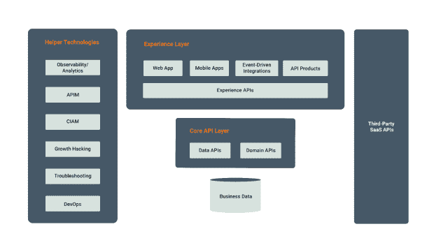

# 如何构建以 API 为中心的数字架构

> 原文：<https://thenewstack.io/how-to-build-an-api-centric-digital-architecture/>

这是两部分系列的第一部分。

就像物种一样，快速进化的能力是数字企业的关键竞争优势——参见[“数字达尔文主义](https://www.wired.com/insights/2014/04/digital-darwinism-disruptive-technology-changing-business-good/)”以 API 为中心的方法是敏捷性的关键促成因素。在这篇文章中，我们将讨论一个典型的 API 驱动架构，如何部署它，以及合适的工具。

敏捷使数字企业能够更快地走向市场，并快速响应变化。例如，在开发产品时，通常对最终用户的需求了解有限。降低这种风险不仅困难，而且昂贵；它可能涉及市场研究、测试用户和专家的意见。一个敏捷的组织可以利用 API 驱动的方法来获得一个合理的近似值，从用户那里学习，并将系统进化成用户真正需要的样子。

但是，有哪些一次就做对的最佳实践呢？

## **一个建筑样本**

下图显示了如何将内部功能安排为 API，并通过组合和创建新的和现有的 API 来创建数字业务。这不是做到这一点的唯一方法；但是，它代表了常见的技术和思想。

这种架构将代码分为两层:核心 API(能力)层和体验层(应用层)。核心 API 层将组织的功能表示为 API(也称为核心 API)。

体验层是最终用户应用程序直接使用的层。这些可以是暴露给终端用户应用和助手服务的网站、移动应用和 API，例如后端对前端(BFF)服务。他们重用 API 经济中的核心 API 和外部 SaaS API。

体验层通过组合新的 API 来创造价值。这一层中的 API 可以由最终用户或 web 或移动应用程序使用。这一层还可以包括事件驱动的集成(将系统、数据和 API 连接在一起的逻辑)，这些集成由世界上发生的事件或系统中发生的事件触发。

在一个设计良好的架构中，核心 API 层应该缓慢发展，并由经验丰富的开发人员采用复杂的技术构建。相比之下，体验层在响应用户请求时发展很快。这一层的目标是从核心 API 层和公共 SaaS API 组合 API，并交付用户体验。这一层需要领域专家和产品经理的密切合作。加速走向市场和在向用户学习的同时进行变革的能力至关重要(增长黑客)。

为什么体验层比核心 API 层进化得快？

当我们需要做出改变或增加新的体验(UI 修改)时，有些可以通过重用 API 来处理，而不用改变它们。然而，一些体验层将需要 API 的改变。一个好的设计旨在保持 API 的稳定和最小的变化，并减少应用程序等待核心 API 变化的需要。所以，核心 API 层的变化会比体验层慢。API 设计越好，核心 API 层变化越慢。

运行在体验层和核心 API 层的服务需要几种辅助技术。首先，他们需要支持用户身份和访问控制，这由客户身份和访问管理(CIAM)技术支持。其次，他们需要 API 管理(APIM)来将他们的服务公开为 API，处理他们的订阅、节流和其他服务质量(QoS)特征，并为将使用这些 API 的开发人员提供支持(通常通过开发人员门户，有时也通过市场)。

使用库和代码来构建或组装 CIAM 和 APIM 是可能的，但是通常花费在构建它们上的注意力、时间和金钱都被浪费了，使你偏离了你的核心目标。

仅仅将系统投入生产是不够的，我们需要保持系统运行并支持它。为此，我们需要开发运维及故障排除支持。

DevOps 包括一个代码存储库和一个 CI/CD 管道来构建和部署变更，以及多个环境(通常是开发、试运行和生产)来测试和逐步推出代码。一些部署支持加那利和蓝绿色部署，以支持逐步部署，并在出现问题时提供即时回退。

故障排除是一套帮助支持团队隔离和修复任何问题的工具。至少，这必须包括可观察性工具、日志管理和从运行系统中收集数据的支持。

## **构建以 API 为中心的数字架构**

我们需要决定我们可以在哪里运行系统，我们将如何实现服务，以及我们将如何将相关服务作为 API 来公开、管理和治理。你经营的是一种服务。您可以选择使用 API 管理解决方案将其中的一些服务公开为 API。我们可以根据它们的功能来识别两种类型的服务:业务逻辑服务和数据服务。

数据服务是通过向导或使用 Java、Go 或 Ballerina 等编程语言构建的。根据所需的特性，您可以选择 GraphQL 或 OData 或纯 JSON with HTTP。通常，向导或低代码/无代码体验让用户使用 SQL 或其他查询来探索数据库，并将结果映射到消息中。

大多数业务逻辑服务会在响应之前修改数据库、检索数据并运行一些业务逻辑。它们通常用 Java (+Spring Boot)、Go (go-kit)和 Ballerina 等语言构建，这些语言是强类型的，具有可靠的并发模型，并且速度很快。

上述语言的一个显著例外是，当 API 公开机器学习模型时，用户可能会选择 Python flask 框架或 TensorFlow 服务。

核心 API 层中的服务通常由有经验的开发人员编写。这些服务可以在内部硬件、云中或无服务器平台上运行。对于重负载，无服务器选项可能成本过高。

核心 API 层中的服务通常需要连接到同一层中的现有数据库、系统或其他服务。它们与 HTTP、gRPC 通信，有时也与 AMQP 或 Kafka 等消息协议通信。

核心 API 层中的服务可以被体验层直接使用，或者作为 API 使用。如果它们作为 API 公开，通常会使用 API 管理解决方案(内部部署或由云提供商提供)。

体验层包括 API、服务(如 BFF 服务或终端用户 API)、集成以及 web 应用或移动应用。这些应用程序和服务组成了其他核心 API 层 API、服务或 SaaS API。由于体验层通常关注 API 的组成，所以它主要构建在连接器生态系统和数据映射功能上:连接器提供易于使用的客户端来与核心 API、服务和 SaaS API 对话，数据映射让我们可以在不同的消息格式之间进行转换。

典型的组合 API 将直接或通过事件接收消息，调用几个 API 并在这些 API 之间翻译数据。体验层通常使用云中的集成平台即服务(iPaaS)、内部集成工具或使用编程语言(如 Ballerina 或 Python)或无服务器运行的代码来实现。大多数选择都有一个连接器生态系统，并支持数据映射。

用于编写集成的低代码技术(服务器端代码)对于体验层来说是一个很好的选择，因为它支持快速开发、领域专家的参与和更广泛的劳动力。

体验层中的大多数服务通常被公开为 API。如果您选择 iPaaS 或云平台(如 Azure functions)进行部署，它们都提供 APIM 支持、可观察性、日志管理，有时还提供 CIAM 支持。通常，非云提供商提供的解决方案往往在功能上更深入，但您应该根据自己的需求进行选择。一些值得注意的 APIM 解决方案包括 WSO2 [API Manager](https://wso2.com/api-manager/) ，Apigee 或 MuleSoft。

体验层提供的大部分公共 API、移动应用或网站都需要支持终端用户管理、认证和授权，我们应该用 CIAM 解决方案来解决。您可以选择内部或 SaaS CIAM 解决方案，如 [WSO2 Asgardeo](https://wso2.com/asgardeo/) 、Okta 和 Auth0。

您可以选择在集成了上述所有方面的内部开发人员平台(如 Choreo)上进行构建，而不是直接从头开始构建，或者在基础设施即服务(IaaS)级别的云提供商上进行构建。然而，平台必须采取固执己见的方法来设计决策，减少您的选择和灵活性，以换取简单性和更大的灵活性。

<svg xmlns:xlink="http://www.w3.org/1999/xlink" viewBox="0 0 68 31" version="1.1"><title>Group</title> <desc>Created with Sketch.</desc></svg>