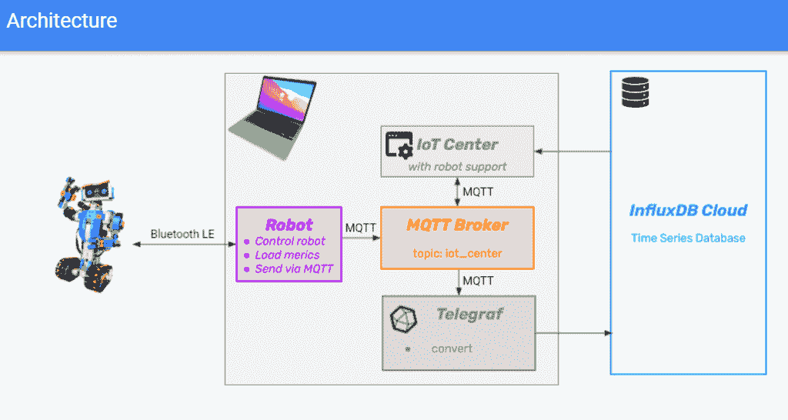
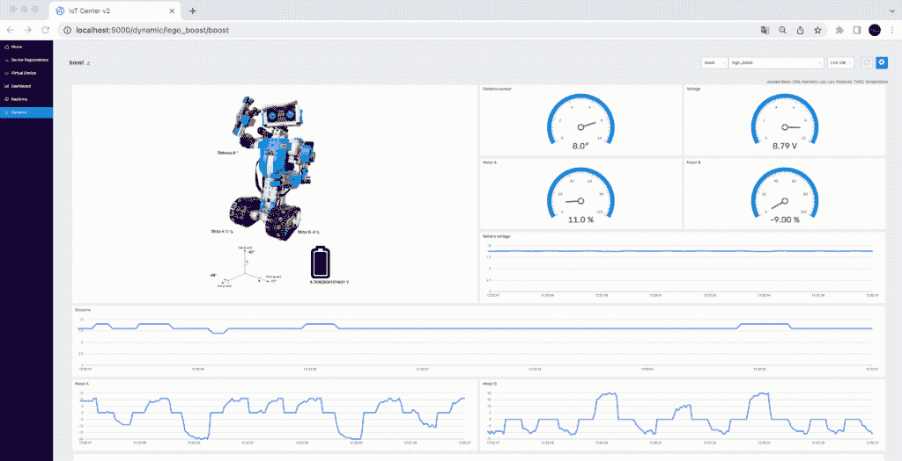
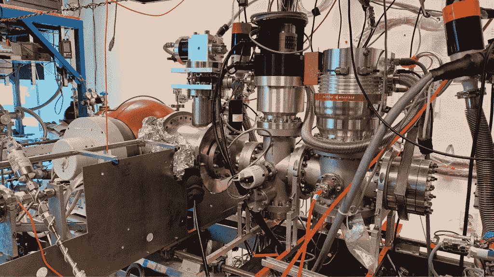
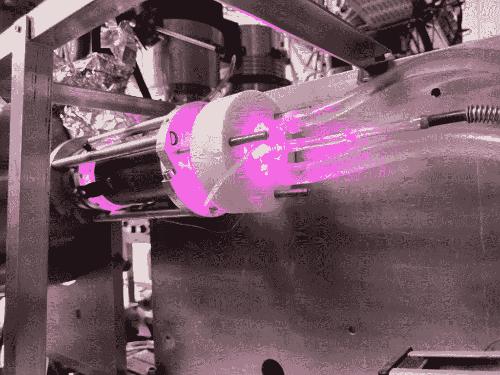
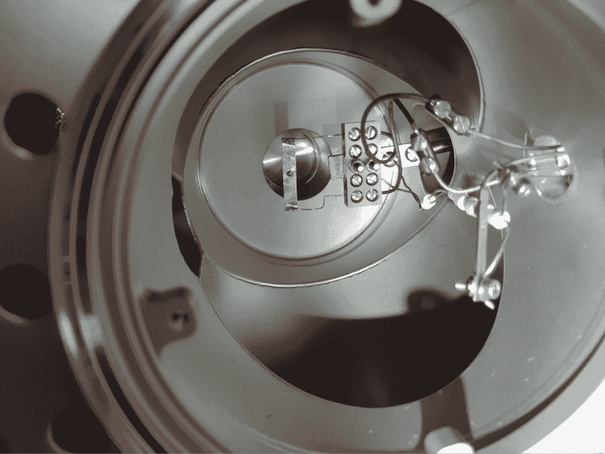

# 如何使用 Python 构建交互式乐高机器人

> 原文：<https://thenewstack.io/how-to-build-an-interactive-lego-robot-using-python/>

查尔斯·马勒

查尔斯是 InfluxData 网站的技术营销作家。他的背景包括从事数字营销和全栈软件开发。

Python 的一个伟大之处在于它有一个几乎所有东西的库，包括控制乐高机器人。最近，我们的团队正在头脑风暴一些想法，如何为活动制作比我们在笔记本电脑上运行的标准仪表板和演示更令人兴奋和吸引注意力的演示。

最终结果是重新利用一个乐高机器人来制作一个交互式 InfluxDB 演示，使用 Python 通过蓝牙连接与机器人通信。在本文中，我将回顾一些使这个机器人成为现实的技术挑战和架构决策，以及如何将像乐高机器人这样简单的演示项目应用到更复杂的用例中。

## InfluxDB 乐高机器人设计决策

我们的一名团队成员在和他的孩子一起制作了一个乐高[助推机器人](https://www.lego.com/en-us/themes/boost)之后，想出了使用这个机器人作为演示核心的主意，他的孩子对他的玩具在原型阶段被临时征用不太高兴。这位同事知道有一些用于控制机器人的 Python 库。

下一步是弄清楚如何连接机器人演示所涉及的不同组件，这基本上涉及简单性和可靠性之间的权衡。我们需要设置足够容易使用，以便非技术活动人员能够开始演示。有一些提议的架构涉及使用 [Raspberry Pi](https://thenewstack.io/creating-a-demo-environment-with-a-raspberry-pi-cluster/) 或 ESP32 与机器人进行交互。最终，我们确定最简单的方法是从运行演示所需的其他软件的笔记本电脑直接连接到机器人，而不是使用其他可能在前往活动现场的途中丢失或损坏的设备。

[https://www.youtube.com/embed/Cp2gDleP8_M?feature=oembed](https://www.youtube.com/embed/Cp2gDleP8_M?feature=oembed)

视频

机器人演示的第一次迭代在激活时执行以下操作:

*   Python 脚本创建了与机器人的蓝牙连接，并为两种不同的预编程例程之一发送命令——舞蹈例程或随机运动模式。
*   来自机器人的传感器数据被发送回 Python 程序，然后该程序将数据转发给 MQTT 代理。
*   Telegraf 转换从 [MQTT](https://www.influxdata.com/integration/mqtt-monitoring/?utm_source=vendor&utm_medium=referral&utm_campaign=2022-06_spnsr-ctn_lego-tutorial_tns) 代理接收的数据，然后将其发送给本地 InfluxDB 实例进行长期存储。
*   物联网中心还接收来自 MQTT 代理的数据，并通过实时仪表板显示传感器数据。物联网中心还连接到 InfluxDB，并可以查询和显示历史数据。

## 乐高机器人技术深度潜水

现在让我们更深入地看看组成乐高机器人项目的不同组件。对于这样一个简单的演示，有相当多的移动块。这是一张展示所有事物之间联系的图表:

【T2

### 计算机编程语言

Python 充当应用程序的粘合剂，通过蓝牙连接到机器人，给它命令，然后将传感器数据发送到 MQTT 代理。Python 脚本使用以下库:

*   暗淡——这是用于连接代理的底层蓝牙库。
*   pylgbst——这是一个围绕官方 Lego Boost 蓝牙协议的高级包装器，提供了一个 API 来控制机器人并与之连接。它使用由 dessel 创建的连接来发送这些命令。
*   Paho MQTT —这个库用于连接 MQTT 代理。
*   InfluxDB Python 客户端库—InfluxDB 客户端用于通过将传感器数据转换为标准线路协议来简化与 influx db 的交互，尽管这也可以通过 Telegraf 来完成。

### InfluxDB

InfluxDB 用于存储机器人运行时产生的所有带时间戳的传感器数据[。这些类型的物联网工作负载非常适合像](https://www.influxdata.com/what-is-time-series-data/?utm_source=vendor&utm_medium=referral&utm_campaign=2022-06_spnsr-ctn_lego-tutorial_tns) [InfluxDB](https://www.influxdata.com/time-series-database/?utm_source=vendor&utm_medium=referral&utm_campaign=2022-06_spnsr-ctn_lego-tutorial_tns) 这样的时序数据库。InfluxDB OSS 在本地运行，用于长期存储，但它也可以配置为使用[边缘复制功能](https://docs.influxdata.com/influxdb/cloud/write-data/replication/?utm_source=vendor&utm_medium=referral&utm_campaign=2022-06_spnsr-ctn_lego-tutorial_tns)将数据推送到云实例。

### Telegraf

在本演示中，Telegraf 用于将传感器数据转发到 InfluxDB，但它也支持 40 多个其他数据存储。Telegraf 在这个用例中接收 MQTT 数据，但也支持许多其他不同的输入格式，并拥有处理器[插件](https://docs.influxdata.com/telegraf/v1.22/plugins/?utm_source=vendor&utm_medium=referral&utm_campaign=2022-06_spnsr-ctn_lego-tutorial_tns)，可用于在输出数据进行存储之前转换数据。

### 莫斯基托

[mosquito](https://mosquitto.org/)是一个开源的 MQTT 代理，我们选择在这个项目中使用它。MQTT 通常用于物联网项目，因此从实现的角度来看，它是有意义的，并且作为参考架构，它也使项目与潜在用户更相关。

### 物联网中心

[物联网中心](https://github.com/bonitoo-io/iot-center-v2)是由 InfluxData 构建的一个应用，作为一个示例物联网应用和参考架构，用于如何将 InfluxDB 与各种物联网设备集成。对于机器人演示，物联网中心通过 MQTT 接收数据，并通过仪表盘实时显示。物联网中心还可以通过直接使用 JavaScript 客户端库查询 InfluxDB 来显示历史数据。

机器人的传感器提供以下显示在仪表板上的值:

*   两个马达运动的方向。
*   视觉传感器的距离读数。
*   X、Y 和 Z 轴的角度值。
*   电池的电压。

###  码头工人

Docker 用于为非技术用户简化管理和运行演示。所有用户需要做的就是使用 Docker Desktop 通过单击激活演示环境，然后 InfluxDB、Telegraf、Mosquitto 和 IoT Center 就可以使用了。

## 从乐高机器人到等离子体和粒子物理学

虽然制作一个乐高机器人可能看起来像一个玩具问题，但它确实显示了 InfluxDB 作为一个平台的强大和灵活性，以及学习如何使用它的价值。例如，帮助创建乐高机器人演示的一名实习生将这些知识带回学校，并重用了大量代码来对一个涉及原子氢检测的实验室实验进行实时监控:

这可能看起来很疯狂，但从概念上讲，这是一回事，只是从传感器收集数据。

孔

光圈内的氢检测器

InfluxDB 还用于更大规模的实验，其中 [CERN 使用 InfluxDB](https://www.influxdata.com/customer/cern/) 来存储 [ALICE](https://home.cern/science/experiments/alice) 实验的监测数据，该实验使用 27 公里长的大型强子对撞机来研究[夸克-胶子等离子体的物理性质](https://en.wikipedia.org/wiki/Quark%E2%80%93gluon_plasma)。

## 扩展 InfluxDB 乐高机器人

乐高机器人演示在 AWS re:Invent 上首次亮相，并通过让游客好奇它能做什么来吸引游客。目前有一些关于如何通过增加功能来改进演示的想法。一个想法是通过结合一个颜色传感器来创建一个更具交互性的演示，该颜色传感器可以通过使用 InfluxDB 创建[任务](https://docs.influxdata.com/influxdb/cloud/process-data/get-started/?utm_source=vendor&utm_medium=referral&utm_campaign=2022-06_spnsr-ctn_lego-tutorial_tns)和[警报](https://docs.influxdata.com/influxdb/cloud/monitor-alert/?utm_source=vendor&utm_medium=referral&utm_campaign=2022-06_spnsr-ctn_lego-tutorial_tns)来触发自动操作。另一种选择是允许机器人通过键盘或鼠标输入来操纵。这些想法实际上只是冰山一角，由于 Python 生态系统，还有许多其他的可能性。如果你想建造自己的机器人，你可以看看 GitHub repo 来获得灵感。

<svg xmlns:xlink="http://www.w3.org/1999/xlink" viewBox="0 0 68 31" version="1.1"><title>Group</title> <desc>Created with Sketch.</desc></svg>