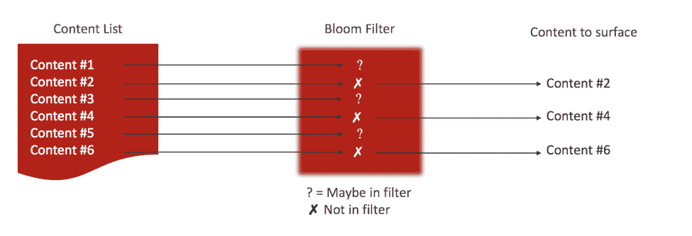

# 如何在会话存储中构建智能:数据结构

> 原文：<https://thenewstack.io/how-to-build-intelligence-into-your-session-stores-data-structures/>

这是三篇文章系列的第二部分，我们将讨论会话存储，这是大多数基于 web 的应用程序的常见组件，并讨论如何在这些会话存储中构建分析，以便它们能够实时做出智能决策。

[在第一篇文章](https://thenewstack.io/how-to-build-intelligence-into-your-session-stores/)中，我们探讨了与会话存储和微服务相关的概念。在这第二篇文章中，我们从 Redis 中的一些数据结构开始，这些数据结构允许作为会话存储的一部分非常有效地实现智能，以及一些需要这种智能的常见模式。这些包括只向用户显示新内容(过滤掉候选内容)，提出相关/个性化的建议或推荐，以及向大量用户推送相关通知。

## 有用的 Redis 数据结构

### 布隆过滤器

 [Kyle J. Davis，Redis 实验室技术营销经理

Kyle J. Davis 是 Redis 实验室的技术营销经理。Kyle 是一个热情的全栈开发人员，经常使用 Node.js 和 Redis，这在他关于这两者的长期博客系列中有所记载。此前，Kyle 在高等教育部门工作，帮助为学者和管理人员开发工具和技术。](https://redis.com/) 

[布鲁姆过滤器](https://redis.com/blog/rebloom-bloom-filter-datatype-redis/)可能是最著名的概率数据结构。布隆过滤器测试是否存在，并可以判断某个项目是否已经*可能*被添加到过滤器中，或者*肯定没有*被添加到过滤器中。换句话说，假阳性是可能的，但假阴性是不可能的。作为接受误报的交换，您获得了巨大的存储节省:无论过滤器中项目的大小或数量如何，每个项目都需要少量的**位**。所以，你可以用布隆过滤器做两个操作:

*   添加项目
*   检查先前是否已将项目添加到过滤器中

[Redis](https://redis.com/redis-features/redis) 中的 Bloom filters 可以通过模块 ReBloom 获得，既可以通过下载、编译和运行模块 LOAD 命令在 Redis 的开源版本中使用，也可以通过下载软件包并在管理界面中启用它直接在 Redis Enterprise 中使用。

布隆过滤器的最简单的实现可以“填满”，即随着更多项目的添加，错误率变得越高。布隆过滤器的 ReBloom 实现是可伸缩的:您指定一个错误率，并且如果您试图添加将导致错误率大于指定比率的项目，ReBloom 将在同一个键内无缝地创建一个附加的布隆过滤器。当您检查某个项目是否存在时，它将检查所有内部 Bloom 过滤器。这种折衷对于已经被缩放多次的布隆过滤器来说确实导致更重的存在检查操作，但是它可以产生几乎一致的错误率。幸运的是，您可以指定一个初始大小来满足您的项目基数要求，从而减少不必要的缩放。

### 超对数

超对数是一种可以从概率上确定唯一项的基数的结构。像 Bloom filters 一样，每个条目只需要 20 比特，条目的大小与结构的大小无关.唯一项的基数是一个估计值。作为所需大小和错误率的示例，您可以在大约 12kb 的存储中保存 2 个 ^(64 个)唯一项目(任何大小),错误率为 0.81%。HyperLogLog 有三种操作:

*   添加项目
*   清点独特的物品
*   合并到一起的超级日志

合并操作将在两个超对数(联合)之间产生一组唯一项。例如，如果您合并两个超级日志，每个都有单独的项目“dog”，然后您对新合并的超级日志进行计数，计数仍然只有 1。

HyperLogLog 是 Redis 的内置数据类型之一。

### 比特计数

位计数不是一个独立的结构，而是使用 Redis 字符串数据结构的一种替代方法。Redis 可以在预先分配的值上以 O(1)的复杂度通过索引将字符串值操作为位数组。这种技术有许多用途，但我们可以直接使用它来创建类似时间序列的结构。

如果从一个已知的固定时间点开始，并从该固定时间点开始计算指定的时间段，则可以在相关索引处使用 set individual bits。假设您的固定点是 2018 年 1 月 1 日，午夜(2018/1/1 00:00:00)，您想要记录凌晨 1 点(2018/1/1 01:00:00)发生的事情，并且您正在跟踪分钟周期。在这种情况下，您可以将第 60 个^(位从 0 翻转到 1，以表示在凌晨 1 点有活动)

Redis 有许多命令，可以:

*   对数组中设置为 1 的第一位进行计数
*   查询单个位
*   设置单个位
*   查询多个位
*   访问任意位宽的多个位

位计数和位计数命令是 Redis 的内置功能。

## 会话存储模式

让我们探索会话存储微服务要实现的几个模式。

### 内容浮现

给定一个内容密集型平台，如博客、电子商务或新闻网站，一个共同的目标是通过向用户展示新的(和个性化的)内容来吸引他们。这提出了挑战，因为它将涉及存储用户已经交互的每个内容片段，然后找到与设定列表的差异。如果您将用户阅读的内容插入到站点的主数据库中，这将很快变成一个伸缩问题，因为对于大多数数据库来说，写入是一项昂贵的操作 Redis 是一个明显的例外。然后，您需要执行另一个代价很高的操作来查找内容列表和已查看内容列表之间的差异。使用会话存储和布隆过滤器，我们可以做得更好。

首先，每当用户查看一段内容时，我们可以将其添加到用户会话存储中的 Bloom filter 中。第二，当我们想要显示新的内容时，我们可以获取内容片段的列表，然后在过滤器中检查这些片段的存在。检查布隆过滤器中的存在是 O(log n)运算，其中 *n* 是过滤器必须被缩放的次数( *n* 将可能非常小，因此我们可以检查多个项目的存在，而不用太担心性能)。由于布隆过滤器不会返回假阴性，我们可以肯定地知道，布隆过滤器中的*不是*的内容对于这个特定用户来说是“新鲜的”。



这种模式的有趣之处在于它可以非常容易地扩展。内容列表的变化相对较少，可以很容易地从主数据库中进行缓存。每个用户都有自己的布隆过滤器，存储需求适中，这意味着需求更多地与用户群的规模相关，而不是内容的数量或交互的次数。最后，在一个分片环境中，比如 Redis 企业集群，数据和负载可以很容易地跨多个分片共享，因为它是由每个用户单独的小键组成的。

## 活动模式监控和个性化

今天最吸引人和动态的网络体验是由用户有意识和无意识地提供给网站的数据驱动的。我们可以利用我们的微服务来收集用户的行为数据，然后处理和利用这些数据为用户创造定制的体验。

首先，这一过程通常被认为难以完成。分析数据通常在另一个服务中收集(例如 Google Analytics ),这些数据是匿名的。由于在基于磁盘的数据库中直接记录所有数据时难以满足写入和存储要求，因此自行收集这种类型的数据通常是不可行的。

第二，对这种类型的数据做出决策要依靠复杂而昂贵的图表或基于 ML 的解决方案。虽然这些解决方案通常会产生有趣的结果，但数据是推断性的，并且被锁定在难以与其他见解结合的黑盒中。例如，您可能有演示一些具体相关性的市场研究，但是如果您的基于 ML 的模型不提供与市场研究一致的特定数据的输出，您就不能充分利用您的数据。举个例子:

为了完成这种类型的监控，我们需要利用我们的许多结构。借助微服务，我们的信息量有限，但足以获得重要的洞察力。

首先，让我们记录站点活动。我们可以通过位计数来实现这一点，位计数不仅会告诉我们*何时发生了*活动，还会告诉我们该活动中任何可辨别的模式。最初，我们将选择固定的时间点和时间段。假设起点是 1 月 1 日 ^(st) ，我们的时间段是分钟。任何时候用户在任何特定的分钟内加载页面，我们将翻转对应于从我们的固定点开始的分钟数的位；在我们的固定点之后 1500 分钟意味着我们将翻转我们的活动监控键中的第 1500 个^位。

接下来，我们将在超级日志中记录访问者使用的唯一页面，只需将 URI 添加到超级日志中。同样，对于访问者消费的每个页面，URI 被添加到页面访问布隆过滤器。我们还将在每次页面访问时增加一个简单的 Redis 计数器。

所有这些操作都是在每次页面访问时完成的——这听起来可能有点多，但是，所有这些操作都是轻量级的。

有了这些信息，我们可以开始将它们组合成具体的见解。例如:

*   这是用户第一次访问特定页面吗？在访问布隆过滤器页面中检查 URI。
*   新来的吗？HyperLogLog 计数为 1，并且页面不在布隆过滤器中。
*   在过去的五分钟内不活动？将活动位计数器的最后五位相加。如果为 0，则用户在最近五分钟内没有访问过该网站。
*   访问了一堆页面？检查此群集的页面访问布隆过滤器。

在前面的例子中，假设购物车添加确认页面有一个 URI，如下所示:

```
/added/[primary-item-category]

```

所以，我们有两个 URIs，可能是这样的:

```
/added/tv

/added/tv-mount

```

当用户访问购买确认页面时，我们可以检查页面访问 bloom filter 的各种组合，包括我们的 TV & TV Mount 组合。如果这些匹配，那么我们可以建议用户使用 HDMI 电缆来完成购买。这可以实时完成，而不必逐字记录每个交互。应该注意的是，我们依赖于 Bloom filter 中的肯定存在测试；因此，可能会出现假阳性。回想一下，ReBloom 实现可以增长，同时将错误率保持在可接受的水平，防止随着过滤器填充而不断增加的假阳性率。此外，由于我们检查的是多个项目，并且每次检查的错误概率都是独立的，因此每次检查的组合错误率都会增加。

假设我们已经在 ReBloom 中设置了一个具有默认错误率(0.01 或 1/100)的布隆过滤器，对于给定的布隆过滤器状态，*两个*项目都是误报的概率要高得多。最后，在这个用例中，建议一件不完美的物品是可以接受的:谁在网上购物时没有遇到过这种情况？这是准确性和速度/存储效率之间的权衡，必须针对每个单独的使用案例进行权衡。

当涉及到监控行为时，隐私显然是一个问题。当用户意识到某个网站可能在跟踪他们访问的页面时，他们通常会感到不安。一想到邪恶的第三方获得这些信息，就令人不安。布鲁姆过滤器或超对数这样的概率数据结构的一个有趣的方面是，它们本质上是单向的——不可能直接提取放入其中的信息。如果通过某种方式，恶意的第三方获得了我们描述的会话存储中的 Bloom filter 或 HyperLogLog 数据，他们将只能查询项目(在这种情况下是 URIs)，而不能获得项目列表。虽然这不应该被认为是一种加密形式，但当恶意参与者必须像大海捞针一样接近它时，这种配置会使您成为一个不太受欢迎的目标。

## 群组通知

假设你的网站有用户组和通知系统。向单个用户发送通知非常简单:您有一个通知列表和一个状态(已读/未读)。每个用户都有自己的列表。然而，群组通知提出了一些挑战。向组发送通知时，会在每个用户的个人通知列表中插入一个新通知。这是有问题的。将通知推送给一大群用户需要对每个用户进行写操作，这对于小群体来说可能没什么问题，但是想象一下拥有数百万用户的群体。当用户看到通知时，您需要将状态从未读设置为已读，这将涉及到主数据库。

为了提高效率，让我们重新设计这个模式。首先，组通知存储在整个组的简单列表数据结构中。当您想要添加通知时，只需将一个项目添加到此结构中。这成为一个容易缓存的数据，因为它很少改变，并且对所有用户都是一样的。接下来，我们为每个用户在 Redis 支持的会话中存储了一个 Bloom filter。当用户检查组通知时，您从列表中取出前 *n* 个项目，并检查它们是否出现在 Bloom 过滤器中——看到的项目出现在过滤器中，而看不见的项目不出现。在这种情况下，我们假设已经看到了所有内容，除非通知不在过滤器中。

这个过程非常轻量级。向组添加通知仅仅是影响组中每个用户的单次更新，而不管组的大小。标记“读取”完全发生在会话存储中，并且在仅链接到单个用户的数据结构上，这意味着它可以毫不费力地伸缩。存储需求是最小的，并且对已读/未读状态的检查包括一些简单的散列函数，随后仅查询很少的位。

虽然这些模式中的一些可能属于短暂的类别，但是通知属于应该基于会话(对于单个用户是唯一的)并且总是持久的一类数据。 [Redis Enterprise](https://redis.com/redis-enterprise/advantages/) 具有填补这一角色的独特优势，因为它允许通过内存复制实现[持久性](https://redis.com/redis-features/persistence)。将这一点与一分钟快照持久性相结合，可以创建一个分层的持久性，其中没有单个事件可以取出您的内存数据库，并且在所有节点都出现故障的情况下，您可以获得一个不超过一分钟的副本。

通过 Pixabay 的特征图像。

<svg xmlns:xlink="http://www.w3.org/1999/xlink" viewBox="0 0 68 31" version="1.1"><title>Group</title> <desc>Created with Sketch.</desc></svg>