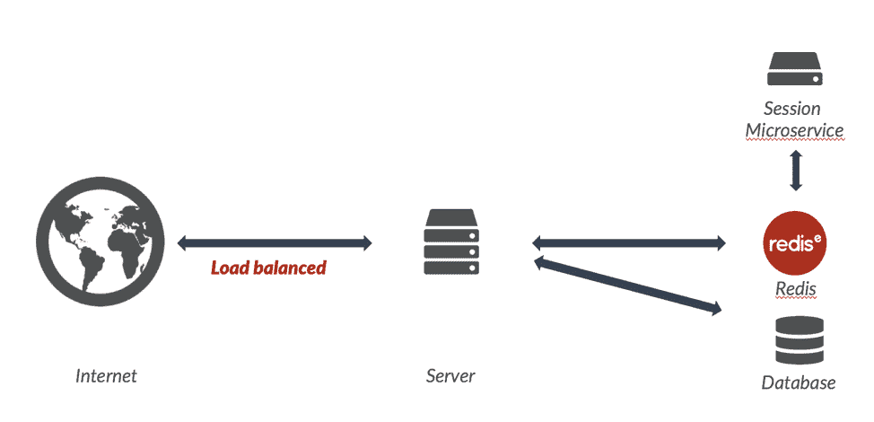

# 如何将智能构建到会话存储中

> 原文：<https://thenewstack.io/how-to-build-intelligence-into-your-session-stores/>

会话存储是大多数基于 web 的应用程序的常见组件。在本文中，这是系列文章的第一篇，我将讨论如何在这些会话存储中构建分析，以便它们能够实时做出智能决策。我解释了如何实现常见的模式，比如向用户呈现正确的内容，使用活动模式来推动建议/推荐，以及向大量用户发送群组通知。

## 什么是会话存储？

 [Kyle J. Davis，Redis 实验室技术营销经理

Kyle J. Davis 是 Redis 实验室的技术营销经理。Kyle 是一个热情的全栈开发人员，经常使用 Node.js 和 Redis，这在他关于这两者的长期博客系列中有所记载。此前，Kyle 在高等教育部门工作，帮助为学者和管理人员开发工具和技术。](https://redis.com/) 

简而言之，会话存储是连接到服务用户的数据“块”,与主数据库分开存储，以便在不直接、持续访问数据库的情况下提供粘性。在这种情况下，“用户”的定义很宽泛。用户可以简单到仅仅是一个网页的访问者，一个在手机应用程序中拥有帐户的用户，甚至是通过 API 访问数据的另一个服务。

会话通常通过 cookie 在请求之间保持。服务器给客户机 cookie，客户机存储它，然后用这个 cookie 发回后续请求。然后，服务器使用 cookie 字符串作为令牌，通过它可以将数据与用户相关联。

通常，会话数据是单个用户(且仅是该用户)最频繁使用的。会话数据通常也是呈现页面或视图的关键要求。

很多时候，会话数据是短暂的，并且被复制到其他一些数据存储中。然而，正如我们不久将探讨的，这并不总是正确的。

## 什么是智能会话存储？

在本文中，我们将探索超越“哑”数据存储的会话存储。会话存储中的智能数据可以由服务的用户计算、推断或直接提供。这样，您可以将传统的会话数据(用户名、首选项或其他常见的有状态数据)与智能数据一起存储。

我们将使用的智能数据的一些示例如下:

*   组通知—向特定部分的用户提供单一通知
*   内容呈现数据—一个数据集，用户可以利用它来指向其他内容
*   活动数据-关于用户行为和服务使用的信息
*   个性化数据——可用于使服务对每个用户更加具体和相关的数据

## 为什么任何服务都需要会话存储？

在一个非常简单的世界里，我们不需要会话存储。在下面这个非常简单的例子中，您将整个互联网连接到您的单个服务器，然后由单个数据库提供支持。在每个页面视图中，web 服务器连接到数据库并获取必要的信息。

这对于小的用例来说可能很有用，但是当你的网站变得繁忙时，你可能会遇到数据库变慢的问题。毕竟，与 web 服务器的职责相比，查询——或者更糟，写入大多数数据库是非常耗费资源的。要补救这种情况，您需要修改网站代码，开始使用基于文件的会话存储。这是最简单的会话存储策略—实际上，单个会话存储在 web 服务器上的文本文件中。然后，web 服务器软件将直接读取或操作会话数据文件。

> 由于 Redis Enterprise 以其易于扩展以适应巨大流量的能力而闻名，这种连接允许用户、服务器和微服务实例的近乎无限的增长。

这很有帮助，因为数据库很少被访问，因此速度更快。然而，当你的网站发展得更快时，另一个问题就出现了。此时，您已经限制了对数据库的请求数量，但是对于所有的文件 I/O，除了 web 服务器的正常职责之外，web 服务器本身在您的流行站点的压力下开始变得紧张。这个难题的常见解决方案是添加更多的 web 服务器和一个负载平衡器。负载平衡器将流量均匀地分配给所有 web 服务器。

这个解决方案在测试期间可能工作得很好，但是实际用户可能会有抱怨。让我们来看看，当一个拥有存储其姓名的会话的用户被定向到两个具有基于文件的会话存储的不同 web 服务器时，会发生什么情况。

如上图所示，当 web 服务器阵列将会话数据存储在一个文件上，而负载平衡器刚刚将数据分发到下一个 web 服务器时，会话数据可能会以文本文件的形式存储在另一个服务器上。因此，该服务不知道用户名为 Robin。让我们探索一个更好的解决方案。

在这个例子中，我们有一个 web 服务器，它将会话数据存储在 [Redis](https://redis.com/why-redis/) 中，而不是存储在服务器上的文本文件中。还包括一个会话微服务，可以管理我们的会话智能会话数据。在这个架构中值得注意的是，web 服务器从不直接连接到微服务，一切都是通过 Redis 数据库进行的。由于 [Redis Enterprise](https://redis.com/redis-enterprise/) 因其能够轻松扩展以适应巨大的流量而闻名，这种连接允许用户、服务器和微服务实例的近乎无限的增长。此外，Redis Enterprise 具有广泛的[高可用性](https://redis.com/redis-features/high-availability)特性，这对于任何架构的关键组件都是必不可少的。

## 为什么要使用微服务？

与构建复杂应用程序的整体方法相比，微服务有一些众所周知的优势。借助微服务，您可以更轻松地扩展应用的容量、开发和可靠性。在这种情况下，“开发”指的是实现您的应用程序需要覆盖的复杂功能群所需的开发人员/团队。

开发人员可能是一群挑剔的人。一个团队可能想要使用与另一个团队完全不同的工具、语言和方法。将这些团队合并在一起可能很难(或者不可能)有效地完成。此外，代码库越大，就越难:

*   明白；理解
*   试验
*   添加功能

通过将会话存储视为微服务，您可以从 web 服务层抽象出存储的复杂性，甚至可以使用完全不同的语言和工具。事实上，您可以精确地测试会话存储的适当行为。最后，您可以独立于服务图层的任何其他部分添加要素。

对于容量，微服务允许您根据需要分配更多基础架构，而不必横向扩展架构的其他部分。与整体式方法相比，微服务允许基础架构针对离散服务进行适当调整。以我们的会话微服务为例，我们可以添加重要的额外功能，而不用担心它在以后向外扩展时会成为瓶颈。反之亦然:如果架构的其他部分是资源密集型的，我们可以保持会话管理层更精简。

最后，微服务可以增加我们应用的可靠性。构建微服务本质上需要关注故障情况。事实上，您甚至可以内置功能来允许微服务的热重启，甚至特定微服务的完全故障，从而导致您的应用降级而不是硬故障。

## 运输机制

对于我们的会话存储，我们将以两种方式使用 Redis。首先，如你所料，我们将使用 Redis 作为数据库。其次，我们将使用 Redis 作为传输工具。Redis 有一些非常有趣的轻量级机制来管理数据流。

这种类型最常见的 Redis 功能是发布/订阅。Redis 中的发布和订阅模式被归类为“一劳永逸”，这意味着一旦您发布了一条消息，它就消失了——没有该消息被发布的自动和持久的记录。很像经典的思维实验:

“如果一棵树倒在森林里，周围没有人听到，它会发出声音吗？”

Redis 等价于:

"如果一个消息发布到一个频道，没有人订阅，它是否存在？"

与思维实验不同，在 Redis 中我们有一个直截了当的答案:不。

您可以订阅单个频道(subscribe ),或者更有趣的是，您可以订阅一个模式(PSU SUBSCRIBE ),该模式基于 glob 通配符来监控频道。

我们将使用的另一种模式是阻止列表。列表是有序的项目，可以很容易地推入和弹出。阻塞列表是相同的底层数据类型，但有所不同:在空列表的情况下，服务器会阻塞任何其他命令的执行，直到另一个客户端将一个项目推入列表中，或者直到超时时钟结束。

通过这两种模式，我们可以创建灵活的微服务传输，支持关键和非关键路径。让我们先来看看非关键途径:

步骤 0 发生在收到请求之前的某个时间点。

在这个序列中，服务层不等待会话微服务响应。实际上，服务层只发送消息，但是它不知道这个消息是否被预定的接收者接收到。这种类型的序列非常适合于存储在会话中的数据完全无关紧要并且对渲染的其余部分不重要的情况。使用这种模式的优点是对服务层的唯一性能影响是一个简单的 O(1)命令:PUBLISH。会话微服务处理可以在发送响应期间甚至之后发生。

现在，对于关键路径，我们将看到微服务层如何发挥更大的作用。

步骤 0 发生在收到请求之前的某个时间点。

这两个序列在步骤 3 之前是相同的。这里，在关键路径中，在步骤 3，我们现在阻塞服务层的客户机(注意:您要么必须为每个请求创建一个 Redis 客户机连接，要么更好地使用连接池)。这意味着客户端将处于空闲状态，直到微服务层向列表中添加一个项目或达到超时(超时可以是非常低的值)。非常重要的一点是，会话和请求都有唯一的 id。由于唯一的 id，任何给定的“async:*”列表应该只有一个订户。在微服务层，微服务进行处理，然后向这个唯一列表发布消息。该消息可以简单地向服务层指示微服务层已经完成，或者该消息本身可以包含信息。当您需要确认微服务已经完成，或者您的其余步骤取决于微服务已经执行的某个操作时，此序列非常有用。正如您可能想象的那样，在相对意义上，这个序列有更多的开销和潜在的延迟，但请记住，这些都是非常简单的轻量级操作，最有可能在亚毫秒时间尺度内完成(显然，减去微服务所需的任何处理时间)。

## 从提交数据到计算数据

大多数会话存储只是存储用户在某个时候提交的数据:帐户细节、偏好，甚至可能是购物车。这样，数据就相当简单了——实际上，数据库只是保存一个值并将其返回给用户。但是，会话存储可用于更复杂的数据。在本系列的下一部分，我们将看看 Redis 和/或 [Redis 模块](https://redis.com/community/redis-modules-hub/)中可用的一些数据结构(在本系列的后面，我们将说明如何在会话存储的情况下使用它们)。对于下面描述的所有结构，我们将描述它们与使用和存储特征相关的属性，而不会太深入算法实现或理论。

通过 Pixabay 的特征图像。

<svg xmlns:xlink="http://www.w3.org/1999/xlink" viewBox="0 0 68 31" version="1.1"><title>Group</title> <desc>Created with Sketch.</desc></svg>