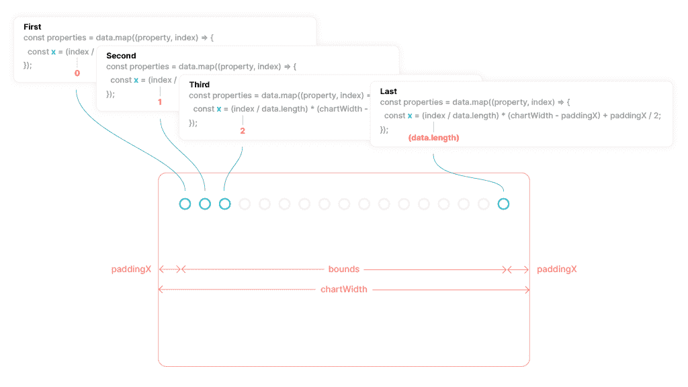

# 如何用 React，SSR 和 Tailwind CSS 构建 SVG 折线图

> 原文：<https://thenewstack.io/how-to-build-svg-line-charts-with-react-ssr-and-tailwind-css/>

在这篇文章中，我将解释如何使用服务器端渲染在 React 中“滚动你自己的”SVG 折线图。要使用 React 进行服务器端渲染，可以使用 [Next.js](https://nextjs.org/) 或 [Gatsby](https://www.gatsbyjs.com/) 。

Gatsby 和 Nextjs GitHub 存储库活动线图截图

在下面的链接中，您会发现使用这两种框架完成的折线图的实时预览和 GitHub 存储库。

我不会讨论如何开始使用这两个框架，所以如果您不熟悉这些技术，请查阅文档。

我还使用了[顺风](https://tailwindcss.com/)来设计图表。如果你也想这么做，那么 Tailwind 文档中有关于 [Gatsby](https://tailwindcss.com/docs/guides/gatsby) 和 [Next.js](https://tailwindcss.com/docs/guides/nextjs) 的安装指南。

在演示站点中，我使用了 GitHub REST API 作为数据源，如果你想做同样的事情，你需要一个 GitHub 个人访问令牌。或者，如果您愿意，我在下面的链接中提供了一些样本数据。

## 抽样资料

您可以使用下面的任何一个示例数据表。

### 盖茨比页面示例数据要点

### 用法示例

### Next.js 页面示例数据要点

### 用法示例

## 什么是服务器端渲染？

服务器端呈现(SSR)是应用程序将服务器上的 HTML 文件转换为客户端(浏览器)完全呈现的 HTML 页面的能力。将 SSR 与服务器端数据获取相结合意味着您可以在服务器上用已经“获取”的数据生成图表，也可以在服务器上生成图表。

以这种方式创建图表意味着，当浏览器中禁用 JavaScript 时，或者在 React 对 DOM 进行处理之前，所有的数据获取和呈现都将正常工作。

以这种方式呈现图表意味着当数据被“获取”时，它们永远不会出现空白，并且在数据加载后，你不会看到“跳转”或布局变化；使用这种方法还可以确保你的[灯塔](https://developer.chrome.com/docs/lighthouse/overview/) [CLS](https://web.dev/cls/#what-is-a-good-cls-score) 分数不受影响。

## 线形图剖析

在以下部分中，您将创建构成折线图的多个不同部分。下图对这些进行了描述。

显示 Svg 折线图不同部分的图表

## 创建折线图组件

创建一个名为<linechart>的新组件，并将文件命名为 line-chart.js</linechart>

<linechart>组件接受一个名为 data 的属性。数据属性的形状是使用属性类型定义的。</linechart>

## 在页面上呈现折线图

将<linechart>导入页面组件并返回。根据您使用的是 Gatsby 还是 Next.js，析构的页面属性会有所不同。</linechart>

## 设置折线图

在此步骤中，您将定义用于控制折线图不同部分的变量。

下面是对每个变量的简短解释。

1.  chart width:SVG 视图框的宽度。
2.  chart height:SVG 视图框的高度。
3.  offsetY:用于定位刻度。
4.  paddingX:折线图周围的左右填充。
5.  填充:折线图周围的顶部和底部填充。
6.  maxY:数据数组的最大总值。
7.  guides:确定参考线数量的空数组。

## 折线图属性

属性数组是使用数据属性的值和上一步定义的变量的组合创建的。每个返回值用于折线图的不同部分。

这里要查看的两个重要值是 x 和 y。这些变量是通过组合前面定义的一些变量和. map 中的索引值创建的。

不加修改地返回总计和日期值。

## 创建 X 坐标

x 坐标用于为标记、值和折线点的 x 值创建位置。

x 坐标是通过使用。映射并将它除以在数据属性上传递的数据的长度。将其乘以 chartWidth 并减去 paddingX 值可确保 x 坐标值永远不会超出图表宽度的界限。

显示阵列的图表。映射迭代以创建 x 坐标

## 创建 Y 坐标

y 坐标用于为标记、值和折线点的 y 值创建位置。

y 坐标的创建方法是将总和除以 maxY 值，然后乘以 chartHeight 减去 paddingY 值。作为一个额外的步骤，减去 paddingY 加上 offsetY 值，这为图表底部的刻度创造了一些额外的空间。

显示阵列的图表。映射迭代以创建 y 坐标

## 创建点数组

SVG [折线](https://www.w3schools.com/graphics/svg_polyline.asp)元素可用于创建由点连接的线。要为折线创建点，您可以使用属性数组中的 x 和 y 值，并将它们作为 x，y 位置数组返回。

points 数组将返回类似下面的内容。数组中的每个索引都包含一个 x 和 y 坐标。

## 创建 SVG

创建一个新的元素，定义视图框属性并将角色设置为 presentation。

## 创建折线

创建一个新的<polyline>元素，将填充设置为无，并添加相关的类来设置笔画的样式。还可以使用属性定义 strokeWidth。使用 points 属性可以传递 points 数组返回的值。</polyline>

## 创建标记和值

使用从属性数组返回的值，您现在可以添加和定位 svg 元素来显示数据数组的总计。

使用 cx 和 cy 属性使用 x 和 y 属性定位<circle>元素，并使用 r 属性给定半径 12。您可以添加自己的类名和 strokeWidth 值，以获得所需的外观。</circle>

使用 x 和 y 属性，通过 x 和 y 属性也可以定位<text>元素。<text>元素接受子元素，所以添加 total 属性来显示它。我在 y 轴上增加了额外的 2.8，以确保文本在<circle>中垂直居中。您可以添加自己的类名或属性来实现所需的外观。</circle></text></text>

## 创建记号

记号的创建方式略有不同，您会注意到<text>元素被包装在<g>中。</g></text>

这是为了创建一个新的坐标系，这样当旋转应用于文本时，它的上/左位置是从<g>而不是元素的上/左位置计算的。</g>

<g>元素不支持 x 或 y 属性，所以您将使用 transform 属性并为 x 和 y 位置提供 translate 值。我还减去了 paddingY 和 offsetY 值，以正确定位刻度。</g>

## 创建指南

辅助线是最后添加的元素；但是这次您将遍历 guides 数组，而不是遍历 properties 数组。

这只是一个空数组，索引用于为 React 提供一个键。y 坐标的创建方式与前面类似，其中创建了一个比率，以确保 y 位置保持在边界内，并且不与记号重叠。

使用从属性数组返回的值，可以添加任意数量的不同 SVG 元素来帮助显示不同类型数据的不同值。

x 和 y 属性应该就是您所需要的。虽然创建它们有点棘手，但它们为你想要添加到图表中的任何新元素创建了边界。

感谢您的阅读，如果您有任何问题，请在 Twitter 上找到我: [@PaulieScanlon](https://twitter.com/PaulieScanlon) 或查看我的网站 [paulie.dev](https://paulie.dev/) ，在那里我有更多的 React/Jamstack 教程。

## 进一步阅读

<svg xmlns:xlink="http://www.w3.org/1999/xlink" viewBox="0 0 68 31" version="1.1"><title>Group</title> <desc>Created with Sketch.</desc></svg>