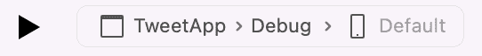

# 如何建立自己的去中心化 Twitter

> 原文：<https://thenewstack.io/how-to-build-your-own-decentralized-twitter/>

> “你好艾伦，你好吗？”
> 
> “你好，贝丝，我很好”

在一部小说的书面约定内，当你碰到这两行时，你可以理解为两个人在互相交谈。也可能有一个叙述者，也必须有一个作者。

有了社交媒体，台词不是转述的言语，而是现场主角实时发布的帖子。叙述者成为社交媒体平台。因此，当一个平台没有控制地位时，保持对话是一个挑战。

## 联邦和分布式的区别

根据我的经验， **federation** 在软件世界中经常被提及，但很少被实践；试图在两个独立的实体之间进行编排是很脆弱的。我们理解 Twitter 是其信息的所有者、控制组织者和真理的来源。当应用于社交网络时，术语“社交图”混合了用户发帖与帖子本身的关系。不管怎样，我们知道 Twitter 拥有自己的社交图谱。

随着我们最喜欢的蓝鸟应用在[被破坏，一些注意力已经从](https://thenewstack.io/twitter-turmoil-we-need-an-open-protocol-for-public-discourse/)[转移到乳齿象](https://thenewstack.io/devs-are-excited-by-activitypub-open-protocol-for-mastodon/)(以及在较小程度上像 [IndieWeb](https://indieweb.org/) 这样的项目)。如果 Twitter 是一个中央权威平台，那么我们可以说一个**联邦网络**有多个中心，而一个**分布式网络**根本没有中心。如果要考察这两个东西的意义，就把“分布式”想成一个质量。联邦的完美例子是乳齿象。它有许多独立拥有和管理的服务器实例，这些实例与其他志同道合的服务器进行通信。用户和服务器之间的关系是非常熟悉的，而稳定分布的 Indieweb 期望参与者在他们自己的 web 域上独立地维护他们的社交数据。

也许终极对比是僵尸启示录电影提供的。社会要么是由不稳定的小团体组成，要么是每个人都在铁丝网和枪支后面为自己奋斗。Twitter 关闭后，生活不会那么糟糕。

就其核心而言，替代模式的基本概念是，对话和你的身份不(或不完全)由一个单一的平台控制。我将把这个概念扩展到正常范围之外，并使用一个代码项目来探索对话所有权的问题，我将在一系列文章中概述这个项目，从本文开始。

## 一个类似 Twitter 的应用的架构

为了熟悉起见，我将在我们的实验图上把一条消息称为 **tweet，**用户称为 **tweeter** ，而平台相当于 **tweet viewer** 。

我们将使用的架构为 tweet viewer 提供了访问参与 tweet 的用户并获取他们的 tweet 的工作，以便将它们缝合在一起，形成社交图。这接近于最终的分发，其中推文者控制或多或少的一切，推文查看平台只拥有收集推文所需的权限。每个用户都拥有自己的推文，并将它们存储在一个**存储库**中——在项目中表示为一个文件。一个 tweet view 平台检查它知道哪些身份，并去 tweeter 的商店恢复他们的 tweet。我使用 JSON 作为数据格式。


项目架构

这个示例代码库的目的是展示社交图不归任何人所有意味着什么，就像 Twitter 一样。相反，tweet 的显示是从用户的 tweet 存储中提取的，并在每次请求时重新构建。

“拥有”你的推文意味着两件事。首先，我可以对我的推文做任何我喜欢的事情(编辑、删除、添加)，因为我拥有它们。其次，这意味着一个推文查看平台需要我的许可才能使用我的推文。这意味着该图可能处于永久的损坏或分裂状态，因为没有中央权力机构有权实施结构。这进一步意味着在向用户呈现图表时需要一定程度的缓解。我们以后会对这些案例进行实验。

我使用了 Visual Studio 解决方案，因为它易于构建和运行单独的项目。你可以[下载解决方案](https://github.com/eastmad/TheNewStack)并自己构建，或者只是跟着做。有两个可运行的项目: **TweetApp** 填充 tweet store，以及 **TweetDisplay** 显示 tweet viewer 平台将显示的 tweet。该代码主要关注 JSON 文件的读写，以及显示 tweets 的排序。请记住，您可以直接调整 JSON 数据。


新堆栈的解决方案

我做了几个假设来简化项目并关注问题:

*   tweet stores 和 view platforms 显然应该是分开的独立服务，但是在这个项目中，它们舒适地坐在一起。因此，这些服务之间所有可能的通信问题都被省略了。
*   因为数据位于项目中，Tweet 应用程序可以方便地在任何 tweeter 的商店中创建 Tweet。
*   线程非常简化，你可以只回复最后一条推文。

## 让我们开始建造吧

首先，让我们看看这个项目的基本 Tweet 结构:

```
public  struct  Tweet
{
        public  string  Text  {  get;  set;  }
        public  long  Replyto  {  get;  set;  }
        public  long  Time  {  get;  set;  }

        public Tweet(string text,  long replyto)
        {
            Text  =  text;
            Replyto  =  replyto;
            Time  =  DateTimeOffset.Now.ToUnixTimeSeconds();
        }

        ...
}

```

你会注意到没有名字——因为你可以在每个 tweet viewer 平台上有不同的身份。我使用 unix 时间(自 1970 年 1 月 1 日以来的秒数)作为惟一的 id 和创建时间。下面是一个 tweet store 中 JSON 格式的 tweet 的例子:

```
{
    "Text":  "Hi there, anyone listening?",
    "Replyto":  0,
    "Time":  1668435369
},

```

回复字段为 0，意味着这是一个线程的开始。

用户和推文查看平台之间的关系在身份:
中定义

```
public  struct  Identity
{
        public  string  Name  {  get;  set;  }
        public  string  StoreFile  {  get;  set;  }
        public  bool  Permission  {  get;  set;  }
        public  short  Id  {  get;  set;  }

                ...
}

```

身份结构为特定 tweet 平台内的用户设置名称。允许 tweet 平台从指定的 tweet store 中读取 tweet 的权限令牌应该是什么，只是一个 bool。这是艾伦的身份:

```
{
        "Id"  :  1,
        "Name"  :  "Alan",
        "StoreFile"  :  "AlansTweets.json",
        "Permission"  :  true
},

```

在开始使用这个解决方案之前，更改 **JsonServices.cs** 中的 BASEDIRECTORY，使它与您的安装位置相匹配。稍后，您可以移动所有的。JSON 文件到另一个目录并指向它。

```
const string BASEDIRECTORY  =  "/Users/username/Projects/TheNewStack/";

```

因此，让我们运行 tweet viewer 应用程序来查看我们当前的对话，包括 viewer 平台已识别的三个 tweeters，以及已经在商店中的 tweet:


结果如下:


通过推文显示将推文缝合在一起

我们可以使用 tweet id(括号中的长数字)来添加回复 tweet。因此，让 Cath 在她关于汽车的帖子末尾添加一条阴谋性的推文。结尾是 id 为 1668634367 的推文。

切换到 Tweet 应用程序并运行:



这是结果:


使用 TweetApp 添加推文

现在，当我们运行 Tweet 显示时，我们看到了这个:


添加到线程后的推文

所以我们已经为更多的实验做好了准备。但是让我们在随后的文章中这样做，因为已经有相当多的东西需要打下基础。目前，[下载项目](https://github.com/eastmad/TheNewStack)并试玩。

<svg xmlns:xlink="http://www.w3.org/1999/xlink" viewBox="0 0 68 31" version="1.1"><title>Group</title> <desc>Created with Sketch.</desc></svg>