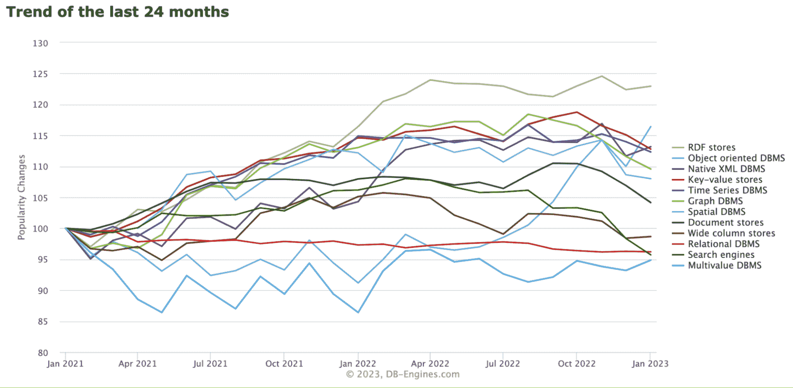

# 2023 年如何选择合适的数据库

> 原文：<https://thenewstack.io/how-to-choose-the-right-database-in-2023/>

数据库通常是应用程序中最大的性能瓶颈。一旦用于生产，它们也很难迁移，因此为应用程序的数据库做出正确的选择是至关重要的。

做出正确决定的很大一部分是知道你的选择是什么。在过去的几年中，数据库领域一直在快速变化，因此本文将通过讨论以下主题来简化您的工作:

*   2023 年数据库生态系统概述
*   从技术角度来看，究竟是什么让不同类型的数据库表现不同
*   何时使用专用数据库，何时使用通用数据库

## 2023 年的数据库前景

在深入研究之前，我们先来看一下当前数据库生态系统的概况以及各种类型数据库的市场份额:

如你所见，尽管 NoSQL 数据库被大肆宣传，关系数据库仍然是最常用的数据库类型。然而，如果我们看看最近的趋势，排名讲述了一个略有不同的故事。

这个图表显示，在过去的两年中，关系数据库已经被几种不同类型的数据库模型所取代。下面是一些正在被开发人员采用的主要数据库模型:

## 是什么让数据库表现不同？

说到数据库性能，没有什么神奇的东西能让一个数据库比另一个数据库性能更好。像所有计算机科学一样，它归结为允许针对特定用例优化性能的权衡。特别是对于数据库， [CAP 定理](https://www.influxdata.com/glossary/cap-theorem/?utm_source=vendor&utm_medium=referral&utm_campaign=2023-02_spnsr-ctn_choose-right-db_tns)很好地介绍了一些可能的性能调整折衷方案。

例如，在 NoSQL 数据库的早期，有很多关于其可伸缩性的宣传，但是这种权衡通常涉及牺牲标准关系数据库提供的数据一致性保证。

影响数据库性能的一些其他设计因素:

*   磁盘存储格式—数据库在硬盘上实际存储和组织数据的方式对性能有重大影响。随着越来越多的公司开始存储大量用于分析工作负载的数据，以基于列的格式在磁盘上存储数据越来越受欢迎，比如像 T2 的 Parquet T3。
*   主索引数据结构—数据库如何索引数据也将对性能产生重大影响。数据库通常有一个存储引擎使用的主索引，然后允许用户定义辅助索引。考虑索引的最简单方式是，它们将有助于提高读取性能，但会增加写入新数据点的开销。
*   数据压缩——数据如何被[压缩](https://thenewstack.io/in-storage-compression-saves-money-boosts-performance/)将影响到存储数据的成本和数据库的查询性能。一些压缩算法旨在尽可能减少数据的大小。其他的可能有较低的压缩率，但是在解压缩数据时速度更快，这意味着您可以获得更好的数据查询性能。
*   热存储和冷存储—许多数据库系统现在允许数据在更快更贵的“热”存储和更便宜但更慢的“冷”存储之间移动。从理论上讲，这可以为频繁查询的数据提供更好的性能，并节省存储成本，同时仍然允许访问冷存储中的数据，而不是直接删除。
*   耐用性/灾难恢复—数据库如何处理灾难恢复对性能也有影响。设计一个数据库来减少各种故障通常会降低性能，因此对于一些数据不是任务关键型的用例，偶尔丢失数据点是正常的，数据库可以取消一些安全保证来挤出更好的性能。

所有这些因素，以及许多其他没有涉及到的因素，都会影响数据库的性能。通过扭转这些杠杆，数据库可以针对非常具体的性能特征进行优化，牺牲某些东西实际上不会成为问题，因为它们在特定情况下是不需要的。

## 何时为您的应用程序使用专门的数据库

决定应用程序使用哪个数据库有很多因素。让我们看看在为应用程序选择数据库时需要考虑的一些主要事项。

### 数据访问模式

选择数据库的主要因素是应用程序中的数据将如何被创建和使用。最广泛的着手方式可能是确定您的工作负载将是[在线分析处理(OLAP)](https://www.influxdata.com/glossary/olap/?utm_source=vendor&utm_medium=referral&utm_campaign=2023-02_spnsr-ctn_choose-right-db_tns) 还是在线事务处理(OLTP)。OLAP 工作负载以分析为中心，与关系数据库旨在处理的更标准的 OLTP 工作负载相比，具有不同的访问模式。OLAP 查询通常只命中几列来执行计算，并且可以通过使用为此设计的列数据库来优化。例如，由于性能优势，大多数[数据仓库](https://www.influxdata.com/glossary/data-warehouse/?utm_source=vendor&utm_medium=referral&utm_campaign=2023-02_spnsr-ctn_choose-right-db_tns)都建立在面向列的数据库之上。

一旦大致确定了工作负载的类型，现在就需要考虑查询的延迟要求以及数据写入的频率等问题。如果您的用例需要对类似[监控](https://www.influxdata.com/solutions/application-performance-monitoring-apm/?utm_source=vendor&utm_medium=referral&utm_campaign=2023-02_spnsr-ctn_choose-right-db_tns)的任务进行低延迟的近实时查询，您可以考虑一个时序数据库，该数据库旨在处理高写吞吐量，同时还允许数据在接收后立即被查询。

对于 OLTP 风格的工作负载，您通常会在关系数据库或文档数据库之间做出选择。这里的关键因素是查看您的数据模型，并确定您是想要 NoSQL 文档数据库提供的模式灵活性，还是更喜欢关系数据库提供的一致性保证。

您可以考虑的最后一件事是，您是否希望您的工作负载在一天中相当一致，或者它是否会“突发”并要求您的数据库偶尔处理大得多的读写量。在这种情况下，使用一个易于扩展和缩减硬件的数据库是有意义的，这样您就不会面临停机时间或大部分时间不需要的硬件的高成本。

### 内部知识

在决定为您的数据库使用什么时，应该考虑您的团队的现有技能。您需要确定使用专用数据库的潜在收益是否值得投资来培训您的团队学习如何使用它，以及学习新技术时损失的生产力。

如果您知道您正在构建的服务不需要针对性能进行完全优化，那么使用您的团队最熟悉的任何数据库来完成工作都是很好的。另一方面，如果您知道性能是至关重要的，那么采用新数据库的成长烦恼可能是值得的。

### 建筑复杂性

保持软件的架构尽可能简单是最理想的，所以向系统中添加另一个组件，比如一个新的数据库，应该与管理数据库会给系统增加的额外复杂性进行权衡。

如果您的应用程序非常适合专门的数据库，可以充当应用程序数据的主数据库，那么这不是一个大问题。另一方面，如果您将使用更通用的数据库作为应用程序的主存储，那么为数据子集添加额外的数据库可能不值得，除非您面临严重的性能问题。

## 结论

数据库生态系统正在快速发展。虽然使用您知道的数据库总是一个好的选择，但是对于开发人员来说，关注一些正在发布的新技术，看看它们对于您正在构建的东西是否是一个好的选择是有意义的。在专用数据库上构建可以帮助您的应用程序在许多方面取得成功，包括节省成本、为用户提高性能、使其更易于扩展以及提高开发人员的工作效率。

<svg xmlns:xlink="http://www.w3.org/1999/xlink" viewBox="0 0 68 31" version="1.1"><title>Group</title> <desc>Created with Sketch.</desc></svg>