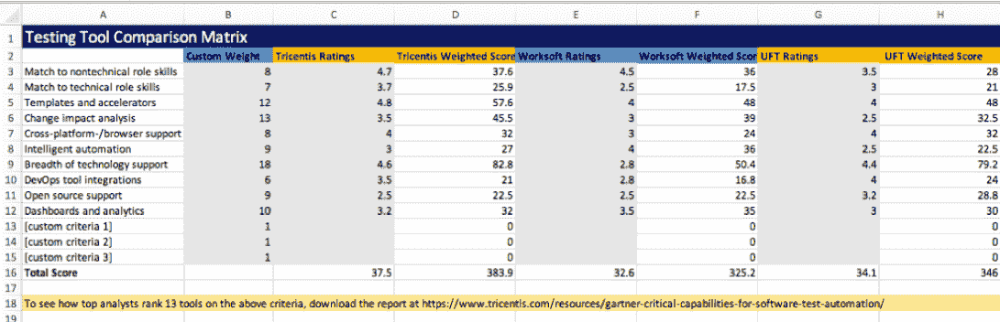

# 如何选择正确的测试自动化工具(并且远离麻烦)

> 原文：<https://thenewstack.io/how-to-choose-the-right-test-automation-tools-and-stay-out-of-trouble/>

Tricentis 赞助了这篇文章。

 [韦恩·阿里奥拉

来自 Tricentis 的 Wayne 是持续测试、基于风险的测试、服务虚拟化和 API 测试等软件测试领域公认的思想领袖。Wayne 创造并销售了支持动态软件开发、测试和交付环境的产品。他推动了许多创新技术的设计，并获得了多项发明专利。他为软件测试领域贡献了 15 年，在软件行业工作了 20 多年。在 LinkedIn 或 Twitter 上与他联系。](https://www.linkedin.com/in/wayneariola/) 

找出数百个可用的测试自动化工具中的哪一个适合您的组织可能并不有趣——但是正确使用它是至关重要的。做出一个错误的决定或工具选择，您很可能会因为否定了通过开发和运营的自动化和现代化所获得的速度收益而受到责备。然而，如果你做出明智的选择，你可以因加速交付速度、最小化商业风险甚至降低测试成本而获得好评。

你如何越过华而不实的产品演示，决定哪种工具将真正适用于*你的*文化、*你的*现有团队成员和*你的*应用程序架构？

评估工具的一个受人尊敬的标题是**[“Gartner 的软件测试自动化的关键能力。”](https://www.tricentis.com/resources/gartner-critical-capabilities-for-software-test-automation/)** 每年，Gartner 分析师都会评估软件测试行业的发展状况，然后根据最新趋势制定一套评估和比较软件测试工具的标准。该报告分析了最流行的商业软件工具如何与这些标准进行比较——但是您可以使用它们的框架作为供应商中立的指南来评估和比较您可能考虑的任何软件测试工具。

## 评估测试自动化工具的首要考虑

以下是最新版本的报告中列出的 10 大测试自动化功能:

*   **与非技术角色技能相匹配:**适合业务分析师、主题专家和其他非程序员。
*   **匹配技术角色技能:**适合开发人员和测试自动化专家。
*   **模板和加速器:**模板库和向导，有助于特定垂直行业和应用的测试(例如， [SAP](https://www.tricentis.com/sap/) [S/4HANA](https://www.tricentis.com/sap/migrating-to-s-4hana/) ， [Salesforce](https://www.tricentis.com/enterprise-applications/salesforce-testing/) …)。
*   **变更影响分析:**根据代码变更和风险来确定测试的优先级。
*   **跨平台/浏览器支持:**跨操作系统、浏览器类型/版本和移动设备的测试。
*   **智能自动化:**采用 AI、机器学习、自愈技术、机器人和自动化测试生成的智能自动化测试。
*   **技术支持广度:**支持跨桌面、web、移动、AR/VR、IoT 和全栈云应用测试的各种 UI 和 API 格式/协议。
*   **DevOps 工具集成:**支持 DevOps、敏捷规划和 ALM 工具。
*   **开源支持:**开源测试工具和框架的支持和扩展。
*   **仪表板和分析:**跟踪和分析整个测试过程，冲刺水平的测试活动和单独的测试。

## 将测试自动化标准与您预期的用例结合起来

该报告鼓励评估者根据其独特的环境和要求定制标准权重，但提供了以下四个“用例”作为起点:

*   **企业端到端测试:**测试可能跨 SAP、其他打包应用(Salesforce、Oracle EBS……)、API、ESB、web/mobile ui 等的端到端业务流程。这个用例的主要考虑因素是技术支持的广度(18%)。变革影响分析和模板/加速器也很重要。
*   **渐进式 web 应用/响应 web/本地应用:**在各种最终用户浏览器和设备上进行自动化测试。以 34%的权重，跨浏览器测试主导了这个用例。DevOps 工具集成和技术角色技能匹配位居第二。
*   **[持续测试](https://www.tricentis.com/products/what-is-continuous-testing/) :** 在应用交付管道的每个阶段降低风险的能力。对于持续测试，Gartner 最重视技术角色技能(22%)与非技术角色技能(7%)的匹配。开源支持、DevOps 工具集成和智能自动化也非常重要。
*   **智能测试:**利用人工智能、高级分析、机器学习和类似技术的测试能力。毫不奇怪，智能自动化是这里的首要因素(25%)。与非技术角色技能和变革影响分析相匹配也很关键。

## 下载您的测试工具对比表

为了帮助您比较商业和开源测试工具，我们准备了一个完全可定制的测试工具比较矩阵。您可以为每个工具输入您自己的评分(或使用 Gartner 的评分)，指定您希望如何衡量各种标准，甚至考虑对您的团队/组织很重要的其他标准:

## 

[**【下载测试工具对比矩阵】**](https://www.tricentis.com/wp-content/uploads/2019/02/Testing_Tool_Comparison_Matrix.xlsx)

## 选择和比较测试自动化工具的更多资源

如果您仍然不确定评估哪些测试自动化工具，这里有两个资源可以为您指出各种可行的选择，包括开源和商业的。

**[顶级软件测试工具:终极列表列表](https://www.tricentis.com/blog/software-testing-tools/)**

现在有 100 多个软件测试工具列表在博客和软件测试社区网站上流传。为了帮助 DevTest 专业人员对它们进行分类，本文回顾并比较了各种列表——因此您可以快速研究可用的选项，并对您想要评估的软件测试工具做出自己的决定。每个软件测试工具列表都基于三个标准:

*   范围:涵盖的软件测试工具的数量。
*   详细信息:列表中提供的详细程度。
*   分析:它提供的分析深度。

[【阅读顶级软件测试工具列表终极列表】](https://www.tricentis.com/blog/software-testing-tools/)

**[Gartner 软件测试自动化 MQ](https://www.tricentis.com/resources/gartner-magic-quadrant-software-test-automation/)**

这份关于软件测试行业趋势的年度报告已经成为软件测试专业人员的“必读”研究。除了探索敏捷和开发运维如何改变对软件测试的期望，Gartner 还评估了顶级供应商如何与这些不断变化的期望进行比较。他们的评估主要基于 700 多个客户询问以及广泛的(50 多个问题)客户调查和访谈。阅读 Gartner 软件测试自动化魔力象限。]

通过 Pixabay 的特征图像。

<svg xmlns:xlink="http://www.w3.org/1999/xlink" viewBox="0 0 68 31" version="1.1"><title>Group</title> <desc>Created with Sketch.</desc></svg>