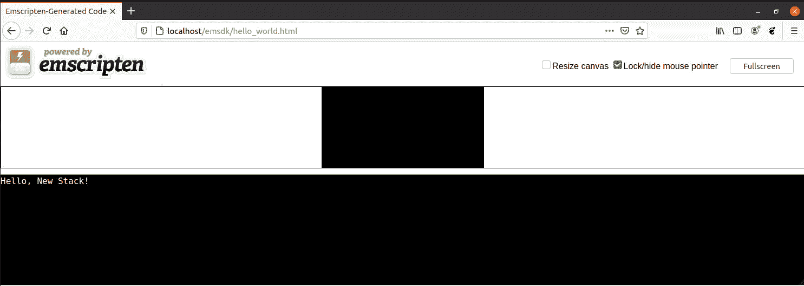

# 如何用 Emscripten 将 C 代码编译成 WebAssembly

> 原文：<https://thenewstack.io/how-to-compile-c-code-into-webassembly-with-emscripten/>

在本系列的上一篇文章中，我们讨论了什么是 WebAssembly 以及使用 web assembly 的主要好处。在我们继续本系列的下一部分之前，您肯定想先了解一下[什么是 WebAssembly，为什么需要它？](https://thenewstack.io/what-is-webassembly-and-why-do-you-need-it/)

一旦你读完这篇文章，你的第一个问题可能是，“[我如何开始使用 WebAssembly？](https://thenewstack.io/what-is-webassembly/)“这正是我们这次要解决的问题。我将演示如何开始使用这项技术。我将在 Ubuntu Linux 20.04 上这样做(这也是在 macOS 上安装的相同过程)，并向您展示如何运行总是有用的“Hello，World！”申请。这是一个简单的例子，可以让你很容易开始使用 [WebAssembly](https://webassembly.org/) 。

说了这么多，让我们继续你的第一个 WebAssembly 应用程序的步骤。

## 安装必要的依赖项

幸运的是，没有太多的依赖需要照顾。但是在安装 WebAssembly 的必要组件之前，我们需要使用以下命令安装 git:

`sudo apt-get install git -y`

一旦安装了 git，就可以准备 WebAssembly 环境了。

## 安装 Emscripten

下一步是使用 [Emscripten](https://emscripten.org/) ，这是一个开源软件，可以将 C 或 c++——或任何使用 [LLVM](http://llvm.org/) 的语言——编写的项目编译到浏览器、 [Node.js](https://nodejs.org/) 或 [wasm 运行时](https://v8.dev/blog/emscripten-standalone-wasm#running-in-wasm-runtimes)中。Emscripten SDK 概述了所有必要的工具(如 Clang、Python 和 Node.js ),以及一个更新的机制，以便在工具链的新版本发布时能够迁移到它们。

我们要做的是首先在用户的主目录中编译代码。接下来，我们将让它在 Apache 文档根目录中工作，从而使它更有用一些。

要下载 Empscripten SDK，请发出命令(从用户的主目录中):

`git clone [https://github.com/emscripten-core/emsdk.git](https://github.com/emscripten-core/emsdk.git)`

文件下载完成后，使用以下命令切换到新创建的目录:

`cd emsdk`

接下来，我们将确保使用以下命令更新我们的源代码:

`git pull`

现在，我们可以使用以下命令安装最新版本的 Emscripten:

`./emsdk install latest`

这将需要一些时间(因为它必须在您的系统上安装一些工具)。您可能需要 30 分钟来完成这一部分。安装完成后，您可以使用以下命令激活最新版本:

`./emsdk activate latest`

最后，我们将使用以下命令设置各种环境变量:

`source ./emsdk_env.sh`

## 创造你好，世界！来源

我们现在准备好最终创建我们的 Hello，World！申请。我们要用 C 语言编写这个应用程序，所以对很多人来说，这可能有点过时了。使用以下命令创建新文件:

`nano hello_world.c`

在该文件中，粘贴以下代码:

```
#include &lt;stdio.h&gt;
int main(int argc,  char **  argv)  {
  printf("Hello, New Stack!\n");
}

```

注意，“你好，世界！”？

使用键盘快捷键[Ctrl]+[x]保存并关闭文件。

## 编译源代码

我们现在要做的是使用 emcc 编译器将我们的 C 代码转换成 WebAssembly (WASM) HTML 文件。我们将使用以下命令来完成:

`emcc hello_world.c -s WASM=1 -o hello_world.html`

在我们实际启动代码之前，我们仍然需要安装一个 web 服务器，然后将代码移动到我们的服务器文档根目录。您也可以通过使用 Emscripten 的内置 HTTP 服务器和以下命令来避免这种情况:

`emrun --no_browser --port 8080 hello_world.html`

但是，要使用上面的命令，您必须使用以下命令重新编译代码:

`emcc --emrun hello_world.c -s WASM=1 -o hello_world.html`

让我们以正确的方式做这件事。使用以下命令安装 Apache 服务器:

`sudo apt-get install apache2 -y`

安装完成后，使用以下命令启动并启用 Apache webserver 服务:

`sudo systemctl start apache2`

`sudo systemctl enable apache2`

接下来，使用以下命令将 emsdk 文件夹移动到 Apache 文档根目录中:

`sudo mv emsdk /var/www/html`

现在，将 web 浏览器指向 http://localhost/EMS dk/hello _ world . html，您应该会看到 Hello，New Stack！打印出来(**图 1** )。



图 1:你好，新堆栈！

如果您已经在服务器上安装了 Emscripten(没有 GUI)，您可以将 web 浏览器指向 http://server/EMS dk/hello _ world . html(其中 SERVER 是服务器的 IP 地址或域)，您将看到相同的结果。

但是，需要注意的是，一旦将 emsdk 文件夹移动到文档根目录，您将无法将新代码编译到 WebAssembly 中，因为环境变量已经发生了变化。因此，您将希望重新开始这个过程，只是这次使用 *sudo* (因为您的标准用户没有在/var/www/html/目录中安装的权限)。为此，您可以使用以下命令切换到 root 用户:

`sudo -s`

完成后，您可以使用以下命令切换到文档根目录:

`cd /var/www/html/`

使用以下命令删除 emsdk 文件夹(如果您已经将它移动到文档根目录中):

`rm -rf emsdk`

然后从头开始，返回命令:

`sudo git clone https://github.com/emscripten-core/emsdk.git`

再次浏览 how-to，您应该能够在 Apache 文档根目录中编译您的代码，然后从您的 web 浏览器启动它。

这就是如何在 Emscripten 的帮助下，使用 WebAssembly 将 C 代码编译成 HTML 的要点。

<svg xmlns:xlink="http://www.w3.org/1999/xlink" viewBox="0 0 68 31" version="1.1"><title>Group</title> <desc>Created with Sketch.</desc></svg>