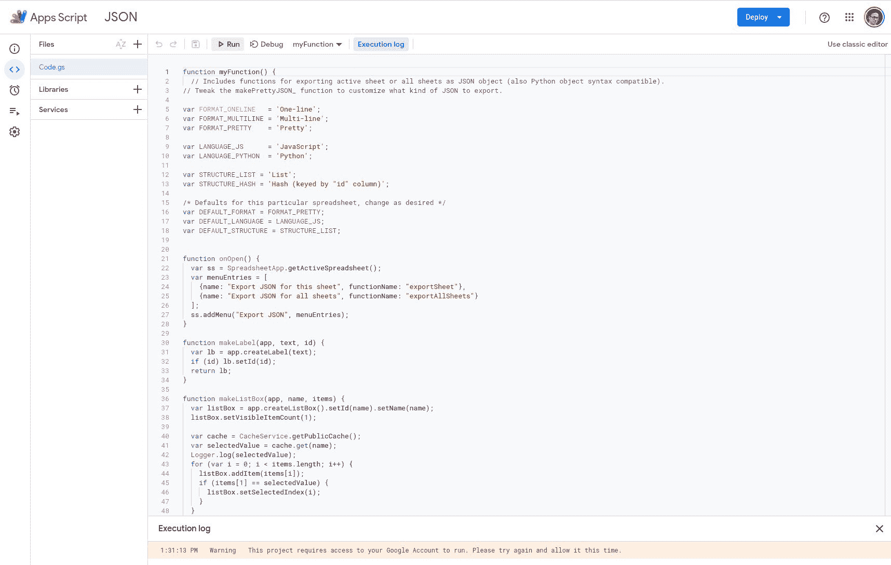
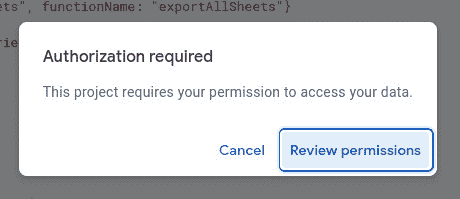
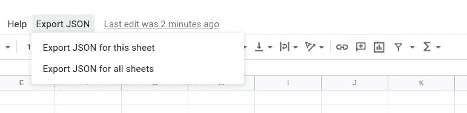
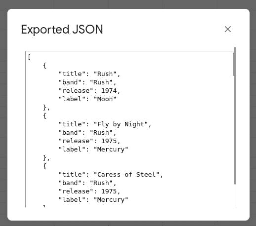

# 如何将 Google 电子表格转换成 JSON 格式的文本

> 原文：<https://thenewstack.io/how-to-convert-google-spreadsheet-to-json-formatted-text/>

JSON 代表 JavaScript Object Notation，是一种非常重要的开放标准文件/数据交换格式，轻量级且易于理解。JSON 语法规则非常简单:

*   数据是键值对。
*   数据用逗号分隔。
*   对象放在大括号内。
*   数组存储在括号中。

JSON 有许多用例，可以在容器清单、配置文件、公共/前端/内部 API、NoSQL 数据库、数据导出等等中找到。JSON 变得如此流行，几乎无处不在。打开一个 Linux 应用配置，你会发现 JSON。创建一个容器清单…有 JSON！

编写 JSON 也没那么有挑战性。以下面这段 JSON 代码为例:

```
{"colors":  [
   {"colorname"  :  "Black",  "hex"  :  "000000"},
   {"colorname"  :  "White",  "hex"  :  "FFFFFF"},
   {"colorname"  :  "Red",  "hex"  :  "FF0000"}
]}

```

非常简单易懂。上面的每个条目都是一个**键:值**对的形式。你可以写一整天，对吗？但是，如果您已经有了一组想要转换成 JSON 格式的数据，该怎么办呢？比方说，您有一个 Google Sheets 文档，它的布局格式可以转换成 JSON。有没有可能将数据导出为 JSON 格式的文本？

为什么，是的，它是。

让我展示给你看。

你唯一需要的就是一个谷歌账户。

准备好了吗？我们开始工作吧。

## 创建电子表格

我要在这里展示一下我的爱好，因为我为 Rush albums 创建了一个 Google Sheets 文档。电子表格中的数据如下所示:

您可以创建包含任何类型数据的图纸文档。但是一旦创建了电子表格，冻结标题行是至关重要的。所以在制作好你的电子表格后，选择第一行，然后点击*查看>冻结>第一行*。如果不这样做，导出将出错。

好了，现在您已经将数据添加到电子表格中，下一步是创建一个 [Apps 脚本](https://developers.google.com/apps-script)，一个用于集成和自动化任务的 Google Cloud JavaScript 工具。为此，点击*扩展>应用程序脚本*。在出现的窗口中，粘贴在 [this Gist](https://gist.githubusercontent.com/pamelafox/1878143/raw/6c23f71231ce1fa09be2d515f317ffe70e4b19aa/exportjson.js) 中找到的以下脚本。

粘贴脚本后，单击 Untitled Document，然后将其命名为 JSON EXPORT。接下来，点击*保存*按钮保存您到目前为止所做的工作。保存后，点击运行按钮(**图 1** )。



**图 1:**run 按钮是指向右边的小箭头，直接指向 Debug 的左边。

当你点击运行时，你会被提示脚本需要权限才能继续运行(**图 2** )。



**图 2:** 权限总是一个问题。

确保您逐步移交了有问题的帐户的适当权限。修复这个过程中，你会得到一个警告，谷歌尚未验证该应用程序。继续，点击高级，然后转到 JSON(不安全)。完成权限设置后，您将返回到应用程序脚本窗口。

如果您现在返回到电子表格并重新加载它，您应该会看到一个新的菜单项，标记为 Export JSON ( **图 3** )。



**图 3:** 我们向 JSON 转换的新菜单项。

单击“导出 JSON ”,然后为该工作表选择“导出 JSON”。这个脚本会完成它的工作，当它完成时，会出现一个带有 JSON 格式文本的弹出窗口(**图 4** )。



**图 4:** 我们的 Rush discography 已经被转换成了一种方便的 JSON 格式。

复制并粘贴弹出窗口中的输出，并在任何需要 JSON 格式代码的地方使用它。

这个脚本的一个优点是它允许您不断地向电子表格中添加内容。因此，您可以构建您的数据，将其导出到 JSON，返回到电子表格，添加更多数据，然后再次将其导出到 JSON，新数据将被包含在内。更好的是，您可以关闭电子表格，稍后再返回，添加更多数据，并将其导出为 JSON(Apps 脚本仍然与电子表格关联)。

有一点需要注意的是，当您重新打开电子表格时，可能需要几秒钟才会出现 Export JSON 菜单。如果它没有立即显示，等待它，它会弹出到工具栏中。

## 结论

如果您使用 Google Sheets 存储数据，并且需要(在某些时候)将数据转换成 JSON 格式的文档，这是最好的方法之一。最重要的是，这只是一个展示谷歌应用程序如何对开发者友好的好方法。试一试这个脚本，看看您是否开始使用它来为您的开发或配置需求创建更好的 JSON 代码。

<svg xmlns:xlink="http://www.w3.org/1999/xlink" viewBox="0 0 68 31" version="1.1"><title>Group</title> <desc>Created with Sketch.</desc></svg>