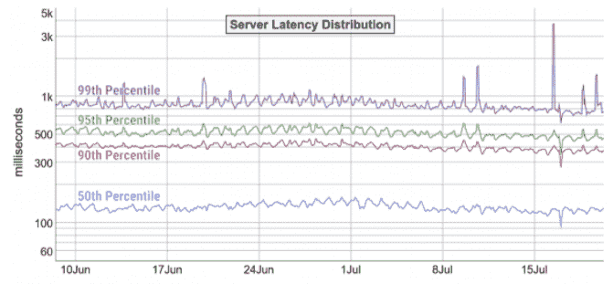
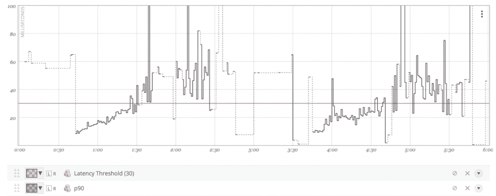
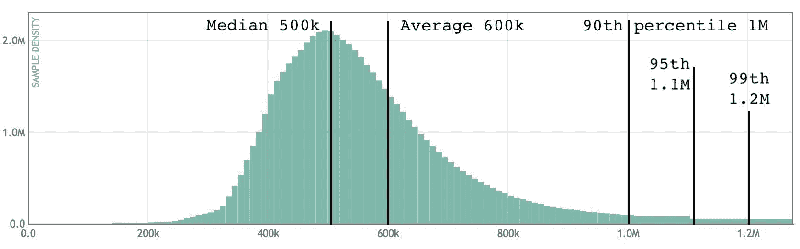
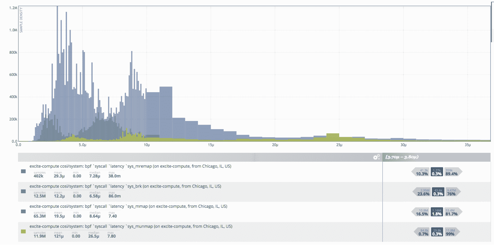

# 如何正确构建和计算延迟 SLO

> 原文：<https://thenewstack.io/how-to-correctly-frame-and-calculate-latency-slos/>

 [西奥·施洛斯纳格

西奥于 2010 年创立 Circonus，并继续担任其首席建筑师。20 年来，他一直在设计、编码、构建和操作可扩展系统。作为一名连续创业者，他已经创建了四家公司，并帮助发展了无数的工程组织。西奥是*可扩展互联网架构* (Sams)的作者，是*网络运营* (O'Reilly)和*寻求 SRE* (O'Reilly)的撰稿人，也是全球 IT 会议的常客。他是 IEEE 会员和 ACM 杰出会员。](https://www.linkedin.com/in/postwait/) 

随着越来越多的公司转变为以服务为中心的“永不停机”环境，他们正在实施站点可靠性工程(SRE)原则，如服务级别目标(SLO)。SLO 是关于可接受的可用性和性能水平的协议，是帮助工程师正确平衡风险和创新的关键。

SLO 通常围绕延迟和错误率来定义。本文将深入探讨基于延迟的 SLO。设置延迟 SLO 是为了设置最低可行服务级别，该级别仍将向消费者提供可接受的质量。这不一定是你能做到的最好，这是你想要实现的目标。为了给自己的成功做好准备，这应该是最基本的可行目标，这样你就可以更容易地积累错误预算来承担风险。

正确计算 SLO 需要大量的统计分析。**不幸的是，当谈到延迟 SLO 时，计算几乎总是出错。**事实上，SREs 可用的许多工具执行的绝大多数计算都是不正确的。由此带来的后果是巨大的。计算 SLO 时数学计算不正确会导致数万美元的不必要容量，更不用说人力时间成本了。

本文将深入探讨如何以正确的方式构建和计算延迟 SLO。虽然这是一个太复杂的主题，无法在一篇文章中解决，但这些信息至少为理解不应该做什么以及如何准确地计算 SLO 提供了基础。

## **错误的方式:百分位数的聚集**

计算 SLO 时最常被误用的技术是百分位数的集合。您几乎不应该计算百分位数的平均值，因为即使是非常基本的汇总任务也不能被百分位数度量所容纳。人们通常认为，由于大多数遥测系统获取百分位数的成本很低，而且使用起来不费吹灰之力，因此在大多数时候，它们适合于汇总和系统范围的性能分析。但不幸的是，您失去了确定数据何时对您撒谎的能力——例如，当您隐藏了较高的(+/- 5%或更高)错误率时。

【T2

上图是用于测量服务器延迟分布的常见图表。它覆盖了两个月，从六月初到七月底，这里的每个像素代表一个值。第 50 个百分位数，即平均值，意味着大约一半的请求(蓝线下的请求)得到的服务快于大约 140 毫秒，大约一半的请求得到的服务慢于 140 毫秒。

当然，大多数工程师希望 99%的客户都能获得出色的体验，而不仅仅是一半。因此，不是计算平均值或第 50 个百分位数，而是开始计算第 99 个百分位数。查看顶部的紫色线，每个点的第 99 个百分位数表示在绘制该像素的位置服务了多少请求——数百个、数千个等。低于这条线的 99%的请求更快，而高于这条线的 1%的请求更慢。需要注意的是，您不知道这些请求的速度有多快或多慢，所以只看百分比最高值可能会产生很大的误导。

这里的一个关键计算问题是，随着时间的推移，图上的每个像素代表该时间段发生的所有请求。假设图上有 1400 个像素和 60 天——这意味着每个像素代表一个小时内发生的所有请求。因此，如果您可以想象在右上方的峰值处，第 99 个百分位数有一个峰值，在图表上峰值代表的小时内实际发生了多少请求？

问题是，许多工具使用数据采样技术来计算第 99 个百分位数。他们在一段时间内收集数据，例如每一分钟。如果你在一个小时内有 60 个一分钟 99 百分位的计算，你想知道整个小时的 99 百分位是多少，没有办法计算。**该图的作用:**当你缩小，不再有足够的像素时，它会将组成该像素的点平均在一起。所以你现在看到的是每小时平均 99%的次数，这在统计学上没有任何意义。

为了更好地说明这一点，我们来看看下面放大后的延迟分布图。

【T2

这张图计算的是一分钟内的第 90 个百分位数，你可以看到它上下跳动了很多。尽管聚集百分位数很诱人，但它可能会产生实质上错误的结果——尤其是当您的负载高度不稳定时。

百分比度量不允许您实现针对小时或周制定的准确的服务级别目标。有相当数量的可操作的时间序列数据监控系统，包括开源的和商业的，都可以很好地以五分钟(或类似的)间隔存储百分位数。**但是** **百分点被平均以适应图上时间窗口中的像素数量，并且平均数据在数学上是错误的。**

百分位数是真实系统监控的主要工具，但是应该理解它们的局限性。因为几乎每个监控和可观察性工具集都提供了百分位数，并且对它们的使用没有限制，所以它们可以很容易地应用于 SLO 分析，而不需要操作者了解它们如何应用的后果。

## **重新思考如何计算 SLO 延迟:直方图**

那么，计算 SLO 延迟的正确方法是什么呢？随着您的服务变得越来越大，您要处理的请求越来越多，实时计算变得越来越困难，因为数据太多了，而且存储起来并不容易。例如，假设您想计算第 99 个百分位数，然后决定第 99 个百分位数不对，而第 95 个百分位数对。你必须查看过去的日志，重新计算一切。这些日志可能很昂贵，不仅是计算，而且首先是存储。

比存储百分位数更好的方法是以一种比存储单个样本更有效的方式存储源样本数据，但仍能产生具有统计意义的总量。输入直方图。直方图是计算 SLO 延迟的最准确、快速和廉价的方法。直方图是连续变量分布的一种表示，其中整个数值范围被分成一系列区间(或“箱”)，该表示显示了每个箱中有多少个值。直方图是 SLO 分析(或任何高频、大容量数据)的理想选择，因为它们允许您存储大规模数据的完整分布，而不是存储一小部分分位数。使用直方图数据的好处在于，直方图可以随时间聚合，并且可以根据需要用于计算任意百分位数和反向百分位数。

对于 SLO 相关的数据，大多数从业者实现开源直方图库。有许多实现，但在 Circonus 我们使用对数线性直方图，特别是 [OpenHistogram。](https://openhistogram.io/)它提供了存储效率和统计准确性的组合。一位数样本量的最坏情况误差为 5%，比平均百分位数的百分位数要好很多。一些分析师使用近似直方图，如 t-digest。然而，这些实现通常表现出接近中值的两位数错误率。对于任何基于直方图的实现，总会有一定程度的误差，但对数线性等实现通常可以将误差降至 1%以下，尤其是在大量样本的情况下。

【T2

上面的直方图包括特定延迟分布的每个样本，总共 600 万个延迟样本。例如，它显示 100 万个样本落在 370，000 到 380，000 微秒的区间内，99%的延迟样本快于 120 万微秒。它可以以 600 字节存储所有这些样本，并精确计算百分位数和反百分位数，同时存储、分析和调用非常便宜。

让我们更深入地了解直方图的好处，以及如何使用它们来正确计算 SLO。

### 直方图很容易计算任意百分位数和反向百分位数

将 SLO 定为百分位数是反向的，它们必须定为反向百分位数。例如，当您说“99%的主页请求应该快于 100 毫秒”时，99%的延迟只是告诉我们 99%的用户的体验有多慢。这不是超级有帮助的。更重要的是要知道有多少用户达到或超过了你的 100 毫秒目标。当你计算的时候，这叫做百分位数倒数。

此外，在制定 SLO 时，有两个时间点至关重要:

1.  计算百分位数的时间段。例如:五分钟。
2.  你计算你的目标成功的时期。例如:28 天。

你需要一段时间来计算你的百分比的原因是，查看 28 天内的每一个请求是很困难的，尤其是考虑到流量高峰。因此，工程师所做的就是在合理大小的窗口中查看这些请求——在本例中为 5 分钟。因此，您将希望确保您的主页请求在 28 天内少于 100 毫秒，并且您将在五分钟的窗口中查看这一点。在 28 天中，您将有 288 个 5 分钟的窗口，查看每个窗口，以确保 99%的请求都快于 100 毫秒。在 28 天结束时，你会知道有多少窗口是赢家与输家，并根据该数据，根据需要进行调整。

因此，说 SLO 在 100 毫秒内达到 99%是不完整的。一个正确的 SLO 是:

*   99%在任何五分钟内低于 100 毫秒，其中 99%在连续 28 天内得到满足。

这个 SLO 的倒数百分位数是:过去 28 天中有 99%的主页请求在< 100ms; % requests = count_below(100ms) / total_count * 100; ex: 99.484 percent faster than 100ms

These inverse percentiles are easy to calculate with histograms. And a key benefit is that the histogram allows you to calculate an arbitrary set of percentiles — the median, the 90th, 95th, 99th percentile — after the fact. Having this flexibility comes in handy when you are still evaluating your service, and are not ready to commit yourself to a latency threshold just yet.

## Histograms Have Bin Boundaries to Ease Analysis

Histograms divide all actual sample data into a series of intervals called bins. Bins allow engineers to do statistics and reasoning about the behavior of something without looking at every single data point. **中得到服务。对于准确的分析来说，绝对关键的是您的直方图要确保大量的条柱，并且您要在所有直方图中设置相同的条柱。**

有各种具有直方图的监控解决方案，但它们的条柱数量往往极其有限，可能低至 8 个或 10 个。有了这么多箱子，你的计算误差是天文数字。相比之下，Circhlist 有 43，000 个容器。至关重要的是，您在延迟范围内有足够多的与您的百分位数相关的区间(例如 5%)。这样，无论数据如何分布，您都可以保证所有百分位数的 5%准确性。

重要的是，你要根据你正在回答的实际问题来设定你的分类界限。因此，在我们的示例中，如果您希望请求快于 100 毫秒，请确保您的 bin 边界之一在 100 毫秒上。通过这种方式，您可以准确地回答 100 毫秒的反百分位数问题，因为直方图计算所有内容，并且计算小于 100 毫秒的所有内容。

此外，您的直方图应该有共同的柱边界，以便您可以轻松地将所有直方图加在一起。例如，您可以将这一分钟和最后一分钟的所有直方图添加到一个分钟直方图中，对于小时、天、月也是如此。而当你想知道上个月你的 99%是为了什么的时候，马上就能得到你的答案。事实上，为您的整个组织规定条块边界通常是一个好主意，否则，您将无法从不同的服务聚集直方图。

## 直方图让您可以连续迭代 SLO

提醒一下，SLO 应该是最低的目标——这是用户对你的最低期望——这样你就可以承担更多的风险。如果你把目标设定为 99，但是直到你达到 95 才有人注意到问题，那么你的 SLO 太高了，浪费了你不必要的时间和金钱。但是如果你把它定在 95，那么你就有更多的预算和空间去冒险。因此，将 SLO 设置为最小可行值是很重要的，这样您就可以围绕它进行预算。99.5%和 99.2%和 100 vs 115 毫秒有很大的区别。

但是你怎么知道这个数字应该是多少呢？答案是你没有。第一次做对是不可能的。你必须坚持测试和测量。通过直方图保持高粒度的历史准确性，您可以迭代优化您的参数。你将能够一起看你所有的数据，并定量地圈出一个好的数字。你可以查看过去两三个月的数据，以确定在什么阈值时你开始看到下游的负面影响。

例如，上面的直方图包括 1000 万个延迟样本，每五分钟存储一次。这显示了您的系统行为如何随时间变化，并有助于您了解如何设置 SLO 阈值。例如，您可以确定，您的 SLO 有 99%在 100 毫秒以内失败，并且一整天都在以 300 毫秒的速度为请求提供服务——但是您的服务的下游消费者从未注意到。这表明你超额完成了任务，这是你不应该做的。

您的软件和您的消费者总是在变化，这就是为什么设置和衡量您的 SLO 必须是一个迭代的过程。我们已经看到公司花费数千美元和浪费大量资源试图实现一个完全不必要的目标，因为他们没有反复回去做数学计算，以确保他们的目标设置合理。因此，一定要尊重你计算 SLO 的准确性和数学方法——因为它们几乎直接反馈到预算中。你可以通过把期望值设得尽可能低来获得更多的预算，同时还能获得最佳的结果。

## **尊重数学**

当你设定了一个 SLO，你就对组织的其他成员做出了承诺；通常，招聘、资源、资本和运营支出决策都是围绕这一点制定的。这就是为什么正确设计和计算你的 SLO 是绝对重要的。可审计、可衡量的数据是设定和满足 SLO 的基础；虽然这很复杂，但绝对值得努力去做好。记住，永远不要合计百分位数。对数线性直方图是准确计算延迟 SLO 的最有效方法，允许您任意计算反向百分位数，随时间迭代，并在任何时间快速、廉价地返回到您的数据以回答任何问题。

<svg xmlns:xlink="http://www.w3.org/1999/xlink" viewBox="0 0 68 31" version="1.1"><title>Group</title> <desc>Created with Sketch.</desc></svg>