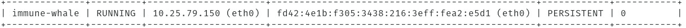
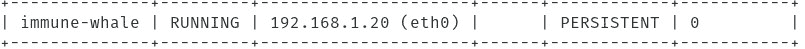

# 如何为 LXD 集装箱创建桥接网络

> 原文：<https://thenewstack.io/how-to-create-a-bridged-network-for-lxd-containers/>

说到集装箱，LXD 可能不会出现在你的脑海中。这是一个遗憾，因为这个工具是开发人员以虚拟机的方式开始使用容器的一个很好的途径。LXD 是一个基于图像的容器部署平台，与 Ubuntu 的 [Multipass](https://multipass.run/) 有些相似。事实上，如果你用过 Multipass，你会觉得和 LXD 在一起很舒服。最大的不同是 LXD 给了你更多的环境选择。

使用这种工具(而不是直接使用 Docker)的一个缺点类似于 Kubernetes——从局域网访问实际的容器。使用 Kubernetes，您必须部署特殊的服务来访问这些容器。另一方面，对于 LXD，为了访问这些虚拟化容器，您需要创建一个网桥。

如何实现这一点将取决于您用来部署 LXD 的主机。我将使用 Ubuntu Server 18.04 引导你完成这个过程。这个特定的 Linux 发行版使用 [Netplan](https://netplan.io/) 来配置网络设备。Netplan 配置文件是基于 YAML 的，所以任何使用过 Docker 或 Kubernetes 的人都应该很快熟悉这些文件的布局。

为了实现这一点，您需要启动并运行 LXD，并部署一个容器。为此，您可以阅读一下我的文章“[如何使用 LXD](https://thenewstack.io/how-to-deploy-containers-with-lxd/) 部署容器”。

有了它，让我们来实现它。

## 创建网络计划桥

您必须做的第一件事是使用网络计划创建一个桥。这是在主机上完成的。网络计划使用/etc/netplan 中的配置文件。我们将编辑现有文件，并将桥添加到该文件中。在你接触那个文件之前，你会想要备份它。

使用以下命令找出网络计划文件的名称:

`ls /etc/netplan/`

您将看到类似于 **01-netcfg.yaml** (或者可能是 50-cloud-init.yaml)的列表。使用以下命令备份该文件:

`sudo cp /etc/netplan/01-netcfg.yaml /etc/netplan/01-netcfg.yaml.bak`

现在您已经备份了网络计划文件，让我们使用以下命令打开它进行编辑:

`sudo nano /etc/netplan/01-netcfg.yaml`

该文件将类似于:

```
network:
      version:  2
      renderer:  networkd
      ethernets:
         ens5:
         dhcp4:  no
        addresses:  [192.168.1.222/24]
         gateway4:  192.168.1.1
         nameservers:
                 addresses:  [8.8.4.4,8.8.8.8]

```

正如我前面提到的，这是一个 YAML 文件，所以你必须密切注意缩进。

我们要做的第一件事是注释掉 dhcp4 行下面的所有内容，所以文件看起来像这样:

```
network:
      version:  2
      renderer:  networkd
      ethernets:
         ens5:
         dhcp4:  no
#    addresses: [192.168.1.222/24]
#    gateway4: 192.168.1.1
#     nameservers:
#              addresses: [8.8.4.4,8.8.8.8]

```

我们现在将 dhcp6 设置为 no，并创建一个网桥(名为 br0 ),文件中有一个类似于
的部分

```
<i>          </i><i>     </i>dhcp6:  no

  bridges:
     br0:
           interfaces:  [ens5]
           addresses:  [192.168.1.222/24]
           gateway4:  192.168.1.1
           mtu:  1500
           nameservers:
                 addresses:  [8.8.8.8]
           parameters:
                 stp:  true
                 forward-delay:  4

```

您需要确保更改上面的 IP 地址，以匹配您的网络拓扑。保存并关闭文件。

整个文件现在应该看起来像:

```
network:
      version:  2
      renderer:  networkd
      ethernets:
         ens5:
         dhcp4:  no
         dhcp6:  no
#    addresses: [192.168.1.222/24]
#    gateway4: 192.168.1.1
#     nameservers:
#              addresses: [8.8.4.4,8.8.8.8]

 bridges:
      br0:
          interfaces:  [ens5]
          addresses:  [192.168.1.222/24]
          gateway4:  192.168.1.1
          mtu:  1500
          nameservers:
            addresses:  [8.8.8.8]
           parameters:
                stp:  true
                forward-delay:  4

```

除了网桥名称之外，新配置的唯一区别是我们添加了以下选项:

*   STP–支持生成树协议。
*   转发延迟–定义网桥在进入转发状态之前将保持监听和学习状态的时间。

现在我们使用 *netplan* 命令来生成配置，命令如下:

`sudo netplan generate`

最后，使用命令应用配置:

`sudo netplan apply`

您的网络计划桥现在可以用于 LXD 了。

## 如何使用与 LXD 的桥梁

让我们使用以下命令部署一个新容器:

`lxc launch ubuntu:20.04`

一旦容器启动，您将看到它与命令一起列出(连同它的内部 IP 地址):

`lxc list`

您应该会看到类似于图 1 所示的内容。



**图 1:** 关于我们新部署的容器的信息。

问题是，该容器被分配了一个内部 IP 地址 10.25.79.150，我们无法从我们的局域网访问该地址。这就是我们建造这座桥的原因。我们想要做的是将 *br0* 桥分配给 immune-whale(由 LXD 生成的一个随机名称)容器。

为了将容器附加到桥上，我们将发出命令:

`lxc config device add immune-whale eth0 nic nictype=bridged parent=br0 name=eth0`

如您所见，在上面的命令中，我们将 br0 桥分配给了 immune-whale 容器的 eth0 设备。发出命令后，给 LXD 一些时间来部署新的 IP 地址。要查看新分配的基于局域网的 IP 地址，请发出以下命令:

`lxc list`

最终，immune-whale 容器将获得一个您的局域网可以到达的 IP 地址(图 2 )。



**图 2:** 我们的 LXD 集装箱现在可以通过局域网访问了。

现在，您可以从您的局域网访问容器，并开始使用它进行开发。比方说，你想为 NGINX 开发一个 web 应用。您可以使用以下命令获得对容器的访问权限:

`lxc exec immune-whale /bin/bash`

在容器提示符下，用命令安装 NGINX:

```
apt-get update
apt-get install nginx  -y

```

通过将 web 浏览器指向您的容器的 IP 地址，您应该能够访问 web 服务器。

这就是创建网桥的全部内容，这样您就可以访问使用 LXD 平台部署的容器。这是开发人员开始利用容器的一个很好的方式，而不必处理 Kubernetes 的复杂性。是的，在某些时候你将不得不与 Kubernetes 合作，但是当你开始使用容器或者尝试容器开发时，你可能想要使用像 LXD 这样的平台来站稳脚跟。

<svg xmlns:xlink="http://www.w3.org/1999/xlink" viewBox="0 0 68 31" version="1.1"><title>Group</title> <desc>Created with Sketch.</desc></svg>