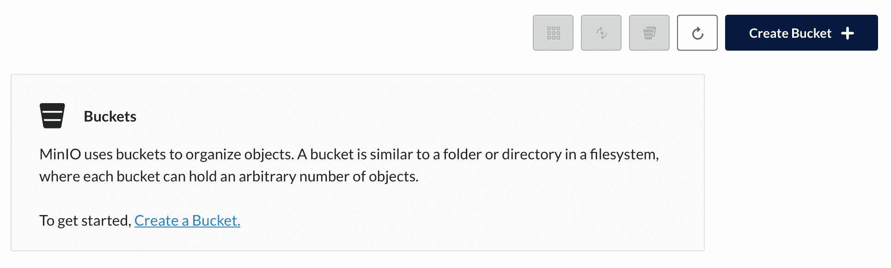
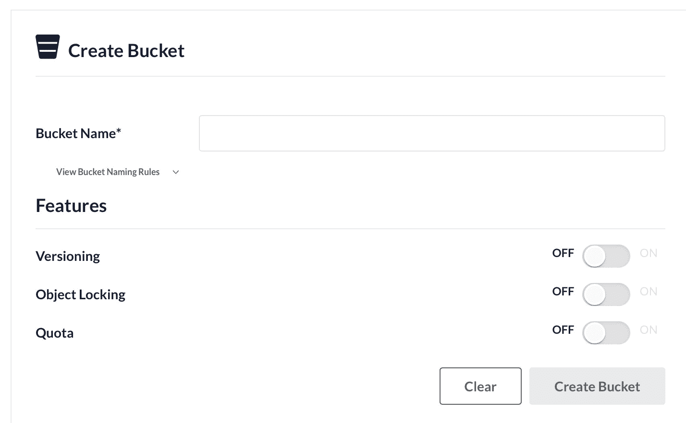
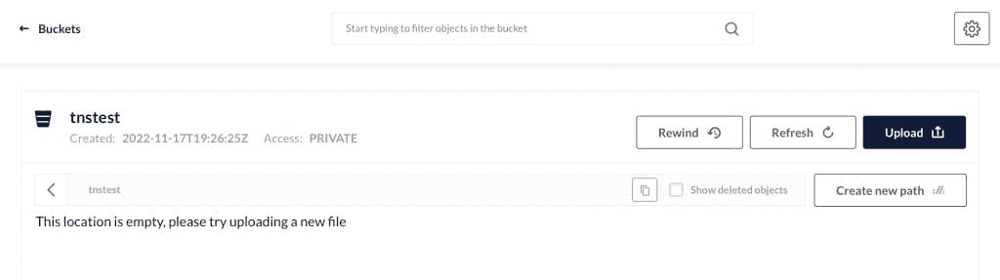

# 如何使用 MinIO 对象存储创建对象存储桶

> 原文：<https://thenewstack.io/how-to-create-an-object-storage-bucket-with-minio-object-storage/>

如果您需要使用对象存储来满足任何类型的需求，MinIO 是一个很好的工具。例如，您可以创建用于 Kubernetes 部署的对象存储。想象一下将容器部署和对象存储的可伸缩性结合在一起。正如他们所说，天空是极限。

我已经向您介绍了在 Rocky Linux 上部署 MinIO 的过程[，这可以在本地机器甚至第三方云托管系统上完成。无论您将](https://thenewstack.io/add-object-storage-to-rocky-linux-with-minio/) [MinIO](https://min.io/?utm_content=inline-mention) 部署在哪里，您都需要创建用于存储所有数据(比如图像、视频、文档等等)的对象桶。本教程将向您展示如何。

MinIO 的一个非常方便的方面是它允许你从 Web UI 和命令行创建[对象存储桶](https://thenewstack.io/how-minio-brings-object-storage-service-to-kubernetes/)。这意味着您可以处理这个过程，即使您手边没有 web 浏览器，您所能做的就是 SSH 到 MinIO 服务器。所以，无论你喜欢 GUI 还是 CLI(命令行界面)，你都可以使用 MinIO。

让我告诉你这是怎么做的。

## 要求

你唯一需要的是一个正在运行的 MinIO 实例和一个登录的管理员帐户。就是这样。让我们开始这场储物秀吧。

从 GUI 创建存储桶

首先，我们将处理 GUI 方面的事情。通过将浏览器指向 http://SERVER:9001(其中 SERVER 是托管服务器的域或 IP 地址)登录到您的 MinIO 实例。您将使用用户名“admin”和您在安装过程中为该用户创建的密码登录。

成功登录后，会提示您创建第一个存储桶(图 1)。



图 1: MinIO 已经安装完毕，可以创建第一个 bucket 了。

单击创建存储桶。在出现的窗口(图 2)中，您必须给 bucket 一个名称(比如 tnstest)。



图 2:在 MinIO 中创建新的存储桶。

为存储桶命名后，您必须决定要启用的选项，包括:

*   版本控制使得在同一个键下保存一个对象的多个版本成为可能。
*   对象锁定防止任何人删除对象。只有在首次创建存储桶时，才能启用此选项。
*   配额限制了可以存储在存储桶中的数据量。

当启用上面的一些选项时，你会注意到更多的选项出现。例如，如果您启用版本控制，则会出现一个新的保留选项(以防止在指定时间段内删除对象)。此外，如果您启用了配额，您将需要以 MB、GB、TB、BP 和 EB 为单位定义报价。如果启用保留，则必须将其配置为法规遵从性或治理模式，并设置有效期(以天为单位)。

完成配置后，点击 Create Bucket，MinIO 就会自动完成任务。创建存储桶后，它将是空的。您可以单击 Upload(图 3)将您的第一个文件上传到对象存储桶。



图 3:新创建的 MinIO 存储桶。

如果您随后单击窗口右上角的齿轮图标，您会发现自己处于 Bucket configuration 窗口中(图 4)，在这里您可以选择访问策略、加密、配额、复制，

## 从 CLI 创建存储桶

现在，我们将看到如何从终端窗口做同样的事情。在此之前，我们必须安装 CLI 客户端。使用
下载二进制文件

```
sudo curl  -o  /usr/local/bin/mc https://dl.min.io/client/mc/release/linux-amd64/mc

```

使用
赋予文件适当的可执行权限

```
sudo chmod  +x  /usr/local/bin/mc

```

使用命令
验证安装

您应该会在输出中看到类似这样的内容:

*mc 版本 release . 2022-11-07t 23-47-39Z(commit-id = BC 16 bde 337 add 744 b 25 c 47 c 4643491 EBA 2 a 17 c1b)*
*运行时:go 1 . 19 . 3 Linux/amd64*
*版权所有(c) 2015-2022 MinIO，Inc.*
*许可 GNU agu*

我们现在需要用命令添加 MinIO 服务器:

```
mc alias set myminio http://SERVER:9000 admin PASSWORD

```

其中 SERVER 是托管服务器的域或 IP 地址，PASSWORD 是您在安装 MinIO 期间为 admin 用户设置的密码。

您应该在输出中看到以下内容:

```
Added  `myminio`  successfully

```

您可以使用命令查看当前存储桶的列表:

您应该会看到输出中列出的 *tnstest/* 。

让我们用命令创建一个新的 bucket:

```
mc mb myminio/tns-bucket2

```

您应该会在输出中看到以下内容:

```
Bucket created successfully  'myminio/tns-bucket2'.

```

## 从命令行上传文件到存储桶

让我们创建一个测试文件，并将其上传到我们新的 tns-bucket2 bucket 中。首先，用
创建测试文件

接下来，使用
将文件上传到 tns-bucket2

```
mc cp test myminio/test-bucket2

```

文件应该立即上传。要验证它是否在桶中，请用
列出内容

```
mc ls myminio/tns-bucket2

```

您应该会在输出中看到以下内容:

这就是使用 MinIO web 界面和 mc 命令行实用程序创建新的对象存储桶的全部内容。通过一点 shell 脚本的魔力，您甚至可以从命令行自动将文件上传到 bucket。再说一次，天空是无限的。

<svg xmlns:xlink="http://www.w3.org/1999/xlink" viewBox="0 0 68 31" version="1.1"><title>Group</title> <desc>Created with Sketch.</desc></svg>