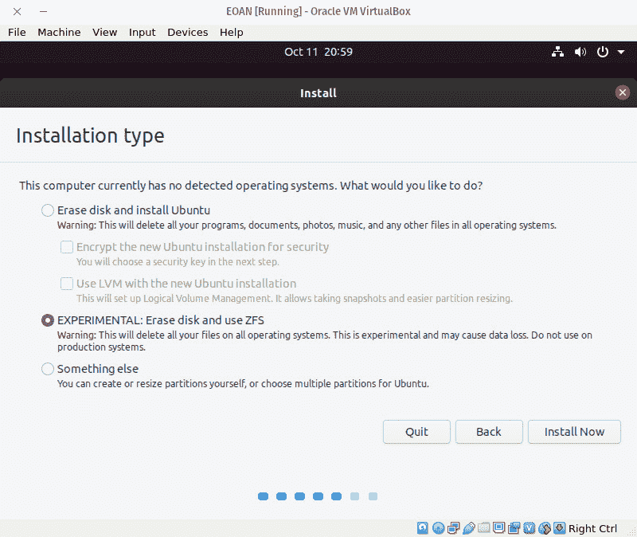
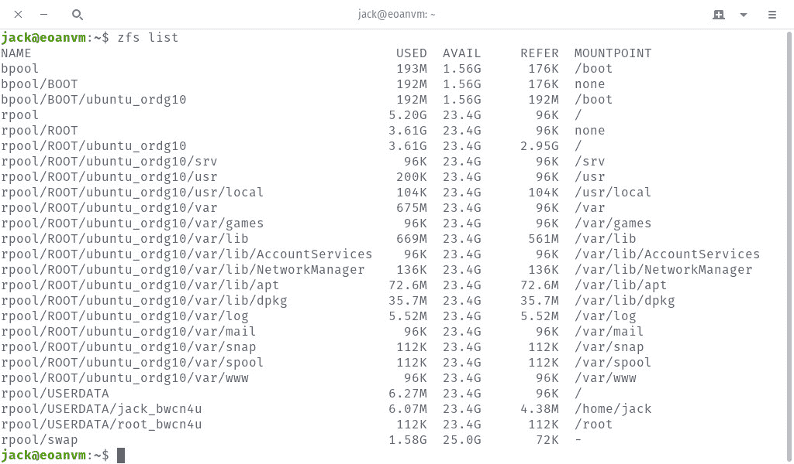
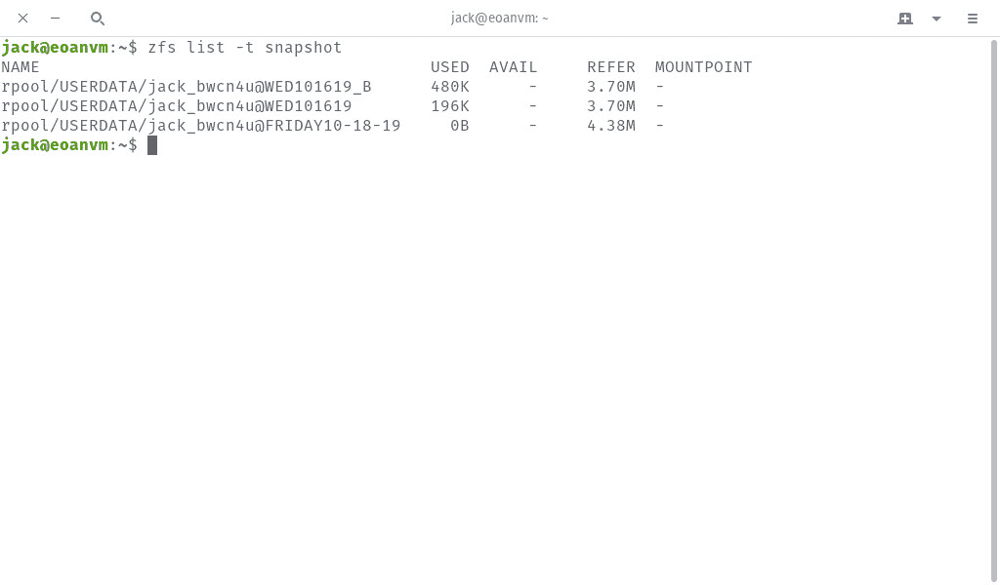
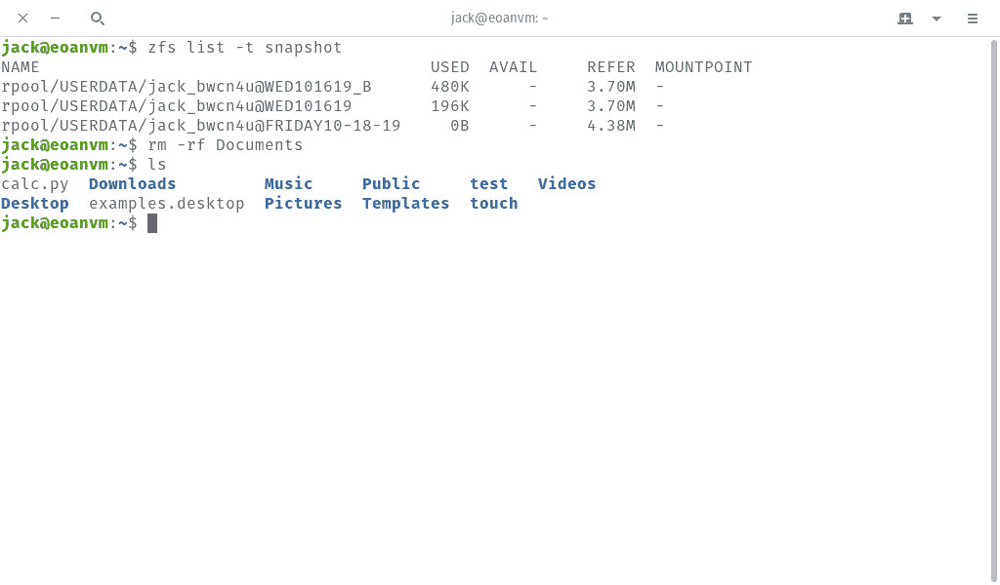
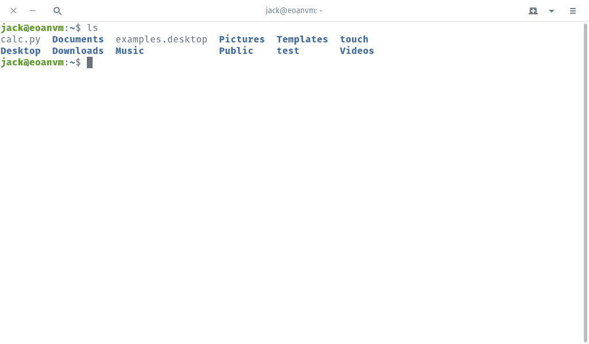
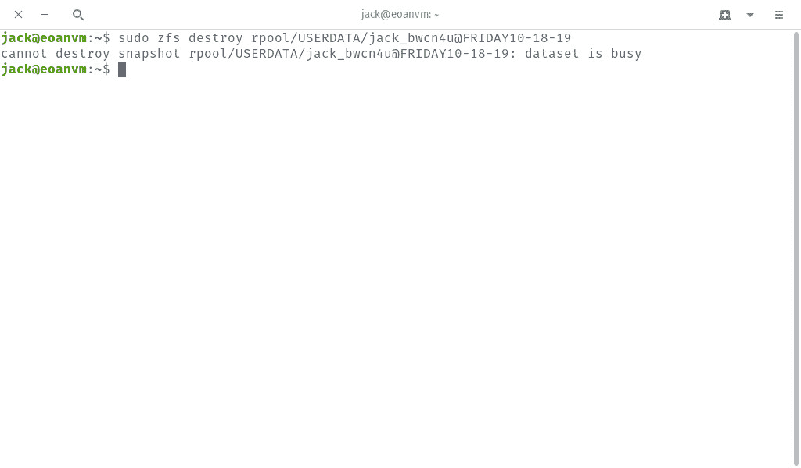

# 如何在 Ubuntu 19.10 上创建和销毁 ZFS 快照

> 原文：<https://thenewstack.io/how-to-create-and-destroy-zfs-snapshots-on-ubuntu-19-10/>

正如我们上周提到的[，](/ubuntu-19-10-promises-an-improved-experience-for-ai-ml-developers/) [Ubuntu 19.10](https://ubuntu.com/download) 已经正式到来，它带来了许多真正令人兴奋的功能。尽管这些新选项中的大部分是针对桌面用户的，但有一个特别令人兴奋的特性将使桌面和服务器用户都受益。该功能是 ZFS 支持的。

最初由 [Sun Microsystems](/sun-microsystems-a-look-back-at-a-tech-company-ahead-of-its-time/) 为其[Solaris Unix 发行版](https://en.wikipedia.org/wiki/ZFS)开发的 ZFS 是一个 128 位文件系统和逻辑卷管理器的组合，它提供以下特性:

*   是可扩展的。
*   支持高存储容量和更高效的数据压缩。
*   包括快照和回滚。
*   支持写入时拷贝克隆。
*   进行连续的完整性检查和自动修复。
*   128 位寻址
*   还有更多。

问任何管理员，他们都会同意 ZFS 的加入对 Ubuntu 来说是一件大事。为什么？仅快照和回滚功能就值入门费(顺便说一下，这是免费的)。借助此功能，管理员可以将系统回滚到工作状态(或包含意外删除的数据的状态)。这是一件大事。

当然，快照和回滚并不是新事物。事实上，许多平台已经包含这个工具很多年了。所以也许 Ubuntu 在这方面有点落后。但是对于任何使用 Ubuntu 的人来说，这是一个“迟到总比不到好”的例子。

但是 ZFS 是如何在 Ubuntu 上工作的呢？很高兴你问了。让我展示给你看。

### 警告

在深入研究之前，要知道 Ubuntu 19.10 中的 ZFS 支持是实验性的。尽管我发现它非常稳定，但在生产环境中使用它时，您可能会三思而行(直到它不再被列为“实验性的”)。

另外，请注意，ZFS 支持目前仅在桌面版本安装期间提供。这并不意味着您不能在服务器版本上添加对文件系统的支持，但是事情并不那么简单。正因为如此，我将在 Ubuntu 19.10 的桌面版上进行演示。

### 装置

第一步是在安装 Ubuntu 19.10 时启用 ZFS。在安装过程中，您会在安装类型阶段发现一个新选项(**图 1** )。



图 1:在安装期间选择 ZFS 选项。

安装完成后，重新启动并登录。

如果你使用的是 Ubuntu 19.10 的服务器版本，你总是可以用命令安装 ZFS 支持:

```
sudo apt-get install zfsutils-linux

```

当然，如果你走这条路，你必须采取一些额外的步骤(比如创建数据集)。对于桌面安装，您会发现整个目录层次结构都由 ZFS 数据集组成，因此需要做的工作要少得多。

## 与 ZFS 的第一步

登录到桌面后，您会希望打开一个终端窗口并获得数据集列表。对于不使用 ZFS 的 Ubuntu 安装，您通常会使用/home/jack 或/usr/local/这样的目录路径。启用 ZFS 的系统则不是这样。相反，他们使用数据集。数据集是一种共享存储池(ZFS 最基本的构造块)的文件系统。

要查找数据集，发出命令:

正如您所见(在**图 2** )，每个目录都可以在 bpool(引导)或 rpool(根)池中找到。



图 2:我们的数据集列表。

让我们使用用户的主目录。在这种情况下，数据集*r pool/user data/jack _ bw cn 4 u*。

## 创建快照

我们要做的第一件事是创建/home/jack 目录的新快照(记住，它是*rpool/user data/jack _ bw cn 4 u*数据集)。假设我们想要创建一个用今天的日期标记的快照。这个命令应该是:

```
sudo zfs snapshot rpool/USERDATA/jack_bwcn4u@FRIDAY10-18-19

```

你可以这样包含*日期*命令:

```
sudo zfs rollback rpool/USERDATA/jack_bwcn4u@`date  +%F`

```

要验证是否拍摄了快照，请发出命令:

您应该会看到列出的所有当前快照(**图 3** )。



图 3:我们的新快照已经创建。

## 回滚快照

假设，不管出于什么原因，某个目录被意外地从主目录中删除了。你是做什么的？幸运的是，您已经创建了一个快照，并且可以回滚该快照，这样删除的目录就会返回。

首先，让我们用命令删除~/Documents 目录:

```
rm  -rf  /home/jack/Documents

```

发出 *ls* 命令，可以看到文档目录不见了(**图 4** )。



我们的文档目录已被删除。

现在，我们将回滚星期五的快照以恢复该目录。为此，发出命令:

```
sudo zfs rollback rpool/USERDATA/jack_bwcn4u@FRIDAY10-18-19

```

命令完成后，再次发出 *ls* 查看文件已返回(**图 5** )。



图 5:文档又回来了。

## 销毁快照

假设您创建了许多快照，或者某个特定的快照有损坏或丢失的数据。您可能需要删除该快照。假设我们要删除*rpool/user data/jack _ bwcn 4 u @ Friday 10-18-19*快照。为此，命令应该是:

```
sudo zfs destroy rpool/USERDATA/jack_bwcn4u@FRIDAY10-18-19

```

一旦销毁了快照，就无法恢复，因此请小心使用该命令。如果你碰巧有一个特别重要的快照，你不想销毁它，你可以把它保留下来。要暂停我们的*rpool/user data/jack _ bwcn 4 u @ Friday 10-18-19*快照，您可以发出命令:

```
sudo zfs hold keep rpool/USERDATA/jack_bwcn4u@FRIDAY10-18-19

```

现在，如果您尝试销毁该快照，您将看到一个错误(**图 6** )。



图 6:无法销毁此快照。

要销毁保存的快照，您必须像这样添加-d 选项:

```
<i>sudo zfs destroy  -d  rpool/USERDATA/jack_bwcn4u@FRIDAY10-18-19</i>

```

就这样，held 住的快照没了。

这就是 Ubuntu 19.10 中新增的 ZFS 功能创建和销毁快照的基础。在测试环境中尝试一下，看看效果如何。到目前为止，我只发现了一个问题，即在尝试回滚快照时，我必须重新启动机器，回滚命令才能成功运行。除了这个问题，ZFS 和 Ubuntu 19.10 都很顺利。

<svg xmlns:xlink="http://www.w3.org/1999/xlink" viewBox="0 0 68 31" version="1.1"><title>Group</title> <desc>Created with Sketch.</desc></svg>