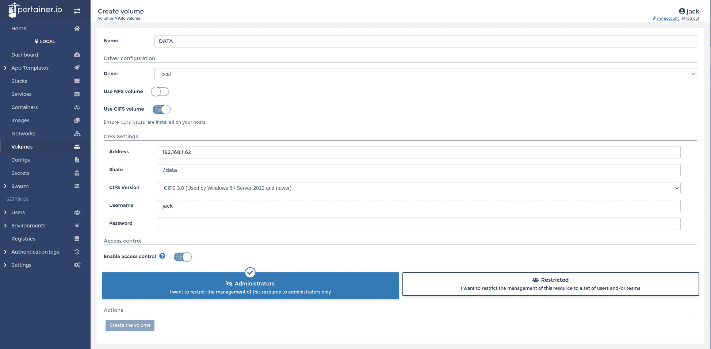
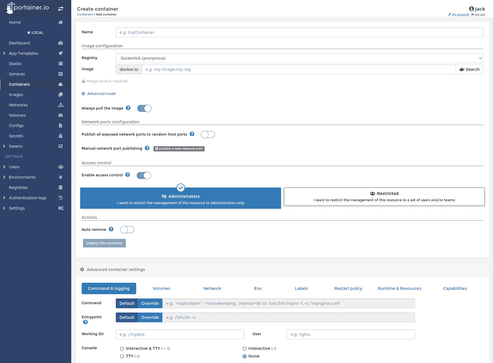
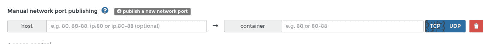
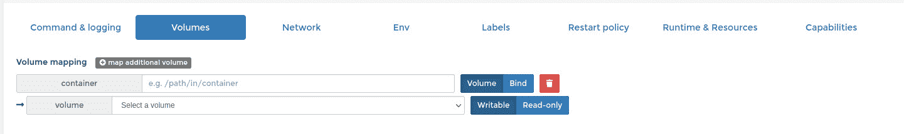
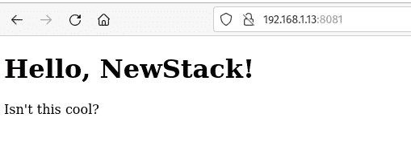

# 如何在 Portainer 中创建和使用集装箱体积

> 原文：<https://thenewstack.io/how-to-create-and-use-container-volumes-within-portainer/>

Portainer 已经成为我最喜欢的管理容器的工具。有了这个基于 web 的 GUI，您可以对 Docker 容器做任何您需要做的事情。它功能强大，灵活，非常用户友好。

使用 Portainer，您几乎可以管理容器的任何方面，从构建和部署单个应用程序/服务，甚至全栈应用程序。Portainer 真正出色的另一个领域是卷的创建和使用。

什么是 Docker 卷？简单。假设您部署了一个存储数据的应用程序或服务。如果部署不带卷的容器，数据将存储在容器中，从另一个容器访问该数据可能会很困难。更糟糕的是，如果这个容器出了什么问题，它存储的数据可能会被破坏。

这就是卷通过为容器创建持久存储发挥作用的地方。这样，您可以创建一个利用外部卷的容器。如果容器发生问题，数据仍然存在于卷中。

我将通过部署一个简单的 [NGINX 容器](https://www.nginx.com?utm_content=inline-mention)向您展示在 Portainer 中使用卷是多么容易，该容器映射到 Linux 服务器上托管的持久卷。

为此，您需要一个 Portainer 的运行实例、一个 Linux 服务器和一个在 Linux 机器上拥有 *sudo* 特权的用户。

你准备好了吗？我们开始工作吧。

## 在 Linux 服务器上安装 Samba

为了有趣起见，我们将使用一个 [Samba 共享](https://www.samba.org/)，一个开源的微软 Windows 文件共享系统，作为持久卷。要做到这一点，请登录您的 Linux 服务器(我使用的是 Ubuntu Server 22.04)并安装必要的依赖项:

`sudo apt-get install samba cifs-utils -y`

接下来，使用以下命令创建一个目录来存放共享(我将使用 */home/jack/data* ，但是您可以使用您喜欢的任何目录):

`mkdir ~/data`

接下来，使用以下命令为您的 Linux 用户创建一个密码:

`sudo smbpasswd -a USER`

其中 USER 是您的 Linux 用户名。

系统会提示您键入并验证新密码。

为 Samba 用户启用:

`sudo smbpasswd -e USER`

其中 USER 是您的 Linux 用户名。

接下来，通过使用以下命令编辑 Samba 配置文件来创建新共享:

`sudo nano /etc/samba/smb.conf`

在该文件的底部粘贴以下内容(编辑以匹配您为共享创建的目录):

```
[data]
path  =  /home/jack/data
browsable  =  yes
writable  =  yes
read only  =  no

```

保存并关闭文件。使用以下命令重新启动 Samba:

`sudo systemctl restart smbd`

## 在 Portainer 中创建卷

接下来，登录 Portainer 实例(如果您还没有部署它，请查看[这个新的堆栈教程](https://thenewstack.io/deploy-portainer-for-easier-container-management/)了解如何部署)，并单击左侧栏中的 Volumes。在出现的窗口中(**图 1** ，给新卷命名。



图 1:在 Portainer 中创建一个卷。

接下来，单击“使用 CIFS 音量”的开/关滑块，直到它处于开的位置。在 CIFS 设置下，键入您的 Linux 服务器的 IP 地址，添加共享名(在本例中是 */data* )，确保从版本下拉列表中选择 CIFS 3.0，键入您添加到 Samba 的用户名，然后键入密码。

填写完必要的信息后，单击创建卷。

太棒了。您已经创建了您的第一卷。

## 使用卷部署 NGINX

现在是有趣的部分。单击左侧边栏中的容器，然后单击添加容器。在结果窗口中(**图 2** ，命名容器(类似于 *nginxvolumetest* )并在 Image 字段中键入 *nginx* 。



图 2:用 Portainer 创建一个新容器。

接下来，单击 publish a new network port，在出现的窗口(**图 3** )中，为主机键入 8081，为容器键入 80。



图 3:在 Portainer 中将主机端口映射到 NGINX 端口。

接下来，单击高级容器设置下的卷选项卡，然后单击映射附加卷。在这个新的部分中(**图 4** ，您将在容器字段中键入 */usr/share/nginx/html* (这是 NGINX Docker 容器的文档根)。从 volume 下拉菜单中，选择您刚刚创建的新卷(在我的例子中，它是 *DATA* )。



图 4:将卷映射到 NGINX 文档根目录。

向上滚动并单击部署容器。NGINX 容器的部署应该没有问题。

## 创建一个样本 NGINX 索引文件

回到托管该卷的 Linux 服务器。我们将为 NGINX 创建一个样本 index.html 文件。使用以下内容创建文件(确保编辑命令以反映您创建的共享的位置):

`nano ~/data/index.html`

在那个文件中，粘贴以下内容:

```
&lt;!DOCTYPE html&gt;
&lt;html&gt;
&lt;body&gt;

&lt;h1&gt;Hello,  NewStack!&lt;/h1&gt;
&lt;p&gt;Isn't  this cool?&lt;/p&gt;

&lt;/body&gt;
&lt;/html&gt;

```

保存并关闭文件。现在，打开一个 web 浏览器，指向 *http://SERVER:8081* (其中 SERVER 是托管服务器的 IP 地址或域)。您应该看到我们创建的 index.html 的内容(**图 5** )。



图 5:为什么你好，纽斯塔克！

恭喜，您刚刚部署了一个 NGINX 容器，它使用 Linux 服务器上 Samba 共享中的持久卷，这一切都来自 Portainer 的用户友好特性。

<svg xmlns:xlink="http://www.w3.org/1999/xlink" viewBox="0 0 68 31" version="1.1"><title>Group</title> <desc>Created with Sketch.</desc></svg>