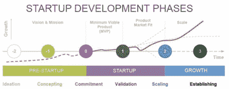
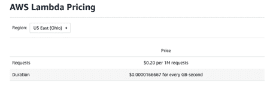
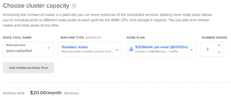
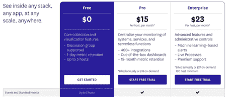
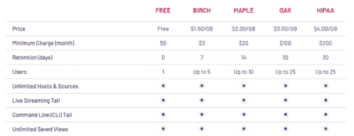
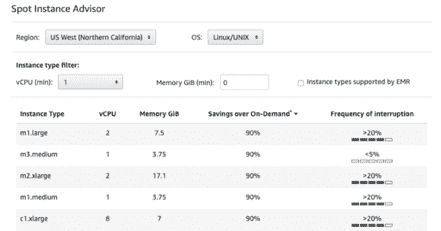

# 如何为口袋里只有 20 美元的初创公司创建可扩展的基础设施

> 原文：<https://thenewstack.io/how-to-create-infrastructure-for-a-startup-with-only-20-in-your-pocket/>

每个人都认为物美价廉的基础设施是一个神话，在现实生活中行不通。自动扩展、基础设施即代码、Kubernetes、监控和日志记录——这些听起来都非常昂贵。但是，如果一家初创公司负担不起昂贵的基础设施，该怎么办呢？

在本文中，我们将考虑两个例子，说明如何在有限的预算上构建有意义的基础设施，而不会限制您的业务，也不会做出错误的决策。

## 何时为初创公司构建基础设施

 [奥列格·米科拉琴科

Oleg Mykolaichenko 是一名 DevOps 工程师，基辅 DevOps 社区的联合创始人，负责 DOU 上的 DevOps 摘要。UA，以及乌克兰最大的关于 DevOps 的电报频道。主要关注点:CNCF 堆栈、哈希公司堆栈、IaC、云和持续改进。](https://github.com/Mykolaichenko) 

通常情况下，产品的第一个版本已经准备好了，但却没有地方推出。根本没有基础设施，或者基础设施状况很差。不幸的是，这意味着在竞争对手继续建设的时候，初创公司在浪费时间。

基础设施是运行项目的服务、流程和场所。事实上，它是产品与计算能力的整体捆绑。这些是服务器、开发和部署流程、日志监控服务和高级架构愿景。

在公开发布之前，可能有大量的事情需要处理。

*   如果交通堵塞，
*   如果你有足够多的用户，
*   如果有人想收购你的创业公司，
*   如果用户不来，你的初创公司将成为一个死产品。

我曾多次目睹一家初创公司被出售，它与创始人的关系变得如此紧密，以至于改变所有访问权限和账户的过程拖了好几个月。

同样可能发生的是，当产品在公司现有的产品组合中增长过多时，几个月都不可能将其剔除。以我的经验来看，那些购买应用程序来传递知识和学习系统所有细节的人要去几次办公室。又贵又费时，不如一开始就打好扎实干净的基础。

在最坏的情况下，你将重用基础设施工作来启动一个新的创业公司。在最好的情况下，您将获得一个易于维护的可扩展托管平台，不会限制您的业务，也不会造成问题。

启动开发阶段

假设假设已经被确认并通过了验证阶段，然后你决定实施它以获得最终产品，所以你改变它几次，在产品搜索中到达顶端，然后…结束。

运行应用程序的唯一服务器因过载而崩溃。然后，一切开始变得模糊:给提供商的信，无尽的等待时间，重新启动，用户再次到来，一切都变得糟糕。非常失望。

为了避免这种情况，您需要在公开发布之前考虑应用程序的扩展方式。您可以做的另一件事是执行负载测试，确定最大负载，并租用比需要更多的服务器。此选项成本更高，因为即使容量在未使用时会停机，您也必须为此付费。

一家初创公司需要快速的反馈循环、快速的开发和频繁的发布。

理想情况下，产品和基础设施开发应该并行进行:构建和部署过程将加快移动速度，因此，测试阶段将更快——这将允许初创公司更快地移动。

## 谁应该创建平台的第一个版本？

我强烈建议找一个兼职的 DevOps 工程师，在几天内实现一个初始的基础设施。另一方面，如果你是一名开发人员，或者你的资源有限，你可以按照建议自己完成，但这需要更长的时间。

你拥有的更多:金钱还是时间——取决于你自己。

考虑一种情况:一个叫做“基础设施”的口袋里有 20 美元。在这种情况下我们该怎么办？

## 基础设施设计的最佳实践

在本文的第一部分，我们讨论了最常见的错误，但是现在让我们来讨论如何避免它们。必须在预算和分配$20 之前收集需求。

让我们来看看什么是最重要的:

### 1.可量测性

如果公开发布完全是一团糟，那么在假设验证和开发上花多少时间都没用。基础设施的设计必须考虑到潜在的增长，这样 Kubernetes 和云提供商就可以轻松解决这个问题。

让我们举这个例子:

*   来了 1000 个用户——很好，让我们增加云中虚拟服务器的数量，
*   10，000 人到达——太好了，我们会增加更多，
*   数据库开始变慢(我们可以从监控图中看到)—好的，我们应该增加它的大小或类型。

你应该经常使用常识:为一家初创公司划分数据库？否。增加虚拟数据库服务器的大小？是的。

### 2.基础设施作为代码

幸运的是，在 2020 年，没有人会手动提升基础设施。手动更改意味着大量的例行操作，从而导致错误。在这种情况下，没有人知道基础设施目前的状况，没有人知道它通常是如何工作的，以及它是如何工作的。但是你可以用 Terraform 解决这些问题。

### 3.价格

如果我们可以运行应用程序，并且只需支付很少的基础设施费用，那就太棒了。但如果我们是一家处于初始阶段的初创公司，那么我们仍然赚不到钱，而且基础设施成本越低，我们就必须进行更多的“尝试”才能让它运转起来。

### 4.关注利益

与应用和基础设施相关的一切都应该尽可能在 SaaS 进行。需要监控吗？数据狗或者新遗迹。无处安放原木？Logentries 或 LogDNA。没有构建应用程序的基础吗？TravisCI、CircleCI 或 Github 操作。

### 5.独立账户和信用卡

为注册服务创建单独的邮箱，为支付服务创建单独的银行卡。从任何角度来看，这都是非常有用的建议。

## AWS 的无服务器:先是几便士，然后是一卡车的钱

无服务器架构是第一个让我们轻松解决初创企业廉价基础设施问题的解决方案。长话短说，姑且同意我们不需要任何服务器，我们根本不想了解它们的任何东西，我们是从功能方面考虑的。

Lambda 成本:每 1M 请求 0.20 美元+持续时间计费

我们应该使用最符合逻辑的解决方案:亚马逊网络服务的 Lambda + API 网关。它是这样工作的:我们在 Lambda 函数中描述业务逻辑，在顶层，我们使用 API 网关在几个函数之间完成路由。

这种方法的巨大优势是成本非常低，而且只是在实际使用资源之后。事实证明，虽然我们没有流量和用户——我们几乎不用付费，但当第一个流量到来时——我们开始为每个请求付费。我们得到的另一个好处是开箱即可扩展。

基础设施作为代码的概念将会非常有用，它将允许你在 Terraform 中描述所有的资源(和几个开发环境，快速发布)。此外，将有基本的监测和基本的登录出同一个盒子，所有这些都非常便宜，而该产品没有人使用。

最大的优势是对价值的关注，因为一切都是自己运作的，你只需要开发业务逻辑，不要担心其他任何事情。

另一方面，也有缺点:

*   厂商锁(如果我们在 AWS 内部设计一个无服务器系统，我们将仅限于这个云)；
*   每次运动的额外费用:流量，日志，监控，时间，资源；
*   当很多用户来的时候，它会花费一卡车的钱；
*   如果我们不正确地设计系统，将会花费一大笔钱——它将占用不必要的内存，执行时间长，等等。

如果您正在测试一个想法，并且不期望有大量的请求和用户 AWS 的无服务器是您的理想选择。但是如果你确实获得了很多用户，那就很贵，超级不方便。所以要意识到这一点。

## 数字海洋中的 Kubernetes:每月 20 美元

我个人的建议是着眼于任何 Kubernetes 实现，以便不要每六个月或一年重做一次基础设施。目前，Kubernetes 已经成为市场事实上的标准，这是一个正在开发和支持的领先领域，在这里投入时间和资金是有意义的。

对于业务，Kubernetes 提供了一个平台，在这个平台上，可立即获得可伸缩性、高可用性、部署策略和大量集成。

DigitalOcean 是最便宜的云提供商之一。此外，几个月前，该公司发布了数字海洋 Kubernetes 服务。托管 Kubernetes 意味着我们将获得该平台的所有好处，而无需担心配置、管理和维护 Kubernetes 本身。

PaaS Kubernetes 的替代品有 AWS Elastic Kubernetes 服务(一个空的 Kubernetes 集群大约 120 美元/月)，Google Kubernetes 引擎(两个最小的节点 50 美元起)。它们更贵，但同时也更适合生产。当创业公司已经有资金进来时，它可以被视为一种迁移选择。

数字海洋 Kubernetes: 2 个节点——每月 20 美元

最便宜的配置是两台虚拟服务器。可以是一个，但是那样就不会容错了，所以没有办法只能是一个。

DigitalOcean Kubernetes 支持基础设施即代码的概念。资源和提供者在 Terraform 中可用，它们非常容易配置。一个现成的 Kubernetes 集群是用一个资源和几行代码创建的。

就可扩展性而言，我们能够纵向扩展(增加虚拟服务器的大小和类型)和横向扩展(自动增加群集中的服务器数量)。默认情况下，水平可伸缩性是可用的，其工作方式如下:

1.  根据指标(CPU 负载、内存、网络)，Kubernetes 确定需要在集群中添加一个虚拟服务器；
2.  Kubernetes 意识到出现了一个新的服务器，并将一些应用程序转移到那里；
3.  当负载消失时，Kubernetes 逐渐从集群中移除服务器；
4.  胜利:我们只支付了几个小时的费用，只是在负载运行的时候。

为了在 Kubernetes 世界中实现详细的监视和日志记录，最好使用 Prometheus-operator 和 Elastic stack。这些服务安装在集群内部，并消耗资源。我们正在用 20 美元建设基础设施，所以我们没有额外的资源。让我们看看如何摆脱这种局面。

数据狗定价:0 美元，最多 5 台主机

在现有的所有 SaaS 监控系统中，我只找到了一个来自 Datadog 的免费计划。在 Datadog 的帮助下，我们将能够从集群中收集指标，在浏览器中查看图表，并分析我们的应用程序性能不佳的原因。

此外，我推荐使用 Sentry 进行应用程序错误的初始分析。他们也有免费计划。

LogDNA 定价:免费计划，0 保留天数

LogDNA 有一个免费的日志解决方案:但是你需要知道日志会在 24 小时后被删除。这可能很不方便，因为您总是希望了解错误第一次出现的时间，同时也希望了解我们的需求——使用 LogDNA 就可以了。

值得一提的是，如果超出免费计划的限制，这三种产品即使在开始时也相当昂贵。但是让我们现实一点:小型 Kubernetes 集群的资源和开发人员的时间不足以支持他们的监控，即收集日志和分析错误的服务。如果您的基础架构在增长，您很可能会决定支持您的解决方案，但现在，当您需要快速发展时，SaaS 解决方案将是一个很好的选择。

这足够让你开始了。

## 但是廉价的 Spot 实例呢？

是的，一个好主意。但对于第一版来说不是这样。

Spot 实例是虚拟服务器，在最受欢迎的云提供商那里可以便宜 90%。他们最主要的是，这些服务器可以随时从你这里拿走，也可能根本不存在。

Spot Instance Advisor:节省高达 90%的费用

事实证明，应用程序必须以一种特殊的方式设计，这意味着您需要:实现一个优雅的关闭(在扩展时这是必要的)，向架构添加消息队列，并且还要注意许多其他的小细节。这种方法是产品的复杂化，是对核心业务的额外强调。

如果应用程序已经在 Kubernetes 中，并且您可以很容易地从那里的 spot 服务器添加一个额外的集群。当基础设施足够大时，这将大大节省预算，但在初始阶段，这只会带来额外的麻烦。

## GCP 自由层和 AWS 自由层

几乎所有的云提供商都有免费试用期，这在你需要省钱的时候会很有帮助。在大多数情况下，这是为期一年的一定数量的钱，可以使用云提供商的有用服务来花费。

让我们看看我们的选择:

*   谷歌云平台 12 个月赠送 300 美元。如果你尝试构建一个 Kubernetes 集群，每月花费大约 50 美元，所以这笔钱足够用六个月了。
*   AWS 免费层意味着在配额内使用某些服务，也是 12 个月。

不幸的是，Kubernetes 引擎在免费试用版中不可用，但是构建我们在前面讨论的无服务器架构是完全可能的。

提供商希望在这个测试期间，你会非常喜欢使用云，以至于你会开始添加额外的服务:缓存、CDN、数据库等等。但你应该非常小心，因为在积极使用的情况下，很容易上瘾:当计费已经非常昂贵，并且你不能迅速转向更便宜的解决方案。

我还应该提一下 Google Cloud 和 AWS。如果你的初创公司已经开始运营，有用户，有法律实体，你可以在图表上显示增长——最有可能的是，你将能够从云提供商那里获得资金。

> 如果你目前的创业想法没有成功，你可以在现有的基础设施上轻松推出一个新想法。

条件和机会是灵活的，一般来说，可以这样描述:提供商将在长达三年的时间里，每月向你提供基础设施开发所需的金额。在此期间，你很可能会学习如何使用内部服务(积极的营销和个人经理将为此做出贡献)，过一段时间后，你甚至不会考虑离开。

## 收场白

在现实生活中，即使没有任何资金，您也可以运行一个具有高可用性的初始可扩展基础架构。当然，每月 20 美元是最小的基础设施的第一个版本的最低金额，但随着初创公司的增长，服务器的数量、成本以及日志记录和监控的额外服务的价格都会增加。

默认情况下，我们最终获得了一个可扩展的基础架构(不需要为此做任何额外的事情)，我们采用了市场上最可用的技术堆栈，并且该解决方案在不久的将来不需要重做。

最后但同样重要的是，Kubernetes 使您能够轻松地从较便宜的 DigitalOcean Kubernetes 迁移到较贵的 Google Kubernetes 引擎，或者在投资到位后迁移到最贵的 Amazon Kubernetes 引擎。未来，将有可能迁移到您自己的服务器上，甚至有可能迁移到云无关的服务器上(当平台同时在几个云提供商上运行时)。

基础设施已经为开发做好了准备，它不会限制你的业务，而且非常便宜。如果你目前的创业想法没有成功，你可以在现有的基础设施上轻松推出一个新想法。

如果你的创业公司或产品能够度过困难时期，或者在阅读完这篇文章后，它没有在意想不到的用户的压力下倒下，我会非常高兴。如果发生这种情况，请转让我 1%的公司股份。

<svg xmlns:xlink="http://www.w3.org/1999/xlink" viewBox="0 0 68 31" version="1.1"><title>Group</title> <desc>Created with Sketch.</desc></svg>