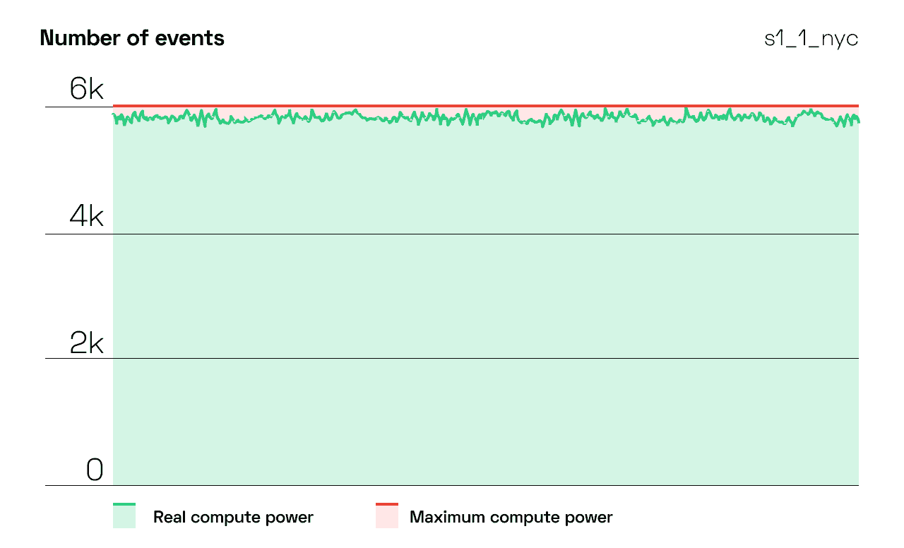
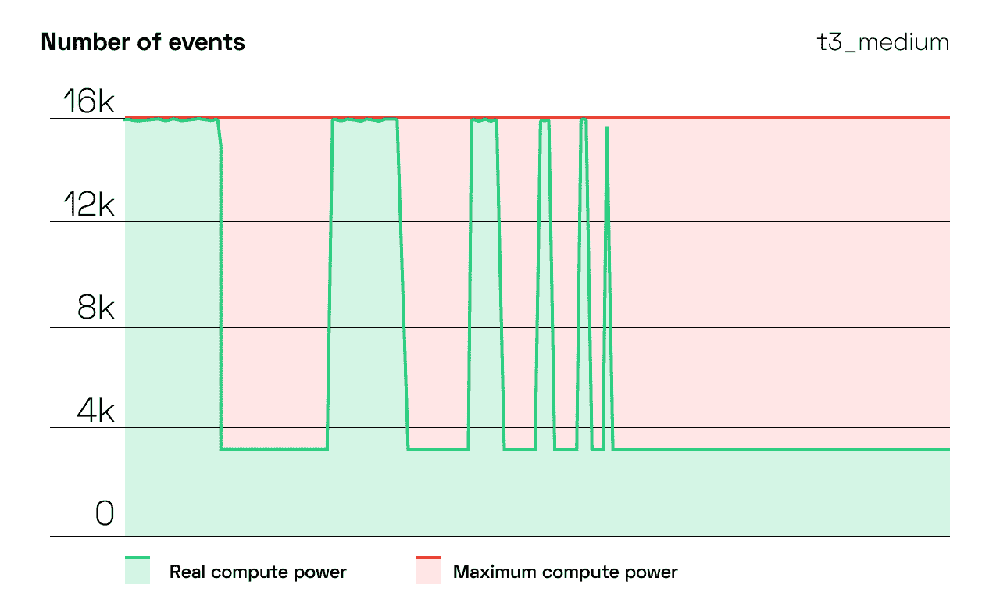
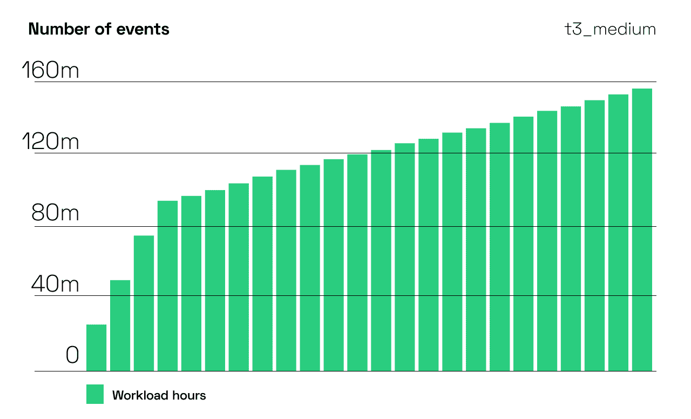

# 如何在没有 AWS Spot 实例的情况下削减您的 Kubernetes 账单

> 原文：<https://thenewstack.io/how-to-cut-your-kubernetes-bill-without-aws-spot-instances/>

 [莱昂·库伯曼

莱昂是 CAST AI 的联合创始人兼首席技术官。Leon 曾担任甲骨文云基础设施安全产品副总裁，拥有 20 多年在 IBM、Truition 和 HostedPCI 等公司工作的经验。他创立了 Zenedge，并担任首席技术官，该公司被甲骨文收购。](https://www.linkedin.com/in/itexecutivecto/) 

现货实例提供了一个有吸引力的折扣，但有一个陷阱。AWS 可以随时拔掉插头，只给你两分钟时间将 Kubernetes 工作负载转移到其他地方。当明智地使用时， [spot 实例](https://cast.ai/blog/how-to-reduce-cloud-costs-by-90-spot-instances-and-how-to-use-them/)可以带来巨大的成本节约。然而，它们不是灵丹妙药，AWS 也有一些限制。

如果您的行业或设置阻止您在 spot 实例上运行工作负载，不要担心。仍然有办法[削减你的云账单](https://thenewstack.io/7-tips-for-cutting-down-your-aws-kubernetes-bill/)甚至一半。开始的最佳方式是对云实例进行合理调整。

本质上，合理调整意味着:

*   分析实例的利用率和性能指标
*   了解他们是否以合理的价格高效运行
*   通过升级、降级或终止实例来提高基础设施的性价比

下面是为 Kubernetes 工作负载选择最佳 Amazon EC 实例的分步指南。

## 1.定义您的需求

您可能想得到一个负担得起的实例，但是您在这里将承担风险。一旦运行内存密集型应用程序，实例可能会遇到性能问题。

首先考虑您的工作量要求。为了控制云成本，请仅订购您在这些关键计算方面所需的资源:

*   CPU 计数
*   中央处理机体系结构
*   记忆
*   固态硬盘存储
*   网络

因此，您已经确定了一组匹配的实例类型。在选择类型之前，请在 CPU 密集型和 GPU 密集型实例之间进行选择。如果你正在构建一个机器学习应用，选择一个 GPU 实例。在训练模型上要快很多。AWS 引入了一个新的为推理而设计的实例类型(在下一节阅读更多内容)。

## 2.选择合适的实例类型

AWS 提供了几种类型的 [EC2 实例](https://cast.ai/blog/aws-eks-vs-ecs-vs-fargate-where-to-manage-your-kubernetes/)，它们匹配不同的用例并提供不同的参数比率。它们也是可扩展的，因此这意味着如果您的工作负载需要，您总是可以获得更大的容量

### 通用

这种类型的 CPU 与内存的比例是平衡的。它非常适合使用等量 CPU 和内存的通用应用程序，例如中低流量的 web 服务器或较小的数据库。

### 计算优化

这些实例针对 CPU 密集型工作负载进行了优化，具有较高的 CPU/内存比率。选择它们用于中等流量的 web 服务器、批处理预处理或应用服务器等用例。

### 内存优化

这种类型提供了较高的内存 CPU 比率，非常适合数据库服务器、分析或更大的内存缓存等生产工作负载。

### 存储优化

对于需要大量读/写操作和低延迟的工作负载，存储优化实例是一个不错的选择。它非常适合大数据、SQL 和 NoSQL 数据库以及数据仓库。

### 加速计算

这些实例使用硬件加速器来执行数据模式匹配、图形处理和浮点数计算等任务，比运行在 CPU 上的软件好得多。选择它们进行机器学习和高性能计算(HPC)。

### 推理类型

AWS 引入这种类型是为了支持机器学习应用。EC2 Inf1 提供了比 AWS EC2 G4 实例高 30%的吞吐量和低 45%的每次推理成本。

## 3.考虑芯片和处理器的问题

为了提供计算服务，云提供商推出了不同的计算机。那些计算机中的芯片具有不同的性能特征。

这里有一个例子。一个实例使用稍慢的老一代处理器，而另一个实例使用稍快的新一代处理器。在没有任何意识的情况下，您可能最终选择了一个提供您实际上并不需要的强大性能特征的实例。

### 如何在各种情况下验证真实性能

为任务选择最佳虚拟机的最佳方法是基准测试，这意味着将相同的工作负载放到不同的实例类型上，并检查其性能。一年前我们在 CAST AI 开始的时候就是这样。这是我们学到的。

### 示例洞察:云耐久性的差异

为了理解实例性能，我们开发了一个称为“耐久性系数”的指标我们是这样计算的:

*   我们测量了一个给定的实例类型在 12 小时内可以做多少工作，以及它的性能变化有多大。
*   请注意，对于持续的基本负载，您的目标是稳定性。对于突发性工作负载，较低的稳定性也不错。
*   在我们的案例研究中，性能稳定的实例接近 100，性能随机的实例接近 0 值。

在这里做出决定可能很困难，因为不清楚当使用不同的实例类型时，您的资金获得了多大的稳定性。

在我们的案例研究中，DigitalOcean s1_1 机器获得了 0.97107 (97%)的耐久系数。AWS t3_medium_st 达到 0.43152 (43%)。

来源:CAST AI

来源:CAST AI

### 注意:考虑 ARM 驱动的实例

AWS 已经提供了基于 ARM 的实例——例如，EC2 A1 系列使用了 [Graviton2](https://aws.amazon.com/ec2/graviton/) ARM 处理器。ARM 运行和散热更便宜，因为它消耗的能量更少。云提供商可能会降低收费。

如果您想使用它，您可能需要重新构建您的交付管道，以便为 ARM 编译您的应用程序。另一方面，如果你正在运行一个解释堆栈(想想 Python、Ruby 或 NodeJS)，你的应用程序可能会运行。

## 3.利用 CPU 爆发

可突发性能实例旨在为企业提供基准水平的 CPU 性能，并在工作负载需求突然变化时提供突发到更高水平的额外选项。

这种情况适用于低延迟的交互式应用程序、微服务或中小型数据库。

请注意，累积的 CPU 信用数量将始终取决于您选择的实例类型。一般来说，大型实例平均每天 4 小时或更长时间每小时收集更多的信用。然而，如果您运行的电子商务网站在每次营销活动后都有大量访客，那么一个可爆发的实例是一个很好的选择。

### 考虑到这一点:CPU 的能力是有限的

通过测试可突发的实例，我们发现计算能力通常在前四个小时呈线性增长，之后变得更加有限。下面是一个 t2_2xlarge 实例的图表。

来源:CAST AI

## 4.仔细检查存储转移限制

另一个重要的成本来源是数据存储。AWS EC2 实例使用弹性块存储(EBS)来存储磁盘卷。选择实例类型时，请确保它具有您的应用程序所需的存储吞吐量。避免昂贵的硬盘选项，如高级固态硬盘，除非您希望充分利用它们。

## 5.不要忘记网络带宽

如果您正面临巨大的数据迁移或高流量，那么看看您的实例和分配给它的消费者之间的网络连接的大小。

您可能会发现可以支持 10 或 20 Gbps 传输速度的实例。但是请记住，只有这些实例能够支持这种级别的网络带宽。

## 总结:自动调整大小

您可以获得一个自动化的解决方案，而不是手动调整云实例的大小。

我们用人工智能驱动的实例选择算法构建了 CAST AI 来做这件事。它选择满足工作负载要求的最佳实例类型，并在集群需要额外节点时应用更改。您的工作负载将始终以最高的性能和最低的成本运行。

*注册 [CAST AI](https://cast.ai/) 并免费分析您的集群，开始节省 50%至 90%的云账单。*

<svg xmlns:xlink="http://www.w3.org/1999/xlink" viewBox="0 0 68 31" version="1.1"><title>Group</title> <desc>Created with Sketch.</desc></svg>