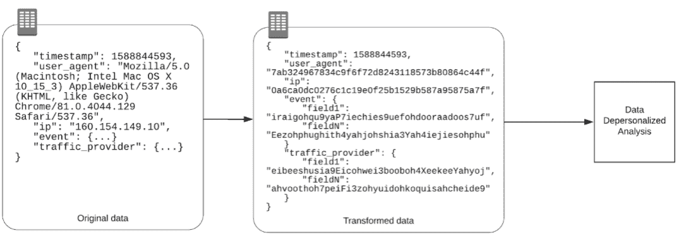

# 如何用个人数据降低工作风险

> 原文：<https://thenewstack.io/how-to-de-risk-your-work-with-personal-data/>

 [阿列克谢·凯塞尼赫

阿列克谢·凯塞尼赫是一位拥有 10 多年经验的信息安全专家。目前是 Soveren 的 CISO，同时在一家拥有 4 亿多用户的大型电子商务市场工作，之前曾在德勤(Deloitte)担任顾问。](https://soveren.io/) 

在上一篇文章中，我解释了如何定义信息资产的风险。在本文中，我将向您介绍影响处理、存储和传输个人数据的资产的风险。我还将谈到如何通过安全控制来减少和消除这些风险。

我们要考虑的风险是:

*   存取管理
*   数据安全
*   开发和测试
*   设备安全性
*   数据传送

在处理个人数据时，降低风险的一个重要方法是定义负责存储和处理个人数据的系统、网络和网络组件。您需要非常清楚哪些资产包含所有个人数据，并将它们转移到单独的安全轮廓中。

这样做将使您能够消除适用于基础架构中其他 IT 资产的威胁，这些威胁可能会直接或间接影响您的系统和个人数据环境。

## 让生活更轻松

当谈到使用个人数据时，我们经常忘记我们并不总是需要使用个人数据本身。通过为您的客户(用户)使用唯一标识符，您可以使您的工作变得非常简单，并将风险降至最低。

简而言之，您可以获取客户的姓名— John Smith —他的电话号码、地址并用 UserID_1 替换它。如果您需要将表中数据的不同部分分开，可以将 John 的唯一 id 设置为:

*   名称—名称 _uid_
*   电话— ph_uid_1
*   地址—ad_uid_1

上述值对于您的内部流程(分析、统计、批量查询等)来说已经足够了。);另外，你的系统中不会有个人数据，只有标识符。这样做意味着您可以设置您的安全性，以便只有一套系统可以访问或可以请求访问个人数据。

另一个最佳实践是组织您的系统，以便将存储的个人数据的类型分开，每种类型都有自己的名称空间。

例如，分隔:

*   员工和客户个人数据
*   个人数据为姓名、电话和地址的用户，以及提供 ID(如护照扫描件)的用户
*   不同类型数据的解密密钥(例如，来自密钥管理系统的数据)

关于保持解密密钥独立的最后一点的附加内容是，它将使您能够更好地控制访问管理，能够为不同的数据请求设置密钥用法。

## 没有人，没有问题

限制对个人数据的访问是这里的关键。接触个人数据的人、服务和系统越少，就越容易对一切进行形式化和监控。

此外，了解谁可以访问个人数据以及如何访问，将有助于您正确设置事件调查流程。这本身将缩短您的响应和调查时间，更不用说事故管理流程的业务费用了。

## 加密

个人数据应该加密存储和传输。使第三方无法解密数据，将从整体上降低与未经授权访问个人数据和数据泄露相关的风险。

作为替代，您可以 [混淆个人数据](https://soveren.io/blog/how-to-obfuscate-data) (就像在 PCI DSS 中对支付数据所做的那样)或将其标记化。

您可以完全标记 IP 地址之类的东西。这意味着第三方服务将无法访问源 IP 地址，但可以了解哪些用户拥有相同的 IP 地址，因为他们的令牌将是相同的。

## 仅生产环境中的个人数据

即使您的测试环境与您的生产环境受到相同级别的保护，您也不应该在测试时使用真实的个人数据。我的意思是，如果您首先允许您的开发人员访问真实的个人数据，这本身就会产生需要控制的风险(例如，监控开发人员、完整性控制、防止未经授权方访问导致的数据泄露)。

## 设备安全性

如果您不是一家大型或成熟的企业，并且您还没有针对最终用户设备安全性的正式政策和流程，或者您认为基本的 Windows 和 MacOS 安全性已经足够好，请确保您为有权访问包含个人数据的系统的员工保护所有虚拟工作空间。事实上，使用 [跳转主机](https://en.wikipedia.org/wiki/Jump_server) 来保护包含个人数据的轮廓会更好。

除此之外，你还可以使用亚马逊应用流(Amazon AppStream)或类似的软件，这将为那些没有安装额外安全软件的设备覆盖你的风险。

## 推还是拉

如果您需要将个人数据传输给第三方(当然，您应该通过安全通道和/或加密格式进行传输),请确保您正在传输数据(推送模式),并且他们没有从您处获取数据(拉取模式)。

这看起来似乎没有什么区别，或者说这妨碍了效率，但是请这样想:如果您让数据从您这里被提取，那么您将冒被获取更多数据(或者比您预期的更多请求)的风险。现在想象一下，第三方服务受到损害。你明白我的意思了吧。

替代方法是尽可能使用匿名数据。设置匿名化服务，通过使用开放算法对所有信息进行标记化，最大限度地消除 web/移动应用入口点数据的个性化。

## 最后的想法

降低风险与消除风险截然不同。值得记住的是，每次人们/系统使用关键数据时，您都应该创建一个单独的环境(尤其是当这些数据的安全要求受到 GDPR 等法规的管制时)。通过这样做，您将使您的安全工作变得容易得多。这不仅意味着避免罚款或负面宣传，还意味着降低支持您的整体安全的成本，即使考虑到存储和处理个人数据的额外基础架构的额外成本。

<svg xmlns:xlink="http://www.w3.org/1999/xlink" viewBox="0 0 68 31" version="1.1"><title>Group</title> <desc>Created with Sketch.</desc></svg>