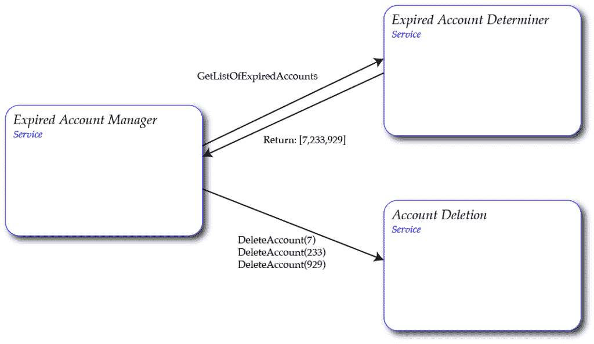

# 如何处理服务失误，让你的客户永远不会注意到

> 原文：<https://thenewstack.io/how-to-deal-with-service-failures-so-your-customer-never-notices/>

[新遗迹](https://newrelic.com/)赞助本帖。

这真的很简单——服务调用其他服务，并根据这些服务的响应采取行动。有时候，那个行动是成功的，有时候是失败的。但是是成功还是失败，取决于交互是否满足一定的要求。特别是，对于给定的情况，反应必须是可预测的、可理解的和合理的。这一点很重要，以便读取响应的服务可以做出适当的决定，而不会传播垃圾结果。当服务收到它不理解的响应时，它可以根据垃圾响应采取行动，这些行动可能会对您的服务和应用程序产生危险的副作用。

## **失败的发球**

 [李·艾奇逊

Lee 拥有 30 年的经验，致力于设计和构建大规模、基于云、面向服务的 SaaS 应用。他在构建高度可用的系统方面有专门的知识。李是新遗迹战略建筑的高级主管。在 New Relic 的最后四年里，他设计并领导了 New Relic 平台和基础设施产品的建设，并帮助 New Relic 设计了一个可靠的基于服务的系统架构，该架构随着他们从一个简单的 SaaS 初创公司发展成为一个高流量的公共企业而扩展。](https://twitter.com/leeatchison) 

让我们看一个例子。假设我们有一个应用程序，它要求客户维护一个帐户来使用该应用程序。当然，这是大多数基于 web 的应用程序的情况。我们有一系列的服务来控制和维护这些客户的账户。

现在让我们更详细地看一下这些服务的子集。假设我们有以下一组服务:

*   **ExpiredAccountDeterminer** 。*过期账户确定器服务*。该服务的目的是返回过期帐户的列表。这可能是因为客户已经放弃了他们的账户，或停止支付，或其他原因。它只有一个方法“GetListOfExpiredAccounts”，该方法返回需要删除的过期帐户 id 列表。
*   **账户删除**。*账户删除服务*。该服务的目的是获取给定的帐户 ID 并删除相应的帐户。它只有一个方法“DeleteAccount”，用于删除指定的帐户 ID。
*   **ExpiredAccountManager** 。*到期的客户经理服务*。该服务的目的是获取过期帐户的列表，然后逐个删除这些过期帐户。

删除过期帐户所涉及的服务，正确地协同工作。

**ExpiredAccountManager** 服务调用 **ExpiredAccountDeterminer** 服务来获取要删除的账户列表。然后，管理器服务获取这个列表，并为每个准备删除的帐户逐个调用**帐户删除**服务。这如图 1 所示。在这种情况下，确定者返回三个帐户，经理尽职尽责地删除这三个帐户。一切都好。

但是如果 **ExpiredAccountDeterminer** 服务失败并返回垃圾，会发生什么呢？那么整个应用程序会怎么样呢？答案取决于 **ExpiredAccountManager** 服务如何响应该条件。垃圾答案很可能会在管理器服务中产生错误。但是同样可能的是，管理器服务将垃圾错误地解释为一组帐户 id。这个垃圾结果列表本质上是一个很大的随机账户列表。

因此， **ExpiredAccountManager** 服务尽职尽责地关闭，并告诉 **AccountDeletion** 服务删除所有指定的帐户，一个接一个，直到它们都消失。他们是不应该被删除的有效帐户的事实是无关紧要的，他们无论如何被删除。

绝对不是这种情况下的合理反应。这种情况如图 2 所示。这里，**getlistoexpiredaccounts**方法返回垃圾响应，而 **ExpiredAccountManager** 服务关闭，并为其识别的每个帐户 ID 逐个调用**deleteaccount**方法。账户删除服务会不加选择地删除所有账户。

服务处理不当导致不良反应。

显然，这是一种糟糕的情况，这种情况可以而且应该通过在所有服务中应用适当的服务故障处理来避免。

## **处理服务故障**

你如何处理服务失败？当你所依赖的服务出现故障时，你该如何应对？该解决方案首先设置对响应应该是什么以及调用服务应该如何解释这些响应的预期。

回应和你对回应的解读必须:
●可预测。
●可以理解。
●合乎形势

让我们依次看一下这三个方面。

## **可预见的反应** 

拥有可预测的响应是服务能够依赖其他服务的一个重要方面。如果接收到一个没有被预测到的响应，接收服务将没有一个框架来决定如何处理这个响应。没有这个框架，沟通失误会导致错误，而错误又会导致严重的错误。

如果服务的下游依赖失败，它仍然有责任以可预测的方式做出响应。这种可预测的响应可以非常合理地生成适当的错误消息。但是生成垃圾和不可读的响应是不合理的。

例如，如果要求一个服务执行操作“42 + 39”，那么响应应该是数字“81”。但是如果服务被要求执行操作“35 / 0”，那么可预测的响应将是“不是一个数字”或“错误，无效的请求”如果服务一次返回结果“392838383 ”,另一次返回结果“19283838329 ”,将会出现不可预测的响应。

在图 2 中， **ExpiredAccountDeterminer** 服务生成垃圾数据集是不可预测的，即使该服务处于故障模式。如果它不能完成预期的任务，它应该会生成一条错误消息。如果它不能返回错误代码，还不如什么都不返回。但是在任何情况下，它返回随机的、不可预测的或无意义的结果都是不可接受的。

## **可以理解的回应**

可理解意味着依赖的服务在服务间的响应有一个约定的格式和结构。这构成了依赖服务之间的契约。服务的响应必须符合该契约的范围，即使它有行为不当的依赖关系。仅仅因为一个依赖项违反了它的 API 契约，它就违反了与它的消费者的 API 契约，这是绝对不可接受的。相反，要确保约定的接口提供足够的支持来覆盖所有的意外事件，包括失败的依赖关系。

例如，如果要求服务执行操作“42 + 39”，那么响应应该是一个数字或有效的错误消息。这些对预期反应的限制使反应变得可以理解。对于服务来说，返回答案“cherry”或“yes”是不可理解的。

在图 2 中，从 **ExpiredAccountDeterminer** 服务返回的垃圾是一个不可理解的响应。

## **合理回应**

一个合理的响应是一个表明你的服务实际发生了什么的响应。

例如，如果要求一个服务执行操作“42 + 39”，那么响应应该是 42 和 39 相加的结果。服务返回 42 减去 39 的结果是不合理的。即使它正确地计算出“42–39”的有效结果，服务返回该结果也是不合理的。

在图 2 中，如果您调用 **ExpiredAccountDeterminer** 服务，该服务返回所有帐户的列表或所有有效帐户的列表是不合理的。对于服务来说，唯一合理的做法是返回一个准备删除的帐户列表，或者如果它不能确定正确的答案，则返回一个有效的错误消息。在这种特殊情况下，它返回一个空列表(表示没有帐户准备好被删除)甚至是合理的。但是，即使在出错的情况下，返回任何其他内容也是不合理的。

## **结论**

非常流行的表达“垃圾入，垃圾出”永远不应该是一个服务可以接受的行为。这不是在您的服务中构建弹性的方法。

您的上游依赖项希望您提供可预测的响应。你的上游依赖者期望你的回应是可理解的和合理的。如果你的输入是垃圾，就不要输出垃圾。如果你的服务失败或者有一个依赖失败，不要输出垃圾。

如果您对来自下游服务的不可预测的反应提供不可预测的响应，您只是将不可预测的性质传播到价值链的上游。迟早，这种不可预测的反应会将无效数据注入到您的业务流程和系统中。这可能会影响您的业务系统和客户体验。在图 2 的例子中，影响可能是灾难性的。

即使服务或其依赖项出现故障，重要的是这些问题永远不会对最终用户或客户表现出来。即使一个服务不能做它应该做的事情，它也需要返回一个可预测的、可理解的和合理的响应，即使这个响应是为了指示一个预期的和适当的错误条件存在。

否则会降低应用程序的弹性，并给应用程序和客户带来风险。

通过 Pixabay 的特征图像。

<svg xmlns:xlink="http://www.w3.org/1999/xlink" viewBox="0 0 68 31" version="1.1"><title>Group</title> <desc>Created with Sketch.</desc></svg>