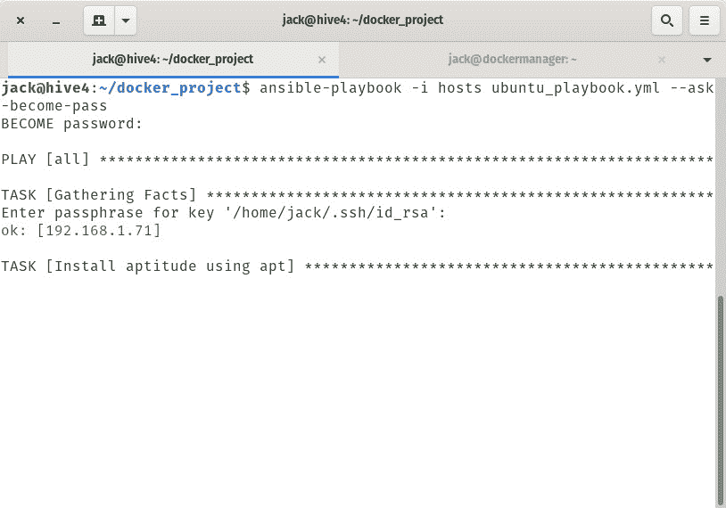
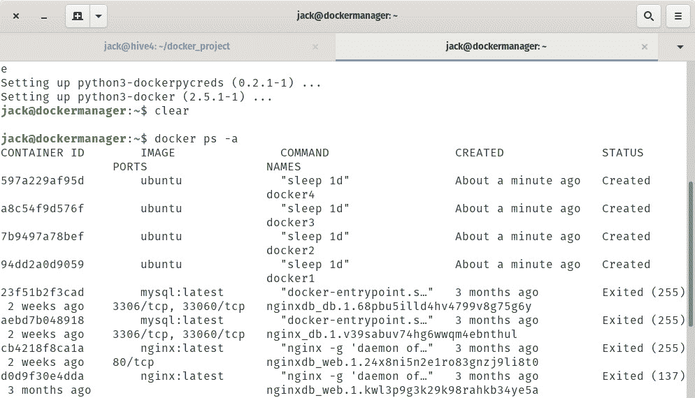

# 如何使用 Ansible 部署容器

> 原文：<https://thenewstack.io/how-to-deploy-a-container-using-ansible/>

集装箱。你不能逃避他们，因为他们在接管企业 IT 部署方面继续前进。您可以将它们部署为应用程序、服务等等。而且，部署容器的方法与部署它们的原因一样多种多样:

*   码头工人
*   库伯内特斯
*   大牧场主
*   Solaris 容器
*   火箭
*   MicroK8s
*   建筑的

这个清单还在继续。但是，您知道还有另一种部署容器的方法吗？这种方法可能会让远程管理员急于一试。另一种方法是通过 Red Hat 的开源自动化工具 [Ansible](https://www.ansible.com/) 。

对于那些不知道的人，Ansible 是一个运行在 Linux 上的开源软件供应、配置管理和应用程序部署工具。Ansible 包括自己的声明性语言，并使用剧本来创建在远程机器上运行简单或非常复杂的命令(或命令组)的环境。

当然，Ansible 可以用来部署容器。

现在，在您深入研究之前，我要向您展示的不一定是最佳实践场景。因为每个人的情况和需求都不一样，所以这里您将看到的只是使用 Ansible 部署容器的简单介绍。有更好的方法吗？当然可以。但是这会给你一个起点，让你制作高度灵活和可行的剧本吗？肯定会的。

同时，让我们看看这是如何做到的。

## 你需要什么

为了做到这一点，你至少需要两台服务器，其中一台已经安装并运行了 Ansible。我将用 Ubuntu Server 18.04 的两个实例来演示。你还需要一个拥有**账号权限的用户账号。最后，您需要在服务器之间设置 SSH 密钥认证。如果没有 SSH 密钥认证，这将不起作用。**

这就是你所需要的。

## 安装 Ansible

如果您的服务器上还没有运行 Ansible，请按照以下步骤安装它:

1.  登录将托管 Ansible 的 Ubuntu 服务器
2.  用命令*sudo apt-add-repository PPA:ansi ble/ansi ble*安装必要的存储库。
3.  用命令 *sudo apt-get update* 更新 apt。
4.  用命令*sudo apt-get install Ansible-y*安装 ansi ble。
5.  如果需要，用命令*sudo apt-get install Python-y*安装一个 Python 解释器。

### 复制您的 SSH 密钥

为了实现这一点，您必须设置 SSH 密钥认证。在您的 Ansible 服务器上，使用以下命令创建您的 SSH 密钥:

*ssh-keygen*

生成密钥后，使用以下命令将其复制到远程机器:

*ssh-copy-id SERVER_IP*

其中 SERVER_IP 是远程服务器的 IP 地址。

### 安装 Docker

接下来，您必须在两台(或所有)机器上安装 docker 引擎。要安装 docker 引擎，请登录到您的一台服务器并发出以下命令:

`sudo apt-get install docker.io python3-docker -y`

安装完成后，使用以下命令启动并启用 docker 引擎:

`sudo systemctl start docker
sudo systemctl enable docker`

最后，使用以下命令将您的用户添加到 docker 组:

`sudo usermod -aG docker $USER`

为了使更改生效，请注销并重新登录。

一旦您在所有机器上完成了这些步骤，您就准备好继续前进了。

### 目录结构

我们现在要创建必要的目录和文件。这将在运行 Ansible 的机器上完成。登录到该机器并发出命令:

`mkdir ~/docker_project`

使用以下命令切换到新创建目录:

`cd ~/docker_project`

现在，我们将创建我们的主机文件。使用以下命令执行此操作:

`nano hosts`

在该文件中，粘贴以下内容:

```
[webserver]
SERVER_IP

[webserver:vars]
ansible_python_interpreter=/usr/bin/python3

```

其中 SERVER_IP 是远程服务器的 IP 地址。如果您有多台服务器，该文件看起来应该是这样的:

```
[webserver]
SERVER_IP
SERVER2_IP

[webserver:vars]
ansible_python_interpreter=/usr/bin/python3

```

保存并关闭文件。

我们现在将创建一个可行的行动手册。本行动手册将完成以下工作:

*   安装智能。
*   安装一些依赖项。
*   添加 docker 存储库。
*   安装 docker 社区版。
*   安装 docker Python 模块。
*   拉一下 Ubuntu 官方图片。
*   基于新获取的 Ubuntu 映像创建四个容器。

这个新文件将是标准的 YAML 格式，这意味着你必须密切注意你的行缩进。不一致的缩进会导致你的剧本失败。使用以下命令创建一个新文件:

`nano ubuntu_playbook.yml`

我们的剧本是这样的:

```
-  hosts:  all</code>  <code class="">  become:  true</code>  <code class="">   vars:</code>  <code class="">     create_containers:  4</code>  <code class="">     default_container_name:  docker</code>  <code class="">     default_container_image:  ubuntu</code>  <code class="">    default_container_command:  sleep  1d</code>  <code class="">   tasks:</code>  <code class="">     -  name:  Install aptitude using apt</code>  <code class="">       apt:  name=aptitude state=latest update_cache=yes force_apt_get=yes</code>  <code class="">     -  name:  Install required system packages</code>  <code class="">       apt:  name={{  item  }}  state=latest update_cache=yes</code>  <code class="">       loop:  [  'apt-transport-https',  'ca-certificates',  'curl',  'software-properties-common',  'python3-pip',  'virtualenv',  'python3-setuptools']</code>  <code class="">    -  name:  Add Docker GPG apt Key</code>  <code class="">       apt_key:</code>  <code class="">         url:  https://download.docker.com/linux/ubuntu/gpg</code> <code class="">        state: present</code> <code class="">    - name: Add Docker Repository</code> <code class="">      apt_repository:</code> <code class="">        repo: deb https://download.docker.com/linux/ubuntu xenial stable</code> <code class="">        state: present</code> <code class="">    - name: Update apt and install docker-ce</code> <code class="">      apt: update_cache=yes name=docker-ce state=latest</code> <code class="">    - name: Install Docker Module for Python</code> <code class="">      pip:</code> <code class="">        name: docker</code> <code class="">    - name: Pull default Docker image</code> <code class="">      docker_image:</code> <code class="">        name: "{{ default_container_image }}"</code> <code class="">        source: pull</code> <code class="">    - name: Create default containers</code> <code class="">      docker_container:</code> <code class="">        name: "{{ default_container_name }}{{ item }}"</code> <code class="">        image: "{{ default_container_image }}"</code> <code class="">        command: "{{ default_container_command }}"</code> <code class="">        state: present</code> <code class="">      with_sequence: count={{ create_containers }}

```

保存并关闭文件。显然，您可以修改行动手册以满足您的需求，所以请仔细阅读并相应地修改它。

正如我所说的，有许多方法来处理赋予的任务。上面看到的只是其中之一。然而，它是可行的，并且是了解如何用 Ansible 部署容器的一个很好的方式。

## 运行行动手册

有了我们的剧本，我们现在可以用下面的命令运行它:

`ansible-playbook -i hosts ubuntu_playbook.yml --ask-become-pass`

–ask-been-pass 选项指示 Ansible 要求远程用户 SSH 密钥的 sudo 密码(**图 1** )。输入密码后，按键盘上的 Enter 键，剧本就会运行。



**图 1:** 键入 SSH 密钥，剧本将会运行。

根据您的网络连接和计算机速度，该行动手册可能需要几分钟才能完成。完成后，登录到您的远程服务器并发出命令:

`docker ps -a`

您应该看到新的容器已经部署好了(**图 2** )。



**图二**。用 GIMP 创建

这就是用 Ansible 部署容器的全部内容。有更好的方法吗？当然可以。但是如果您已经投资了 Ansible，为什么不将容器的部署添加到您不断增长的剧本列表中呢？

<svg xmlns:xlink="http://www.w3.org/1999/xlink" viewBox="0 0 68 31" version="1.1"><title>Group</title> <desc>Created with Sketch.</desc></svg>