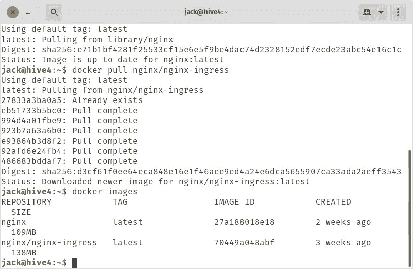
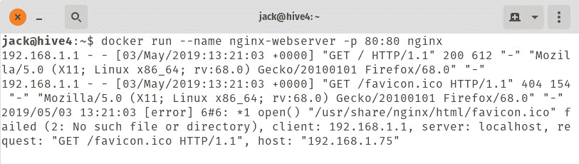
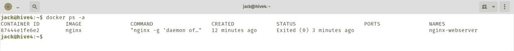
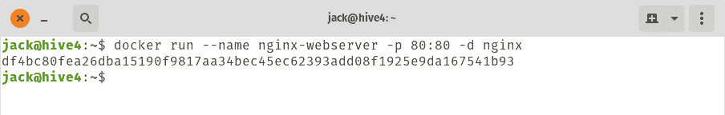
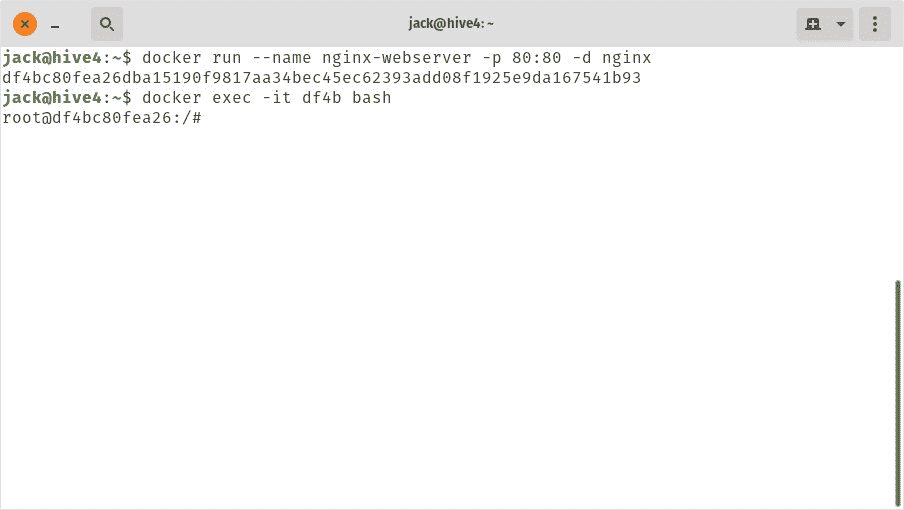

# 容器基础:如何用 Docker 部署容器

> 原文：<https://thenewstack.io/containers/how-to-deploy-a-container-with-docker/>

想象一下，为了推出一个网站，你不必从裸机开始安装一个成熟的服务器。不需要安装操作系统，然后安装服务器软件，然后部署精心制作的应用程序或网站，您可以简单地在一个自包含的捆绑包中开发一切，然后通过一个命令将其推出。

这是使用容器的众多好处之一。它们使得开发和部署周期非常高效。但是如何部署这些容器呢？我想在这里向你介绍一下这个过程。我们将着重于在 Ubuntu Server 18.04 上部署一个基本的 NGINX web 服务器，作为一个容器。所有这些都将在 Docker 的帮助下完成。

## 你需要什么

为了成功地将 NGINX 部署为容器，您需要具备以下条件:

就是这样。有了这两部分，你就可以开始了。

## 温和的提醒

您部署的每个容器都将基于从 [DockerHub](https://hub.docker.com/) 中提取的图像。你可以拉下一张图片，想用多久就用多久。DockerHub 上也有针对单个应用程序或平台的大量图片。以 NGINX 为例。如果你在 DockerHub 上搜索 NGINX，你会找到大约 56172 个条目。这并不意味着这些条目中的每一个都是您可以使用的可行图像。

图像是这样命名的:

```
<em>name/descriptive-name</em>

```

例如，使用 NGINX，您可能会找到一个名为
的图像

```
bitwarden/nginx  (a  reverse proxy NGINX image)

```

或者你可能会发现:

```
nginx/nginx-ingress  (NGINX Ingress controller for Kubernetes)

```

你看，几乎每种需求都有图片。

这个时候，你要关注的形象只有一个。那张图片是 NGINX 官方发布的。

### 拉图像

在使用图像之前，必须将其保存在本地驱动器上。有两种方法可以做到这一点:

*   直接使用 pull 命令。
*   间接，在容器部署过程中。

要从 DockerHub 获取图像，您可以打开一个终端窗口并发出命令:

如果您想提取入口图像，该命令将是:

```
docker pull nginx/nginx-ingress

```

一旦你拉下了你想要的图像，你可以用命令来确保它在那里:

上面的命令将列出您已经绘制的所有图像(**图 A** )。



图 A:NGINX 和 nginx/nginx-ingress 图像都可以使用。

下拉随机图像时一定要小心。为什么？因为你永远不知道是什么创造了它们。容器可能包含恶意代码，这会对您的网络或数据造成严重破坏。因此，最好只使用官方图像(比如 NGINX 图像)。

### 部署容器

现在是部署容器的时候了。如果您还没有下载映像，那么请求的映像将在部署阶段被下载。因为我们拉下了官方 NGINX 图像，我们将使用它。

要部署一个容器，您可以像这样使用 **docker** 命令:

```
docker run  --name NAME  -p  PORTS IMAGE

```

其中:

*   NAME 等于您想给容器起的名字(可以是任何东西，比如 nginx-webserver)。
*   端口要使用的端口(格式为网络端口:容器端口)。
*   IMAGE 用于容器的图像(如 nginx)。

因此，部署我们的 NGINX 容器的最基本命令是:

```
docker run  --name nginx-webserver  -p  80:80  nginx

```

容器将被部署，NGINX web 服务器将在端口 80 上对您的本地网络可用。但是，如果用于部署容器的服务器上的端口 80 已经被占用了，该怎么办呢？您可以将它部署在网络端口 8080 上，就像这样:

```
docker run  --name nginx-webserver  -p  8080:80  nginx

```

至此，你可能会看到下一期。运行上述命令之一后，没有返回 bash 提示符(**图 B** )。

[](https://cdn.thenewstack.io/media/2019/05/6be34ba0-dockerb.jpg)

图 B:当 NGINX 支持的站点被访问时，容器给我们反馈，但是它没有给我们返回的提示。

### 分离模式

如何运行容器，并获得 bash 提示符？为此，您必须在分离模式下运行容器。在这之前，你必须用键盘组合**【Ctrl】**+**杀死当前容器。该组合将返回提示并终止容器。**

 **要确保容器不再运行，发出命令:

这将列出所有集装箱及其状态(**图 C** )。

[](https://cdn.thenewstack.io/media/2019/05/b789d62a-dockerc-1024x343.jpg) 如果容器仍在运行，我们必须先终止它，然后才能在同一个端口上部署另一个容器(否则端口会发生冲突，阻止容器部署)。要杀死一个正在运行的容器，首先需要容器 ID(一个随机的字符串)。当发出 **docker ps -a** 命令时，该字符串出现。要终止一个正在运行的容器，发出命令:

其中 CONTAINER_ID 是所述容器的 ID。

然后，您可以使用命令删除容器:

其中 CONTAINER_ID 是所述容器的 ID。

请注意，您不必输入完整的容器 ID，因为字符串的前四个字符就足够了。

现在，要在分离模式下部署容器，命令应该是:

```
docker run  --name nginx-webserver  -p  80:80  -d  nginx

```

这一次，您不仅会得到提示，Docker 还会为您显示容器 ID(**图 D** )。

[](https://cdn.thenewstack.io/media/2019/05/064e1bf3-dockerd.jpg)

图 d .我们的 NGINX 容器，以分离模式运行。

### 访问正在运行的容器

如果您想在运行的容器上工作呢？比如你想对 NGINX 进行修改，甚至开始开发它将显示的网站？为此，您必须访问容器。为此，您需要容器 ID。有了 ID，发出命令:

```
docker exec  -it CONTAINER_IT bash

```

其中 CONTAINER_ID 是容器的 ID。

您现在应该在运行容器提示符下(**图 E** ，在这里您可以开始在 NGINX 服务器上工作。



图 NGINX 容器提示，准备工作。

要退出容器，只需输入命令 **exit** 。

## 比你想象的容易

希望到现在为止，您已经看到容器部署并不像您想象的那样具有挑战性。在 Docker 的帮助下，您可以像专业人士一样在几分钟内推出应用和服务。

<svg xmlns:xlink="http://www.w3.org/1999/xlink" viewBox="0 0 68 31" version="1.1"><title>Group</title> <desc>Created with Sketch.</desc></svg>**