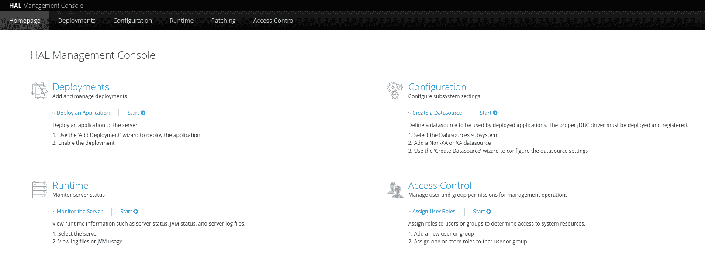
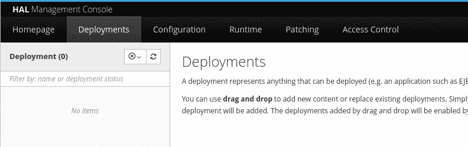
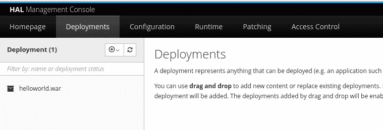
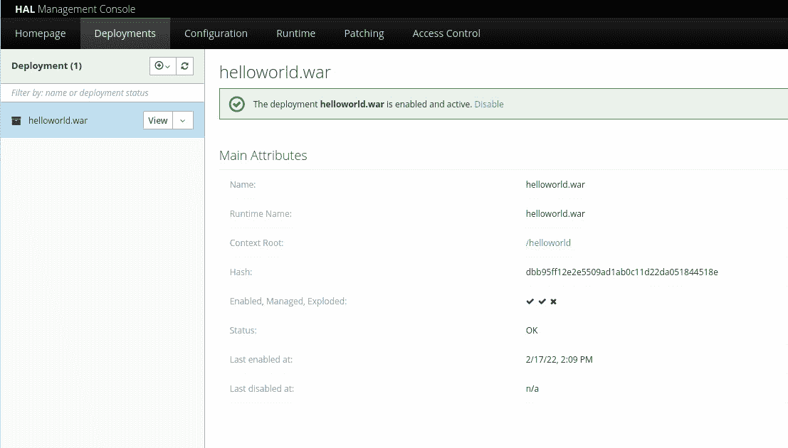
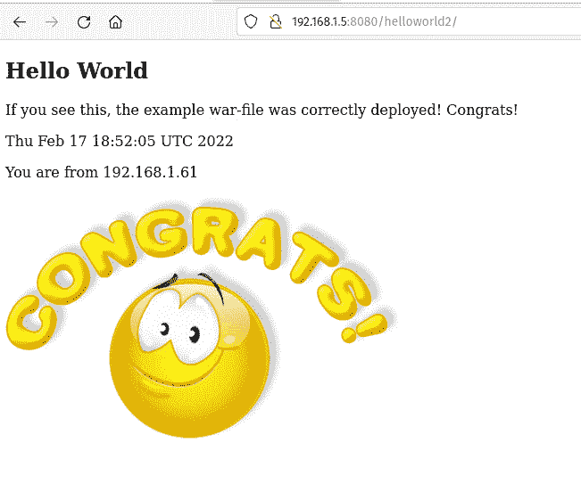
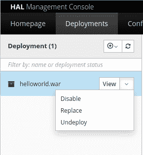

# 使用 Wildfly 应用服务器|新堆栈部署 Java 应用程序

> 原文：<https://thenewstack.io/how-to-deploy-a-java-app-with-the-wildfly-application-server/>

Wildfly 是一个模块化的轻量级 Java 应用服务器，由 Red Hat 维护，可以免费部署到您的数据中心或第三方云主机。我们已经介绍了在 Ubuntu Server 20.04 实例上部署 Wildfly 的[，现在我们将更进一步，看看使用该平台部署 Java 应用程序有多简单。](https://thenewstack.io/how-to-deploy-the-red-hat-wildfly-app-server/)

要做到这一点，您需要以下内容:

*   野火蔓延的实例
*   要部署的示例 Java 应用程序

在演示实际部署之前，我们必须创建一个可部署的 Java 应用程序。为此，我们将求助于屡试不爽的 Hello，World！

## 安装 Java JDK

为了创建 Java 应用程序，我们需要 Java JDK 的一些帮助。因为我们是在 Ubuntu 上演示，所以 Java JDK 的安装非常简单。登录到您的 Ubuntu 机器，打开一个终端窗口，发出命令:

`sudo apt-get install default-jdk -y`

安装将处理所有必要的依赖项。完成后，您可以使用以下命令来验证安装:

`java --version`

您应该在输出中看到类似下面的内容:

```
openjdk  11.0.13  2021-10-19
OpenJDK Runtime Environment  (build  11.0.13+8-Ubuntu-0ubuntu1.21.10)
OpenJDK  64-Bit Server VM  (build  11.0.13+8-Ubuntu-0ubuntu1.21.10,  mixed mode,  sharing)

```

## 构建一个 Java 应用程序

接下来，我们将构建一个简单的 Java 应用程序。使用 Wildfly，您可以部署文件类型，如 EJB-JAR、WAR、EAR 或任何类型的标准存档(如 RAR)。我们将为我们的 Java 部署创建一个 WAR 档案。

要成为，使用以下命令创建一个新目录:

`mkdir HELLOWORLD`

使用以下命令切换到新创建目录:

`cd HELLOWORLD`

在该目录中，使用命令创建另外两个目录:

```
mkdir META-INF
mkdir WEB-INF

```

接下来，使用以下命令创建 index.jsp 文件:

`nano index.jsp`

在该文件中，粘贴以下内容:

*！doctype html>*
*<html>*
*<head>*
*<title>JSP 测试</title>*
*<%!*
*String title = " Hello World "；*
*%>*
*</head>*
*<body>*
*<H2><% = title %></H2>*
*<p>*
*如果看到这里 war-file 的例子是正确的 de>*
*</p>*
*<p>*
*<% = new Java . util . date()%>*
*</p>*
<p>

 **<样式>*
*# congrats {*
*宽度:440px*
*身高:302px*
*背景:无-重复左居中 URL(' d>*
*}*
*</style>*
*</body>*
*</html>*

保存并关闭文件。

接下来，创建清单。MF 文件，命令为:

`nano META-INF/MANIFEST.MF`

在该文件中，粘贴以下内容:

```
Manifest-Version:  1.0
Created-By:  NAME

```

其中 NAME 是你的名字。

保存并关闭该文件。

使用以下命令创建 web.xml 文件:

`nano WEB-INF/web.xml`

将以下内容粘贴到该文件中:

```
&lt;web-app&gt;
     &lt;display-name&gt;Hello World&lt;/display-name&gt;
&lt;/web-app&gt;

```

保存并关闭文件。如果我们发出 *tree* 命令，我们将看到您的 Java 应用程序的结构如下所示:

index.jsp├──
├──元信息
│ └──清单。MF
└──we b-INF
└──web . XML

一切就绪后，我们现在可以使用以下命令创建一个. war 文件:

`jar -cvf helloworld.war *`

这些选项包括:

*   c–创建新的 Jar 归档文件。
*   v–生成详细输出。
*   f–将文件名设置为选项后面的内容(在我们的例子中是 helloworld.war。

当命令完成时，您将在目录中找到 helloworld.war 文件。

## 部署新的 Java 应用程序

现在是时候部署我们的 Hello，World！Java 应用程序。登录到 Wildfly 的实例，从主页中单击 Start(在 Deployments — **图 1** 下)。

**图 1**



在 Wildfly 基于 web 的界面中访问部署工具。

在生成的页面上，将 helloworld.war 文件拖到左侧的部署窗格中(**图 2** )。

**图 2**



部署窗口允许轻松拖放添加支持的文件。

一旦文件被上传，它将在部署窗格中列出(**图 3** )。

**图 3**



我们的 helloworld.war 文件已经成功部署到 Wildfly。

单击 helloworld.war 条目显示应用程序的属性(**图 4** )。

**图 4**



Wildfly 看到的 helloworld.war 应用程序的详细信息。

在详细信息中，您应该看到应用程序根目录的链接，列为/helloworld。如果你点击那个链接，它会带你到正在运行的应用程序(**图 5** )。

**图 5**



运行 Hello，World！应用程序给我们一个友好的提醒，它正在按预期运行。

您可以根据需要部署任意数量的应用程序，然后可以通过 web 浏览器和 http://server:8080/APP/(其中 SERVER 是托管服务器的 IP 地址或域，APP 是应用程序的名称)等地址从服务器访问这些应用程序。在我们的例子中，应用程序的 URL 是:

`http://192.168.1.5:8080/helloworld/`

局域网上的任何人都应该能够访问该应用程序。

如果您想要禁用您部署的应用程序，单击 View 旁边的下拉菜单并选择 Disable ( **图 6** )。

**图 6**



从 Wildfly 内部禁用我们的 Hello，World 应用程序。

您也可以从同一个下拉列表中选择取消部署来取消部署应用程序。

## 结论

Wildfly 是一个非常强大且易于使用的 Java 应用服务器。如果您希望将基于 Java 的应用程序部署到您的局域网、广域网或第三方云主机，这是一个很好的起点。

<svg xmlns:xlink="http://www.w3.org/1999/xlink" viewBox="0 0 68 31" version="1.1"><title>Group</title> <desc>Created with Sketch.</desc></svg>*