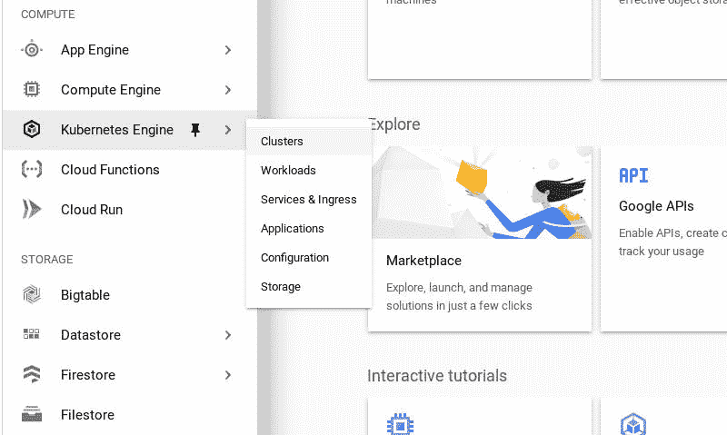
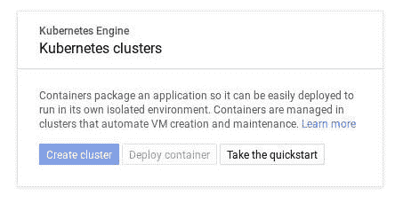
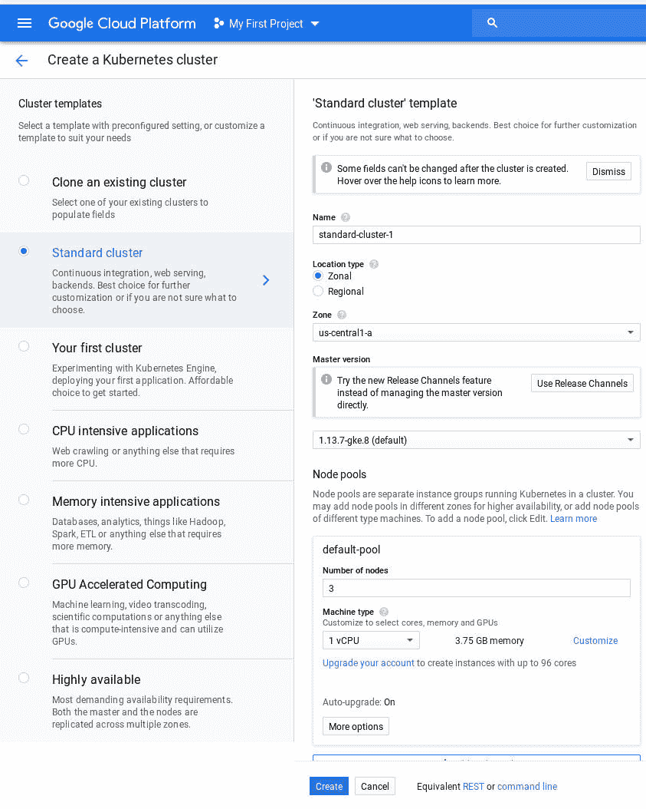
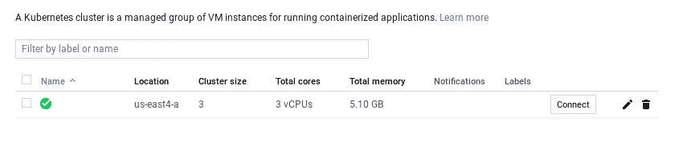
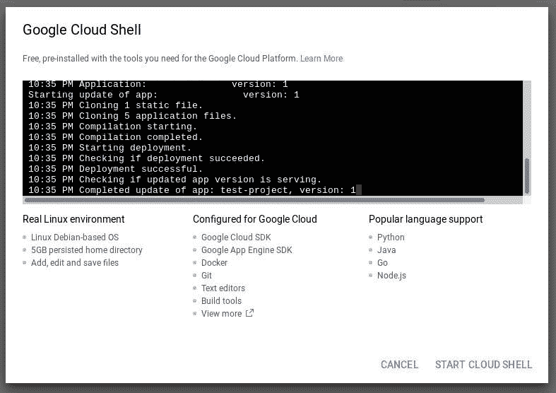
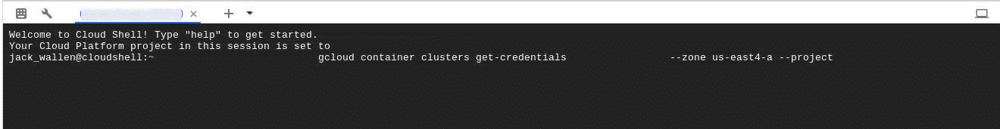
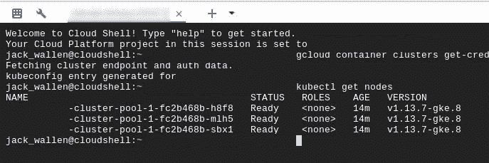

# 如何将 Kubernetes 集群部署到 Google 云平台

> 原文：<https://thenewstack.io/how-to-deploy-a-kubernetes-cluster-to-the-google-cloud-platform/>

部署 Kubernetes 集群的方法有很多。对于一些企业来说，最好的解决方案是在内部的 Linux 服务器上。对于其他人来说，最好的选择是部署在第三方服务上，如亚马逊网络服务、T2 Rackspace、T4 微软 Azure 或谷歌云平台。为什么有人想要部署到第三方，而不是保持对集群每个方面的绝对控制？简单:可靠性和开销。

您的公司可能没有足够的资源来大规模部署集群。也有可能您根本没有时间或人力来启动和运行这些 Kubernetes-ready 服务器。或者，您可能需要比内部硬件更高的可靠性。

不管怎样，你都被保护了。如果你碰巧有一个谷歌云平台账户，你就走运了。在 Google 的平台上部署 Kubernetes 集群实际上非常容易。更有吸引力的是，您不必担心管理硬件。

让我们浏览一下在 Google 云平台上部署 Kubernetes 集群的过程。

## 你需要什么

为了部署一个集群，你需要一个[谷歌云平台](https://cloud.google.com/)账户。你可以注册一个免费试用，这将给你价值 300.00 美元的信用。请注意，您将在一个月内用完这些配额，即使您只部署了集群而没有做任何事情。也就是说，让我们部署一个集群。

## 部署您的第一个集群

登录您的谷歌云平台帐户。一旦你通过了身份验证，你会想去[控制台](https://console.cloud.google.com)，在那里你可以控制你的 GCP 账户的方方面面。在左侧栏中，单击 Kubernetes 引擎>集群(**图 1** )。



**图 1:** 左侧导航中的 Kubernetes 集群条目。

在出现的窗口中(**图 2** ，点击创建集群。因为这是您的第一次集群部署，所以必须启用 Kubernetes 引擎 API。这可能需要一些时间，所以请耐心等待。



**图 2:** 创建集群按钮。

在下一个窗口中(**图 3** ，您必须配置您的集群。有几个选项可以考虑，但是因为这是您第一次使用 Google 云平台的集群，所以让它变得简单一些。在左侧导航中选择标准集群。在右窗格中，为群集指定一个名称，选择区域，然后选择要将群集部署到的区域(从区域下拉列表中)。



**图 3:** 配置您的第一个集群。

接下来，配置要添加到集群中的节点数量。需要考虑的一点是，您选择的节点数量会增加集群的成本。您添加的节点越多，就越快用完这些免费配额(或者会增加您的月费用)。所以明智地选择节点数。

决定添加多少节点后，选择机器类型，如有必要，单击“定制”以更改分配给每个节点的内存量。

完成定制后，单击创建。这个过程需要一些时间，所以要有耐心。最终，您的集群将部署完毕，您几乎可以开始工作了。

### 启用命令行访问

如果没有命令行访问，这个集群对您来说没什么用。部署完成后，您将看到您的新集群列表(**图 4** )。单击与该集群关联的连接按钮。



**图 4:** 为了保护客户隐私，我删除了一些信息，但是我的集群已经准备好了。

将出现一个新窗口，显示 gcloud 容器命令(**图 5** )。为了获得命令行访问权限(同样，从您的 Google 云平台帐户中)，请单击在云外壳中运行。



**图 5:** 获得对集群的 shell 访问。

点击云壳中的运行后，会出现一个新的窗口(**图 6** )。在该窗口中，单击开始云壳。



**图 6:** 从命令行使用 Kubernetes 集群所需的一切都在这里。

又一个新窗口将出现(**图 7** )。这次是一个终端窗口，包含您之前复制的命令。你所要做的就是按下键盘上的回车键来执行命令。



**图 7:** 运行 gcloud container 命令，从命令行访问您的集群。

现在，您应该可以轻松掌握 Kubernetes 集群的全部功能。您可以通过发出命令
进行测试，以确保一切准备就绪

上述命令的输出应该列出您为集群部署的所有节点。

您的 Kubernetes 集群现在可以部署和扩展容器了。

## Gcloud 命令

如果您更愿意从 Linux 命令行使用 Kubernetes 集群，那么您很幸运，因为您可以安装该命令并远程访问您的集群。为此，您必须从 Google 安装必要的 SDK。我将在 Ubuntu Server 18.04 机器上演示。

首先，用命令安装必要的依赖项:

```
sudo apt-get install apt-transport-https ca-certificates gnupg

```

接下来，使用命令添加 Google Cloud SDK URI:

```
echo  "deb [signed-by=/usr/share/keyrings/cloud.google.gpg] https://packages.cloud.google.com/apt cloud-sdk main"  |  sudo tee  -a  /etc/apt/sources.list.d/google-cloud-sdk.list

```

使用命令导入 Google Cloud 公钥:

```
curl https://packages.cloud.google.com/apt/doc/apt-key.gpg | sudo apt-key --keyring /usr/share/keyrings/cloud.google.gpg add -

```

使用命令更新 apt:

最后，用命令安装 SDK:

```
sudo apt-get install google-cloud-sdk  -y

```

安装完成后，您需要用命令初始化 SDK:

在初始化期间，您将被要求登录您的 Google 云平台帐户。您将获得一个链接，可以在浏览器中打开。在您点击该链接之前，请确保您已使用默认浏览器登录到您的 GCP 帐户。在浏览器中，你会得到一个验证码。将代码复制回 Linux 终端窗口，并按回车键。然后，系统会提示您选择一个要使用的项目，并询问您是否要配置默认的计算区域。初始化完成后，使用命令
更新已安装的组件

最后，您可以使用命令安装组件(如 kubectl):

```
gcloud components install kubectl

```

现在，您可以使用类似于
的命令将集群部署到您的 Google 云平台帐户

```
gcloud container clusters create NAME  --zone ZONE

```

其中 NAME 是小写字母，是集群的可读名称，ZONE 是要部署到的区域。

## 打开你的集群

这就是你在谷歌云平台上安装 Kubernetes 集群所需要的一切。现在，您可以从云平台仪表板或 Linux 命令行管理该集群。

<svg xmlns:xlink="http://www.w3.org/1999/xlink" viewBox="0 0 68 31" version="1.1"><title>Group</title> <desc>Created with Sketch.</desc></svg>