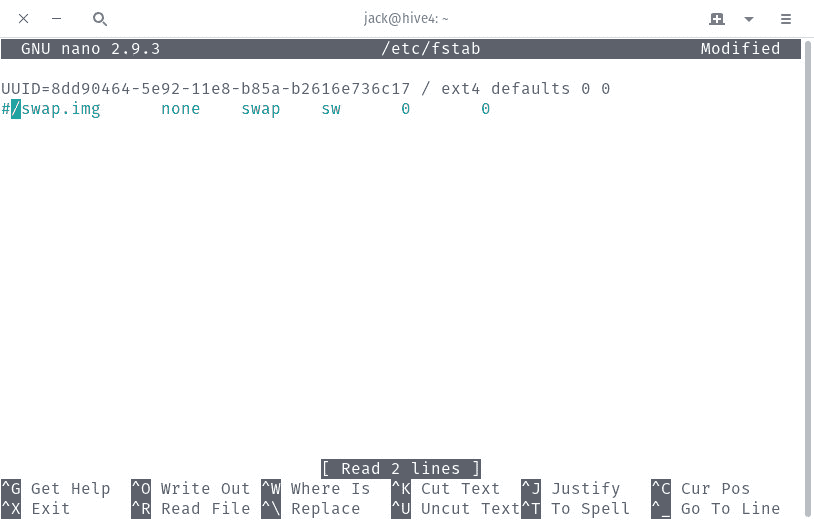
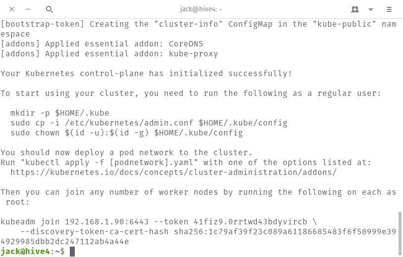
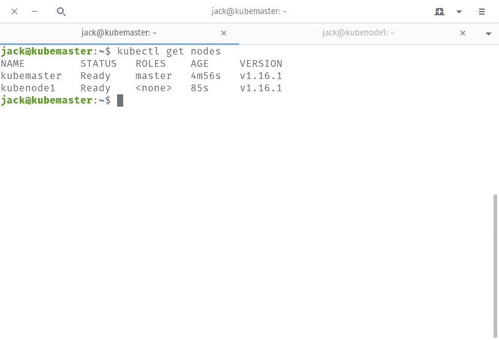

# 如何使用 Ubuntu Server 18.04 部署 Kubernetes 集群

> 原文：<https://thenewstack.io/how-to-deploy-a-kubernetes-cluster-with-ubuntu-server-18-04/>

如今，要避开库伯内特的迷人歌声几乎是不可能的。有充分的理由。一旦一切正常运行，这个容器编排工具就能让您以前所未有的敏捷性扩展您的运营。

为了实际使用 Kubernetes 来部署和管理您的容器，您首先必须释放一个 Kubernetes 服务器集群。一旦完成，您将能够部署、扩展和管理您的容器化应用程序。

在 Ubuntu Server 18.04 的帮助下，我将带你完成这个过程。你需要做的就是至少 2 个 Ubuntu Server 18.04 实例和一个拥有 sudo 权限的用户帐户。你需要确保所有的机器都被更新(使用命令 **sudo apt-get update** 和 **sudo apt-get upgrade -y** )。

一些时间:大约 30 分钟左右。

我将在两台服务器上演示:一台主服务器和一台节点服务器。

我们开始工作吧。

## 安装 Docker

必须在主节点和节点上完成以下操作。

首先要做的是 Docker 的安装。为此，登录到服务器并发出命令:

```
sudo apt-get install docker.io

```

一旦安装了 docker，您需要将您的用户添加到 docker 组中(否则您必须使用 **sudo** 运行所有 Docker 命令，这可能会导致安全问题)。要将您的用户添加到 docker 组，发出命令:

```
sudo usermod  -aG docker  $USER

```

注销并重新登录，以便更改生效。

使用命令启动并启用 docker 守护进程:

```
sudo systemctl start docker
sudo systemctl enable docker

```

## 安装 Kubernetes

现在我们需要在两台机器上都安装 Kubernetes。为此，首先使用命令添加 Kubernetes GPG 密钥:

```
curl  -s  https://packages.cloud.google.com/apt/doc/apt-key.gpg | sudo apt-key add

```

如果您发现 curl 没有安装(它应该已经安装了)，使用命令:
安装它

```
sudo apt-get install curl  -y

```

接下来，使用命令添加必要的存储库:

```
sudo apt-add-repository  "deb http://apt.kubernetes.io/ kubernetes-xenial main"

```

使用命令安装必要的软件:

```
sudo apt-get install kubeadm kubelet kubectl  -y

```

上面的命令将挑选出所有必要的依赖项，并无故障地完成它们。

## 主机名

为了使事情变得简单，您需要为每台服务器分配特定的主机名。要更改主机名，发出命令:

```
sudo hostnamectl set-hostname HOSTNAME

```

其中 HOSTNAME 是主机的主机名。

您可以选择使用主机名，例如:

*   kubemaster
*   节点 1
*   节点 2
*   节点 3
*   等等。

注销并重新登录。最后，将主机名映射到 IP 地址。为此，使用命令
打开 hosts 文件进行编辑

在该文件的底部添加类似的内容(确保使用您给机器指定的主机名以及它们相关的 IP 地址):

192 . 168 . 1 . 218 kube master
192 . 168 . 1 . 219 kube node 1
192 . 168 . 1 . 220 kube node 2

保存并关闭文件。

## 禁用交换

为了运行 Kubernetes，您必须首先禁用 swap。为此，发出命令:

要使其永久化(否则，swap 将在重启时重新启用)，发出命令:

在 fstab 文件中，注释掉交换条目，如图**图 1** 所示:



**图 1:** 从 fstab 中禁用 swap。

## 初始化主机

下一步是初始化您的主机。为此，发出命令:

```
sudo kubeadm init  --pod-network-cidr=192.168.1.90/16

```

确保在上述命令中切换出您的主机的 IP 地址。

当初始化完成时，您将得到用于将节点加入主节点的精确命令(**图 2** )。确保复制该命令。



**图 2:** 命令将节点加入主节点。

仅在主服务器上，使用命令为集群创建一个目录:

使用命令将配置文件复制到这个目录:

```
sudo cp  -i  /etc/kubernetes/admin.conf  $HOME/.kube/config

```

使用命令:
赋予配置文件适当的权限

```
sudo chown  $(id  -u):$(id  -g)  $HOME/.kube/config

```

## 部署 Pod 网络

在将节点加入主节点之前，必须首先部署一个 pod 网络(否则一切都无法正常工作)。法兰绒就是这样一个豆荚网络。使用以下命令部署它(仅在主服务器上运行):

```
kubectl apply  -f  https://raw.githubusercontent.com/coreos/flannel/master/Documentation/kube-flannel.yml

```

## 将节点加入主节点

现在，您已经准备好将您的节点加入主节点。转到每个节点，发出初始化主节点后显示的 join 命令。该命令将类似于:

```
sudo kubeadm join  192.168.1.190:6443  --token bzbwl4.ll5o9x3jjhqqwofa  --discovery-token-ca-cert-hash sha256:ecb0223a05be3502c2d102f3e56104b10fcd105430eb723d3b3e816618323d73

```

在每个节点上运行相同的 join 命令。一旦加入成功，回到你的主人那里发出命令:

您应该会看到列出了所有加入的节点(**图 3** )。



**图 3:** 我们的节点已经加入并准备好了。

此时，您的 Kubernetes 集群已经准备好部署您的第一个容器化应用程序或服务。不要忘记，如果您想将更多的节点加入到主节点中(以增加您的伸缩能力)，您将需要那个 join 命令。如果您忘记了保存该命令，您总是可以使用命令:
来检索它

```
kubeadm token create  --print-join-command

```

上面会打印出 join 命令，所以你可以把它复制粘贴到你的新节点中。

<svg xmlns:xlink="http://www.w3.org/1999/xlink" viewBox="0 0 68 31" version="1.1"><title>Group</title> <desc>Created with Sketch.</desc></svg>