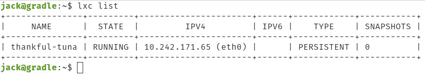
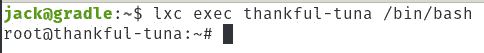

# 如何使用 LXD 部署容器

> 原文：<https://thenewstack.io/how-to-deploy-containers-with-lxd/>

您选择的容器部署技术是什么？

*   Kubernetes？
*   码头工人？
*   多次通过？
*   rkt？
*   containerd？

以上每一种都有其利弊。有些非常困难，但提供了巨大的灵活性和控制力。其他的非常简单，但是缺少一些更重要的扩展管理工具。有些更适合作为开发环境，而有些则最适合用于应用程序部署。

简单地说，有很多路可以走。让我们再加入一个。另一个是 LXD(读作 Lex-D)，它是一个基于图像的容器部署工具，类似于 Multipass。然而，与多通道不同，LXD 在初始化阶段提供了更多的配置选项。LXD 是围绕一个强大而简单的 REST API 设计的。

LXD 和其他容器编排工具的最大区别之一是 LXD 容器只能在 Linux 上运行。仅此一点就可能让一些管理员卷铺盖走人(因为容器最大的吸引力之一就是可移植性)。然而，对于那些寻找发展环境的人来说，LXD 可以很好地为你服务。

作为一个由 [Canonical](https://canonical.com/) 管理的开源项目，LXD 实际上从 2015 年就已经存在了(当时发布了 0.1 版本)，所以它对容器世界并不陌生。该功能集包括:

*   使用非特权容器和资源限制来提高安全性。
*   可扩展至数千个计算节点。
*   简单明了的 CLI。
*   从中提取大量的 Linux 图像。
*   跨主机容器和图像传输。
*   高级资源控制。
*   USB、GPU、UNIX 字符和块设备、网卡、磁盘和路径的设备直通。
*   网桥创建和配置以及跨主机隧道的网络管理。
*   存储管理支持。
*   通过 liblxc 及其 Go 绑定使用 LXC 来创建和管理容器。

如果你的兴趣被激起，让我们安装并使用 LXD。

## 要求

和 LXD 一起工作，你只需要这两样东西:

*   一个受支持的 Linux 发行版(我将在 Ubuntu Server 18.04 上演示)。
*   拥有 sudo 权限的用户。

这就是你和 LXD 一起工作所需要的。

## 安装 LXD

我们必须做的第一件事是安装 LXD。安装 LXD 有两种方式:apt 和 snap。用 apt 安装会得到 3.x 版本，而用 snap 安装会得到 4.x 版本

要安装 apt，请发出以下命令:

`sudo apt-get install lxd -y`

要使用 snap 安装，请发出以下命令:

`sudo snap install lxd`

安装完成后，您必须将您的用户添加到 LXD 组，如下所示:

`sudo usermod -aG lxd $USER`

要避免注销并重新登录，请发出以下命令以确保组更改生效:

`newgrp lxd`

要验证安装，请发出以下命令:

`sudo lxd --version`

您会看到命令报告返回:

*3.0.0* (如果通过 apt 安装)
*4.0.1* (如果通过 snap 安装)

就这样，LXD 安装完毕，准备就绪。

## 正在初始化 LXD

在部署第一个容器之前，必须初始化 LXD。这将建立 LXD 环境。要初始化 LXD，请发出以下命令:

`sudo lxd init`

在此过程中，您会被问及一些问题:

*   您想使用 LXD 聚类吗？(是/否)[默认=否]
*   是否要配置新的存储池？(是/否)[默认=是]
*   新存储池的名称。[默认=默认]
*   要使用的存储后端的名称。(btrfs，dir，lvm) [default=btrfs]注意:如果使用 snap 安装，您还将获得 zfs 选项—这是默认选项。
*   创建新的 ZFS 池？(是/否)[默认=是]
*   您想使用现有的块设备吗？(是/否)[默认=否]
*   新环路设备的大小(GB )?(最少 1GB 默认=19GB]
*   您想连接到 MAAS 服务器吗？(是/否)[默认=否]
*   您想创建一个新的本地网桥吗？(是/否)[默认=是]
*   新桥应该叫什么？[默认值=lxdbr0]
*   应该使用什么 IPv4 地址？(CIDR 子网表示法，“自动”或“无”)[默认=自动]
*   应该使用什么 IPv6 地址？(CIDR 子网表示法，“自动”或“无”)[默认=自动]
*   您想让 LXD 在网络上可用吗？(是/否)[默认=否]
*   约束 LXD 的地址。[默认值=全部]
*   将 LXD 绑定到的港口。[默认值=8443]
*   新客户端的信任密码。(键入并验证密码)
*   您希望过时的缓存图像自动更新吗？(是/否)[默认=是]
*   你想打印 YAML 的“lxd init”吗？(是/否)[默认=否]

如何回答上述问题将取决于您的硬件、您对 LXD 的目标、您的网络环境以及您希望您的容器有多安全。请务必认真回答这些问题。

初始化只需几秒钟，然后您就可以开始部署了。

## 使用 LXD 部署容器

假设您想要使用最新版本的 Ubuntu (20.04)部署一个容器。为此，发出以下命令:

`lxc launch ubuntu:20.04`

根据您的网络连接，提取图像和启动容器可能需要一些时间。完成后，确保使用以下命令启动容器:

`lxc list`

您应该看到您的新容器信息被列出来了(**图 1** )。

**图 1:** 我们的 Ubuntu 20.04 容器已经上线。

LXD 会给你的容器取一个随机的名字(如你所见，我们新推出的 Ubuntu 20.04 容器被命名为 thankful-tuna)。然后，您可以通过发出以下命令来访问容器的外壳:

`lxc exec CONTAINERNAME /bin/bash`

其中 CONTAINERNAME 是分配给容器的随机名称。

然后，您会发现自己在新部署的容器中处于 root 用户的 bash 提示符下(**图 2** )。

**图 2:** 我们现在已经准备好开始开发新发布的 Ubuntu 20.04 容器了。

一旦您完成了容器，使用以下命令离开 shell 提示符:

`exit`

然后，您可以使用以下命令停止并删除该容器:

`lxc stop CONTAINERNAME`

`lxc delete CONTAINERNAME`

其中 CONTAINERNAME 是分配给容器的随机名称。

这是使用 LXD 部署容器的基础。如果您一直在寻找开发容器技术的另一种方法，可以考虑将 LXD 添加到您的工具包中。LXD 还有很多值得学习的地方，所以请通过[官方文档](https://lxd.readthedocs.io/en/latest/)了解更多细节和更高级的任务。

Linux 基金会是新堆栈的赞助商。

<svg xmlns:xlink="http://www.w3.org/1999/xlink" viewBox="0 0 68 31" version="1.1"><title>Group</title> <desc>Created with Sketch.</desc></svg>