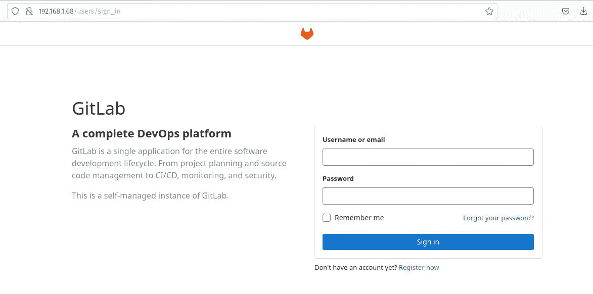

# 如何使用 Docker 和 Ubuntu Server 22.04 部署 GitLab 服务器

> 原文：<https://thenewstack.io/how-to-deploy-gitlab-server-using-docker-and-ubuntu-server-22-04/>

你有没有想过托管自己的 [GitLab](https://about.gitlab.com/?utm_content=inline-mention) 仓库，以确保你的代码永远不会落入[坏人之手](https://thenewstack.io/github-copilot-and-open-source-a-love-story-that-wont-end-well/)？尽管在第三方云主机上托管您的存储库有很多优势(比如可用性和可靠性)，但有一点值得一提，那就是完全控制您的存储库，这样没有人可以在没有您的同意下访问它。

在 Ubuntu Server 22.04 和 Docker 的帮助下，你可以做到这一点。我会告诉你怎么做。这并不太复杂，但是需要几个步骤。所以，事不宜迟，让我们开始工作吧。

为了完成这个任务，你需要一个 Ubuntu Server 22.04 的运行实例和一个拥有 *sudo* 权限的用户。Ubuntu 的实例可以托管在你的局域网上，甚至可以托管在你的云托管账户上(尽管通过第三方托管它违背了自托管库的目的)。不管怎样，你已经准备好创造奇迹了。

## 安装依赖项

我们要做的第一件事是安装所需的依赖项。登录到您的 Ubuntu 实例，使用以下命令安装所需的软件:

`sudo apt install ca-certificates curl openssh-server apt-transport-https gnupg lsb-release -y`

接下来，我们需要安装 Docker 的社区版。为此，我们将添加官方的 Docker GPG 键:

`curl -fsSL https://download.docker.com/linux/ubuntu/gpg | sudo gpg --dearmor -o /usr/share/keyrings/docker-archive-keyring.gpg`

接下来，添加 Docker 存储库:

`echo "deb [arch=amd64 signed-by=/usr/share/keyrings/docker-archive-keyring.gpg] https://download.docker.com/linux/ubuntu $(lsb_release -cs) stable" | sudo tee /etc/apt/sources.list.d/docker.list > /dev/null`

使用以下命令更新 apt:

`sudo apt-get update`

最后，安装 Docker 社区版:

`sudo apt-get install docker-ce docker-ce-cli containerd.io docker-compose -y`

通过以下方式将您的用户添加到 docker 组:

`sudo usermod -aG docker $USER`

注销并重新登录，以使更改生效。

到目前为止，一切顺利。我们继续吧。

## 更改默认 SSH 端口

因为 GitLab 使用默认的 SSH 端口，所以您必须更改默认的 SSH 服务器端口。否则，会有冲突。使用以下命令打开 SSH 配置文件:

`sudo nano /etc/ssh/sshd_config`

在该文件中，查找行:

将该行改为:

启用端口 22 通过防火墙:

`sudo ufw allow 2022`

确保使用以下命令测试另一个登录的 SSH 连接:

`ssh USER@SERVER -p 2022`

其中 USER 是您的远程用户名，SERVER 是托管服务器的 IP 地址或域。

## 创建新的 Docker 卷

我们现在准备好继续进行码头方面的工作了。我们要做的第一件事是创建一个新卷。首先，创建一个目录来存放这些文件:

`sudo mkdir -p /srv/gitlab`

接下来，创建一个目录，其中包含我们的 Docker 合成文件:

`mkdir ~/docker-gitlab`

使用以下命令切换到该目录:

`cd ~/docker-gitlab`

创建一个包含环境变量的文件:

`nano .env`

将以下内容粘贴到新文件中:

`GITLAB_HOME=/srv/gitlab`

保存并关闭文件。

## 创建 Docker 合成文件

使用以下内容创建新的合成文件:

nano docker-compose.yml

在该文件中，粘贴以下内容(确保更改**粗体**中的任何内容以适应您的环境/需求):

```
version:  '3.6'
services:
web:
image:  'gitlab/gitlab-ee:latest'
container_name:  'gitlab-server'
restart:  always
hostname:  '<b>gitlab.example.com</b>'
environment:
GITLAB_OMNIBUS_CONFIG:  |
external_url  'https://<b>DOMAIN_OR_IP</b>'
gitlab_rails['smtp_enable']  =  true
gitlab_rails['smtp_address']  =  "<b>SMTP_SERVER</b>"
gitlab_rails['smtp_user_name']  =  "<b>SMTP_SERVER_USERNAME</b>"
gitlab_rails['smtp_password']  =  "<b>SMTP_SERVER_PASSWORD</b>"
gitlab_rails['smtp_domain']  =  "<b>DOMAIN</b>"
gitlab_rails['smtp_enable_starttls_auto']  =  true
gitlab_rails['smtp_port']  =  587
gitlab_rails['smtp_authentication']  =  "login"
gitlab_rails['gitlab_email_from']  =  '<b>FROM_EMAIL</b>'
gitlab_rails['gitlab_email_reply_to']  =  '<b>REPLY_EMAIL</b>'
# Add any other gitlab.rb configuration here, each on its own line
ports:
-  '80:80'
-  '443:443'
-  '22:22'
-  '587:587'
volumes:
-  '$GITLAB_HOME/config:/etc/gitlab'
-  '$GITLAB_HOME/logs:/var/log/gitlab'
-  '$GITLAB_HOME/data:/var/opt/gitlab'
shm_size:  '256m'

```

保存并关闭文件。

## 部署容器

我们现在准备好部署容器了。为此，发出以下命令:

`docker-compose up -d`

容器的部署需要一些时间(大约 10-30 分钟，取决于您的网络连接速度)，所以要么坐下来看输出，要么做一些其他的工作。部署完成后，您需要使用以下命令访问自动生成的 root 密码:

`sudo cat /srv/gitlab/config/initial_root_password`

您应该看到一长串随机字符，将作为您的 root 密码登录。

## 访问 GitLab

打开 web 浏览器，将其指向 http://SERVER(其中 SERVER 是您的服务器的 IP 地址或域)。你将看到 GitLab 登录屏幕(见图 1)，在这里你将键入用户名 root 并粘贴你在 *intial_root_password* 文件中找到的密码，如上所示。如果站点不能立即启动，给它一些时间让容器完成部署。不断刷新您的 web 浏览器，直到登录屏幕出现。



**图 1:**git lab 登录画面表示成功！

## 另一种部署方法

如果您发现上面的部署有问题，这里有另一种方法。

使用
设置卷位置

```
export GITLAB_HOME=/srv/gitlab

```

用这个部署容器(确保更改粗体字以适应您的需要):

```
docker run  --detach  \
  --hostname  <b>HOSTNAME</b>  \
  --publish  443:443  --publish  80:80  --publish  22:22  \
  --name gitlab  \
  --restart always  \
  --volume  $GITLAB_HOME/config:/etc/gitlab  \
  --volume  $GITLAB_HOME/logs:/var/log/gitlab  \
  --volume  $GITLAB_HOME/data:/var/opt/gitlab  \
  --shm-size  256m  \
  gitlab/gitlab-ee:latest

```

上述方法之一应该可以部署 GitLab。如果仍然有问题，您可以将面向外的 SSH 端口更改为类似 10022 的端口，这样该选项看起来就像 *—publish 10022:22。*

最后，如果部署 GitLab 仍有问题，这里有另一个选项:

`docker run -d -p 22:22 -p 80:80 -p 443:443 \`

``  --name gitlab --hostname gitlab.example.com \``

 ``  --restart unless-stopped --shm-size 256m \`

`  -v gitlab_config:/etc/gitlab -v gitlab_logs:/var/log/gitlab \`

`  -v gitlab_data:/var/opt/gitlab gitlab/gitlab-ce:14.7.0-ce.0`

恭喜你！您现在有了一个可以在您的局域网中使用的 GitLab 存储库。

<svg xmlns:xlink="http://www.w3.org/1999/xlink" viewBox="0 0 68 31" version="1.1"><title>Group</title> <desc>Created with Sketch.</desc></svg>`