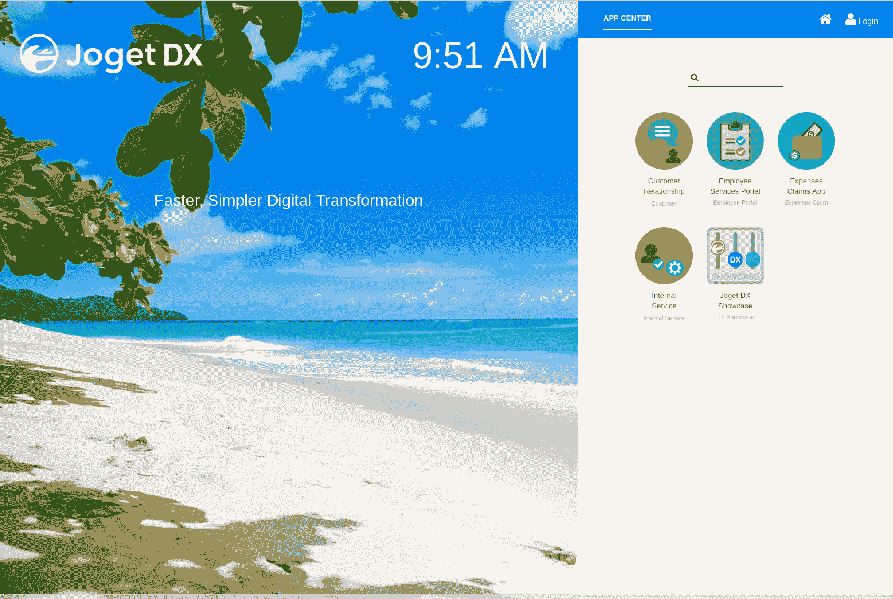
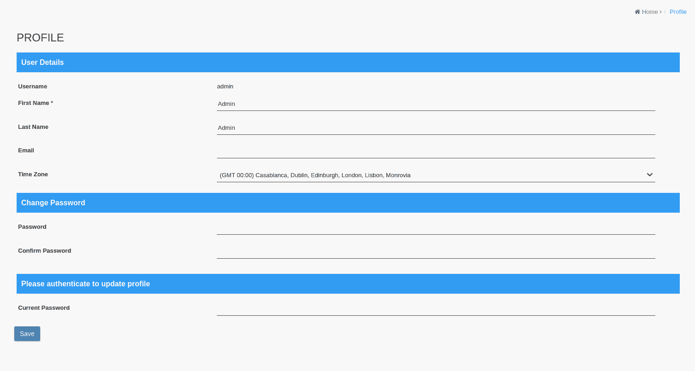
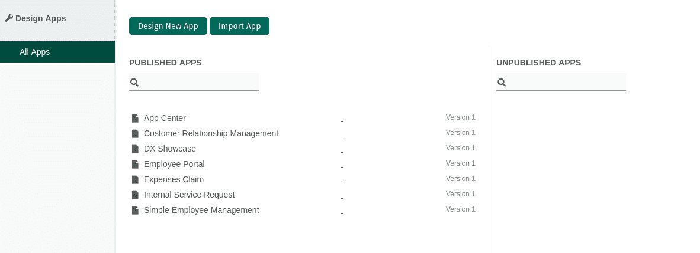
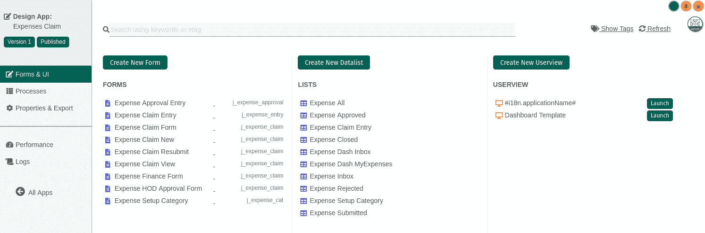
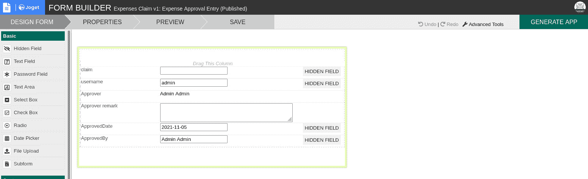

# 如何部署 Joget 无代码开发者平台

> 原文：<https://thenewstack.io/how-to-deploy-the-joget-no-code-developer-platform/>

低代码和无代码是风靡一时的。为什么不呢？这两种解决方案都是创业公司和企业创建应用程序的好方法，而不必雇用具有丰富软件工程师经验的开发人员。考虑到移动应用的指数级增长和对敏捷工作流管理的需求，像 Joget 这样的平台找到了一个全新的受众就不足为奇了。

Joget 是一个开源的无代码/低代码应用程序平台，它使快速应用程序开发(RAD)成为企业的现实，否则企业可能甚至不知道它是可能的。有了 Joget，您就有了一个构建、交付、监控和维护企业级应用程序的单一平台。所有这些都是通过拖放、无代码的解决方案实现的。

这听起来像是一项你必须注册或支付月费才能使用的服务。但这是开源的，所以 Joget 可以部署到您的内部数据中心或第三方云主机。

[Joget](https://www.joget.org/) 的特点包括:

*   拖放构建器、工作流管理和流程自动化
*   内置应用程序中心
*   从市场无缝安装应用程序
*   受材料设计启发的用户界面
*   表单元素，包括网格、电子表格、签名等。
*   仪表板、报告、图表和报告工具集成
*   应用生成器在几分钟内构建应用
*   扩展特性集的插件支持
*   与众多云环境集成
*   应用性能管理
*   张量流支持
*   渐进式 Web 应用合规性
*   DevOps 和 Git 集成

在这一点上，您必须接受 Joget 无代码解决方案，所以让我们继续进行部署。

## 如何部署 Joget

我们将全面采用 cloud native，并通过 Docker 部署 Joget。在此之前，我们必须首先安装 Docker。我将在 Ubuntu Server 21.04 上演示，但您可以在任何支持 Docker 的操作系统上部署该平台。

要在 Ubuntu Server 上安装 Docker，请登录系统并发出以下命令:

`sudo apt-get install docker.io -y`

安装完成后，使用以下命令启动并启用 docker 服务:

`sudo sytemctl start docker` `sudo systemctl enable docker`

接下来，您必须使用以下命令将您的用户添加到 docker 组:

`sudo usermod -aG docker $USER`

注销并重新登录，以使更改生效。

安装 Docker 后，您现在可以部署 Joget 了。有两种方法可以做到这一点，要么使用嵌入式 MySQL 数据库，要么使用链接的 MySQL 数据库。使用嵌入式选项进行测试，一旦被接受，就可以部署链接版本以获得更大的可扩展性。但是，请记住，如果您尝试嵌入式版本并决定迁移到链接部署，则必须在部署链接实例之前停止并删除嵌入式实例。

要部署嵌入式数据库，发出以下命令:

`docker run -d -p 8080:8080 -v /var/lib/mysql --name joget jogetworkflow/joget-enterprise`

要使用链接数据库进行部署，必须首先使用以下命令创建 Joget 数据卷:

`docker volume create jogetdata`

接下来，部署 MySQL 数据库容器，确保将 **pword** 改为安全的惟一密码。

`docker run -d --name jogetdb -p 3306:3306 -e MYSQL_ROOT_PASSWORD=jwdb -e MYSQL_USER=joget -e MYSQL_PASSWORD=**pword** -e MYSQL_DATABASE=jwdb mysql:5.7`

一旦数据库容器启动并运行，使用以下命令部署 Joget(并将其连接到 MysQL 容器):

`docker run -d --link jogetdb:jwdb --name joget -p 8080:8080 -e MYSQL_HOST=jwdb -e MYSQL_DATABASE=jwdb -e MYSQL_PORT=3306 -e MYSQL_USER=joget -e MYSQL_PASSWORD=**pword** --mount source=jogetdata,target=/opt/joget/wflow jogetworkflow/joget-enterprise`

同样，确保将 **pword** 改为一个安全、唯一的密码。

## 构建您的应用程序

给容器一点时间旋转。打开 web 浏览器，将其指向 http://SERVER:8080/jw(其中 SERVER 是托管服务器的 IP 地址)。然后您应该看到 Joget 主窗口，您可以在这里登录(**图 1** )。

图 1: Joget 已经部署完毕，您可以登录并开始构建了。

默认登录凭据是 admin/admin。登录后，您应该立即更改密码，方法是单击右上角的 Admin profile 下拉菜单并选择 profile。从出现的窗口(**图 2** ，您可以更改您的管理员密码，以及您的时区。

图 2:更改 Joget 管理员密码和时区。

更改密码和时区后，返回主窗口，然后进入主页，点击右下角的铅笔图标，显示应用程序按钮。点击该按钮，显示一些演示应用(**图 3** )，您可以查看这些应用，帮助您开始使用该平台。

图 3:Joget 演示应用程序可以帮助您快速使用 Joget 构建自己的程序。

选择要查看的应用程序，将会列出各种组件(**图 4** )。

图 4:费用报销应用程序演示是一个很好的起点。

点击任何一个包含的对象，查看它是如何构建的(**图 5** )。

图 5:这里显示了费用审批条目。

对象中的每一项都是从左侧边栏中拖出的。因此，在费用审批条目中，您将看到五个文本字段和一个文本区域。在这些文本字段中，有四个是隐藏的，一个是静态条目(Admin Admin ),一个是日期条目。

此时，您应该继续探索 Joget，感受一下这个工具。当我们下次访问该平台时，我们将浏览构建一个简单应用程序的过程。享受这个易于部署的低代码解决方案。

<svg xmlns:xlink="http://www.w3.org/1999/xlink" viewBox="0 0 68 31" version="1.1"><title>Group</title> <desc>Created with Sketch.</desc></svg>