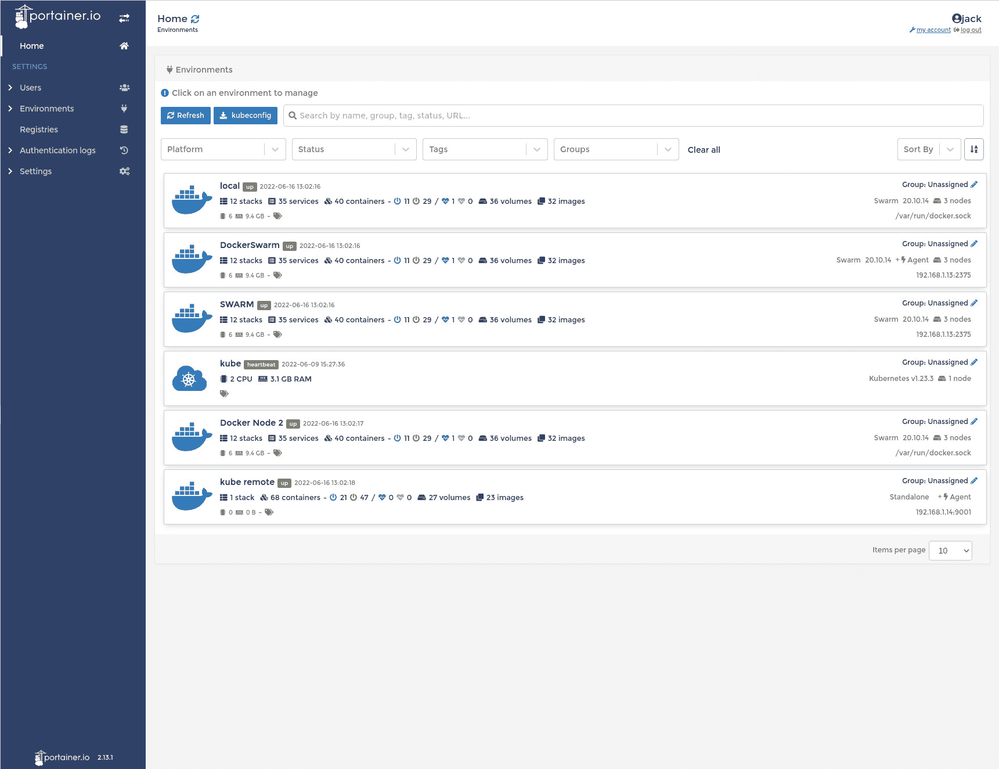

# 如何部署最新的 Portainer 版本

> 原文：<https://thenewstack.io/how-to-deploy-the-latest-portainer-release/>

我已经和 [Portainer](https://www.portainer.io/) 一起工作了一段时间，它已经很快上升到[我最喜欢的容器管理工具](https://thenewstack.io/an-introduction-to-portainer-a-gui-for-docker-management/)的顶端。而且，像所有好的项目一样，Portainer 经常发布平台更新。但是，您不能简单地登录到 Portainer 实例，然后单击 upgrade 按钮。由于 Portainer 本身是作为一个容器部署的，所以要部署最新版本，您必须经历一些困难。

这就是我要向你们展示的。本教程将假设您已经部署了过期的 Portainer 版本。我目前的版本是 2.11.1，目前的发行版是 2.13.1。这个新版本包括一些重要的新特性(以及常见的错误修复)。新功能包括以下内容:

*   Kubernetes 云供应(仅商业版)
*   主页过滤(商业版和社区版)
*   非管理员的注册表浏览(仅商业版)
*   边缘代理等候室(仅商业版)
*   Edge 堆栈的专用注册中心(仅限商业版)
*   来自本地系统的环境变量在 Edge 堆栈中可用(仅限商业版和版本版)
*   强制实施强密码(仅商业版)
*   解决 CVE 的依赖关系更新(商业版和社区版)

我想带您了解一下升级到新版本(社区版)的过程。好消息是你不应该失去你的任何努力。当然，我们将首先备份 Portainer，以防出现问题。

说完这些，我们开始工作吧。

## 备份 Portainer

我们要做的第一件事是备份我们当前的 Portainer 部署。以管理员用户身份登录 Portainer，然后单击左侧导航栏中的设置。向下滚动到页面底部，直到看到下载备份(**图 1** )。

图 1:下载功能出现在 Portainer 的设置窗口中。

我们要将备份文件下载到本地存储，因此单击“下载备份文件”，然后单击“下载备份”。这将把一个. tar.gz 文件保存到您的本地存储。请确保将文件保存在安全的位置，不要丢失或删除它。

## 停止并移走当前的集装箱

现在我们有了备份文件，我们可以停止并删除当前的 Portainer 容器。登录到承载 Portainer 的服务器，使用以下命令找到 Portainer 的容器 ID:

`docker ps -a|grep portainer`

我们所做的是将 *docker ps -a* 命令的输出通过管道传输到 grep，以便只显示那些带有 *portainer* 的条目。您应该在输出中看到 *portainer* 部署的容器 ID。用以下方法停止容器:

`docker stop ID`

其中 ID 是 Portainer 容器的 ID。

接下来，用以下方法移除容器:

`docker rm ID`

其中 ID 是 Portainer 容器的 ID。

## 如何部署最新版本的 Portainer

现在容器已经被移除，我们可以部署最新的版本了。当我最初演示部署 Portainer(参见[部署 Portainer 以简化容器管理](https://thenewstack.io/deploy-portainer-for-easier-container-management/))时，我向您展示了如何使用名为 *portainer_data* 的卷来实现持久存储。我们将利用同一个卷并部署 Portainer，以便它可以利用数据。

首先，我们需要使用命令下拉最新的图像:

`docker pull portainer/portainer-ce:latest`

如果您没有下载最新版本的 Portainer，那么当您部署容器时，它将使用当前的(过时的)映像。

一旦图像被拉下，部署 Portainer:

`docker run -d -p 8000:8000 -p 9443:9443 --name=portainer --restart=always -v /var/run/docker.sock:/var/run/docker.sock -v portainer_data:/data portainer/portainer-ce`

给容器一些时间来部署，然后将 web 浏览器指向 http://SERVER:9443(其中 SERVER 是托管服务器的 IP 地址或域)。应该会提示您进行 Portainer 登录。因为我们将部署连接到了我们的持久存储卷，所以之前的登录应该可以工作。一旦你成功地通过了认证，你将会发现自己回到了 Portainer 的家中，你之前的所有工作都完好无损，新的版本号也清晰地标示出来(**图 2** )。

图 2:我们已经升级到 Portainer 的最新版本。

## 如何恢复备份

如果您发现某处出错，而您的工作不在那里，您可以随时恢复备份。这只能在全新部署期间进行，并且在安装期间完成。部署 Portainer 容器后，将浏览器指向上面列出的相同地址，然后在出现提示时展开从备份中恢复 Portainer 条目(**图 3** )。

图 3:在我们刚刚从之前的安装中下载的备份的帮助下部署 Portainer。

单击“选择文件”并导航到您之前下载的. tar.gz 文件。选择文件后，单击 Restore Portainer，等待奇迹发生。一旦备份被恢复，您应该能够登录 Portainer 并开始工作。

朋友们，这就是将 Portainer 升级到最新版本的全部内容。不，它远没有想象中那么简单，但是一旦你掌握了窍门，你应该可以毫无问题地解决这个问题。

<svg xmlns:xlink="http://www.w3.org/1999/xlink" viewBox="0 0 68 31" version="1.1"><title>Group</title> <desc>Created with Sketch.</desc></svg>