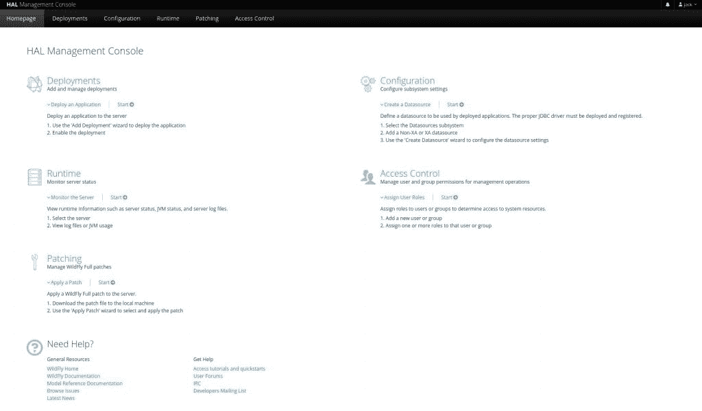

# 如何部署红帽 Wildfly 应用服务器|新堆栈

> 原文：<https://thenewstack.io/how-to-deploy-the-red-hat-wildfly-app-server/>

Wildfly 是一个模块化、轻量级和高度优化的应用服务器，用于构建和部署 Java 应用程序。Wildfly 以前被称为 JBoss，它是跨平台的，提供了一个用户友好的基于 web 的界面，为配置应用服务器和部署应用程序提供了出色的体验。

目前由[红帽](https://www.openshift.com/try?utm_content=inline-mention)维护，[野花](http://www.wildfly.org)开源免费使用。也有针对企业客户的产品，但我们将处理该工具的免费版本。

在 Wildfly 应用服务器中，您会发现以下组件:

*   JBDC 连接池
*   消息传递经纪人
*   资源适配器
*   一个 EJB 集装箱
*   一个轻量级的快速网络服务器，被称为 Undertow
*   批处理作业调度程序
*   微文件与 4.1 版微文件规范的兼容性

Wildfly 功能集包括:

*   支持基于 REST 的数据访问的最新标准
*   ActiveMQ Artemis 作为其 JMS 代理
*   离线 CLI 支持域模式，以便在本地启动主机控制器
*   Undertow JS 项目，帮助您编写服务器端脚本来引入 CDI beans 和 JPA 实体 bean
*   高可用性单一部署
*   默认情况下，池化无状态会话 beans

Wildfly 的安装并不容易。我将带您完成这个过程，所以请密切注意细节。我将在我的首选服务器 Ubuntu Server 20.04 上进行演示。要做到这一点，你需要一个正在运行的 Ubuntu server 实例和一个拥有`sudo`权限的用户。

准备好了吗？让我们实现它。

## 安装依赖项

您只需要安装两个依赖项。首先是 Java 开发工具包，可以使用以下命令安装它:

`sudo apt-get install default-jdk -y`

安装需要一点时间。完成后，使用以下命令安装 unzip:

`sudo apt-get install unzip -y`

这就是依赖关系(也是最简单的部分)。

## 创建一个 Wildfly 用户

让我们创建一个新的 Wildfly 用户。我们将以这样一种方式添加用户，即它实际上不能登录系统(出于安全目的)。我们还将创建它，使它的默认主目录是/opt/wildfly。在添加用户之前，我们需要使用以下命令添加一个新组:

`sudo groupadd -r wildfly`

现在，我们可以添加用户:

`sudo useradd -m -g wildfly -d /opt/wildfly -s /sbin/nologin wildfly`

给新的主目录适当的权限:

`sudo chown -RH wildfly: /opt/wildfly`

## 下载并安装 Wildfly

Wildfly 的最新版本是 26.0.1。请务必访问 [Wildfly](https://www.wildfly.org/) 网站获取最新版本。使用命令下载 26.0.1 版本:

`wget https://github.com/wildfly/wildfly/releases/download/26.0.1.Final/wildfly-26.0.1.Final.zip`

使用以下命令解压缩下载的文件:

`unzip wildfly*.zip`

使用以下命令切换到新创建的目录:

`cd wildfly-20.0.1`

使用以下命令移动该目录中的所有内容:

`sudo mv * /opt/wildfly`

使用以下内容创建新的 Wildfly 配置目录:

`sudo mkdir -p /etc/wildfly`

使用以下命令复制必要的配置文件:

`sudo cp /opt/wildfly/docs/contrib/scripts/systemd/wildfly.conf /etc/wildfly/`

使用以下内容复制启动脚本:

`sudo cp /opt/wildfly/docs/contrib/scripts/systemd/launch.sh /opt/wildfly/bin/`

使脚本可执行:

`sudo sh -c 'chmod +x /opt/wildfly/bin/*.sh'`

复制 Wildfly systemd 文件:

`sudo cp /opt/wildfly/docs/contrib/scripts/systemd/wildfly.service /etc/systemd/system`

最后，启动并启用 Wildfly:

`sudo sytemctl enable --now wildfly`

验证服务是否正在运行:

`sudo systemctl status wildfly`

您应该会在输出中看到*活动(运行)*。

## 配置 Wildfly

既然您已经确定服务运行成功，那么是时候配置服务器了。首先要做的是添加一个管理员用户。发出命令:

`sudo /opt/wildfly/bin/add-user.sh`

出现提示时，为管理用户键入 *a* 。然后会提示您创建用户名和密码。这样一来，我们需要确保 Wildfly 控制台可以在本地主机之外访问。使用以下命令打开配置文件:

`sudo nano /etc/wildfly/wildfly.conf`

将以下内容添加到文件的底部:

```
WILDFLY_CONSOLE_BIND=0.0.0.0

```

保存并关闭文件。

接下来，打开启动脚本进行编辑:

`sudo nano /opt/wildfly/bin/launch.sh`

在以下行的末尾，添加*-b 管理$4* :

```
$WILDFLY_HOME/bin/domain.sh  -c  $2  -b  $3
$WILDFLY_HOME/bin/standalone.sh  -c  $2  -b  $3

```

所以，那些线看起来会像这样:

```
$WILDFLY_HOME/bin/domain.sh  -c  $2  -b  $3  -bmanagement  $4
$WILDFLY_HOME/bin/standalone.sh  -c  $2  -b  $3  -bmanagement  $4

```

保存并关闭文件。

我们现在需要确保使用`systemd`启动管理控制台。打开 Wildfly `systemd`文件进行编辑:

`sudo nano /etc/systemd/system/wildfly.service`

找到以下行:

`ExecStart=/opt/wildfly/bin/launch.sh $WILDFLY_MODE $WILDFLY_CONFIG $WILDFLY_BIND `

将$ WILDFLY _ CONSOLE _ BIND 追加到末尾，这样看起来就像:

`ExecStart=/opt/wildfly/bin/launch.sh $WILDFLY_MODE $WILDFLY_CONFIG $WILDFLY_BIND $WILDFLY_CONSOLE_BIND`

保存并关闭文件。

使用以下命令重新启动 Wildfly 服务:

`sudo systemctl restart wildfly`

## 访问 Web 用户界面

打开网络上的 web 浏览器，并将其指向 http://SERVER:9990(其中 SERVER 是托管服务器的 IP 地址或域)。系统将提示您输入用户名/密码。使用您在安装过程中创建的凭据，然后单击登录。然后您应该会发现自己在 Wildfly 主窗口上(**图 1** )，在这里您可以开始构建 Java 项目。



图 Wildfly 主窗口已经准备好为您工作了。

恭喜，您拥有了一个全新的 Java 应用服务器。下一次，我们将讨论如何使用 Wildfly 部署 Java 应用程序。

<svg xmlns:xlink="http://www.w3.org/1999/xlink" viewBox="0 0 68 31" version="1.1"><title>Group</title> <desc>Created with Sketch.</desc></svg>