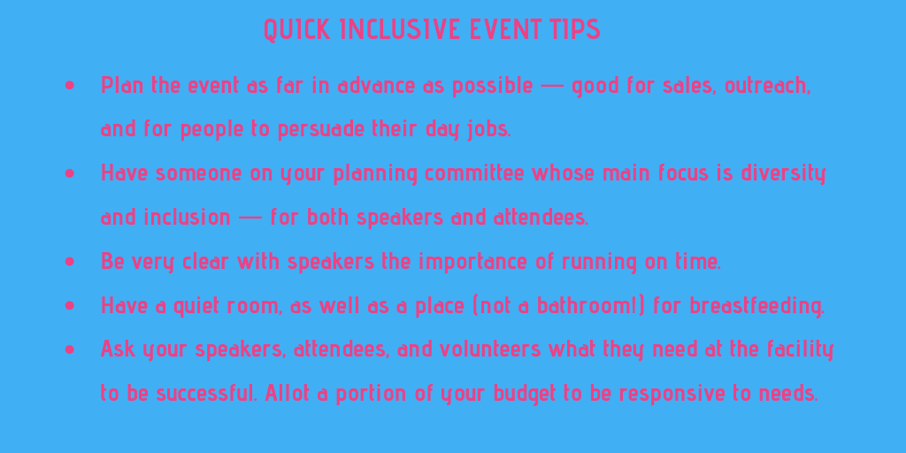

# 如何在科技活动中设计包容性

> 原文：<https://thenewstack.io/how-to-design-inclusion-into-a-tech-event/>

在我参加的每个科技活动上，我都会拍一张女厕所的照片。事实证明我并不孤单。并不是说我是一个爬行动物，只是除了一次以外，我一直都是一个人。现在，当然，我很高兴不用排队，但在科技活动上——以及在整个科技行业——关于可及性、多样性和包容性的信息与现实之间似乎存在巨大差距。当然，舞台上的代表似乎越来越多，尤其是在过去两年，但观众仍然是男性占压倒性优势，白人占主导地位。

## 缺失的一环？

我问了一个庞大的[女性技术人员](http://womenintechto.com/) Slack 社区，为什么她们对参加技术会议犹豫不决。回答各不相同，但无论你是在演讲还是只是出席，成本都很突出。

受访者表示，经理没有叫出女员工来鼓励参加更多的会议，一些女性承认不善于直言不讳和提出要求。如果他们不是演讲者，他们必须证明票价的合理性。每个人都抱怨休假、旅行、住宿和照顾孩子的费用，即使他们能够获得免费机票，这些费用仍然存在。

许多人表示，能够接触到儿童护理是他们不参加科技活动的主要原因——而且这是一笔令人惊讶的小支出，平均约为更普遍的直播字幕费用的一半。

一些人说，如果发言者名单不够多样化，他们会不予考虑，而另一些人说，他们需要一个有保证的安静空间，以应对大型活动可能带来的焦虑。

为了这篇文章，我们认为问题不在于意图。让我们假设科技公司和科技会议真的开始明白，拥抱多样性不仅是正确的，而且通过增加创新和其他好处，它有利于底线。让我们假设他们想变得更加平易近人和多样化——他们只是不知道如何去做。

那么，你如何让你的技术会议变得受欢迎和多样化呢？今天，我们开始用人们正在采取和衡量的积极措施来解决这个问题。

## 舞台上的多样性，但观众中的多样性却没有

至少在伦敦，在几场科技活动的舞台上，人们似乎确实在努力实现性别平等。这似乎不能打动观众。它也没有解决通常非常洗白的舞台和观众。

[Paula Kennedy](https://twitter.com/PaulaLKennedy) 是 DevOpsDays 伦敦委员会的成员，并在许多其他会议上发言，她的主要动机是激励其他人发言，因为[正如书名所示](http://hepg.org/hep-home/books/you-can-t-be-what-you-can-t-see)，你不能成为你看不见的人。

肯尼迪告诉《新堆栈》，“当我去参加会议和聚会时，我看到的都是同样的面孔。我认为自己是女性，但我仍然没有看到多少女性主持人。”

2017 年，她被邀请参加 DevOpsDays，其目标是成为一个非常容易接近的会议。但这到底意味着什么呢？

“演讲者阵容多样化是一回事。肯尼迪说:“我们试图变得多样化，但我们最终更关注性别多样化，而不是其他多样化的衡量标准。”。

至少在技术领域，作为一种日益增长的趋势的一部分，伦敦 DevOpsDays 致力于分发大量门票，接触像编码为的[妇女和编码为](https://www.womenwhocode.com/london)的[黑人女孩这样的团体。当会议组织者有剩余资金时，他们决定在 2018 年发放更多的门票，允许任何人自我认定为代表不足或无报酬。](http://www.blackgirlscode.com/)

2018 年 [DevOpsDays](https://www.devopsdays.org/) 增加了对全性别厕所和颜色编码挂绳的包容性关注，用于代词使用、交流和摄影偏好。虽然这很受欢迎，但肯尼迪承认这可能使注册过程过于复杂，主持会议的志愿者不理解其意图。

组织者这两年还提供保姆服务、手语翻译和隐藏字幕，但也许没有传播得那么好，以至于没有被利用。

尽管所有这些努力和积极的变化反馈，出席的 80%都是男性。

肯尼迪在今年的 Monki Gras 上谈到这个话题时说:“作为组织者，我们真的试图向那些被认为代表不足的人分发门票，这令人失望。”

[https://www.youtube.com/embed/CZr-lxWugNg?list=PLvsKqlNNP3R-Y274Vw7435FOSXLbFMXHQ](https://www.youtube.com/embed/CZr-lxWugNg?list=PLvsKqlNNP3R-Y274Vw7435FOSXLbFMXHQ)

视频

## 平衡活动费用和无障碍需求

预算通常与无障碍的愿望相冲突。一个区分优先顺序的好方法是，当你出售或赠送门票时，问一下是什么让某人很难参加。

去年是安妮·柯里主持 T2 男女混合伦理技术伦理会议的第一年。她刚刚委托了一笔钱来支付任何阻止某人出现的费用。她患有多发性硬化症，支付参加活动的出租车费用使她更有可能参加——[，尽管她很清楚她的病情](https://medium.com/@anne_e_currie/the-main-problem-with-disability-is-its-such-a-conversation-killer-f163ae3e9a8f)可能意味着计划可能会很快改变。最终，她的会议包括了英国手语翻译和隐藏字幕。

在更为成熟的 DevOpsDays，“我们试图考虑所有的事情，并为所有的事情付费，以便有人会使用或不使用它。即使人们今年没有使用它，它也会在明年传播开来，”肯尼迪说。

这意味着他们在位于伦敦市中心的[伊丽莎白二世女王中心](https://qeiicentre.london/accessibility-information/)上花费了大量资金，该中心在整个网站上都有无障碍信息，并允许进行调整，如不分性别的设施和灵活的餐饮选择。

DevOpsDays London 还提供了现场字幕和经认证的儿童保育室，但这两者都没有被充分利用。

Monki Gras 是一个总部位于伦敦的软件工艺会议。今年，随着无障碍的主题，毫无疑问，该地点必须效仿。会议创始人[詹姆斯州长](https://twitter.com/monkchips)真的走了一遍，以确保通往每个潜在会场的公共交通、步行和轮椅路径不是满是鹅卵石和坑坑洼洼，而是电梯和坡道。这就是他们如何从位于肖尔迪奇的时尚的伦敦市中心铁路拱门搬到东伦敦的 [Plexal](https://www.plexal.com/) ，这是一个工作区，是许多关注残疾人的组织的所在地，几乎可以满足任何参与者的需求。

## 租用多元化椅子

即使在志愿者活动委员会中，也应该有人负责确保多样性、包容性和可访问性始终是每个规划步骤的一部分。

Monki Gras 提供多元化和包容性(D&I)赞助，今年由 DigitalOcean 赞助。有了这个，他们不仅能够赞助几十张免费门票，而且他们还能够在活动之前和期间有一个专门的人来运行他们的 D&I 和导师计划。

此外，组织者效仿 Serverlessconf 提供了一个特殊的门票价格，因此与会者也可以贡献出自己的门票。

D&I 项目经理 [Samantha Burke](https://twitter.com/_notwaving) 的部分工作是接触各种社区和聚会，如 [Code Your Future](https://codeyourfuture.io/) 、 [Ada's List](http://adaslist.co/) 、 [Codebar](https://codebar.io/london) 和 [Muslamic Makers](https://muslamicmakers.com/) 以鼓励来自更广泛背景的人加入。

“你必须做外联，包容不会自己发生，”州长说。“在形式上，我们尽量保持开放。我们不是来评判别人的，但我们确实想问为什么要给他们分配一张票。”

但是你如何在不把人符号化的情况下衡量 D&I 的成功呢？

伯克说，她想知道人们是否快乐，他们是否会在第二年回来。

伯克说:“我被活动期间收到的所有微笑和拥抱以及事后 Slack 上的电子邮件和消息淹没了，感谢社区的热情欢迎。”

伯克继续分享说，今年的两位 D&I 导师去年参加了该项目，许多参与者至少参加过一次以前的 Monki Gras，“那些不能回来的人推动了它的发展。去年有几个人甚至买了“支持一个 D&I 出席者”的票

对于 2019 年，伦敦 DevOpsDays 也将一切向前推进，以便有更多的时间进行更多的个人外联活动，并允许每个人更早地制定计划，并提前做好计划，如申请和证明休假。

“去年，我们最大的希望是，我们送出了这么多的门票，这样就能达到平衡。肯尼迪说:“在我们似乎失败的地方，在我们接触到这些拥有特殊观众的特殊聚会团体的地方，这里有 10 张免费票，接受程度并不高。”。

她认为出现在聚会上推介活动并与这些社区互动是很重要的。

[DevOpsDays 对演讲者的呼吁](https://www.devopsdays.org/events/2019-london/propose/)已经开放，他们已经将可访问性作为他们的首要关注点。

## 好了，我们有女人了，我们的多样性工作完成了吗？

虽然男女比例，至少从表面上看，很容易衡量，但这只是包容性的冰山一角。

Mozilla 的开源和社区策略师 Emma Irwin 表示，将包容性融入他们的旗舰活动 MozFest 的第一步是举办多语言会议，因为在开源社区中,[英语可能会非常排斥。](https://thenewstack.io/inclusion-at-scale-in-the-mozilla-and-kubernetes-open-source-communities/)

Mozilla 还在他们的全体会议和全体会议上提供实时字幕，这有一个[的路缘切割效应](https://redmonk.com/videos/alex-chan-the-curb-cut-effect/)，为可访问性设计有很多好处。这不仅有助于听力受损的 OS 社区成员，而且这种按需提供的文字记录可以快速翻译演讲内容。

每个人似乎都在努力说服他们的雇主不仅要休假，还要支付机票费用。另一个伦敦技术会议 [QCon](https://qconferences.com/) 提供了一个有用的[模板信函来帮助这个](https://qconlondon.com/london2018/convince-your-boss.html)。

活动[行为准则](http://confcodeofconduct.com/)起着重要的作用，因为参与者通常甚至不知道这一创造无骚扰环境的参考标准的存在。再者，如果举报了什么，有效吗？人们被要求离开还是情况得到解决？

DevOpsDays 包括一个强制性的复选框，表明您在注册过程中阅读并遵守行为准则。他们还在每个会议日开始时在台上大声朗读代码。到目前为止，他们只有一次重大违规，那就是有人在一个赞助摊位工作。

虽然神经多样性在科技行业得到了很好的体现，但活动并不是为它精心设计的。舞台上令人不安的闪光灯依然闪烁。会议可能会吵得不可开交，而且缺少安静的房间。最重要的是，超过时间表的会议不允许人们计划急需的暂停。

对于那些不得不离开会议去取东西的护理人员来说，这也是一个类似的问题。

设计包容性活动的最后一个注意事项——不要放弃！所以很多会议尝试了一次，宣传得很差，然后第二年就拿走了。如果你提供像儿童看护、字幕或翻译这样的服务，或者为需要的人提供交通补贴，你需要大力宣传。你需要年复一年地这样做，这样人们才会开始使用这些产品。

正如肯尼迪所说，“它并不完美，但我们一直在努力。”

这是一个不错的开始！

专题图片:由知识共享组织 [#WOCinTech 有色人种妇女参与科技聊天](http://wocintechchat.com)提供

<svg xmlns:xlink="http://www.w3.org/1999/xlink" viewBox="0 0 68 31" version="1.1"><title>Group</title> <desc>Created with Sketch.</desc></svg>