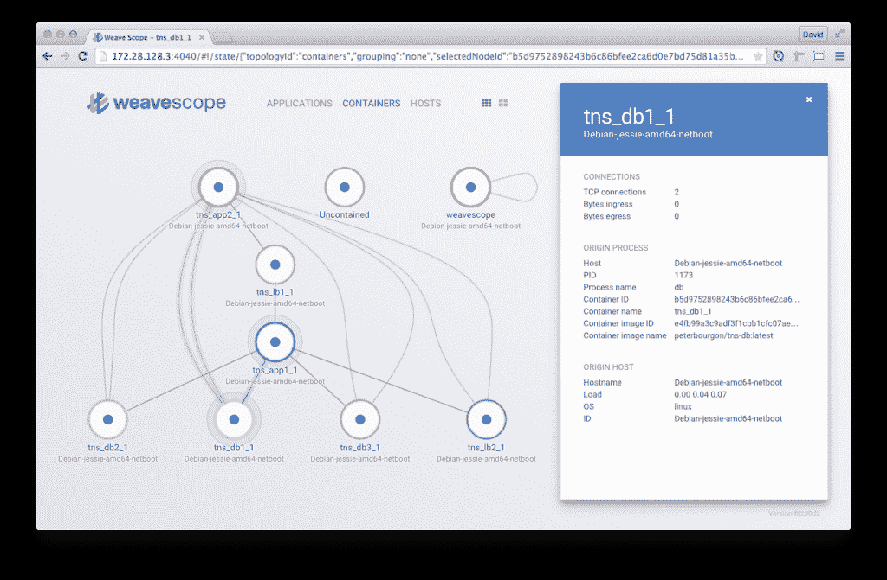

# 如何从 Weaveworks 检测、映射和监控具有 Weave 范围的 Docker 容器

> 原文：<https://thenewstack.io/how-to-detect-map-and-monitor-docker-containers-with-weave-scope-from-weaveworks/>

如果你使用 Docker，你可能已经知道 [Weave 的 Docker 网络](http://weave.works/)。Weave 在您基础设施中的每台 Docker 主机上创建了一个虚拟的软件定义网络(SDN)。每个容器都有自己的 IP，允许您在不改变应用程序行为的情况下设计应用程序拓扑。Weave Run 是一组用于服务发现和地址管理的配套工具，也有助于提供更轻松的开发体验。

[Weave Scope](http://weave.works/scope/index.html) ，Weaveworks 的新产品，延续了该公司制造降低复杂性工具的传统。Scope 自动检测和监控基础架构中的每个主机、容器和进程，并构建它们之间的通信图。Scope 在一个现代化的 web 界面中呈现您的基础架构的最新视图，允许您深入了解、监控和探索您的复杂应用程序拓扑。Scope 不需要对您的代码或配置进行任何更改，也不需要您声明您的基础设施会立即过时。

在本教程中，我们将演示如何在一个典型的三层 web 应用程序堆栈旁边部署 Scope，该堆栈由一个数据服务池、一组自定义应用服务器和一个负载平衡层组成。您将了解 Scope 如何在没有配置的情况下开箱即用，以及它如何立即开始返回有用的情报。

虽然 Weave Scope 与 Docker 和 Weave network 配合得很好，但两者都不是必需的。Scope 可以部署在任何基础架构中，并且在所有云和裸机环境中都能很好地工作。

## 入门指南

我们将从使用 Docker Compose 部署[示例应用程序](https://github.com/peterbourgon/tns)开始。对于演示，我们将在单个主机上工作，但请记住，Weave 在多个主机上工作得同样好，甚至可以跨数据中心和云提供商工作。

首先，让我们安装 Docker 和 Docker Compose:

```
$  wget  -qO-  https://get.docker.com/ | sh
$  sudo curl  -L  https://github.com/docker/compose/releases/download/1.2.0/docker-compose-`uname -s`-`uname -m` -o /usr/local/bin/docker-compose
$  sudo chmod  +x  /usr/local/bin/docker-compose

```

现在，让我们使用 Docker Compose 启动所有组件:

```
$  wget  -O  docker-compose.yml  <a  href="http://git.io/scope-compose">http://git.io/scope-compose</a>
$  docker-compose up  -d

```

看看 Docker ps 的输出，确保一切都在运行:

```
CONTAINER ID   IMAGE             PORTS                  NAMES
fe41c10a63ca   tns_lb1:latest    0.0.0.0:8001-&gt;80/tcp   tns_lb1_1
c94005d87115   tns_lb2:latest    0.0.0.0:8002-&gt;80/tcp   tns_lb2_1
8c15a1325094   tns_app1:latest   8080/tcp               tns_app1_1
645386356a2e   tns_app2:latest   8080/tcp               tns_app2_1
e34ccea042fd   tns_db3:latest    9000/tcp               tns_db3_1
c0d53d1327b4   tns_db2:latest    9000/tcp               tns_db2_1
0a920e17818a   tns_db1:latest    9000/tcp               tns_db1_1

```

通过卷曲其中一个 tns_lb 实例来验证一切正常。默认情况下，它们监听端口 8001 和 8002:

```
$  curl localhost:8001   # on a Mac, try: curl `boot2docker ip`:8001
lb-6d5b2352f76d4a807423ce847b80f060  via http://app1:8080
app-60fbe0a31aee9526385d8e5b44d46afb  via http://db2:9000
db-e68d33ceeddbb77f4e36a447513367e8 OK

```

太好了！仅用几条命令，我们就部署了一个三层应用程序堆栈。现在，我们想了解一下我们的基础设施，所以让我们安装并启动 Weave Scope:

```
$  wget  -O  scope git.io/scope
$  chmod  a+x  ./scope
$  ./scope launch

```

现在，您可以将 web 浏览器指向 **localhost:4040** 。(在 Mac 上，这可能是“boot 2 docker IP”:4040。)

## 查看您的基础设施

既然 Scope 已经启动并运行，是时候看看您的基础设施了。Scope 用户界面加载到您的浏览器中，使您可以立即了解您的网络。

[](https://thenewstack.io/wp-content/uploads/2015/06/weaveworks1.png)

集装箱的简单地图

该图的每个圆圈代表您网络中的一个容器。用一条线连接起来的圆圈是互相连通的容器。使用鼠标探索网络。当您将鼠标悬停在容器或连接范围上时，会突出显示连接的容器，并帮助您更快地理解拓扑。这对于具有大量容器的基础设施尤其有用。

假设我们正在寻找一个数据库(db)容器的更多信息。点击标签为 **tns_db1_1** 的容器，了解更多信息。

[](https://thenewstack.io/wp-content/uploads/2015/06/weaveworks2.png)

数据库容器的详细信息和度量

右边的面板显示了容器的基本信息，如映像和进程名，以及网络指标，如入口/出口字节率和 TCP 连接数。

## 更高级的用例

范围适用于任何规模的拓扑。当你一次在屏幕上看到太多容器时，你可以使用 Scope 的分组特性使事情更容易理解。例如，在**容器**视图中，您可以单击分组按钮将所有运行相同容器映像的容器合并在一起。

[](https://thenewstack.io/wp-content/uploads/2015/06/weaveworks3.png)

分组容器视图

在我们的堆栈中，这意味着所有的 **db** 、 **app** 和 **lb** 实例被合并到单个节点中，即使它们跨主机存在。其结果是基础设施上的逻辑而非物理透镜——这是应用程序开发人员应该直观理解的。并且详细的统计数据也被合并。

这些特性对应用程序开发人员来说很棒，但是那些有更多面向操作背景的人会在**主机**视图中感觉很舒服。在这里，我们看到了基础设施的物理布局，就像您可能在 Ganglia 或 Squid 这样的工具中看到的那样。

[](https://thenewstack.io/wp-content/uploads/2015/06/weaveworks4.png)

主机视图

点击**应用**再次改变地图，显示网络中所有通信的进程。这是范围的最细粒度视图。

[](https://thenewstack.io/wp-content/uploads/2015/06/weaveworks5.png)

应用程序视图

Scope 在一个灵活的数据模型中收集信息，因此几乎可以可视化您的网络的任何可能的转换。

## 让集成更进一步:API

既然您已经看到了在应用网络上获得可见性是多么容易，那么是时候将它集成到您的系统中了。有多种方法可以为您的环境设置编织范围。它是开放的，可以连接其他平台和数据源。开箱即用的用户界面让您可以很好地了解您的应用网络。将其作为解决问题或简单探索拓扑的起点。除此之外，您可以直接查询它的 API 并获得容器连接和度量的提要。该提要可以作为您自己的监控解决方案的输入，并提供拓扑信息。

让我们使用 API 从上面获得关于数据库容器的相同信息(记住，这在运行 Scope 的任何**主机上都有效):**

首先，我们看看哪些拓扑是可用的:

```
GET http://localhost:4040/api/topology
[
 {name:  "Containers",  url:  "/api/topology/containers"},
 ...
]

```

我们需要容器拓扑。要获得所有容器，我们查询:

```
GET http://localhost:4040/api/topology/containers
{
 nodes:  {
      “123...”:  {
 “adjacency”:  [‘456...“],
 ...
      }
}

```

这里我们看到容器拓扑被表示为一个带有邻接表的节点集合。在示例中，我们看到节点“123…”与节点“456…”有一个连接。对所有节点进行迭代允许您导出自己的拓扑。

让我们假设节点“123…”已经是我们正在寻找的数据库容器。要获得关于该容器的更多信息，我们可以查询:

```
GET http://localhost:4040/api/topology/containers/123…

```

尝试一下，看看回复中有什么信息。

## 更高的可见度

现在使用 Weave Scope 来自动生成地图和订阅源，以实现 Docker 应用程序的可见性。当你已经在使用 Weave Net 来设置你的 Docker 集群时，添加它是非常容易的。有一个关于如何开始使用 Weave 的有用的[指南集合。](http://weave.works/guides)

Weave Scope 是开源的，并且一直在开发中。代码可以在 GitHub 上获得，如果你愿意贡献的话，很容易设置。探针和后端是用 Go 编写的。用户界面是 React 单页应用程序。在 Twitter[上关注 weave works](https://twitter.com/weaveworks)以了解最新发布的内容。您可以期待更多的容器指标和特性很快会被添加进来。

<svg xmlns:xlink="http://www.w3.org/1999/xlink" viewBox="0 0 68 31" version="1.1"><title>Group</title> <desc>Created with Sketch.</desc></svg>