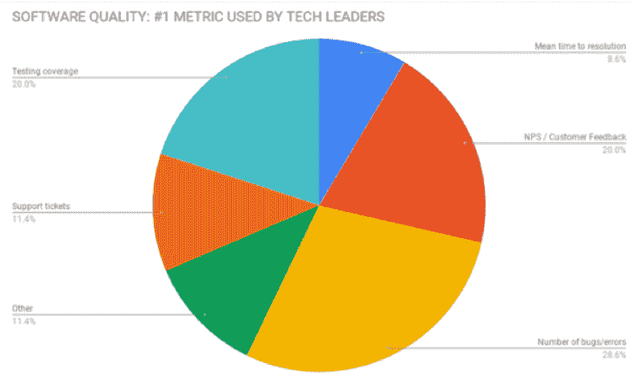

# 如何像科技巨头一样开发和部署软件

> 原文：<https://thenewstack.io/how-to-develop-and-deploy-software-like-a-tech-giant/>

[Raygun](https://raygun.com/) 赞助本帖。

 [弗雷亚·斯帕文

Raygun.com 是一个性能监控套件，能让你为你的客户构建更强大、更快速、更有弹性的网络和移动应用，弗雷亚为其撰稿。](https://www.linkedin.com/in/freyja-spaven-991533125/?originalSubdomain=nz) 

Zoom、Slack 和 Atlassian 正在为“顾客至上”的公司树立新的标准。简单的用户界面和高度专业化意味着他们的发展没有真正的限制，但这并不意味着他们会不断地向他们的套件中添加更多的产品。相反，他们的战略是产品第一，他们专注于使他们的同类最佳软件易于使用和高性能。

我们大多数人都没有这些科技巨头的资源。那么我们怎样才能不辜负软件质量的新标准呢？我们将三位多产的技术领袖聚集在 60 名软件专业人士面前，讨论[软件团队如何在他们的开发工作流程中优先考虑用户体验](https://raygun.com/blog/closing-the-gap-between-code-and-customer/)，以便他们能够交付世界级的软件。

我们的小组成员是:

*   [Josh Robb](https://www.linkedin.com/in/josh-robb-5591339/?originalSubdomain=nz) ，Pushpay 产品和工程高级副总裁。 [Pushpay](https://pushpay.com/about-us/) 是一个目的驱动的捐赠和参与平台，服务于成千上万的客户。
*   Xero 产品执行总经理新美乐股份公司·杜林。基于云计算的会计软件 Xero 拥有 180 万用户，位列《福布斯》“最具创新性的成长型公司”名单。
*   Vend 产品工程总监 Cara Fonseca-Ensor 。 [Vend](https://www.vendhq.com/nz/about-us) retail management 是 iPad 上的第一个销售点软件，服务于 25，000 家商店。

以下是他们对在开发过程中把客户放在第一位的过程的看法，这样他们就可以创建易于使用和高性能的软件。

## 开发时间的优先级

如果你领导一个团队，那么你最常见的挑战之一可能是优先考虑开发时间。您需要在构建新功能、改进现有功能和投资于帮助团队扩展和交付质量的功能之间平衡时间。

罗柏提供了这些见解。“对我来说，这是一个投资组合分配决策，首先要问我愿意在质量上花多少时间。”罗柏说。“有两种方式来看待它，一种是获取实际数据，另一种是从战略角度来考虑，即我们希望在本季度或今年投资什么。”

都灵也呼应了 Xero 对客户的重视，“我认为每个公司都必须开始平衡他们推出多少功能，”都灵说。“在 Xero，我们寻求客户关注和绩效之间的平衡。”

## 加强客户和工程之间的关系

成为客户至上的公司意味着采用策略将开发团队和他们的目标与用户的最终体验联系起来。在 Vend，Fonseca-Ensor 说 Vend 开发工作流程的一个重要部分是花时间与客户交谈并获得他们的反馈，然后收集并显示在 Redash 中。

让代码更贴近客户也可以通过在客户到公司的第一周回答支持问题来加强。一位观众表示，这种策略让他们对自己的工作有了更多的了解，比如他们为什么要开发这个功能。“与客户保持联系对工程师来说真的真的非常关键，”一名观众总结道。

## 软件质量是公司文化的一部分

在整个讨论过程中，很明显软件质量与文化密切相关——文化始于招聘过程。在寻找雇员时，我们的小组成员说，他们在候选人的第一次面试中寻找像关心客户体验这样的品质。

这也不全是招聘的问题。超过 60 名技术领导者的观众的主要收获是，需要有适当的指标和目标来保持整个公司对用户体验负责。为工程团队提供关注软件性能和可靠性的正确指标，对于 Pushpay 的成功至关重要。

okr 是我们小组的首选工具。但是技术领导者如何衡量软件质量呢？我们询问了观众，结果如下图所示:

## 监控软件性能、软件质量和客户体验至关重要

当我们仰望该领域的领导者时，云巨头们已经通过创建专注于提供卓越用户体验的产品第一公司而脱颖而出。虽然软件性能仍然是技术领导者面临的挑战，但产品所有者可以采取一些策略来确保他们的软件保持最佳状态。

[点击此处观看完整的小组讨论](https://raygun.com/blog/closing-the-gap-between-code-and-customer/)。

<svg xmlns:xlink="http://www.w3.org/1999/xlink" viewBox="0 0 68 31" version="1.1"><title>Group</title> <desc>Created with Sketch.</desc></svg>