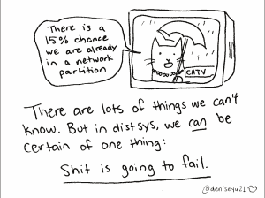
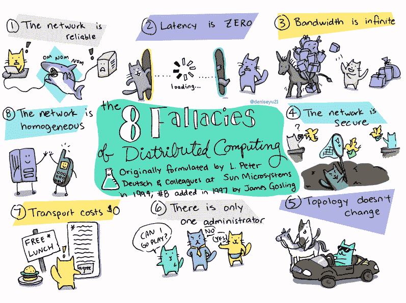
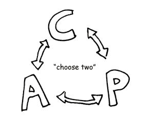
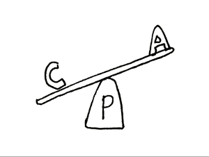
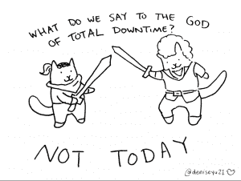
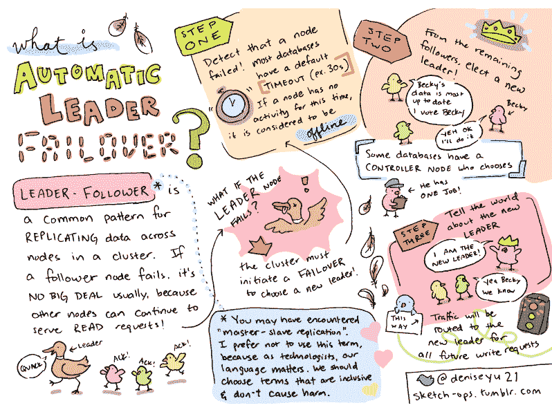

# 如何减少分布式系统不可避免的失败

> 原文：<https://thenewstack.io/how-to-diminish-the-inevitable-failure-of-distributed-systems/>

“在一个遥远的星系中，所有商业应用都与一个数据库对话，通常一个人知道如何在公司自己的硬件上操作它。”

这就是 Pivotal Cloud Foundry 软件工程师丹尼斯·于(Denise Yu)在伦敦(T4)的演讲的开始。

今天的大数据存储和检索需求已经变得更加复杂，这都是因为我们已经获得了大量的数据，并且我们正在使用自然语言处理、模糊搜索、机器学习和人工智能来查询和解释这些数据。

为了满足这些不断发展的需求，Yu 表示，公司首先要做的是纵向扩展，但最终在财务和/或物理上不可能在更多的服务器上开放更多的 CPU。云计算出现了，它允许在许多机器上水平扩展和分布。水平分布工作负载有三个关键驱动因素:

1.  **可伸缩性:**一台机器无法处理请求大小或数据大小，因此数据库碎片化和分片到多台机器上有助于解决这个问题。
2.  **可用性:**如果一台机器停机，其他机器可以继续工作。
3.  **延迟:**当数据在地理上更接近最终用户时，您可以走得更快，获得更好的请求时间。

俞说，这最终导致了无共享架构(SN)——最流行的网络计算形式，俞说所有的公共云都在其上运行——每个节点都是独立和自给自足的，整个系统没有单点争用。因为机器不共享对任何资源的访问，所以可以快速检索数据。

但是这本身也有很多问题。Yu 的演讲讨论了分布式系统背后的哲学以及如何克服它，[所有内容都有她的原创插图](http://deniseyu.io/art)。今天，新堆栈分享她的见解。

### 理解 CAP 定理和网络划分

软件工程师于(音译)是一名哲学专业的学生，她说网络可靠的神话可以归结为一个认知的哲学问题，通常用 [CAP 定理](https://en.wikipedia.org/wiki/CAP_theorem)来解释，她对此提出了部分质疑。

Eric Brewer 博士在 2000 年提出的 CAP 定理(代表一致性、可用性和分区)认为，由于网络可靠性和分布式系统的其他限制，必须在三者之一无法最佳工作的情况下进行权衡，因此其他两个可以。CAP states 分布式系统权衡可以是以下三种之一:

*   一致和分区容忍(CP) —系统牺牲可用性以获得一致的响应和维护网络分区。
*   一致且可用(CA) —系统降低网络分区，使其始终可用，并且响应一致
*   可用和分区容忍(AP) —系统的响应不一致，但始终可用，并且分区在适当的位置。

这通常用一个圆圈或循环来表示，其中三个方面中的两个互相依赖。Yu 介绍了 [Coda Hale 将 CAP 重新定义为一种分析工具](https://codahale.com/you-cant-sacrifice-partition-tolerance/)，其中分区容差是不可避免的，但一致性和可用性可以相互权衡。她提供了自己的跷跷板代表，如下图所示。

她首先用 L 来阐明 C 的[线性化](https://en.wikipedia.org/wiki/Linearizability)，这要求在读取和写入时将最新的数据呈现给所有客户端。

“CAP 中的 C 表示一致性的狭义定义。这意味着所有其他客户也必须看到一致性。这真的真的很难。它需要距离和复制，”于解释说。“数据库工程师试图将复制延迟尽可能降低到零。最终的一致性不能算作上限公式的一部分。”

她说，这样做的一个主要问题是，异步系统无法在 CAP 的世界中工作。CAP 依赖于具有相同状态的每种类型的节点。在我们复杂得多的数据领域中，大多数系统无法处理即时和通用复制，这导致了滞后时间。

在这种情况下，异步“被称为强一致性，它会对您的系统产生更多需求，并有更高的阻塞频率，因为它必须是同步的，”Yu 解释道，引用了 [Jepsen 的一致性模型](http://jepsen.io/consistency)。

在现代系统中，这一切都归结为强大的，而不是绝对的一致性。

“当我们说一个系统在设计时考虑了一致性，我们必须非常清楚我们的意思，”她继续说道。

接下来，她攻击 A 的可用性，因为她说，可用性不能在没有延迟考虑的情况下进行检查，而 CAP 定理没有考虑延迟。

> "除非万不得已，否则不要运行分布式系统."—丹尼斯·于

“我们倾向于将其视为二进制状态，但这不是因为网络延迟。我们怎么知道它是真的没有反应，还是真的只是反应慢？”

于说我们需要设置一个超时限制。

“第一次你不妨掷骰子。你需要监控和观察，以了解对你来说什么是合理的超时，”她继续说道，并指出一些数据库管理系统内置了模糊超时，如[卡珊德拉](http://cassandra.apache.org/)。

Yu 对 P 上的分区容错上限定理提出了质疑，分区容错是指发生在网络分区之间的中断，故障或跨两个数据中心或云的分裂。她说一切都取决于分区，因为对于分布式系统，这是完全不可避免的。

余称这是一种完全不同的“失败类型”,他说“在一次分裂事件中，你的节点可能就在虫洞的另一边。没有办法知道另一边的状态。”

CAP 定理的标准证明考虑了响应网络分区的两种方式:

1.  让客户端在 split 的两面不停的读写，导致失去了线性化。
2.  或者您可以暂停一侧，直到分区停止，但这是可用性的损失。

无论哪种方式，分区都是不可避免的。你只需要决定你的系统能处理多少。

她引用谷歌的杰夫·迪恩的话说:“在谷歌集群生命的第一年，它将经历五次机架故障、三次路由器故障和八次网络维护。”

俞指出，“更清晰的故障状态有助于提高可靠性，”使用 500 多个错误代码来为用户澄清。

因此，现在我们更清楚地了解了分布式系统中的事情是如何失败的，是时候讨论它们为什么会失败以及可以做些什么来限制这种不可避免的失败了。

### 我们对完全停工的上帝说什么？今天不行！

分布式系统为什么会失败？硬件、路由器和网络电缆最终会耗尽，[邪恶的外部力量](https://www.wired.com/2014/08/shark-cable/)最终会摧毁你的连接。

于补充道，“软件会表现得很奇怪。资源隔离永远不会是完美和静态的——你也不希望它完全是静态的。VMs[虚拟机]将会发生我们所说的‘爆发’——CPU 使用率短暂飙升——会让您的进程变慢几秒钟甚至几分钟。”

她继续说，当一个容器停止几秒钟甚至几分钟，这取决于机器或网络故障只是随机发生时，可能会有停止世界垃圾收集。2009 年，显然有人爬进了加州的一个下水道，然后开始切东西——没有任何定理可以帮助解决这个问题！

归结起来就是为失败的可能性做准备。首先，我们通过观察和监控我们的系统来缓解这一问题，并了解以下哪些选项最适合您的系统。

Yu 提供的一种方法是所谓的领导者-追随者故障转移模式，在下面的信息图中有更详细的解释。

她将领导者-追随者模式描述为跨集群中的节点复制数据。

“如果一个跟随者失败了，通常没什么大不了的，因为其他节点可以继续服务于读取请求，”于说。

如果“领导节点”出现故障，则节点群集会自动启动故障转移来选举新的领导节点，具体步骤如下:

1.  检测到节点脱机。默认情况下，大多数数据库管理系统将此超时设置为 30 秒。
2.  从剩余的节点中选出新的领导者，通常具有最一致和最新的数据。于说，一些数据库是一个微小的独裁政权，其中一个控制器节点选择。
3.  对于所有未来的写入请求，流量会自动重新路由到新的主节点。

俞接着指出，有时所有陷入困境的暂停节点可能同时从战争中返回，最终出现多个领导人。

“事情变得非常尴尬，数据通常会丢失，”她说。

这时可以应用[裂脑策略](https://en.wikipedia.org/wiki/Split-brain_(computing))，有目的地划分领导节点。

RabbitMQ 在检测到大约 60 秒内没有通信的 Mnesia 节点时会这样做，然后将其标记为不可读。这些是潜在的[应对机制，在此进一步描述](https://www.rabbitmq.com/partitions.html):

*   自动愈合
*   暂停少数民族
*   暂停-如果-全部-关闭
*   忽视

在[卡夫卡划分策略](https://blog.newrelic.com/engineering/effective-strategies-kafka-topic-partitioning/)中，如果领导者节点退出，则触发最佳节点选举。

Apache Zookeeper 是一种“厚 API”模式，它使用同步副本节点来返回最准确的数据，牺牲了最新的一致性。

最后， [Paxos](https://understandingpaxos.wordpress.com/) 和 [Raft](https://raft.github.io/) 都是共识算法，可以用来选举新的领导人。

无论您选择如何解决它们，网络分区都是分布式系统的死亡和税收版本。

“如果你想运行分布式系统，网络分区是不可避免的。你必须决定什么对你的运营最有意义——你必须选择一个数据存储，它选择你感到舒适的可用性和一致性选项，”Yu 说。

最后，她警告说:“除非万不得已，否则不要运行分布式系统。”

Pivotal 是新堆栈的赞助商。

所有插图由 Denise Yu 的知识共享提供，Yu 的特写照片由提供。

<svg xmlns:xlink="http://www.w3.org/1999/xlink" viewBox="0 0 68 31" version="1.1"><title>Group</title> <desc>Created with Sketch.</desc></svg>