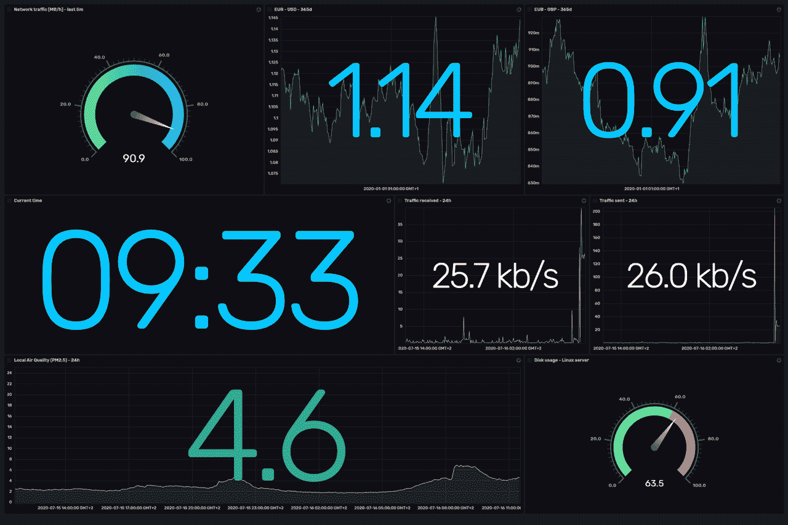
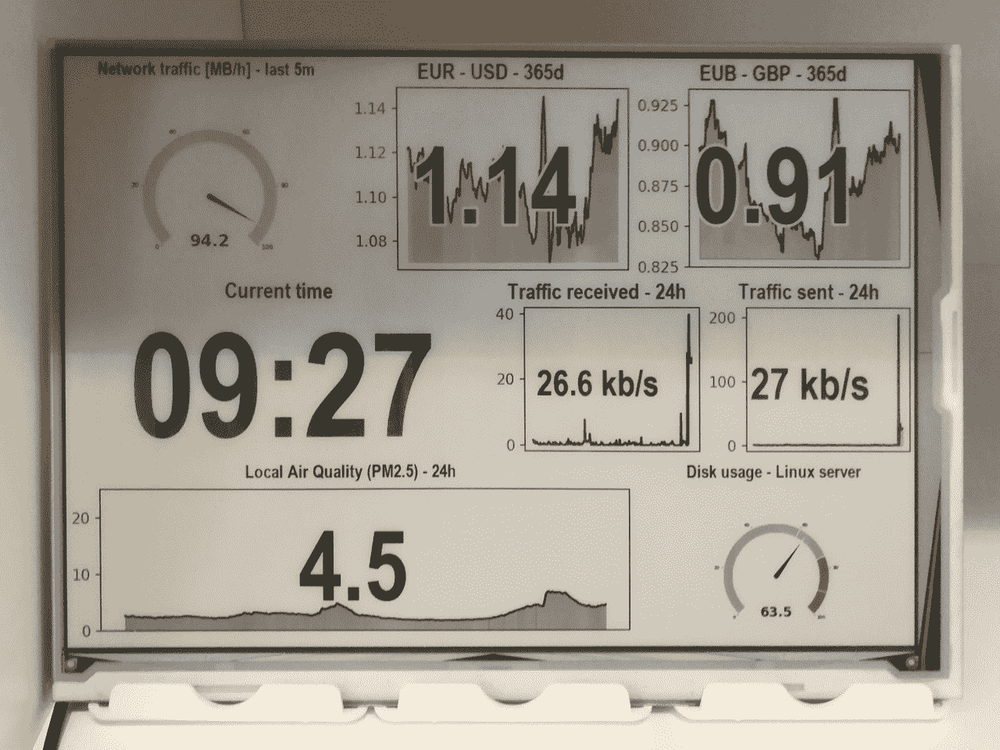
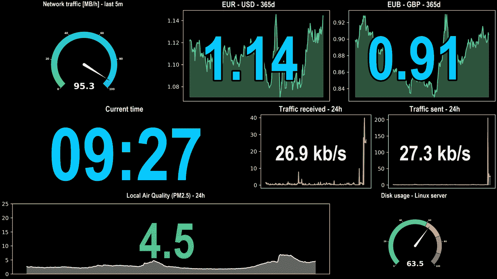

# 如何在 E-Ink 上显示您的 InfluxDB 仪表盘

> 原文：<https://thenewstack.io/how-to-display-your-influxdb-dashboards-on-e-ink/>

[InfluxData](https://www.influxdata.com/) 赞助了这篇文章。

你是否曾经希望看到你的 [InfluxDB](https://www.influxdata.com/products/influxdb-overview/) 仪表盘被渲染成一个单一的图像？或者更好的是——你是否能够在电视或其他显示器上显示它们，这样你就可以不断地看到你所关心的事情的状态？最近，我为此编写了开源代码。下面是故事和一些背景。

最近，我买了一个 [9.7 英寸的 E-Ink 显示器](https://www.waveshare.com/wiki/9.7inch_e-Paper_HAT)来测试它的使用效果。我将它插入我的 Raspberry Pi，并开始测试如何使用 Python 向它发送任何光栅图像。这是它的照片，在我的客厅里展示了 InfluxData 的标志(上图)。

 [沃伊切赫·科奇扬

Wojciech 是 InfluxData 的一名软件工程师，专注于跨多个云和区域的 InfluxDB 云部署的自动化。他拥有大约 10 年的多种公共云经验。作为开发人员、团队领导和架构师，他在软件和开源领域工作了 10 多年。](https://www.linkedin.com/in/wkocjan/) 

E-Ink 显示器有一个巨大的特点:他们非常便宜，保持运行。我的 Raspberry Pi 和显示屏的功耗不到 10W，因此在许多地区全天候运行它的成本不到每月 2€(或 2 美元，取决于你喜欢哪种货币)。这使得它非常适合始终显示最新信息。将 E-Ink 显示器设置在一个可见的地方，并将其用作时钟，可能还会显示诸如家里的空气质量、货币汇率或您的 Linux 机器有多忙等信息。

甚至在我加入 InfluxData 之前，我就一直在用 InfluxDB 存储很多信息。我认为使用 InfluxDB 及其仪表板来定义我的 E Ink 显示应该显示什么会很棒。

InfluxDB 2.0 提供的一个很棒的特性是所有的[仪表板](https://v2.docs.influxdata.com/v2.0/visualize-data/dashboards/)都可以使用[API](https://v2.docs.influxdata.com/v2.0/api/#tag/Dashboards)来访问。这让我想到，展示这样的仪表板会有多难…

[](https://cdn.thenewstack.io/media/2020/07/8048baf8-dashboard-in-browser2.png)

…在我的新 E-Ink 展示上，看起来是这样的:

[](https://cdn.thenewstack.io/media/2020/07/84375bca-dashboard-in-eink2.jpg)

正如我所发现的，这是可行的，不需要很大的努力；而是简单地使用和集成多个组件。

我在这个项目中使用了 Python，因为它是一种通用脚本语言，并且已经有了一个我可以使用的[客户端](https://github.com/influxdata/influxdb-client-python)。

我编写的工具被分成了几个部分，我将在下面详细描述。

## 以编程方式将图像发送到电子墨水显示器

我的 E-Ink 展示是和树莓皮帽子(硬件连接在顶部)捆绑在一起的，它可以放在树莓皮的顶部。这也正是我所做的，这是硬件方面所需要的。

在软件方面，我的 E-Ink 显示器使用 IT8951 控制器，这是非常流行的，有多个客户端可用。我决定用 Python 和 [IT8951](https://github.com/GregDMeyer/IT8951) 开源包。安装只是运行两次 **pip** 命令，如自述文件中所述。

接下来，我编写了简单的代码，从磁盘或 HTTP 响应中读取图像，并将其呈现在显示器上。

这让我可以在 E-Ink 显示器上渲染任何图像，比如上面的徽标或仪表盘。

现在，我可以继续从我的 InfluxDB 仪表板创建图像，这样我就可以将它们发送到 E-Ink 显示器。

## InfluxDB API 客户端

该项目使用了 [Python InfluxDB 2.0 客户端](https://www.influxdata.com/blog/getting-started-with-python-and-influxdb-v2-0/)，它提供了与 InfluxDB 通信的几乎所有功能。

然而，我必须扩展客户端以支持传递变量——这是使用 **v** 变量的 [Flux](https://www.influxdata.com/products/flux/) 查询所需要的，比如 **v.timeRangeStart** 。这些是 InfluxDB 用户界面传递给查询的参数——仪表板、时段和时间范围中的变量。

在撰写本文时，Python InfluxDB 2.0 客户端没有提供直接传递变量的方法。正因为如此，仪表板渲染器使用一个底层 API，并对其进行包装，以允许传递任何变量。代码可以在 [GitHub](https://github.com/wojciechka/influxdb-dashboard-renderer/blob/e983092/influxdb_dashboard/client.py) 上找到，分为两部分。

1.  第一个[处理定义外部变量](https://github.com/wojciechka/influxdb-dashboard-renderer/blob/e983092/influxdb_dashboard/client.py#L10-L86)并将它们序列化为 InfluxDB 2.0 APIs 期望的格式。
2.  第二个使用 InfluxDB 客户端的功能来[定义外部对象 v，并使用外部变量](https://github.com/wojciechka/influxdb-dashboard-renderer/blob/e983092/influxdb_dashboard/client.py#L144-L189)调用查询 API。

这是必需的，因为我想要呈现的大多数仪表板都允许定制时间段，或者需要设置一个或多个变量。我编写的仪表板渲染器支持任何变量，包括内置变量。

## 生成和配置输出图像

自从我开始从事渲染器的工作，我希望它能渲染我可以在任何地方使用的全色图像，但也能为 E-Ink 渲染黑白和灰度图像。我还假设我的图像应该包括 DPI(每英寸点数)。原因是 10 英寸 E-Ink 的 1280×825 图像和 40 英寸液晶电视的 1920×1080 图像应该具有不同大小的 UI 的某些元素，例如标签。

我的仪表板渲染代码部分负责决定背景颜色和计算标签的大小。它还决定单元格的颜色，例如仪表单元格的指示器、图表线的颜色及其下方的填充颜色。

## 呈现单元格和仪表板

主要功能是呈现仪表板。该代码只是根据原始仪表板的布局，将输出图像分成许多列和行。然后，它单独呈现每个单元格，并将其内容粘贴到输出图像中。

单元格的呈现方式取决于其类型。在撰写本文时，仅支持单元格类型的子集:

*   [图形](https://v2.docs.influxdata.com/v2.0/visualize-data/visualization-types/graph/)可视化——使用 [matplotlib](https://matplotlib.org/) Python 库渲染；正确支持多个流量查询和多个结果表；支持颜色主题
*   [Single Stat](https://v2.docs.influxdata.com/v2.0/visualize-data/visualization-types/single-stat/)visualization—使用简单的文本绘制来适应单元格中的文本，呈现单元格中所有通量查询的最后一个表中的最新值；通常，单个 stat 单元格包含一个返回单行表格的查询；支持颜色主题
*   [Graph+Single Stat](https://v2.docs.influxdata.com/v2.0/visualize-data/visualization-types/graph/)visualization—将 Graph 和 Single Stat 可视化的逻辑组合在一个单元格中，并支持 Graph 和 Stat 文本的颜色主题
*   [仪表](https://v2.docs.influxdata.com/v2.0/visualize-data/visualization-types/gauge/)可视化——利用自定义代码利用 [matplotlib](https://matplotlib.org/) Python 库进行渲染；支持双色和多色主题；使用简单的文本绘制来适应单元格中的文本，呈现单元格中所有通量查询的最后一个表中的最新值

对于具有任何其他类型单元格的单元格，将跳过呈现过程，并且仪表板的该部分保留空白。我计划将来支持更多的细胞类型。我也欢迎带有代码的 pull 请求来呈现其他类型的单元格。

呈现还在每个单元格上方添加标签—与 InfluxDB UI 中的可视化相同。

所有单元格格式都支持小数位数、值前缀和后缀的单元格配置选项。这些会在呈现标签和值时反映出来。

有了渲染仪表板的功能，我和 InfluxData 的[里克·斯潘塞](https://www.influxdata.com/blog/author/rick-spencer/)一起实现的下一件事是创建一个 [web 服务器](https://github.com/wojciechka/influxdb-dashboard-renderer/blob/60bb319/server/server.py)，你可以调用它(或`curl`)并为你渲染一个图像。

我们还创建了一个 [Dockerfile](https://github.com/wojciechka/influxdb-dashboard-renderer/blob/60bb319/Dockerfile) 和一个 [container](https://hub.docker.com/r/wojciechka/influxdb-dashboard-renderer) 来使它更容易在任何地方运行。要启动 web 服务器容器，只需运行:

```
```bash
$  docker run  \
  -e  INFLUXDB_TOKEN=(influxdb-all-access-token)  \
  -e  INFLUXDB_URL=https://us-west-2-1.aws.cloud2.influxdata.com \
  -p  5000:5000  wojciechka/influxdb-dashboard-renderer
```

```

…其中`INFLUXDB_TOKEN`的值是我的 InfluxDB Cloud 2.0 帐户或我的 InfluxDB 本地服务器的全访问令牌。`INFLUXDB_URL`设置的地址应该指向 InfluxDB Cloud 2.0 或者你本地的 InfluxDB 服务器。

启动容器后，http://localhost:5000/render？org _ id =(org-id)& id =(dashboard-id)可用于显示控制板。它可以通过浏览器访问，或者作为自动化的一部分来下载图像，然后使用它，例如在 E ink 显示器或大型显示器/电视上呈现它。

`(org-id)`和`(dashboard-id)`的值分别是标识符组织和仪表板标识符。它们可以从 dashboard URL 中检索，其中包含两者—如 InfluxDB Cloud 2.0 中的仪表板的[https://us-west-2-1 . AWS . Cloud 2 . influx data . com/orgs/(org-id)/dashboards/(dashboard-id)](https://us-west-2-1.aws.cloud2.influxdata.com/orgs/(org-id)/dashboards/(dashboard-id))。

下面是同一个仪表板的渲染，使用深色背景的全色输出:

下面是使用**width = 1200&height = 825&dpi = 150&mode = bw4&bright = true**选项调用时的相同渲染，该渲染输出适用于 E Ink:

【T2

服务器还接受可用于定制输出的参数，例如用于输出的**宽度**、**高度**或 **dpi** 。这些选项可以在 URL 中传递，也可以作为环境变量传递。可以在存储库中的服务器自述文件的[可用选项部分找到接受参数的完整列表。](https://github.com/wojciechka/influxdb-dashboard-renderer/blob/master/server/README.md#available-options)

web 服务器可以与通知系统集成，例如将仪表板的状态与 Slack 或 MS Teams 通知一起发送。

除此之外，InfluxDB 2.0 还提供了检索仪表板的 API。这可用于将仪表板呈现为图像。influxdb-dashboard-renderer 项目是如何使用 API 的一个例子。

最初，我的目标是为自己编写一个小工具，这样我就可以将仪表板渲染到 E-Ink 上。随着时间的推移，我意识到它有更多的用例——例如通过电子邮件、Slack、团队共享仪表盘的渲染图像，甚至将仪表盘嵌入其他网站。我建议你试一试。

*目前，新堆栈不允许直接在该网站上发表评论。我们邀请所有希望讨论某个故事的读者通过推特或脸书与我们联系。我们也欢迎您通过电子邮件发送新闻提示和反馈:[feedback @ thenewstack . io](mailto:feedback@thenewstack.io)。*

<svg xmlns:xlink="http://www.w3.org/1999/xlink" viewBox="0 0 68 31" version="1.1"><title>Group</title> <desc>Created with Sketch.</desc></svg>