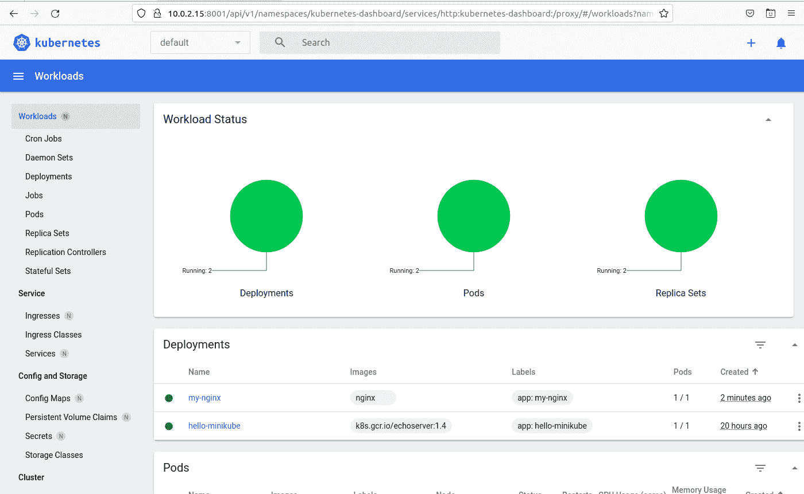

# 如何启用和使用 Minikube 仪表板

> 原文：<https://thenewstack.io/how-to-enable-and-use-the-minikube-dashboard/>

作为一个轻量级的虚拟机实现，Minkube 是为了开发目的而轻松部署本地 Kubernetes 环境的少数方法之一。有了这样的环境，你不仅可以了解 Kubernetes 的来龙去脉，还可以开始你的开发之旅。考虑到[复杂的 Kubernetes 部署](https://thenewstack.io/kubernetes-needs-to-take-a-lesson-from-portainer-on-ease-of-use/)本身，对于刚接触 Kubernetes 的开发者和管理员来说，拥有一个简单的方法来建立并运行环境是显而易见的。

[Minikube](https://minikube.sigs.k8s.io/docs/start/) 可以非常快速地安装，与 Docker 一起，你可以在不到五分钟内建立并运行该环境。一旦准备好了，您就可以完全访问命令行，在那里您可以开始工作。

然而，如果你是 Kubernetes 的新手，或者只是喜欢在 GUI 环境中工作，你可能会对使用 [Kubernetes Dashboard](https://thenewstack.io/kubernetes/kubernetes-dashboards/) 感兴趣，这是一个基于 web 的 Kubernetes 用户界面，它使得将容器化的应用程序部署到集群变得非常容易。

你能用 Kubernetes 仪表板做什么？以下是您可以管理的功能的简短列表:

*   克朗·乔布斯
*   守护进程集
*   部署
*   乔布斯
*   分离舱
*   副本集
*   复制控制器
*   有状态集合
*   入口
*   入口等级
*   服务
*   储存；储备
*   配置映射
*   秘密
*   持久存储
*   名称空间

这样的例子不胜枚举。实际上，Kubernetes 仪表板不仅大大简化了 Kubernetes 的使用速度，还简化了部署管理。甚至部署应用程序也可以通过用户友好的表单来完成。这有助于使 Kubernetes dashboard 成为那些不熟悉这项技术或者只是希望比命令行提供的工作效率更高的人的必备工具。

我要补充一点:对于任何喜欢跳过 Kubernetes 的复杂性(有很多复杂性)的人来说，最好对命令行的工作方式有一些了解；否则，您可能会发现自己在 GUI 中做了很多猜测。

此外，在我们开始之前，有一件事你需要知道。正如 Kubernetes 所涉及的一切一样，总会有复杂的情况。Kubernetes 仪表板的一个复杂之处是，尽管从托管集群的机器上访问它非常简单，但是要访问任何地方都必须经过额外的步骤。我也将向您展示这是如何做到的。

但首先，我们必须部署仪表板。

## 要求

要使用 Kubernetes 仪表板，您需要一个正在运行的 Minikube 实例。我已经在这里详细介绍了部署 Minkube 的过程。确保遵循该教程来启动并运行您的 Kubernetes 环境。一旦您完成了这些，请返回到这里，继续学习如何启用仪表板。

## 部署 Kubernetes 仪表板

现在您已经部署了 Minkube，是时候释放仪表板了。登录到托管您的 Minkube Kubernetes 集群的计算机，并打开一个终端窗口。使用命令
确保一切都在运行

您应该在输出中看到类似这样的内容:

```
minikube
type:  Control Plane
host:  Running
kubelet:  Running
apiserver:  Running
kubeconfig:  Configured

```

现在您已经确定一切都已启动并运行，使用命令:
部署 Kubernetes 仪表板

您可能还想通过
启用入口控制器

```
minikube addons enable ingress

```

部署需要一分钟左右的时间。当它打开时，它会自动打开您的默认 web 浏览器，进入默认的仪表板页面。如果结果是空的，您可以使用
进行快速 NGINX 部署

```
kubectl create deployment my-nginx  --image=nginx

```

当仪表板出现时(图 1)，您应该看到您的 NGINX 部署和您创建的任何其他服务/应用程序。



图 1:使用 Minikube 部署的默认 Kubernetes 仪表板。

## 如何从集群外部访问控制面板

目前，访问仪表板的唯一方法是从主机内部访问。如果你想从你的局域网访问，你需要做两件事。首先是找出托管 Kubernetes 集群的机器的 IP 地址。为此，打开一个终端窗口并发出命令:

有了机器的 IP 地址，接下来必须使用 kubectl 代理命令，它是:

```
kubectl proxy  --address='0.0.0.0'  --accept-hosts='^*$'

```

这是另一个窍门。在 Kubernetes 主机上的默认网络浏览器中打开的 URL 将包含您需要访问的地址，其形式为:

```
http://127.0.0.1:35025/api/v1/namespaces/kubernetes-dashboard/services/http:kubernetes-dashboard:/proxy/#/workloads?namespace=default

```

要访问集群之外的仪表板，您需要将本地主机 ip (127.0.0.1)替换为您的托管服务器的 ip 地址，并将原始地址中的端口替换为端口 8001。因此，如果你的主机的 IP 地址是 10.0.2.15，地址应该是:

```
http://10.0.2.15:8001/api/v1/namespaces/kubernetes-dashboard/services/http:kubernetes-dashboard:/proxy/#/workloads?namespace=default

```

另一个警告是，要到达那个地址，代理命令必须正在运行。我已经尝试了许多方法(systemd 和 shell 脚本)来成功地运行它，但是我还没有任何运气。因此，您必须运行 kubectl 代理命令来从集群之外访问仪表板。在我找到将 kubectl 代理命令作为服务运行的方法之前，您必须使用该命令。我相信有一个聪明的方法可以做到这一点。如果你知道一种方法，请在评论中留下。

在那之前，快乐的仪表板！

<svg xmlns:xlink="http://www.w3.org/1999/xlink" viewBox="0 0 68 31" version="1.1"><title>Group</title> <desc>Created with Sketch.</desc></svg>