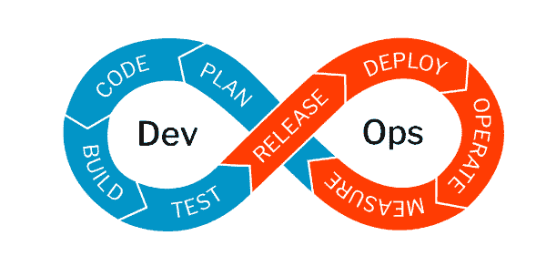
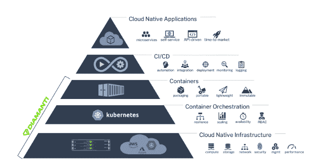
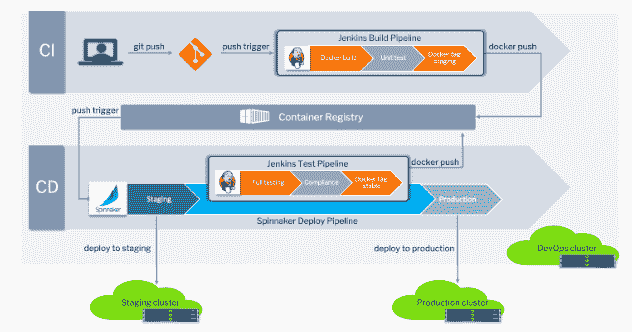

# 如何通过 Kubernetes 和超融合基础设施实现云原生开发运维

> 原文：<https://thenewstack.io/how-to-enable-cloud-native-devops-with-kubernetes-and-hyper-converged-infrastructure/>

[Diamanti](https://diamanti.com/) 赞助本帖。

云原生 DevOps 的新时代带来了各种新工具和最佳实践，为应用程序开发提供了显著的优势。当正确实施时，开发管道变得更加自动化，能够自助服务和 API 驱动，给予开发人员和运营团队独立性。借助云原生开发运维，开发人员可以以更快的速度向最终用户交付应用和更新，而无需担心管理底层基础架构。

图 1: DevOps:开发加运营生命周期。

云原生开发运维包括以下几个方面:

*   微服务架构允许团队以精益和敏捷的方式工作。
*   松散耦合的系统与自动化结合在一起，加快了上市时间。
*   弹性、可扩展性和弹性提供了按需扩展。
*   容器化使应用程序可移植和可重用。
*   自助服务功能和 API 驱动的 CI/CD 为开发人员提供了更大的灵活性。

## 云原生开发运维的构建模块

 [阿尔温德·古普塔

Arvind 是云原生专家、问题解决者和传道者，对学习和教学充满热情。Arvind 在一系列计算机学科中担任过各种技术职务。在开始他的软件测试职业生涯后，Arvind 在 Redback Networks 公司的 ASIC 行业呆了几年，随后在爱立信公司工作，在那里他构建了高级网络芯片。他于 2015 年 10 月加入 Diamanti，在负责解决方案和营销之前，他在将 Diamanti 的硬件平台投入生产方面发挥了重要作用。Arvind 拥有普渡大学的硕士学位。](https://www.linkedin.com/in/guptaarvindk/) 

图 2 显示了全栈云原生开发运维的构建模块:

*   基于微服务的云原生应用。
*   为 DevOps 提供 CI/CD 层、管道、工具和技术。
*   容器是封装不变性软件的标准手段。
*   Kubernetes orchestration 抽象基础设施，同时提供弹性和可伸缩性。
    *   容器提供的构建和打包应用程序的标准化，因此 Kubernetes 可用于部署、运行和管理微服务。
    *   跨内部和公共云供应商的可移植性。
    *   开发运维及基础设施管理的自动化。
    *   支持有状态应用程序的持久卷和存储。
    *   容器存储接口(CSI)很容易抽象出各种存储解决方案。
    *   容器网络接口(CNI)很容易抽象出各种网络解决方案。
    *   服务和入口，以支持对集群中应用程序的访问，并提供负载平衡。
    *   应用程序高可用性的内置结构。
    *   资源的弹性便于自动缩放。内部、公共或混合云基础架构。

图 2:全堆栈云本机 CI/CD 环境的构建块。

## 容器和 Kubernetes 是云原生开发的推动者

Kubernetes 为容器编排带来了很多特性，是对云原生 DevOps 的补充。它们包括:

*   容器提供的构建和打包应用程序的标准化，因此 Kubernetes 可用于部署、运行和管理微服务。
*   跨内部和公共云供应商的可移植性。
*   开发运维及基础设施管理的自动化。
*   支持有状态应用程序的持久卷和存储。
*   容器存储接口(CSI)很容易抽象出各种存储解决方案。
*   容器网络接口(CNI)很容易抽象出各种网络解决方案。
*   服务和入口，以支持对集群中应用程序的访问，并提供负载平衡。
*   应用程序高可用性的内置结构。
*   资源的弹性便于自动缩放。

## 云原生基础架构的重要性

正确的基础设施必须到位，以支持面向 CI/CD 的云原生 DevOps，使开发人员能够专注于交付他们的产品，而不是被产品将在何处以及如何运行所拖累。平台架构师需要工具来管理计算、内存、网络和存储等基础资源，以及流程编排和管理的所有方面。最终结果是开发人员需要的工具更少，总拥有成本(TCO)更低。

### 创新ˌ革新

云原生应用构建为在模块化和自动化的基础设施上运行，使它们变得具有弹性和可预测性。性能和可扩展性以及部署工作负载的灵活性成为重要优势。大多数现有基础设施无法支持这一点。因此，在选择基础设施时，需要一种创造性和创新性的方法。

### 弹性

基础设施必须以“弹性第一”的心态来建设。弹性对于每一层都很重要，无论是网络、存储、节点、流程还是应用程序。

### 可量测性

随着需求的起伏，用于云原生开发运维的平台需要能够支持应用的水平扩展。

### 资源利用

随着越来越多的团队采用云原生 DevOps，用户经常会耗尽资源。虚拟机包含许多不必要的复杂层，会降低资源效率并增加成本。在裸机上运行容器提供了更高的性能和资源利用率。

### 消费模式

借助多租户，团队可以在共享的基础架构上并行工作，企业能够实现更高的应用密度和更高的基础架构效率。能够只使用或支付您需要的公共或内部基础架构非常重要。

### 服务水平协议

由于整个公司的不同团队使用多租户共享基础架构，平台必须遵守一定的服务级别保证。重要的是，负载较重的某个应用程序不会影响同一基础架构上运行的其他应用程序。

### 总体拥有成本（同 Total Cost of Ownership）

虽然创新是一个重要因素，但总拥有成本(TCO)始终是一个旨在“少花钱多办事”的组织的驱动因素对于快速启动和较小的应用程序部署来说，公共云是一个非常有吸引力的选择，但随着应用程序的规模和复杂性不断增长，成本和复杂性可能会飙升。另一方面，内部解决方案需要相对较高的前期投资，但随着采用的增加，长期成本会低得多。事实上，混合云是两个世界的最佳结合，因此为决策者提供了更大的灵活性，并允许他们更有效地管理成本。

### 安全性

显然，在为当今的 IT 环境开发应用程序时，安全性是最重要的考虑因素之一。对于高度分布式的容器化环境，安全性必须从一开始就是开发过程的一部分。DevSecOps 是将安全性集成到软件开发过程中的过程，这可能是公司文化中的一种范式转变。

### 持久存储

虽然 Kubernetes 平台带有标准的容器存储接口(CSI ),但还需要一个满足组织特定需求和预算限制的 Kubernetes 存储解决方案。在选择存储解决方案时，存储服务(复制、快照、备份、恢复、加密功能)当然是要考虑的重要因素。

### 网络和连接

云原生环境是高度分布式的，由微服务组成。服务和 API 之间的通信能力至关重要。应用程序与其他应用程序以及外部世界的连接非常重要。Kubernetes 提供了一个容器网络接口(CNI)，但是选择正确的网络插件会使供应商选择过程变得复杂。大多数网络插件都是基于软件定义网络(SDN)的，这简化了群集中的单元间通信。但是，由于 pod IPs 仅存在于集群中，因此将应用程序暴露在集群之外变得更加困难，并且与现有的网络基础架构不兼容。此外，提前考虑网络性能和噪音邻居(占用大部分资源的容器或虚拟机)消除的潜在问题也很重要。

## 为云原生开发运维选择合适的基础架构

采用云原生开发运维时，明智地选择云原生基础架构至关重要。与许多独立计算、网络和存储组件一起使用的许多现有基础架构不适合云原生开发运维。超融合基础设施(HCI)——专为 Kubernetes 打造，能够支持上述所有要求，对于实现云原生开发运维至关重要。

图 3 显示了在超融合基础设施(Diamanti Enterprise Kubernetes 平台)上运行的云原生 CI/CD 环境的示例。HCI 基础设施，如 Diamanti 提供的，在裸机 Kubernetes 基础设施上提供可扩展的高性能 CI/CD。容器、Kubernetes、存储和网络抽象以及服务质量保证的强大功能使该解决方案能够轻松按需扩展，并在资源分配和使用方面提供无与伦比的正常运行时间和效率。这种基础架构隐含了备份和复制数据以实现高可用性、灾难恢复(DR)以及在混合云环境中无缝移动 CI/CD 环境的能力。

图 3:运行在 Diamanti Enterprise Kubernetes 平台上的云原生 CI/CD 环境。

## 结论

云原生 DevOps 帮助众多组织实现的一个重要里程碑是更快的部署和开发周期。这反过来又有助于拥有稳定可靠的企业基础设施。DevOps 和 Kubernetes 共同成为实现企业数字化转型的基础。借助微服务架构，云原生 DevOps 环境可加速应用交付，提供按需扩展，并支持无缝应用移植和重用。最终，整个云原生 DevOps 堆栈依赖底层基础架构来执行和扩展。

来自 Pixabay 的特征图像。

<svg xmlns:xlink="http://www.w3.org/1999/xlink" viewBox="0 0 68 31" version="1.1"><title>Group</title> <desc>Created with Sketch.</desc></svg>