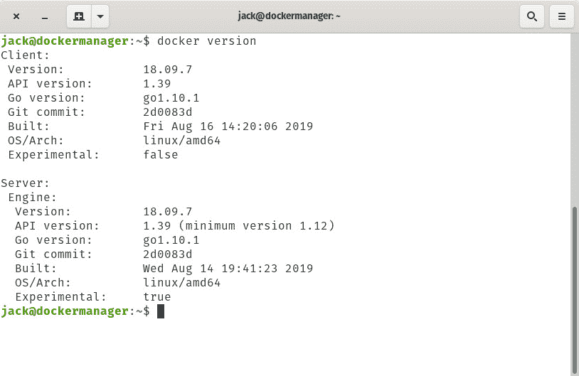
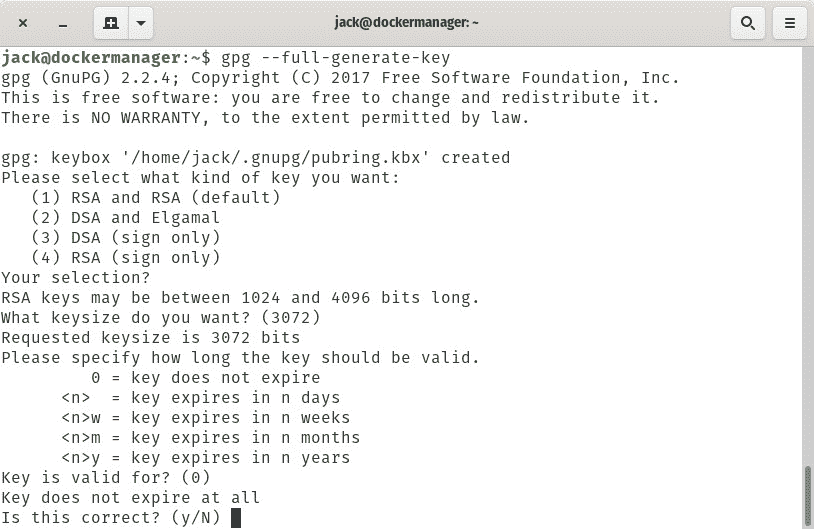
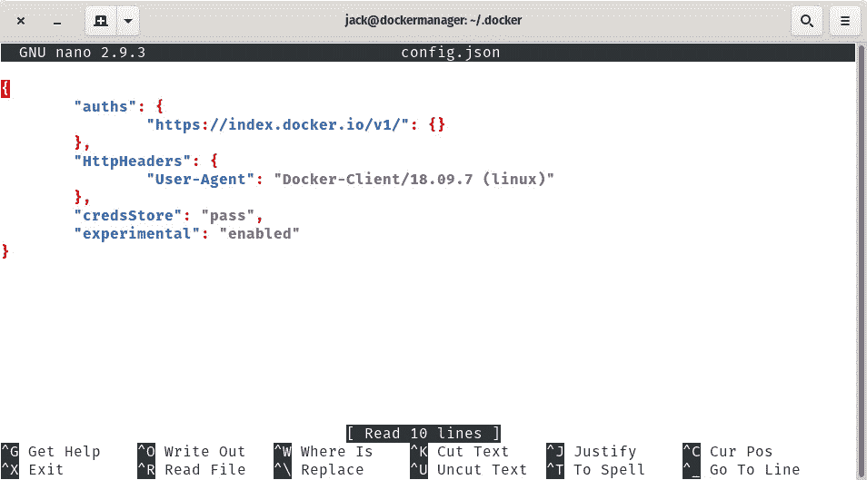

# 如何启用 Docker 实验功能并加密您的登录凭证

> 原文：<https://thenewstack.io/how-to-enable-docker-experimental-features-and-encrypt-your-login-credentials/>

如果你从事企业 IT，你很可能既没听说过也没用过部署了 [Docker 引擎](https://docs.docker.com/engine/)的容器。这是有原因的。docker 引擎功能强大、灵活，是许多其他技术所需要的。最重要的是，Docker 引擎非常容易使用。事实上，这是可用的更简单的容器技术之一。

但是您是否知道 Docker 引擎包含了一些实验性的特性，其中一些特性可能正是您正在寻找的一些真正的容器魔术？没错，隐藏起来(默认情况下禁用)，有一些功能还没有准备好，但仍然可以使用(当然是为了测试)。

正如 Docker 警告的那样，理解这些特性还不能用于生产环境是很重要的。然而，他们是正在测试的功能，他们可能(最终)会正式发布 Docker 引擎。

因此，如果您是勇敢者或好奇者，您可能希望在非生产机器上安装 Docker Engine，启用实验特性，并在您自己的容器上测试它们。

我将向您介绍启用实验性功能的过程，然后突出显示当前的一些功能。我将在 Ubuntu Server 18.04 的一个运行实例上进行演示。你选择的环境并不重要(不管是 CentOS，Ubuntu，Fedora Server，RHEL，SLES 等等。).重要的是您有一个正在运行的 Docker 引擎和一个属于 **docker 组**的用户。

## 启用实验功能

信不信由你，在守护进程端启用实验特性实际上非常简单。为此，请登录到您的服务器并发出以下命令:

`sudo nano /etc/docker/daemon.json`

这是一个新文件，所以您不会发现其中包含的任何内容。将以下内容粘贴到该文件中:

保存并关闭文件。

准备就绪后，使用以下命令重新启动 docker 引擎:

`sudo systemctl restart docker`

您现在可以看到，通过发出以下命令，实验功能已经启用:

`docker version`

您应该看到列出的实验:真(**图 1** )。



**图 1** :守护进程现在启用了实验特性。

接下来，您需要为 docker 客户机启用这些特性。这有点复杂，因为我们必须首先设置 docker 登录过程以使用加密的密码(否则，您会以明文形式留下您的身份验证凭证)。

为了保护这些密码，您必须首先启用凭据存储。让我们实现它吧。因为我们在一个无头的 Ubuntu 服务器上，我们必须首先安装一个工具，它将产生足够的熵来创建密钥。使用以下命令执行此操作:

`sudo apt-get install rng-tools -y`

安装完成后，使用以下命令生成熵:

`sudo rngd -r /dev/urandom`

现在，使用以下命令安装 pass:

`sudo apt-get install pass -y`

接下来，使用以下命令生成 gpg 密钥:

`gpg --full-generate-key`

为了生成密钥，接受问题的默认答案(**图 2** )并用 y 接受它们。



**图 2:** 生成一个 GPG 键。

然后会要求您添加您的姓名和电子邮件，最后，为新密钥创建一个密码短语。生成密钥后，我们现在可以使用以下命令设置凭据的安全存储:

1.  用命令 *mkdir ~/bin* 创建一个新目录
2.  使用命令 *cd ~/bin* 切换到新创建目录
3.  使用命令*echo ' export PATH = $ PATH:~/bin '>>~/将目录添加到您的路径中。巴沙尔*
4.  使用命令下载 docker-credential-pass*wget https://github . com/docker/docker-credential-helpers/releases/download/v 0 . 6 . 3/docker-credential-pass-v 0 . 6 . 3-amd64 . tar . gz*
5.  用命令【docker-credential-pass-v0.6.3-amd64.tar.gz tar xvzf 解压下载的文件
6.  使用命令*chmod a+x docker-credential-pass*赋予新文件适当的权限
7.  使用命令*sudo CP docker-credential-pass/usr/local/bin*复制可执行文件
8.  注销并重新登录。
9.  创建。用命令 *mkdir ~/进入 docker 目录。码头工人*

现在您必须初始化 pass。首先使用命令找到您的 gpg ID:

`gpg --list-secret-keys`

您应该会看到与您新创建的键相关联的一长串字符。使用该字符串，使用以下命令初始化 pass:

`pass init STRING`

其中 STRING 是 gpg 密钥 ID。

新我们必须使用以下命令为凭据存储创建密码:

`pass insert docker-credential-helpers/docker-pass-initialized-check`

在我们登录 docker 之前，使用以下命令创建一个配置文件:

`sudo nano ~/.docker/config.json`

确保文件如下所示:

```
{
"experimental":  "enabled"
}

```

保存并关闭文件。

最后，使用以下命令登录 docker:

`docker login`

就是这样。您的 docker 凭证现在通过加密存储保存，不会出现在~/中。docker/config.json 文件。您可以再次打开该文件，看到出现了许多新的配置选项(**图 3** )。



**图 3:** 完成的 config.json 文件。

现在，让我们来看看目前可用的一些实验功能。

## 当前实验特征

需要记住的一件事是，实验特性来来去去。这些特性提供了对未来版本中可能出现的功能的早期访问。有时这些特性会成为最终版本，有时会被抛弃。找出当前的实验特征也是一个挑战。

对当前 Docker 文档的快速搜索揭示了实验列表中包含的以下特性(当然，这可能会随时改变):

*   docker assemble 是一个插件，它提供了一个语言和框架感知工具，使用户能够将应用程序构建到一个优化的 docker 容器中。有了这个特性，无需提供配置信息就可以快速构建 Docker 映像。
*   [docker deploy](https://docs.docker.com/engine/reference/commandline/deploy/) 是 *stack deploy* 的别名。此功能支持 3.0 及更高版本的合成文件。
*   [docker manifest inspect](https://docs.docker.com/engine/reference/commandline/manifest_inspect/) 显示图像清单或清单列表。
*   [docker 检查点创建](https://docs.docker.com/engine/reference/commandline/checkpoint_create/)从正在运行的容器中创建一个检查点。
*   [docker buildx](https://docs.docker.com/buildx/working-with-buildx/) 是一个 CLI 插件，它扩展了 docker 命令的功能(由[莫比构建工具包](https://github.com/moby/buildkit)提供),如创建作用域构建器实例、针对多个节点并发构建、自动垃圾收集、可扩展的前端格式、构建缓存导入/导出等。

还应注意，一些实验命令可用于标准 docker 引擎，而其他命令仅可用于 **docker-ce** 或 **docker-ee 引擎**。

这就是你获得 Docker 实验功能的方法。

<svg xmlns:xlink="http://www.w3.org/1999/xlink" viewBox="0 0 68 31" version="1.1"><title>Group</title> <desc>Created with Sketch.</desc></svg>