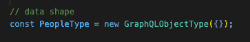

# 如何执行简单的 GraphQL 查询

> 原文：<https://thenewstack.io/how-to-execute-a-simple-graphql-query/>

GraphQL 是一种查询语言，允许对应用程序编程接口(API)进行高度可定制的查询。GraphQL 正在崛起，目前正在 PayPal、网飞、Shopify、Github 和 Airbnb 的生产级应用程序中使用。

本教程将解释如何执行一个简单的 [GraphQL](https://roadmap.sh/frontend) 查询。本教程的先决条件是对 [Node.js](https://nodejs.org/en/about/) 、Node 的 [Express.js](https://expressjs.com/) Web 框架以及【HTTP 请求如何工作的基本理解。 [GraphQL](https://graphql.org/) 是一种查询语言，可以在 Node/Express 环境之外的环境中工作，但本教程适用于 Node/Express 环境。

## 入门和安装依赖项

Npm init(这将创建新的节点项目和 package.json)

以下依赖项将用于此项目。

*   表达
*   graphql
*   快速图表 ql
*   axios

唯一的 dev 依赖项将是 nodemon。

首先，构建脚本。在 package.json 中，您需要编写两个脚本，在每次进行更改时重新启动服务器。这些脚本如下所示:


初始设置的最后一部分是文件树。为此，我只需要添加两个文件:server.js 和 schema.js。

## 构建 Express 服务器

我需要三个项目来运行这个服务器:express、express-graphql 和 schema。此外。我还将创建一个 app 变量，它是 express()的一个实例，将端口定义为 3000，并设置 app.listen 功能。

此时，我的 server.js 看起来像这样:


graphqlHTTP 模块提供了一种简单的方法来创建运行 GraphQL API 的 Express 服务器。此项目只有一个路由处理程序 app.use。使用 graphqlHTTP 时，app.use 功能被设置为一个端点，后跟 graphQLHTTP 变量。它将 Express 连接到 graphQL 及其相关功能。

关于这方面的更多阅读，请查看 [GraphQL 文档](https://graphql.org/graphql-js/express-graphql/)和 [GitHub Read Me](http://express) 的链接，这里也非常有用。

对于这个练习，它实际上就像从 GitHub Read Me 中复制和粘贴一样简单，只需确保模式名与文件顶部的模式变量名相匹配。graphql:true 指的是指向 GraphQL 的查询测试平台 GraphQL 的/graphql 端点(可以把它想象成 graph QL 的邮递员)。

Server.js 现在看起来像这样。


## 构建模式

模式和查询类型构建实际上只是概述了预期的传入字段及其数据类型(字符串、数组、布尔)。虽然格式是 GraphQL 特有的，但它类似于编码中的任何其他概念。不是新，只是不一样。该项目正在查询第三方 API，即星球大战公共 API，因此步骤如下所示:

*   定义 API 预期的数据
*   构建查询对象
*   导出模式

我将在 Axios 中要求。我要开始要求的下一件事是 GraphQL 类型。这里有一个 GraphQL 类型的指南。

我肯定会使用 GraphQLObjectType 和 GraphQLSchema，这样我就可以先使用它们。现在看起来是这样的:


我将和《星球大战》公共宣传部门一起工作。我将查询人员数据。我可以在 people 部分看到，每个数据点旁边都列出了它的类型。我将查询姓名、出生年份、飞船和车辆，因此除了 GraphQLObjectType 和 GraphQLSchema 之外，我还需要导入 GraphQLString 和 GraphQLList。

## 定义数据形状 PeopleType 对象

第一个 GraphQLObject 是 PeopleType:



people 类型对象将概述用户可以从 API 中查询哪些字段，以及查询可以预期接收哪些数据类型。该对象中的键值对如下:

```
name:  ‘String’,

fields:  ()  =&gt;({
    data_point:{  type:  type_expected  }
})

```

people type 对象最终看起来像这样:


## 定义根查询对象

这也是一个 GraphQLObjectType，因为模式中构建的所有对象都是 GraphQLObject 类型，但内部的结构不同。内部结构会是这样的:

```
name:  ‘String’,

fields:  {
      query_name:  {
            type:  type of data expected from the query,
            resolve:  (  )  =&gt;  {
            function requesting queried data
            }
       }
}

```

通过将这个示例代码复制并粘贴到浏览器中，很明显，键“结果”提供了一个所有人对象的数组。因此，要查询的数据类型是一个 people 对象数组，因此在该类型中，它将是一个新的 GraphQLList(PeopleType)。

解析器函数内部是 Axios 对数据的请求。它看起来就像任何其他 Axios get 请求一样。这个物体最终看起来会像这样。


这里的最后一步是导出模式，这非常简单。


作为参考，完整的 schema.js 文件如下所示。


运行 server 命令，然后运行 npm start，并将浏览器指向 localhost:3000/graphql。

## 使用 GraphiQL


开始查询就像{}一样简单。输入 p，它会弹出一个菜单，上面写着“人”。再次打开花括号，输入要查询的字段。按播放，查看收集的数据。


它们可以一起查询，也可以单独查询。

对于示例错误故障排除，请返回到代码文件，将 res.data.results 更改为 res.data，然后运行查询并检查其内容。


GraphQL 的属性之一是数据是嵌套的，对于更密集的查询，数据可能会被深度嵌套，并且可能需要一段时间才能找到数据的位置。一些错误处理只是为了确保一切正常。

有关执行 GraphQL 查询的更多信息，请参见关于执行的 [GraphQL 文档](https://graphql.org/learn/execution/)。

<svg xmlns:xlink="http://www.w3.org/1999/xlink" viewBox="0 0 68 31" version="1.1"><title>Group</title> <desc>Created with Sketch.</desc></svg>