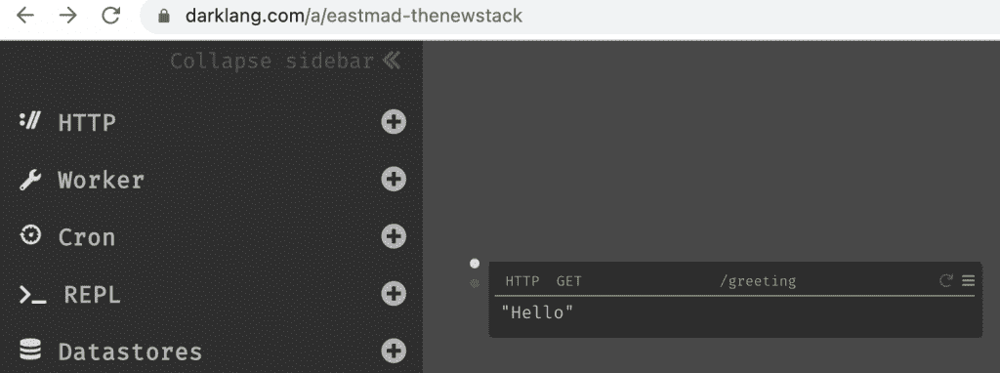
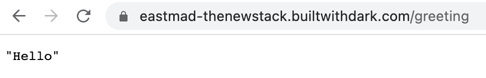
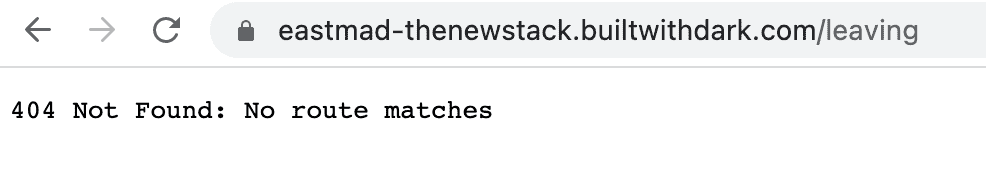
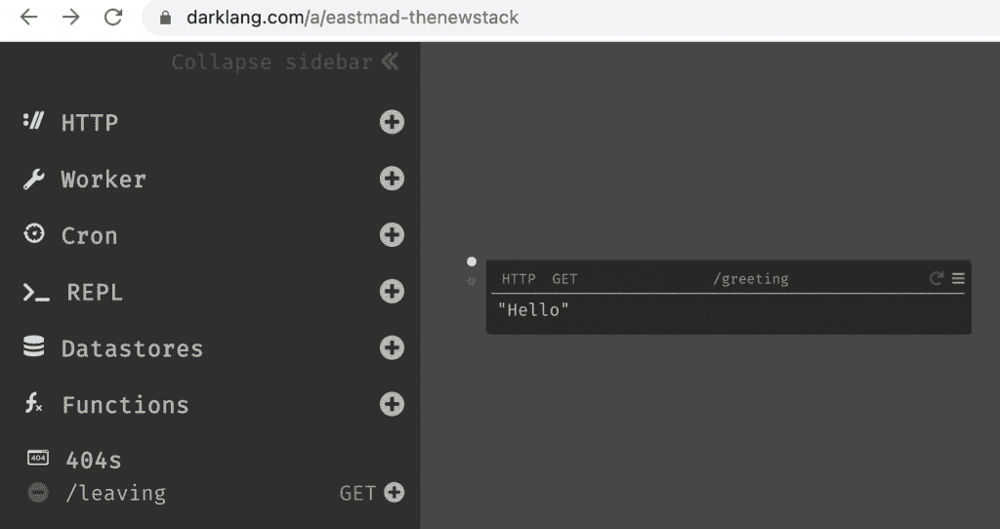
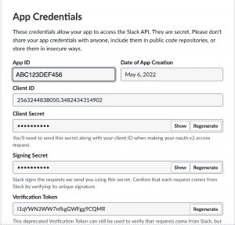
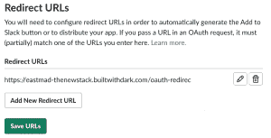
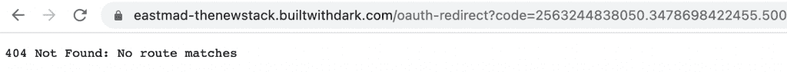
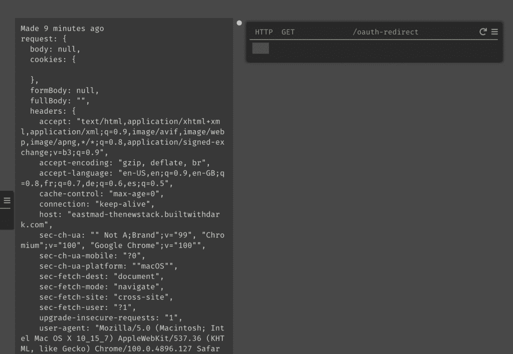
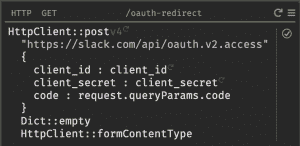

# 如何开始用 Dark 构建无服务器后端

> 原文：<https://thenewstack.io/how-to-get-started-building-serverless-backends-with-dark/>

无服务器的早期承诺之一是更快的解决时间，因为您可以开始工作而不需要建立基础设施。我在一个[的 changelog 播客](https://changelog.com/podcast/430)中听说了一年前的[黑暗](https://darklang.com)，并立即查看了它。当它于 2019 年在[亮相时，Dark 被描述为“一种整体编程语言、编辑器和构建后端的基础设施。”虽然这听起来有点神秘，但它显然是为了谈论 REST 而建立的，用他们的话说，“ **Dark 是构建无服务器后端的一种新方式。”**](https://medium.com/darklang/unveiling-dark-e0be6f1e0b06)

黑暗有点像萨尔萨舞课，在那里你会觉得老师们太好了，他们不再记得没有节奏感是什么感觉。但是使用 HTTP 和 JSON 与正式的舞蹈没有什么不同。你发送一个请求，然后你收到一个响应。响应的主体在 JSON 中。有些习俗你应该知道，有些你可以学会。我认为对于这篇文章，你至少熟悉音乐。

黑暗界面所做的是自动化一些繁琐的通信。最重要的是，你不需要写任何代码。在某种程度上，我们被告知未来不再需要编码，语音识别和完善的用户界面将使开发大众化。这个未来还有点遥远，但明智的做法是发现即将到来的模式。

好了，现在让我们直入黑暗。您可以立即创建一个**画布**，只需在浏览器中根据您的用户名声明一个 URL，然后在该页面上工作。下面我创建了“eastmad-thenewstack ”,并为“/greeting”端点编写了 GET 响应。

这将立即从“builtwithdark”域得到响应:

又快又好。但是我可以反过来这样做，首先用一个新颖的请求到达我的端点，不需要后端实现:

回到我的画布上，Dark 已经将该轨迹存储为 404，因此我可以快速地对其进行操作:

通过点击那个加号，我将能够以与上面我响应“/greeting”相同的方式响应来自“/leaving”的 GET 请求。这就是他们所说的[跟踪驱动开发。](https://docs.darklang.com/discussion/trace-driven-development)几乎通过逆向工程追踪工作确实让你感觉有点像侦探——几乎，我敢说，像黑客。只不过我们在偷窥一场舞会。

重访黑暗网站，他们现在支持 OAuth2，这是资源所有者、客户端应用程序和资源服务器之间的三方授权信任 tango，以令牌语言表示。Dark 也有一个为 Slack 应用程序创建[后端的例子，](https://docs.darklang.com/walk-throughs/slack-app)将作为 Slackbot 可见。虽然这个例子很复杂，但它确实给了我们一个机会来使用一组有用的技术，包括 OAuth。

即使你有一个宽松工作空间的管理权限，平台安全仍然被小心地管理。快速浏览一下[api.slack.com/app](https://api.slack.com/app)，你会看到一个不错的“创建应用”选项，查看基本信息，你会发现有很多东西:

(注意，句号位于客户端 ID 中数字的中间；这表明它必须作为一个字符串来处理。)

现在，我们必须更深入地了解舞蹈的复杂性。我们需要在 Slack 中创建一个重定向 URL，这将启动我们的跟踪过程(查看‘OAuth & permissions’)。

Dark 希望用户使用“/oauth-redirect”作为到画布的路径。在 Slack 中，转到管理分发并复制可共享的 URL。最后，我们有了可以调用后端的东西。通过调用这个，我们将点击我们的黑色画布，并开始跟踪。

事实上，它在我们的画布 404 列表中等待着。我们现在可以创建对 GET 的响应:

到目前为止，一切顺利。我们已经触发了重定向，可以看到 Dark 收到的完整请求。那我们送什么回去呢？好吧，我们有来自 Slack 的“客户 Id”和“客户秘密”。所以我们可以在黑暗中建立一个岗位，继续跳舞。

我们需要创建一个 POST 主体，这就是你需要用 JSON 格式思考的地方——尽管 Dark 忽略了这一点。当我们选择 post 响应时，Dark 会像任何好的 IDE 一样通知我们参数。Slack API 的 URL 的一个字符串，文章的主体，然后是两组本身就是字典的键/值对。

示例中提到了正文的实际格式。当然，**客户端 id** 和**客户端秘密**将是您的字符串:

所以我们直接与 Slack 的 OAuth API 通信。注意，“code”键的值取自 Dark 收到的请求(在我上面的图片底部)，它解析 JSON，所以您可以输入“request.queryParams.code”。当我们发送帖子时，我们希望得到的是正确的访问令牌。

我将在这里停止本文的跟踪工作，但是如果您想继续这个例子，请按照上面的后端演练链接创建一个简单的 Slackbot。我承认我不能重复地让它工作——但是有了反馈，即使失败也很有教育意义。

## 结论

我们从这一切中得到了什么？

*   智能用户界面可以很好地处理熟悉的模式，ide 和静态类型语言的用户已经利用这些模式很多年了。
*   REST 仍然是形成和理解 API 的好方法。更复杂的有效载荷应该鼓励更多像 Dark 这样的工具，帮助探索服务产品。
*   在各种独立的信任机构或它们的模拟中工作是理解一个系统的好方法，但它仍然是复杂的。这就像拿着几串叮当作响的钥匙和安全卡，但必须按照特定的顺序使用。
*   不要停止跳舞。

<svg xmlns:xlink="http://www.w3.org/1999/xlink" viewBox="0 0 68 31" version="1.1"><title>Group</title> <desc>Created with Sketch.</desc></svg>