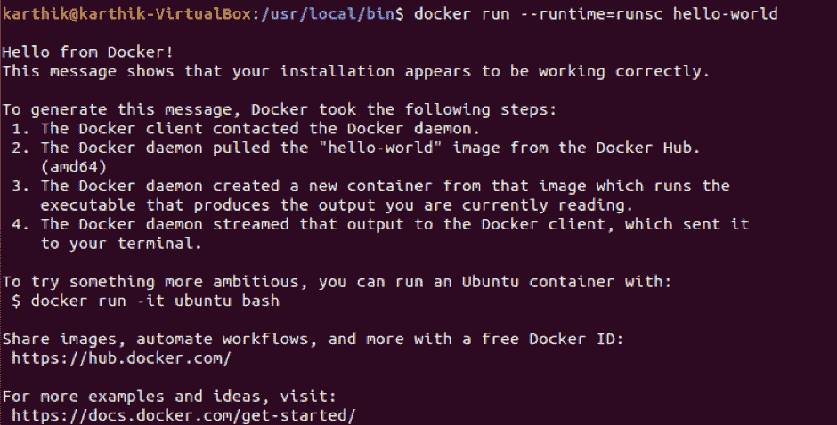

# 如何使用 Google 的 gVisor 实现安全容器

> 原文：<https://thenewstack.io/how-to-implement-secure-containers-using-googles-gvisor/>

[](https://www.upnxtblog.com)

[Karthikeyan shanmu gam](https://www.upnxtblog.com)

[Karthikeyan shanmu gam(Karthik)是一名经验丰富的解决方案架构师，拥有超过 17 年的银行、金融服务和航空领域应用程序设计开发经验&。目前参与技术咨询&提供应用程序转换领域的解决方案，包括传统应用程序的现代化、管理转换练习以及为转换提供解决方案架构。](https://www.upnxtblog.com)

[](https://www.upnxtblog.com)[](https://www.upnxtblog.com)

Linux 容器自 2000 年代初就已经存在，并于 2007 年构建到 Linux 中。由于容器的占地面积小且可移植，相同的硬件可以支持比虚拟机数量大得多的容器，从而大幅降低基础架构成本，并使更多的应用程序能够更快地部署。但由于可用性问题，直到 Docker (2013 年)出现，它才引起足够的兴趣。

与虚拟机管理程序不同(例如 Xen，hyper-v)虚拟化，其中虚拟机通过中间层(hypervisor)在物理硬件上运行，而容器在操作系统内核之上运行用户空间。这使得它们非常轻便和快速。

容器也激发了人们对微服务架构的兴趣，微服务架构是一种开发应用程序的设计模式，在这种模式下，复杂的应用程序被分解为更小的、可组合的服务，这些服务可以协同工作。

现在，随着企业越来越多地采用容器和微服务，容器也带来了风险。例如，如果任何一个容器崩溃，它可以允许跨容器、主机或数据中心等的未授权访问。，从而影响主机 OS 上托管的所有容器。

为了减轻这些风险，我们将研究各种方法，特别是 Google 的 [gVisor](https://github.com/google/gvisor) 方法，这是一种沙箱，有助于为容器提供安全隔离。它还与 Docker 和 Kubernetes 容器平台集成，从而使在生产环境中运行沙盒容器变得简单易行。

在这种背景下，现在让我们来看看实现沙盒容器的各种方法。

## 集装箱隔离机制综述

**机器级虚拟化**通过虚拟机监控器(VMM)将虚拟化硬件暴露给客户内核。在不同的虚拟机中运行容器可以提供很好的隔离、兼容性和性能，但它通常需要额外的代理和代理，并且可能需要更大的资源占用和更慢的启动时间。


机器级虚拟化


传统平台与机器级虚拟化平台之间的比较

[KVM](https://www.linux-kvm.org/) 是机器级虚拟化的最好例子之一。最近亚马逊也推出了[鞭炮](https://aws.amazon.com/about-aws/whats-new/2018/11/firecracker-lightweight-virtualization-for-serverless-computing/)，一种新的虚拟化技术，利用了 [KVM](https://en.wikipedia.org/wiki/Kernel-based_Virtual_Machine) 的修改版本。AWS Lambda/Fargate 广泛使用鞭炮来提供和运行安全沙箱来执行客户功能。


KVM 虚拟化基础设施

另一个基于 KVM 的著名项目是 [Kata containers](https://katacontainers.io/) ，它利用轻量级虚拟机无缝集成到 Docker 或 Kubernetes 等容器生态系统中。

**基于规则的执行**例如 [seccomp](https://www.kernel.org/doc/Documentation/prctl/seccomp_filter.txt) 过滤器，允许为应用程序或容器指定细粒度的安全策略。然而，在实践中，为应用程序可靠地定义策略是极其困难的，这使得这种方法很难应用于所有场景。


基于规则的执行

要在 Docker 中进行同样的配置，Docker 需要用 seccomp 构建，内核配置为启用 CONFIG_SECCOMP。检查您的内核是否支持 seccomp 和配置。

```
grep CONFIG_SECCOMP=  /boot/config-$(uname  -r)

```


检查 seccomp 是否启用

默认情况下，Docker 在默认的 seccomp 配置文件上运行，以在 Docker 运行命令期间覆盖 use–security-opt 选项。例如，下面明确指定了一个策略:

```
$  docker run  --rm  \              -it  \              --security-opt seccomp=/usr/local/profile.json  \              hello-world

```

默认的 seccomp 配置文件为正在运行的容器提供了 seccomp，并禁用了 300+个系统调用中的大约 44 个。它在提供广泛的应用程序兼容性的同时具有适度的保护性。默认的 Docker 配置文件可以在[这里](https://github.com/moby/moby/blob/master/profiles/seccomp/default.json)找到。

profile.json 将特定的系统调用列入白名单，并拒绝对其他系统调用的访问。

在下一节中，我们将看看 gVisor (Google)的容器隔离机制。

## gVisor 简介

gVisor 是一个用 Go 编写的轻量级用户空间内核，它实现了 Linux 系统表面的很大一部分。通过实现 Linux 系统表面，它提供了主机和应用程序之间的隔离。此外，它还包括一个名为 runsc 的[开放容器倡议(OCI)](https://www.opencontainers.org/) 运行时，以便维护应用程序和主机内核之间的隔离边界。

它拦截所有应用程序系统调用，并充当客户内核，无需通过虚拟化硬件进行转换。此外，gVisor 不只是将应用程序系统调用重定向到主机内核。相反， **gVisor 实现了大多数内核原语** ( *)，如信号、文件系统、futexes、管道、mm 等。并在这些原语的基础上构建了完整的系统调用处理程序。*


gVisor 内核

与上述机制不同，gVisor 通过拦截应用程序系统调用和充当来宾内核来提供强大的隔离边界，所有这些都是在用户空间中运行的。与创建时需要一组固定资源的 VM 不同，gVisor 可以像普通 Linux 进程一样适应随时间变化的资源。

尽管 gVisor 实现了 Linux surface 的很大一部分及其广泛的兼容性，但仍有一些未实现的特性和错误。如果你遇到问题，请在这里提交一个 bug [。](https://github.com/google/gvisor/issues)

### 如何使用 gVisor 实现沙盒容器(针对 Docker 应用程序)

第一步是从最新的每夜版本下载 runsc 容器运行时。下载二进制文件后，对照 SHA512 [校验和文件](https://storage.googleapis.com/gvisor/releases/nightly/latest/runsc.sha512)进行检查。

```
wget https://storage.googleapis.com/gvisor/releases/nightly/latest/runscwget https://storage.googleapis.com/gvisor/releases/nightly/latest/runsc.sha512sha512sum -c runsc.sha512chmod a+x runscsudo mv runsc /usr/local/bin

```


runsc gVisor Docker 运行时

下一步是通过向 Docker 配置(/etc/docker/daemon.json)添加一个运行时条目来配置 Docker 使用 runsc


runsc 的 Docker 配置

重新启动 Docker 守护进程后进行更改。

现在 gVisor 配置完成了，我们现在可以使用 docker run–runtime = runsc hello-world 命令运行 *hello world 容器*来测试它



使用 runsc (gVisor)运行 hello world 容器

让我们尝试在 gVisor 上运行 httpd 服务器，这里 test-apache-app 将使用 httpd 映像和 gVisor 运行时。


在 gVisor 上运行 httpd 服务器

runsc 运行时还可以通过使用 [cri-o](http://cri-o.io/) 或 [cri-containerd](https://github.com/containerd/cri) 项目在 Kubernetes 集群中运行沙盒 pods，这些项目将来自 Kubelet 的消息转换为 OCI 运行时命令。

*祝贺你！我们已经学习了如何使用 gVisor 实现沙盒容器。*

### 其他资源:

通过 Pixabay 的特征图像。

<svg xmlns:xlink="http://www.w3.org/1999/xlink" viewBox="0 0 68 31" version="1.1"><title>Group</title> <desc>Created with Sketch.</desc></svg>