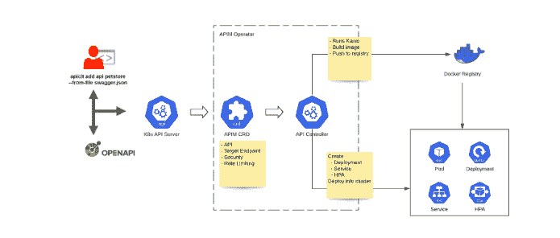

# 如何改进云原生 API 管理

> 原文：<https://thenewstack.io/how-to-improve-cloud-native-api-management/>

[WS](https://wso2.com/) [O2](https://wso2.com/) 赞助本帖。

 [拉克马尔·瓦鲁萨威塔纳

Lakmal 是 WSO2 首席技术官办公室的高级开发人员关系主管。2005 年，Lakmal 共同创立了 thinkCube，这是为电信运营商开发下一代协作云计算产品的先驱。](https://www.linkedin.com/in/lakmal-warusawithana-b8191450/) 

API 现在是数字业务的基本构件。他们目前为 DevOps 提供的优势包括:

*   为组织创造和货币化 API 和 API 产品带来了新的需求。
*   跨内部和外部 API 最大化应用程序的采用和重用。
*   确保 API 安全性。
*   支持越来越依赖 Kubernetes、微服务、服务网格和 CI/CD 的云环境。

WSO2 API Manager 3.0 有助于提高 API 管理能力，同时满足 API 开发者和消费者的需求。在 3.0 版本的所有新功能中，值得注意的是内置的 Kubernetes 操作符和 API Microgateway，它们将 API 提升到 Kubernetes 中的一等公民。

## Kubernetes 算子

Kubernetes 是为自动化而设计的。但是当增加应用程序的复杂性时，它增加了开发运维的负担和出错的可能性。通过组合定制资源和定制控制器，Kubernetes 操作符使开发人员能够编写代码来自动完成 Kubernetes 本身无法完成的任务。自定义资源向用户提供 API，自定义控制器帮助实现 API 函数。有了这个可扩展的架构，用户可以扩展 Kubernetes 集群的行为，而无需修改 Kubernetes 中的代码。

## API 微通道

微服务是一种架构风格，它将应用程序构建为围绕业务功能组织的服务集合。现在，组织内的较小团队可以分析、开发和测试这些服务，同时专注于业务问题。WSO2 API Microgateway 认为开放 API 定义是唯一的事实来源，可以用作 API 治理策略的实施点。开放 API 定义包含了关于 API 的所有必需信息。通过在 WSO2 API 微网关工具包中包含这个定义，用户可以创建一个 API 微网关。

## Kubernetes 的 WSO2 API 操作符

API 开发人员可能不会对容器和 Kubernetes 特别感兴趣，大多数专业人员也不会愿意花时间学习如何部署 Kubernetes pod 或添加 Kubernetes 服务。但是，他们很可能熟悉:

*   后端服务、资源及其行为作为 API 公开。
*   保护 API 的安全机制或策略。
*   保护 API 的限速策略。

此外，他们的期望还包括完成以下一项或多项任务的能力:

*   通过发布到开发人员门户来构建 API 市场。
*   保护和货币化 API。
*   监控和分析 API 的使用。
*   获得关于 API 的商业见解。

Kubernetes 的 API Operator 消除了管理完整 API 管理解决方案的所有复杂性，同时满足了上述期望。它为 API 开发者和 DevOps 提供了丰富的用户体验来管理他们在 Kubernetes 上的系统。

通过向 apictl (API 控制器)工具包提供开放 API 定义，WSO2 API Operator 使用户能够部署具有所需策略实施的 API 微网关。

图 Kubernetes 的 WSO2 API 操作符概述

Kubernetes 的 API 操作符引入了四个新的自定义定义(CRD):安全、速率限制、目标端点和 API。`Security` CRD 保存安全相关信息，`RateLimiting` CRD 包含速率限制的细节。

“TargetEndpoints”定义支持三种 API 部署模式:共享、私人飞机和边车。(更多信息请参考这篇 [API 微网关](https://medium.com/@lakwarus/micro-api-gateway-58cce43f2d7d)文章。)如果一家公司的后端服务已经在运行，并且需要通过微网关公开，开发人员可以自己在 Swagger 中定义目标 URL。如果后端服务没有运行，但团队计划在同一个 Kubernetes 集群中运行它，开发人员可以使用带有相关 Docker 映像的`TargetEndpoint`。然后，API Operator 将使用 microgateway 为定义的后端服务启动相应的 Kubernetes 部署。在共享和私人飞机模式下，后端服务可以在单独的 pod 中运行。然而，在 sidecar 模式下，网关将在与后端服务相邻的同一个 pod 中运行。

API CRD 保存 API 相关的信息。API 将开放 API 定义作为一个配置映射，连同副本计数和微网关部署模式。当自定义 API 控制器被触发时，它将从附加的配置图接收一个开放 API 定义，并通过附加一个多步 docker 文件和开放 API 定义来创建一个 [Kaniko](https://github.com/GoogleContainerTools/kaniko) 作业。Kaniko 是一个从容器或 Kubernetes 集群内部的 docker 文件构建容器映像的工具。这个 Docker 文件用于预构建具有 API microgateway 工具包的 Docker 映像。microgateway 工具包将生成 API microgateway 运行时，并传递相应的 swagger 文件。最后，Kaniko 构建一个新的 API microgateway Docker 映像，并将其推送到已配置的 Docker 注册表中。

完成第一步后，API 控制器将开始创建与 API 定义相对应的相关 Kubernetes 工件。根据定义的 API 模式，它将为 API 微网关和后端服务创建 Kubernetes 部署。

API 控制器消除了 DevOps 的复杂性，实现了部署自动化，并提供了在微服务环境中部署 API 微网关的最佳实践。

## 装置

安装 WSO2 API Manager 3.0 现在只需要对 Kubernetes 集群运行一个 kubectl 命令，剩下的工作就交给它了。开发者可以下载 [apictl](https://github.com/wso2/product-apim-tooling/releases) 并配置他们的机器来控制所有的 API 管理功能。更多信息请见[Kubernetes API 运营商 Git repo](https://github.com/wso2/k8s-apim-operator) 。

## 摘要

Kubernetes 正在迅速成为事实上的云编排平台标准。WSO2 API Manager 3.0 是一个完整的生命周期 API 管理平台，它通过 Kubernetes 操作者来支持 Kubernetes。这意味着管理和配置 API 成为 Kubernetes 平台的核心部分，与现有的管理工具紧密集成。结果是开发人员、开发人员和云管理员在构建、部署和管理 API 时的工作效率更高。

通过 Pixabay 的特征图像。

<svg xmlns:xlink="http://www.w3.org/1999/xlink" viewBox="0 0 68 31" version="1.1"><title>Group</title> <desc>Created with Sketch.</desc></svg>