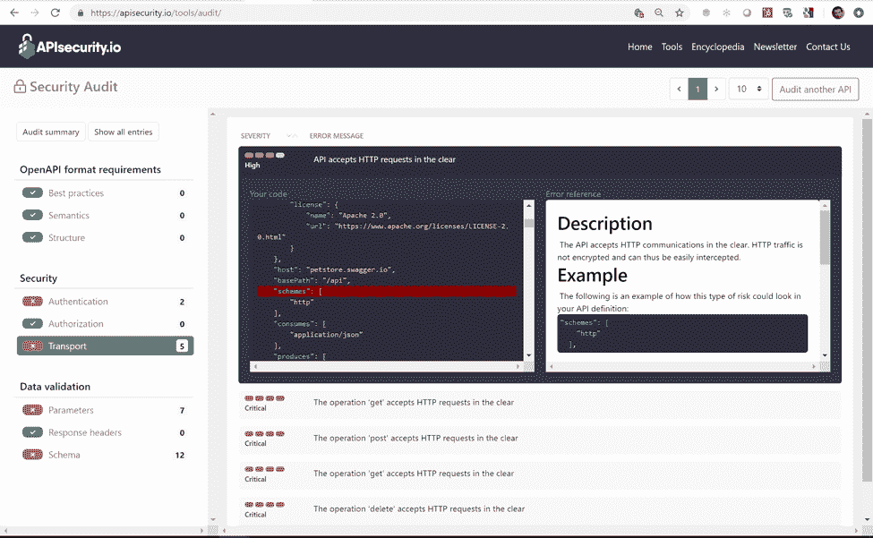

# 如何从一开始就提高 API 的安全性

> 原文：<https://thenewstack.io/how-to-improve-the-security-of-your-apis-from-the-get-go/>

API 正在迅速接管网络。据 Gartner 称，到 2022 年，API 将成为企业最具针对性的攻击媒介。在本文中，我们将探讨如何通过定位和修复 OpenAPI 契约文件中一些最常见的 API 漏洞来提高 API 的安全性。

## API 正在接管世界

web 应用程序的情况正在发生变化:API 的使用正在增加。如今，大多数 web 应用程序都基于一个 UI，该 UI 使用 API 操作调用后端服务器来获取资源和数据。

移动应用、物联网(IoT)、业务集成项目也是如此——所有这些都有支持它们的 API。Akamai 估计现在大约 83%的网络流量是 API 流量。

甚至系统的组装方式也转向了 API。向微服务架构的转变将 API 的扩散带到了一个全新的水平。现在，单独的容器和函数也调用 API 与系统的其余部分一起工作。

## 为什么 WAF 已经不够了

 [德米特里·索特尼科夫

Dmitry Sotnikov (@DSotnikov)在 42Crunch(企业 API 安全公司)担任云平台副总裁，并维护 APISecurity.io，这是一个受欢迎的社区网站，提供 API 安全新闻和每周时事通讯，介绍 API 漏洞、违规、标准、最佳实践、法规和工具。](https://www.42crunch.com/) 

不断变化的应用程序环境也改变了保护它的方法。以前，组织网络架构的入口点是通过应用程序，有一个薄的 web 应用层，运行在专用服务器上。这使得通过建立 web 应用程序防火墙(WAF)来保护应用程序服务器来维护安全性变得相对容易。

然而，随着 API 的兴起，今天的情况大不相同。现在，网络架构没有一个明确定义的入口点。相反，入口点是大量调用后端来提供应用程序功能的 API。

尽管 REST APIs 是基于 HTTP 的，但是如果您认为 WAF 也可以保护 API 流量，那么您将会大吃一惊。WAF 技术通常专注于已知的攻击类型，缺乏对每个 API 设计和实现细节的细致了解。

因此，WAF 根本没有办法区分黑客 API 调用和合法的 API 流量，所以它不能清除它们，而是一视同仁。

## API 安全是团队合作

许多 API 最初只是作为内部实现细节出现的。业务需要一种功能来满足需求，开发人员努力尽可能快速有效地交付这种功能。不幸的是，这通常意味着安全性退居二线，因为:

*   时间压力
*   缺乏对 API 安全性的理解
*   开发人员、运营人员和安全专家之间的脱节

幸运的是，业界出现了一种通用格式，并成为广泛采用的 API 文档化方式。最初称为 Swagger 规范，2016 年该规范被更名为 [OpenAPI 规范](https://www.openapis.org/) (OAS)。该项目由 OpenAPI Initiative 维护，这是一个 Linux 基金会项目，有 35 个公司成员，包括谷歌、微软、易贝、42Crunch 等等。

具有[大型工具支持的通用标准](https://openapi.tools/)使得团队中的开发人员、操作人员和安全人员能够用通用语言交流。所有团队都可以使用标准的 OpenAPI 契约来清晰地交流，而不是从 API 的行为或源代码中推断出 API 的意图。

标准契约能够实现的关键功能之一是 API 安全性。当构建 API 和 API 将要使用的基础设施的所有团队能够清楚地交流意图、需求和结果时，发现、理解和减轻安全风险也更加容易和可靠。

## 一切都从 API 定义开始

因为 API 现在形成了网络的入口点，这使得 API 定义的质量和安全性成为焦点。API 安全性的起点是 OpenAPI 定义本身。

只要阅读最近几期的[每周 API 安全时事通讯](https://apisecurity.io/)，就会发现攻击者可以找到并使用仅为后端使用而设计的 API，并绕过它们，例如，通过发送意想不到的有效载荷。

如果您的 API 定义有很大的安全漏洞，那么在此基础上应用安全措施只会制造一个定时炸弹。第一步是确保您的 API 符合安全性最佳实践。这就是 API 合同安全审计可以提供帮助的地方。

## API 合同安全审计

APIsecurity.io 上的 API 合同安全审计工具是一个快速免费的在线资源，您可以随意使用。通过安全审计，您可以检查 OpenAPI 定义是否符合 OpenAPI 规范，并捕捉您的 API 可能包含的任何安全问题。

您可以从早期开始审计您的 API，并在进一步开发时不断迭代。这样，您可以将安全性最佳实践融入 API 开发过程本身，而不是将安全性降低到事后的考虑。此外,“安全审计”还会标记 API 结构或逻辑中的问题，帮助您提高 API 的整体质量。

虽然 API 安全性没有单一的灵丹妙药，但确保适当的 API 设计并使审核其安全性成为 API 开发过程的一部分是朝着更安全的 API 迈出的一大步，每个组织都需要采取这一步。

API 契约安全审计工具不会持久保存您的文件或报告，因此您不必担心您的 API 会存储在您无法控制的地方。

## 它是如何工作的？

“安全审计”目前支持中的 OpenAPI v2 定义。json 格式。这个例子使用这个安全审计来提高来自 [OpenAPI GitHub 示例](https://github.com/OAI/OpenAPI-Specification/tree/master/examples/v2.0/json)的 API 规范 **petstore-expanded.json** 的安全性。

1.  在 [API 合同安全审计页面](https://apisecurity.io/tools/audit/)上，点击**浏览&上传**按钮，浏览到想要上传到工具的 OpenAPI 文件。


处理完文件后，该工具会显示一份审核报告，其中包括总体分数和所涵盖领域的相关信息:


报告显示 **petstore-expanded.json** 符合所有 **OpenAPI 格式要求**，但是你也可以看到总分 100 分只有 40 分。这意味着在**安全**和**数据验证**方面存在相当多的未决问题

2.单击左侧的部分，查看审计发现的具体问题。例如，在**传输**部分， **petstore-expanded.json** 有五个与 API 及其接受未加密(HTTP)流量的操作相关的问题。


3.如果您单击列出的问题(此处的“ *API 接受 HTTP 请求中的明文“*”)，您可以看到进一步的详细信息。该报告显示了您的 OpenAPI 合同中存在问题的确切位置、关于潜在利用场景的信息以及关于如何修复该问题的建议:



4.遵循报告的建议，修复 API 定义中指出的问题(使用您选择的编辑器)。此示例进行了以下更改:

到

```
"schemes":  [     "https"  ],

```

5.保存您的 API 文件并再次审计它。回到安全审计工具，点击右上角的**审计另一个 API** 按钮，重新上传你的 API 文件。

在这里，虽然在 **petstore-expanded.json** 中仍然存在许多其他问题，但是您可以看到 **Transport** 部分现在已经很好了。


您可以逐个浏览其他部分，并修复剩余的项目。

如果您发现任何您认为尚未正确检测或报告的问题，您可以点击顶部菜单的**联系我们**提供您的反馈。

## 摘要

API 安全性挑战可以通过将安全性转移到左边，一直到开发和设计来解决。OpenAPI 规范是一种行业标准，它支持锁定的 API 设计以及架构师、开发人员、操作人员和安全团队之间共享的通用语言。

来自 Pixabay 的 Gerhard Gellinger 的专题图片。

<svg xmlns:xlink="http://www.w3.org/1999/xlink" viewBox="0 0 68 31" version="1.1"><title>Group</title> <desc>Created with Sketch.</desc></svg>