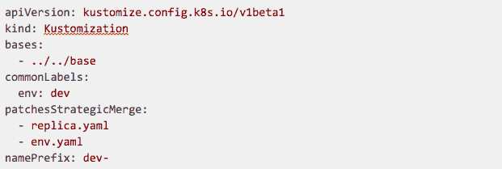

# 如何使用 GitLab 和开源软件改善您的 Kubernetes CI/CD 管道

> 原文：<https://thenewstack.io/how-to-improve-your-kubernetes-ci-cd-pipelines-with-gitlab-and-open-source/>

在我之前的文章“[集装箱化的 CI/CD 管道如何与 Kubernetes 和 GitLab](/part-1-how-to-improve-enhance-your-kubernetes-ci-cd-pipelines-with-gitlab-and-open-source/) 合作”中，我写了 Kubernetes 在 2019 年的受欢迎程度和重要性。我还用 GitLab CI/CD 和 Kaniko 报价描述了集装箱化管道的优势。在这篇文章中，我想介绍更多的开源项目和 GitLab 特性，帮助您部署和运行云原生应用程序。

## 增强应用程序部署

 [尼科·梅森扎尔

Nico Meisenzahl 在 white duck 担任高级云和 DevOps 顾问。作为一名当选的 GitLab 英雄和 Docker 社区领袖，他目前热衷于围绕 Kubernetes、CI/CD、自动化、DevOps 和云的主题。Nico 还经常在欧洲和美国的会议、用户组活动和聚会上发言。](https://www.linkedin.com/in/nicomeisenzahl/) 

现在让我们回到应用程序部署，并向您介绍开源项目 [Kustomize](https://github.com/kubernetes-sigs/kustomize) 。Kustomize 是 Kubernetes 项目的一部分，由 [sig-cli](https://github.com/kubernetes/community/blob/master/sig-cli/README.md) 赞助，它允许你定制用于多种目的的原始和无模板的 YAML 文件，保持原始的 YAML 原样可用。Kustomize 是一个 CLI 工具，默认情况下也集成到了 kubectl 中。

对我来说，Kustomize 是使用连续交付(CD)将容器化应用程序部署到 Kubernetes 集群的完美工具。它允许我们用声明性的方法定义定制，支持我们通过不复制我们的代码将我们的应用程序部署到不同的环境。与其他部署工具不同，Kustomize 的开销最小，并且只关注自动化 CD 管道中需要的特性。

要定制我们现有的 yaml 清单，我们只需要在 kustomization.yaml 中定义我们的定制，然后 Kustomize 使用它作为一个规则集来构建结果 YAML 定义。我举个例子(你可以在这里回顾整个例子[):](https://gitlab.com/gitlab-commit-demo/enhanced-appdeploy-sample)

例如，这个 kustomization.yaml 用于将应用程序部署到开发环境中。因此，它定制了我们现有的 YAML 清单(通过 bases 参数链接)并添加了一些特定的配置:

*   向所有资源添加 env=dev 标签。
*   根据定义的文件修补现有的 YAML 清单；在本例中，它更新了副本计数并添加了一个特定的容器环境变量。
*   将名称前缀 dev-添加到所有资源。

在复杂的部署中，我们还可以定义多个定制定义。Kustomize 文档很好地概述了可能的用例以及进一步的定制选项。

让我们来看看如何将 Kustomize 集成到一个集装箱化的管道中(你可以在这里查看整个例子):

再一次，我们有一个只有一个作业的管道定义。脚本部分将在基于 Alpine 提供 kubectl 的容器中执行。该作业使用 apply 参数执行 kubectl CLI。-k 告诉 kubectl 使用 Kustomize 插件。这两个参数后面都是我们的部署文件所在的路径。在这个例子中，我们使用一个管道变量来定义我们想要部署的定制。

## 保护您的应用程序入口

我们现在能够使用容器化管道来构建和部署我们的应用程序。现在，我们将展示如何保护在 Kubernetes 集群中运行的应用程序工作负载。

当[将我们现有的 Kubernetes 集群](https://gitlab.com/help/user/project/clusters/index.md#installing-applications)与 GitLab 项目或小组集成时，我们可以选择安装一个入口控制器。部署的入口控制器被称为 [GitLab Web 应用防火墙](https://docs.gitlab.com/ee/user/clusters/applications.html#web-application-firewall-modsecurity)。GitLab WAF 基于启用 ModSecurity 模块的 Nginx 代理为您提供实时安全监控。默认启用的 OWASP 核心规则集是基于 GitLab 的最佳实践定制的，并配置为仅检测模式。当然，如果需要，可以启用进一步的安全设置。Web 应用程序防火墙帮助您检测和阻止跨站点脚本以及 SQL 注入攻击。

如上所述，默认情况下，GitLab WAF 配置为只检测。Web 应用程序防火墙会将所有与安全相关的问题记录到入口控制器窗格中的审核日志(/var/log/modsec/audit.log)中，该日志可转发给任何日志管理，以供进一步分析或采取行动。安全问题的输出示例:

## 为什么您应该只关心您的业务逻辑

在这篇文章的最后一部分，我将介绍无服务器，这是另一种在过去一年中吸引了大量精力的方法。描述无服务器的一种方式是，它意味着您不再关心您的服务器和基础设施，而只关注您的业务逻辑或您想要解决的问题。有了 GitLab Serverless，你可以做到这一点。 [GitLab Serverless](https://docs.gitlab.com/ce/user/project/clusters/serverless/) 挤满了 [Knative](https://knative.dev/) 、 [Kaniko](https://github.com/GoogleContainerTools/kaniko) 和 [Istio](https://istio.io/) ，它们都是建立在 Kubernetes 之上的开源项目，它们抽象出复杂的细节，让开发人员专注于重要的事情。

GitLab Serverless 自动构建一个容器映像，无需我们提供 docker 文件，将其部署到 Kubernetes，并根据用户需求自动扩展。这是以类似功能即服务(FaaS)的方式完成的，这也允许我们根据需要将应用程序扩展到零，以节省资源和资金。

一旦我们在 Kubernetes 集群上配置了 GitLab Serverless，我们只需要在我们的项目中配置两个文件:一个 GitLab CI 定义和一个描述您的功能的 serverless.yaml，或者一个描述您的容器化应用程序的 Dockerfile。在下面的例子中，我们部署了一个基于 NodeJS 的函数(你可以在这里查看整个例子)。

的。gitlab-ci.yml 定义了构建和部署我们的函数的管道:

描述函数和所需运行时的 serverless.yaml:

GitLab Serverless 还将为我们提供有关您的功能扩展的详细指标:

所有的例子和代码片段都可以在[这里](https://gitlab.com/gitlab-commit-demo)找到。我之前的文章[“容器化 CI/CD 管道如何与 Kubernetes 和 GitLab 一起工作”](https://thenewstack.io/part-1-how-to-improve-enhance-your-kubernetes-ci-cd-pipelines-with-gitlab-and-open-source/)详细介绍了如何用 GitLab CI/CD 和 Kaniko 创建容器化管道。你也可以看到我在旧金山 GitLab Commit 2020 上关于容器化管道、Kubernetes 和开源的演讲的现场录音:

[https://www.youtube.com/embed/ZLzHnVPPbW0?feature=oembed](https://www.youtube.com/embed/ZLzHnVPPbW0?feature=oembed)

视频

部署愉快！

<svg xmlns:xlink="http://www.w3.org/1999/xlink" viewBox="0 0 68 31" version="1.1"><title>Group</title> <desc>Created with Sketch.</desc></svg>