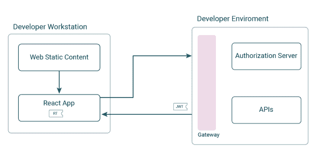
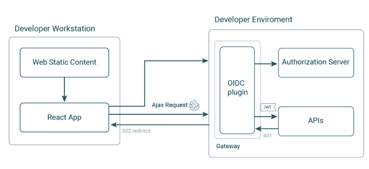
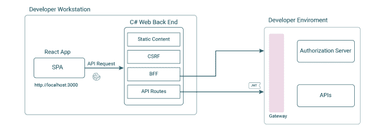
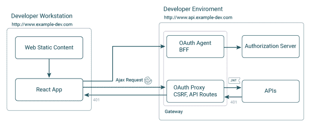
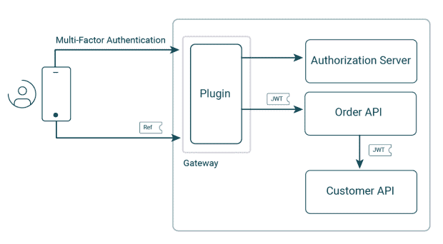
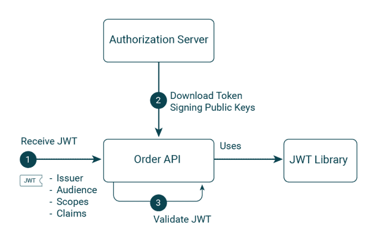
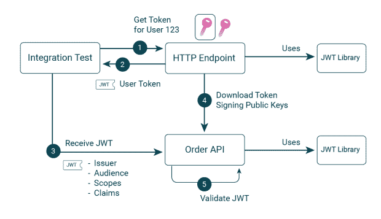
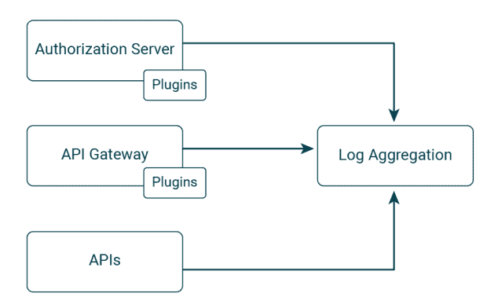
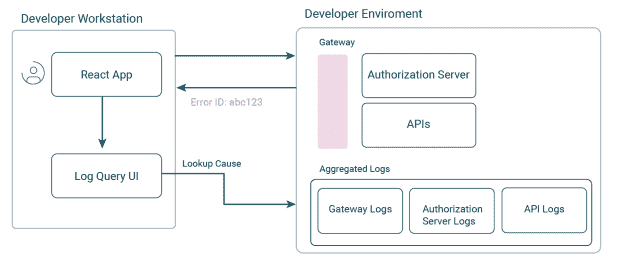

# 如何改善您的 OAuth 开发人员体验

> 原文：<https://thenewstack.io/how-to-improve-your-oauth-developer-experience/>

如今，开发人员体验(DX)是一个经常使用但经常被误解的术语。事实是，糟糕的开发者设置会对数字服务的上市时间产生负面影响。尤其是在实施安全解决方案时，如果选择了次优的技术设计，DX 可能会受到影响，不幸的是，这种情况并不少见。

通常情况下，公司使用 OAuth 系列规范来保护他们的应用程序。然后，具有挑战性的安全工作被外包给第三方身份和访问管理(IAM)系统。您部署了一个名为授权服务器的组件，您的 ui 和 API 都与该组件进行交互，以外包一些困难的安全领域。安全地实现这一点还需要 IAM 提供商提供良好的技术指导。

本质上，OAuth 是一个基于关注点分离的简单而优雅的框架。如果使用正确，它也可以是开发人员友好的。在实施安全解决方案时，公司需要谨慎考虑，首先确定需求，然后选择满足这些需求的设计和安全组件。如果不这样做，有时会严重影响业务交付。

在本文中，我将提出一些建议来改善 OAuth 开发人员的体验，并使开发人员能够以更符合业务的方式进行操作。这将从 web 和 API 开发者的角度来看。我还将重点介绍一些设计模式，它们使您的公司能够在任何地方运行最佳安全性，包括在开发人员工作站上。

## 单页应用程序

许多公司选择构建单页面应用程序(SPAs)来实现快速的交互式用户体验。从 DX 和业务的角度来看，该解决方案非常一致。开发人员使用现代的生产技术来构建 UI，所有的努力都集中在良好的用户体验上。在构建 spa 时，通常会产生一个包含以下部分的初始安全解决方案。

这种应用程序设计的一个问题是它的安全性，因为它在浏览器中使用令牌，并且可能在本地存储中存储刷新令牌。这不符合 [OAuth 针对基于浏览器的应用程序的最佳实践](https://datatracker.ietf.org/doc/html/draft-ietf-oauth-browser-based-apps#section-6.2.1)，并且很可能在安全利益相关方的渗透测试中被提出。相反，建议为 SPA 提供一个应用程序级 cookie 层。

在一些公司中，架构师可能会将基于 cookie 的需求抛给 web 开发人员。然而，用高质量的 DX 解决这个问题需要 API 思维，而 web 开发人员并不总是设计这个需求的最佳人选。开发者可以首先在线搜索，然后实现使用反向代理或 API 网关和实现 OpenID 连接(OIDC)的插件组件的初始解决方案。

开发人员通常会遇到几个棘手的问题。首先，OIDC 插件可能只为网站设计，不支持将 JSON Web 令牌(jwt)转发给 API。其次，它可能很难处理到期，比如不支持刷新底层访问令牌。最后，它不太可能是 SPA 或 Ajax 友好的，可能会突然发出 302 重定向到 Ajax 响应，这对于 SPA 来说是不正确的行为。

最终，开发者会意识到需要一个前端 (BFF)的[后端来以 SPA 友好的方式正确处理上述问题。然后，开发人员必须选择 cookie 发布技术。通常这种选择与公司的网站相匹配，这些网站可以用 C#之类的语言编码。这可能会在开发人员工作站上产生一个胖后端。](https://datatracker.ietf.org/doc/html/draft-ietf-oauth-browser-based-apps#section-6.2)

SPA 现在正确地实现了它的安全性，但是这个变化影响了 DX。为了让 React 应用程序获得静态 web 内容，为了让 cookies 工作，React 开发人员现在必须为所有未来的开发处理许多后端安全问题。在某些情况下，开发人员可能需要相当长的时间来获得可靠的到期、错误处理和可用性。

然而，可以使用现代形式的后端对前端模式来优化 DX。该策略包括将 BFF 关注点从静态内容交付中分离出来。BFF 然后被部署到 API 域，该域必须与 SPA 的 web 源共享相同的父域，以便 cookies 仍然是第一方。React 开发人员只需为所有未来的开发编写 React 代码。

这被称为[令牌处理程序模式](https://curity.io/resources/learn/token-handler-overview/)，其中 OAuth 代理与授权服务器交互，然后代表 SPA 发布 cookies。OAuth 代理确保以 SPA 友好的方式管理 API 请求，将 cookies 转换为令牌，并应用一般的安全检查。要集成令牌处理程序组件，您应该只需要配置和部署 OAuth 代理和 OAuth 代理的[测试实现](https://curity.io/product/token-service/oauth-for-web/)。

这种设计模式将 web 和 API 问题分开，以提供最佳选择。如果适合您的 web 架构，仍然可以将 OAuth 代理和 OAuth 代理部署到 web 域。然而，多域设置可能会提供最佳的 SPA 开发者体验。

## 零信任 API

还需要为后端开发人员和测试人员启用 DX，这在使用安全性时可能需要洞察力。考虑以下移动和 API 端到端流程，其中使用了多因素身份验证(MFA ),包括从移动设备上的 Google Authenticator 应用程序接收的基于时间的一次性密码(TOTP)。

[幻影令牌](https://curity.io/resources/learn/phantom-token-pattern/)模式也用于对发送到移动应用程序的令牌保密。API 采用[零信任](https://curity.io/resources/learn/zero-trust-overview/)方法，其中 JWT 访问令牌在 API 之间转发，每个 API 对每个请求进行数字验证 JWT。

从安全角度来看，所有这些都没问题，但是考虑一下它会如何影响每个微服务的开发者。默认情况下，要获得一个用户级访问令牌进行测试，开发者必须运行一个[码流](https://curity.io/resources/learn/openid-code-flow/)，然后切换到手机 app，输入第二个因子。这不是一个高效的设置。

解决这个问题首先需要理解安全 API 的基本 OAuth 流程。JWT 访问令牌为 API 提供了一个契约。首先，使用非对称公钥验证其数字签名。接下来，它的声明用于授权。JWT 库还用于缓存令牌签名公钥，以确保良好的性能。

订单 API 的集成测试通常会模拟对上游客户 API 的调用。只要提供相同的 JWT 访问令牌合同，就可以使用相同的方法绕过与 OAuth 相关的复杂基础设施。订购 API 不需要测试验证是否有效。相反，它可以简单地向实用程序 HTTP 端点请求特定用户的令牌。这个端点将生成自己的密钥对，用私钥发布 jwt，并使公钥对 API 可用。

API 中的安全代码保持不变，并且在 API 连接到真实授权服务器的部署环境中表现一致。然而，本地设置设计为安全 API 的开发人员提供了良好的 DX，也使他们能够安全地进行开发。模仿授权服务器的 JSON Web Key Set (JWKS)端点可以通过实用程序 API 或 HTTP 工具来完成，如 [WireMock](https://wiremock.org/) 。

## 提供最佳开发人员体验的后端基础设施

API 开发者的故事并没有随着编写和测试 API 代码而结束。还有许多其他组件可供开发人员使用和扩展。以下组件与在 OAuth 开发过程中实现高质量的端到端 DX 特别相关。

[API 网关](https://curity.io/resources/guides/apigateway/)和[授权服务器](https://curity.io/resources/plugins-authenticators/)都是你架构的关键部分，需要良好的可扩展性通过插件和脚本来管理。当实现这种类型的任务时，后端开发人员将使用多个组件在本地运行更复杂的设置。如果开发人员能够将它们全部部署在本地，将会带来显著的生产力优势。这样做可以使端到端的可靠性在您的部署管道中尽早得到验证，之后，相同的行为可以简单地推广到其他环境中。

可在任何地方部署的云原生组件，包括开发人员工作站，最适合这种模式。使用这种方法，您可以选择具有必要可扩展性的最佳组件。您可能会在平台即服务(PaaS)组件中发现较少的选择，并且可能会在某些领域遇到可能会影响 DX 和业务的阻塞问题。

如果你使用的是 Kubernetes，可以使用免费的轻量级 ingress 控制器作为 API 网关，你应该选择一个对[插件](https://curity.io/resources/learn/integrating-plugins-with-kubernetes-ingress/)有良好支持的。同样，你可以免费运行最先进的测井系统，如[弹性叠加](https://curity.io/resources/learn/log-to-elasticsearch/)。然后你也可以使用云本地授权服务器，比如 Curity Identity Server 的[免费社区版](https://curity.io/product/community/)。

## 快速事件解决

核心 DX 区域是您的技术支持流程，包括编码期间和编码之后。开发人员可能必须随叫随到，为客户解决生产问题。在某些情况下，组织可能准备不足，这可能给开发人员带来压力，并可能升级到您最高级的工程师，影响未来的业务交付。

OAuth 安全性比旧的独立系统涉及更多的活动部件。您的开发人员必须了解如何在编码期间对 OAuth 进行故障排除，并预演到期和错误情况。从 DX 的角度来看，下面的设置效果最好，允许任何开发人员或测试人员查询任何组件的日志。这减少了“分析时间”，并可以在此类事件中最大限度地减少停机时间。

如果您能够启用上面的技术支持流程，问题将会像在生产中一样在编码时被管理，这将有助于减轻压力。因此，当 DevOps 人员[对生产事件](https://curity.io/resources/learn/oauth-troubleshooting-devops/)进行故障排除时，他们将需要更少的开发人员输入。随着时间的推移，这种一致的人员流程将尽早发现更多问题，并提高 DX 和质量。此外，将日志质量作为后端必需的第三方组件的选择标准的一部分。

## 为开发者提供一个良好的生态系统

DX 旨在为开发人员提供最佳生态系统，以提高业务敏捷性。对于部署、安全和事件解决等困难领域，请确保您选择的选项除了满足您的业务需求之外，还能在本地工作站上正常工作。然后，您将使用更简单的代码构建安全可靠的软件。

这也是一个渐进的过程，技术目标必须与业务优先级相权衡。应该可以从商业价值的角度来阐述所有 DX 目标，无论是更快的 web 开发、更好的数据保护还是更少的事故。这将帮助您赢得对技术计划的支持，并作为技术路线图的一部分逐步实现它们。

在 Curity，我们认识到 DX 对您业务的重要性。因此，我们不断改进我们的开发者资源，包括 [web](https://curity.io/resources/guides/spa/) 、[移动](https://curity.io/resources/guides/mobile/)和 [API](https://curity.io/resources/guides/api/) 开发指南。OAuth 系列规范使您能够实现许多安全解决方案，我们还确保我们的高级选项可以在开发计算机上端到端运行。

<svg xmlns:xlink="http://www.w3.org/1999/xlink" viewBox="0 0 68 31" version="1.1"><title>Group</title> <desc>Created with Sketch.</desc></svg>